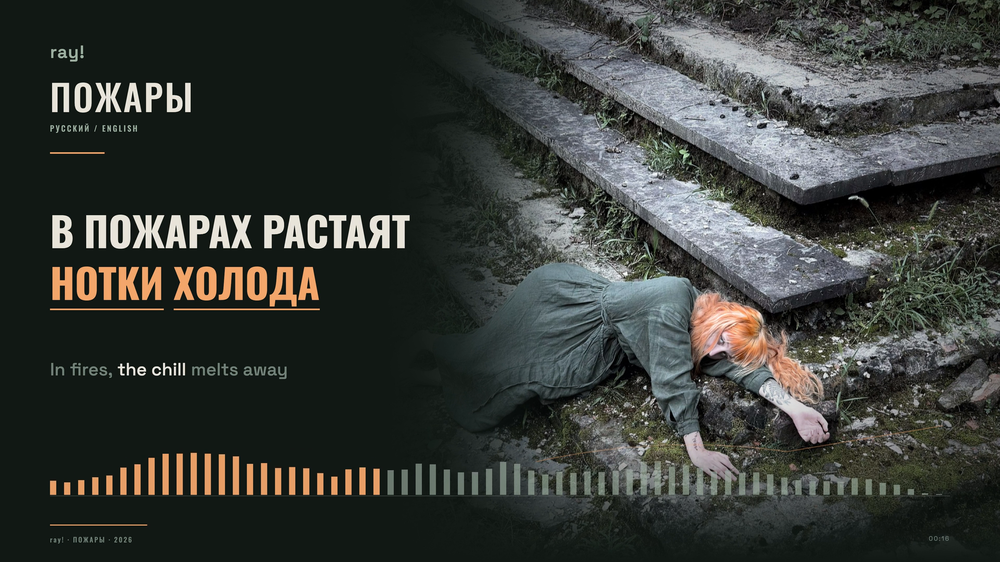
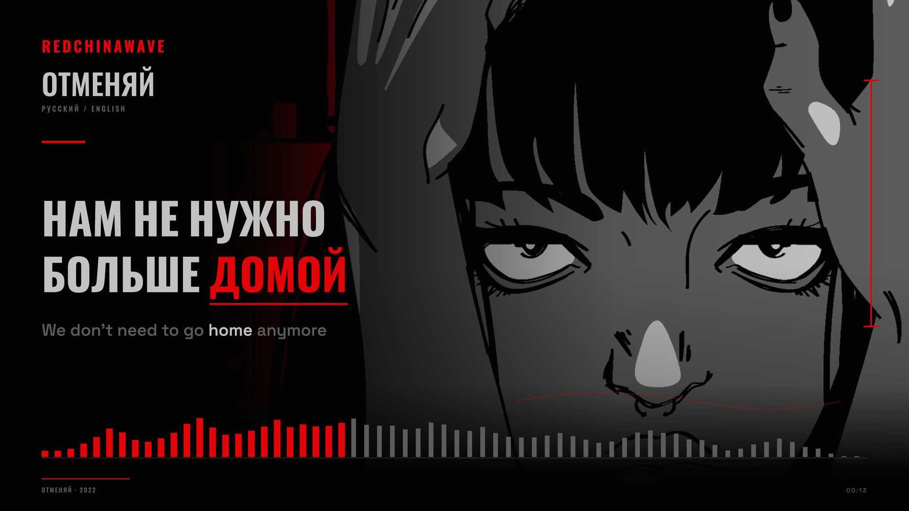
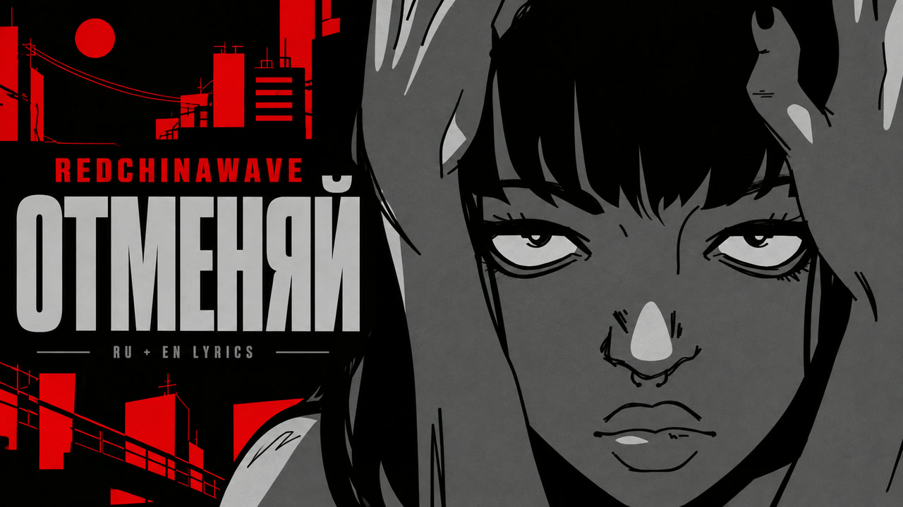
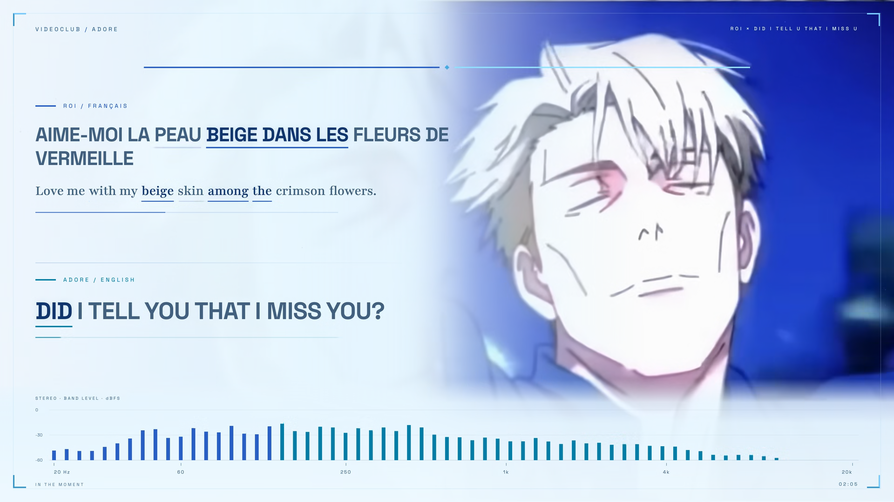
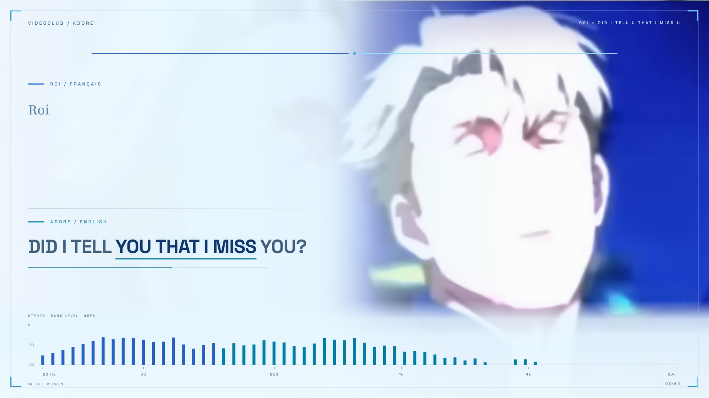

# Lyrics

Music films with synchronized lyrics, meaning-linked translations, and audio-reactive visuals. This repository contains the projects, production workflows, and verification evidence behind each edition.

[**Пожары**](#пожары) · [**Отменяй**](#отменяй) · [**Roi × Adore**](#roi--adore) · [**TikTok edition**](#tiktok-edition) · [**Tanisea**](#tanisea) · [**Build and workflow**](#build-and-workflow)

## Пожары

**ray! — Пожары · Russian lyrics + English translation**

A photographic lyric film in moss green, charcoal and copper, built around the artist's official release artwork. Fixed Russian words and meaning-linked English highlights sit beside the photograph in landscape and beneath it in the dedicated vertical edition. New camera movement and expressive graphics run at 60 fps, with a separately calibrated 64-band spectrum.



*Decoded final movie frame at 00:16.200. Original photograph sourced through the artist's official release; individual photographer unverified.*

| Edition | Format | Timeline | Lyrics |
| --- | --- | --- | --- |
| YouTube | 1920×1080 · 60 fps | 2:30 · 9,001 video frames | Russian + English meanings |
| TikTok | 1080×1920 · 60 fps | Same soundtrack and cue data | Dedicated portrait layout |

The production represents all 117 supplied words in 36 cues and 84 highlight groups. Bounded CTC and attention alignment, isolated vocals and waveform correlation inform the timing. The chopped “Пожар” bridge uses one sustained bilingual motif; individual echoes are not claimed as separately aligned words. [Timing methods and review limits](projects/pozhary-lyric-film/README.md#timing-and-translation).

| Download | Contents |
| --- | --- |
| [YouTube film](https://github.com/ael-dev3/lyrics/releases/download/pozhary-v1.0.0/Pozhary-YouTube-1920x1080-60fps.mp4) | Landscape H.264 / AAC master |
| [TikTok film](https://github.com/ael-dev3/lyrics/releases/download/pozhary-v1.0.0/Pozhary-TikTok-1080x1920-60fps.mp4) | Full-length vertical edition |
| [YouTube thumbnail](projects/pozhary-lyric-film/publishing/Pozhary-YouTube-Thumbnail-1920x1080.jpg) · [TikTok profile cover](projects/pozhary-lyric-film/publishing/Pozhary-TikTok-Cover-Profile-1200x1600.jpg) | Landscape thumbnail and **1200×1600 portrait** profile cover |
| [YouTube title](projects/pozhary-lyric-film/publishing/Pozhary-YouTube-Title.txt) · [description](projects/pozhary-lyric-film/publishing/Pozhary-YouTube-Description.txt) · [TikTok copy](projects/pozhary-lyric-film/publishing/Pozhary-TikTok-Description.txt) | Concise artist-focused credits and AI disclosure |
| [Russian captions](projects/pozhary-lyric-film/publishing/Pozhary.ru.srt) · [English captions](projects/pozhary-lyric-film/publishing/Pozhary.en.srt) | Optional timed caption tracks |
| [Complete production archive](https://github.com/ael-dev3/lyrics/releases/download/pozhary-v1.0.0/Pozhary-Complete-Production.zip) · [Original source](https://github.com/ael-dev3/lyrics/releases/download/pozhary-v1.0.0/Pozhary-Original-Source.mkv) | Editable source, original media, model observations, stems, covers and per-file hashes |
| [Delivery checksums](https://github.com/ael-dev3/lyrics/releases/download/pozhary-v1.0.0/CHECKSUMS.sha256) | Release asset sizes and SHA-256 records |

[Production notes and reproduction](projects/pozhary-lyric-film/README.md) · [Original artist and source credits](CREDITS.md#пожары) · [Official audio](https://www.youtube.com/watch?v=ml9TqzvJLCg)

## Отменяй

**REDCHINAWAVE — Отменяй · Russian lyrics + English translation**

A dark landscape lyric film built around the original upload’s illustration, with a four-color base palette: red `#e10508`, near-black `#030303`, light gray `#c2c2c2` and medium gray `#5c5c5c`. Large Russian type and meaning-linked English highlights sit beside the source artwork, with new camera motion and audio-reactive graphics rendered at 60 fps.



*Decoded frame from the final movie at 00:13.950. Artwork sourced from REDCHINAWAVE’s official upload; original illustrator unverified.*

| Format | Duration | Lyrics | Delivery |
| --- | --- | --- | --- |
| 1920×1080 · 16:9 · 60 fps | 2:10.453 | 21 bilingual lines · 71 Russian words · 50 highlight groups | H.264 High · AAC stereo · BT.709 |

Every repeated verse has its own measured timing. Alignment combines windowed Whisper observations on the mix and separated vocals, independent MMS-FA alignment and waveform/spectrogram inspection. The 64-band measured spectrum is separate from expressive motion. Final verification confirms 7,827 decoded frames, matching AAC packets and no measured source-to-AAC timing shift. Acoustic word boundaries retain uncertainty; frame-rounding accuracy is not ground-truth lyric accuracy.

| Download | Contents |
| --- | --- |
| [Final YouTube film](https://github.com/ael-dev3/lyrics/releases/download/otmenyai-v1.0.0/REDCHINAWAVE-Otmenyai-Lyric-Film-1080p60.mp4) | Verified landscape 1080p60 master |
| [Complete production archive](https://github.com/ael-dev3/lyrics/releases/download/otmenyai-v1.0.0/REDCHINAWAVE-Otmenyai-Complete-Production.zip) | Editable source, dependency lock, fonts, media, stems, alignment inputs, final assets and per-file hashes |
| [Original source video](https://github.com/ael-dev3/lyrics/releases/download/otmenyai-v1.0.0/REDCHINAWAVE-Otmenyai-Original-Source.mkv) | Downloaded streams before the lyric treatment |
| [YouTube thumbnail](https://github.com/ael-dev3/lyrics/releases/download/otmenyai-v1.0.0/REDCHINAWAVE-Otmenyai-YouTube-Thumbnail.jpg) · [Original PNG](https://github.com/ael-dev3/lyrics/releases/download/otmenyai-v1.0.0/REDCHINAWAVE-Otmenyai-YouTube-Thumbnail.png) | Upload-ready JPEG and generated source image |
| [Title and description](projects/otmenyai-lyric-film/publishing/REDCHINAWAVE-Otmenyai-YouTube-Description.txt) · [Russian captions](projects/otmenyai-lyric-film/publishing/REDCHINAWAVE-Otmenyai.ru.srt) · [English captions](projects/otmenyai-lyric-film/publishing/REDCHINAWAVE-Otmenyai.en.srt) | Short artist-focused copy and optional caption tracks |
| [Verification](projects/otmenyai-lyric-film/evidence/delivery-verification.json) · [Release checksums](https://github.com/ael-dev3/lyrics/releases/download/otmenyai-v1.0.0/CHECKSUMS.sha256) | Measured delivery results and asset hashes |

[Full release](https://github.com/ael-dev3/lyrics/releases/tag/otmenyai-v1.0.0) · [Production notes and reproduction](projects/otmenyai-lyric-film/README.md) · [Asset inventory](docs/otmenyai-release-files.md) · [Original official audio](https://www.youtube.com/watch?v=U9SYUPV0QrA)

<details>
<summary>YouTube thumbnail and production credits</summary>



Music and lyrics: **REDCHINAWAVE**. Lyric-film production and English adaptation: **Ael**, assisted by **OpenAI Codex with GPT-6 Astra**. The thumbnail is an AI-assisted adaptation of the source artwork. [Artist and source credits](CREDITS.md#отменяй) · [Software and font credits](projects/otmenyai-lyric-film/SOFTWARE.md).

</details>

## Roi × Adore

**VIDEOCLUB — Roi × adore — Did I Tell U That I Miss U**

A blue-toned lyric film for two overlapping vocal tracks. French lyrics appear alongside their English translation, while the second song has an independent English lyric lane. Original animation, stable typography, and separate spectrum and expressive motion controls carry the design across landscape and vertical editions.



*Frame from the final landscape movie at 02:05.800.*

| Edition | Format | Duration | Video / audio |
| --- | --- | --- | --- |
| Landscape | 1920×1080 · 60 fps | 6:19 | HEVC Main 10 / AAC |
| Vertical | 1080×1920 · 60 fps | 6:19 | H.264 / AAC |

Both editions preserve the locked AAC packets and lyric timeline. The project includes 49 French cues with English translation, 22 English cues, and 504 timed highlight units. The visualizer measures 64 stereo frequency bands on a fixed dBFS RMS scale; expressive motion is controlled separately.

### Film and production downloads

| Download | Contents |
| --- | --- |
| [Landscape film](https://github.com/ael-dev3/lyrics/releases/download/roi-adore-rebuild-v1.0.0/Roi-x-Adore-Lyric-Film-Rebuilt-1080p60.mp4) | Final 1080p60 master |
| [Complete production archive · 1.27 GB](https://github.com/ael-dev3/lyrics/releases/download/roi-adore-rebuild-v1.0.0/Roi-x-Adore-Complete-Production.zip) | Editable project, media, fonts, stems, alignment inputs, analysis, dependency lock and setup instructions |
| [Original source video](https://github.com/ael-dev3/lyrics/releases/download/roi-adore-rebuild-v1.0.0/roi-x-did-i-tell-u-that-i-miss-u-source.mkv) | Untouched downloaded stream |
| [10-second preview](https://github.com/ael-dev3/lyrics/releases/download/roi-adore-rebuild-v1.0.0/Roi-x-Adore-Immersive-Review.mp4) | Short review of the visual treatment |
| [Verification](https://github.com/ael-dev3/lyrics/releases/download/roi-adore-rebuild-v1.0.0/Roi-x-Adore-Verification.json) · [Checksums](https://github.com/ael-dev3/lyrics/releases/download/roi-adore-rebuild-v1.0.0/CHECKSUMS.sha256) | Landscape delivery QA and original release asset hashes |

[Full release](https://github.com/ael-dev3/lyrics/releases/tag/roi-adore-rebuild-v1.0.0) · [Production record](docs/roi-adore-rebuild.md) · [Source and evidence](projects/roi-adore-rebuild/README.md) · [Asset inventory](docs/roi-adore-release-files.md) · [Original upload](https://www.youtube.com/watch?v=11tjwUK2adU)

<details>
<summary>Additional frame and verification details</summary>



*Final landscape movie at 03:59.000.*

- Full decoding passed for both editions: 22,762 delivered video frames each.
- AAC packet identity and delivered-file SHA-256 were verified.
- All 71 lyric cues were checked in two browser focus states.
- Maximum measured cue-boundary rounding error is 8.1667 ms at 60 fps. This describes frame placement, not the accuracy of inferred vocal boundaries; dense overlapping vocals retain uncertainty.
- The selected 1080p60 source is YouTube’s upscaled derivative of native 720p60 material.

The production archive includes a per-file manifest. Installed dependencies, downloadable model weights, regenerable frame caches and temporary encode trials are excluded. See the [production record](docs/roi-adore-rebuild.md) for calibration, rendering methods and limitations.

</details>

### TikTok edition

The vertical adaptation places animation above both lyric lanes, with the spectrum below and space around the content for platform controls. The publishing kit includes the caption, all cover variants, generation prompts, adaptation scripts and verification files.

| Download | Contents |
| --- | --- |
| [Vertical film](https://github.com/ael-dev3/lyrics/releases/download/roi-adore-rebuild-v1.0.0/Roi-x-Adore-TikTok-1080x1920-60fps.mp4) | Full-length 9:16 video at 60 fps |
| [Publishing kit](https://github.com/ael-dev3/lyrics/releases/download/roi-adore-rebuild-v1.0.0/Roi-x-Adore-TikTok-Publishing-Kit.zip) | Covers, caption, prompts, scripts and QA |
| [Profile cover · 1200×1600](https://github.com/ael-dev3/lyrics/releases/download/roi-adore-rebuild-v1.0.0/Roi-Cover-Profile-3x4.jpg) · [Archived landscape variant](https://github.com/ael-dev3/lyrics/releases/download/roi-adore-rebuild-v1.0.0/Roi-Cover-Landscape-4x3.jpg) | Use the portrait cover for the tall profile preview; see the [cover default](docs/tiktok-cover-workflow.md) |
| [Verification](https://github.com/ael-dev3/lyrics/releases/download/roi-adore-rebuild-v1.0.0/Roi-x-Adore-TikTok-Verification.json) · [TikTok checksums](https://github.com/ael-dev3/lyrics/releases/download/roi-adore-rebuild-v1.0.0/TIKTOK-CHECKSUMS.sha256) | Vertical delivery QA and TikTok asset hashes |

[Browse the TikTok material and reproduction notes](projects/roi-adore-rebuild/tiktok/README.md).

## Tanisea

**Tanisea & ksviety — Закричу на весь мир (Remix)**

The first lyric-film project pairs Russian vocals with meaning-linked English highlights. Its warm ember and teal design established the typography, timing and verification workflow used as a starting point for Roi × Adore.


The published square edition runs for 153 seconds at 1080×1080 and 60 fps. Its source records Russian vocal timing as sample indices and maps English phrases to the corresponding meaning, including changes in word order. A separate 120 fps proof exposes timing evidence for inspection.

| Published download · v2.4.0 | Contents |
| --- | --- |
| [Production master](https://github.com/ael-dev3/lyrics/releases/download/v2.4.0/Tanisea-Lyric-Film-Production-Master-vNext.mp4) | Square HEVC Main 10 film with retained AAC |
| [120 fps sync proof](https://github.com/ael-dev3/lyrics/releases/download/v2.4.0/Tanisea-Lyric-Film-Sync-Proof-120fps.mp4) | Diagnostic timing render |
| [Source archive](https://github.com/ael-dev3/lyrics/releases/download/v2.4.0/Tanisea-Lyric-Film-Source-vNext.zip) | Source corresponding to the published edition |
| [Workflow evidence](https://github.com/ael-dev3/lyrics/releases/download/v2.4.0/Tanisea-Lyric-Film-Workflow-Evidence-vNext.zip) | Alignment, generated QA and production evidence |
| [QA report](https://github.com/ael-dev3/lyrics/releases/download/v2.4.0/tanisea-final-qa-vnext.md) · [Checksums](https://github.com/ael-dev3/lyrics/releases/download/v2.4.0/CHECKSUMS.sha256) | Published verification and asset hashes |

[Source project](projects/tanisea-lyric-film/README.md) · [Alignment report](audits/tanisea-word-alignment-v3.md) · [Original versus lyric-film comparison](docs/original-vs-lyric-film-comparison.md)

The repository also contains later chorus corrections and a landscape composition. These are distinct from the published v2.4.0 files above; see [release status and history](docs/release-status.md) before selecting a source revision or download.

## Build and workflow

Each project has its own setup instructions. Use the release source archive when reproducing a particular published movie.

| Project | Starting point |
| --- | --- |
| Пожары | Follow the [reproduction steps](projects/pozhary-lyric-film/README.md#reproduction); both aspect ratios share finalized cues and audio features |
| Отменяй | Use the complete production archive and its [reproduction steps](projects/otmenyai-lyric-film/README.md#reproduction); finalized cues and features are included |
| Roi × Adore | Download the complete production archive and follow its included README; the Git snapshot documents the source and evidence |
| TikTok adaptation | Follow the [vertical reproduction notes](projects/roi-adore-rebuild/tiktok/README.md) after preparing the production inputs |
| Tanisea | Follow the [project quick start](projects/tanisea-lyric-film/README.md#quick-start) for Node.js, FFmpeg and Remotion setup |

The reusable workflow covers soundtrack locking, lyric alignment, semantic translation, visual design, calibrated audio features, rendering and delivery verification:

- [Bilingual lyric workflow and equal-emphasis standard](docs/bilingual-lyric-workflow.md) — future films give English equal size, color strength, highlighting and synchronization precision; includes the production sequence and lessons from Пожары
- [Production workflow](docs/production-workflow.md)
- [First-pass song workflow](docs/first-pass-song-workflow.md)
- [Visual production workflow](docs/pixel-perfect-visual-workflow.md)
- [Scientific audio visualization](docs/scientific-audio-visualization.md)
- [Emotional audio-reactive motion](docs/emotional-audio-reactive-motion.md)
- [Production preferences and known issues](docs/track-workflow-preferences-and-known-issues.md)
- [TikTok cover defaults and crop review](docs/tiktok-cover-workflow.md) — portrait 1200×1600 for the profile preview labelled “4:3”; checked at thumbnail size

## Reference studies

[**LÜCY & Moyka — LOOP**](docs/studies/loop-2026/README.md): illustrated analysis of image-dominant composition, anchored lyrics, independent language transitions and recurring visual motifs. Includes an 8,654-frame numerical scan, selected frame-level observations, source credits and a practical brief for future films.

## Repository structure

```text
assets/                          Film screenshots and artwork
projects/pozhary-lyric-film/       Пожары source, both publishing kits and evidence
projects/otmenyai-lyric-film/      Отменяй source, publishing copy and evidence
projects/roi-adore-rebuild/       Roi × Adore source and evidence snapshot
  tiktok/                        Vertical adaptation and publishing material
projects/tanisea-lyric-film/      Tanisea Remotion project
projects/roi-slowdown-lyric-film/ Historical dual-song implementation
docs/                            Production guides and implementation records
audits/                          Timing and quality reports
deliverables/                    Earlier tracked delivery snapshot
```

## Release history

The Roi × Adore rebuild supersedes the earlier [Roi × Slow Down v1.0.1 edition](https://github.com/ael-dev3/lyrics/releases/tag/roi-slowdown-v1.0.1). Earlier source, timing evidence and downloads remain available for provenance.

[All published releases](https://github.com/ael-dev3/lyrics/releases) · [Release status and version notes](docs/release-status.md)

## License

Our authored workflow documentation, code, prompts, reusable visual contributions and other material we have authority to license are available under **[Creative Commons Attribution 4.0 International (CC BY 4.0)](https://creativecommons.org/licenses/by/4.0/)**. Credit **Ael / Lyrics workflow**, link to the project and licence, and indicate changes. See [LICENSE.md](LICENSE.md) for the scope, exclusions and attribution example, and [the legal text](LICENSES/CC-BY-4.0.txt) for the full terms.

**The original music, lyrics, recordings, remixes, animation, characters, source artwork, fonts and third-party software are excluded. We are not taking credit for their creators' work.** Finished films, screenshots and AI-assisted covers contain third-party material and are not offered as wholly CC BY 4.0 assets.

## Original creators and source credits

- **ray! — Пожары:** [official audio and artwork](https://www.youtube.com/watch?v=ml9TqzvJLCg) · [official release links](https://hangov3r.band.link/pojari).
- **REDCHINAWAVE — Отменяй:** [official audio and source artwork](https://www.youtube.com/watch?v=U9SYUPV0QrA) · [artist links](https://linktr.ee/redchinawave).
- **VIDEOCLUB — Roi:** [official music video](https://www.youtube.com/watch?v=4NOMFBRfaT0).
- **adore — did i tell u that i miss u:** [original track upload](https://www.youtube.com/watch?v=Xf9v-Uvabxo).
- **Dj At — Roi × Adore source mashup:** [source video](https://www.youtube.com/watch?v=11tjwUK2adU).
- **Tanisea / Танисия and ksviety — Закричу на весь мир (Remix):** [source upload](https://www.youtube.com/watch?v=dYraLlQzjAA).

[Full credits, reference uploaders, fonts and unresolved artwork attribution](CREDITS.md). Our work adds lyric presentation and a production workflow; it does not claim authorship of the source music or visuals. No endorsement by the original creators is implied.

## AI disclosure

The project uses substantial **AI assistance** for code, documentation, translation drafting, vocal alignment and cover generation, under Ael's creative direction and review. The films retain source music and source visuals; new motion and lyric graphics are authored for each treatment. Promotional covers are AI-assisted adaptations. Automated verification does not certify every vocal boundary or translation.

[Read the AI disclosure, methods and limitations](AI-DISCLOSURE.md).
