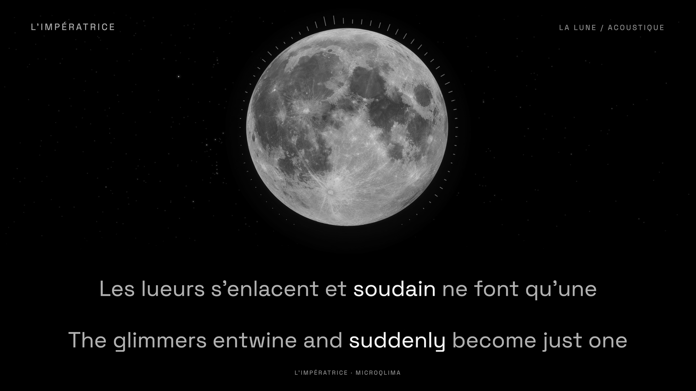
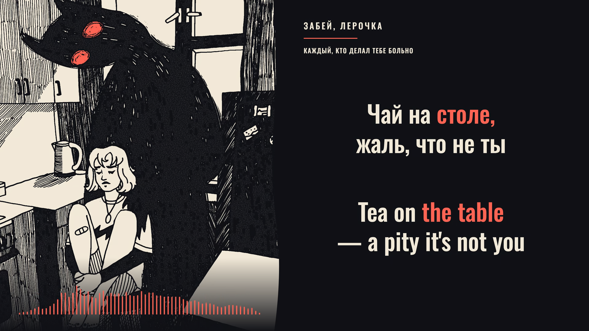
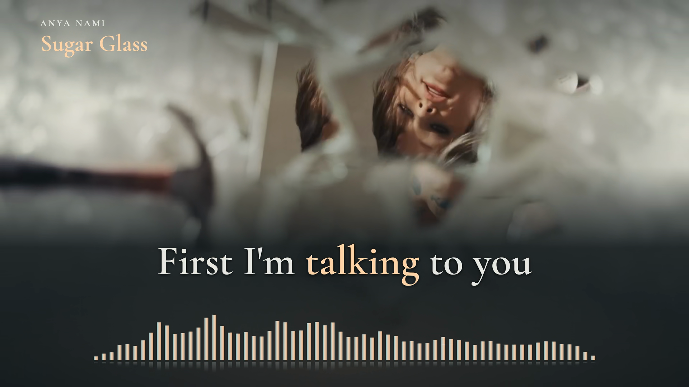
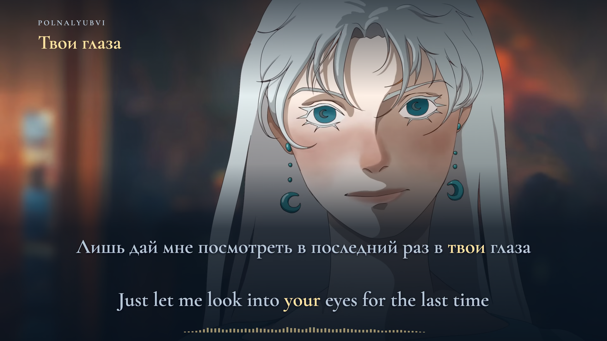
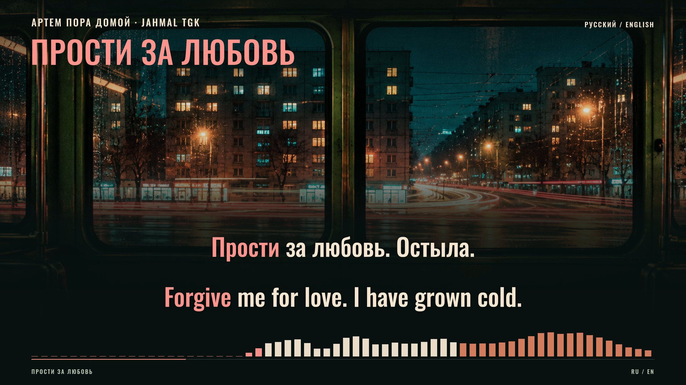
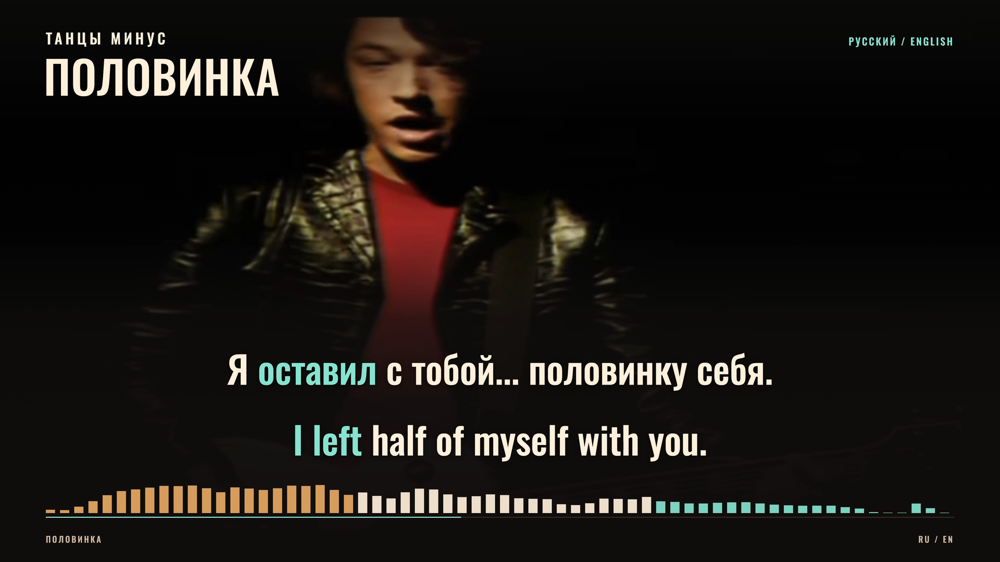
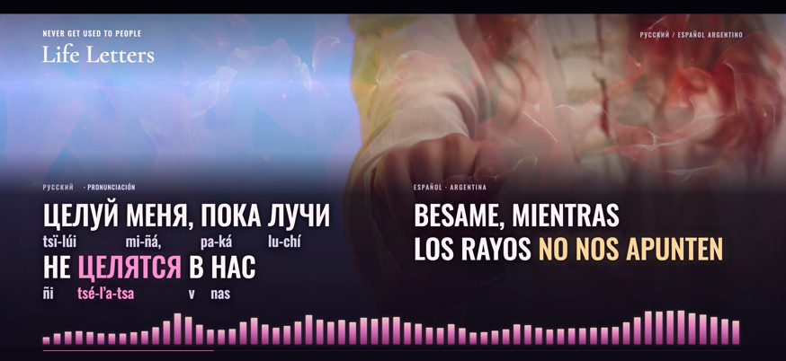

# Lyrics

**Preview before render:** follow [the mandatory preview-first workflow](docs/preview-before-render.md). Deliver a playable review preview before full production. Complete synchronization review and obtain explicit render approval for the current song and reviewed revision before capture or encoding. A preview-only request stops at review delivery; passing tests, positive feedback, saved review notes, a merged PR or approval of an earlier song do not authorize rendering.

Music films with synchronized lyrics, meaning-linked translations, and audio-reactive visuals. This repository contains the projects, production workflows, and verification evidence behind each edition.

**Current style default:** [cinematic lyric presentation](docs/cinematic-lyric-workflow.md) — stable, color-only word or phrase emphasis, precise vocal timing, smooth scene shading and equally prominent bilingual lyrics. Motion intensity follows the song: gentle arrangements can use compact, subdued audio-reactive graphics. The guide includes implemented references and review requirements for future tracks.

[**Pero es locura**](#pero-es-locura) · [**La Lune**](#la-lune) · [**каждый, кто делал тебе больно**](#каждый-кто-делал-тебе-больно) · [**Sugar Glass**](#sugar-glass) · [**Твои глаза**](#твои-глаза) · [**Прости за любовь — accepted with known gaps**](#прости-за-любовь) · [**Половинка**](#половинка) · [**Life Letters**](#life-letters) · [**Joyride**](#joyride) · [**midnight love**](#midnight-love) · [**Пожары**](#пожары) · [**Отменяй**](#отменяй) · [**Roi × Adore**](#roi--adore) · [**TikTok edition**](#tiktok-edition) · [**Tanisea**](#tanisea) · [**Build and workflow**](#build-and-workflow)

## Pero es locura

**Fémina · Vivo en La Oreja Negra · Spanish + English · semantic-focus v2 preview**


*Delivered v1 landscape frame at 01:49.000. Music and performance: Fémina. Production: La Oreja Negra. Film: FLAN Audiovisual.*

The full 4:54.104 live recording has 86 displayed cues, with sentence-case Spanish and English, restored Spanish accents, independently aligned live repeats and source-linked word emphasis. The original performance supplies the motion; warm serif text and a compact measured spectrum support it. Both layouts retain the source ending and credits.

The delivered v1 films passed frame-timestamp and decoded word-state checks against their approved map, with original audio unchanged. A subsequent semantic audit identified incomplete English spans such as “love you.” The corrected **v2 preview** updates 58 phrase occurrences across 40 cues while preserving Spanish timing, wording and layout. Its affected audiovisual review and new rendering remain pending; the v1 videos and upload kit stay unchanged. [Correction details](projects/pero-es-locura-lyric-film/SEMANTIC-FOCUS-V2.md).

[Delivery and reproduction](projects/pero-es-locura-lyric-film/README.md) · [Timing and wording](projects/pero-es-locura-lyric-film/SYNC-NOTES.md) · [Workflow findings](projects/pero-es-locura-lyric-film/WORKFLOW-NOTES.md) · [Original performance](https://www.youtube.com/watch?v=uvLVcEBIn-4)

## La Lune

**L’Impératrice · version acoustique · French + English · Celestial v3**



*Decoded final landscape frame at 00:46.800. Music: L’Impératrice / microqlima. AI-assisted lunar artwork and original lyric presentation.*

The complete 3:17.555 acoustic recording pairs a steady neutral-silver Moon with true black, a Yale Bright Star Catalogue field, slow independent stellar twinkling, a compact radial spectrum and faint instrumental ripples. Equal French and English words retain the earlier accepted audio, timing, mappings and fixed geometry. The oversized Moon is artistic; the catalogue-grounded claim applies to star positions and magnitude ordering.

Both 1080p60 films passed complete timestamps, strict decoding, unchanged original AAC packets and decoded PCM, plus 50,372 visible word-state checks with zero mismatches or ambiguous states. Sampled encoded lunar illumination is steady and neutral. The celestial preview subsequently received explicit acceptance; the [final three-pass recheck](projects/la-lune-acoustic-lyric-film/evidence/final-three-pass-review.json) reconfirmed the same files. Overall acceptance remains separate from incomplete granular listening review. Full media stays local, and the previous edition is preserved.

[Project and reproduction](projects/la-lune-acoustic-lyric-film/README.md) · [Celestial design and scientific limits](projects/la-lune-acoustic-lyric-film/CELESTIAL-NOTES.md) · [Final verification](projects/la-lune-acoustic-lyric-film/evidence/final-verification.md) · [Production lessons](projects/la-lune-acoustic-lyric-film/PRODUCTION-LESSONS.md) · [Posting assets](projects/la-lune-acoustic-lyric-film/publishing/README.md) · [Original recording](https://www.youtube.com/watch?v=p3E731cu_nE)

## каждый, кто делал тебе больно

**забей, лерочка · Russian + English · verified landscape and portrait films · three-color animated treatment**



*Decoded final landscape frame at 01:12.200. Music and source illustration from the original забей, лерочка / Spooky music upload; illustrator unidentified in the available source metadata.*

Ink, ivory and vermilion frame the original kitchen illustration and a measured 64-band spectrum. The approved v6 film keeps the picture geometry still while fine static shifts inside its darkest areas at detected vocal changes. Visualizer emphasis is medium at 1:10–1:28 and 2:38–2:55, strongest only at 2:55–3:10, and normal everywhere else. Centered vocal energy shapes the response inside the selected windows. Decorative loops, extra eye marks, steam, palette inversion and picture pulses are omitted. Equal Russian and English text stays fixed, with complete meaning-linked word emphasis. Both layouts preserve the complete recording.

The full preview preceded explicit approval of the current v6 render. Both final films passed strict decoding, all 12,798 video timestamps, exact original AAC and decoded PCM identity, and 280,986 visible word-state checks across both layouts with zero focus mismatches. Overall acceptance remains separate from incomplete granular listening telemetry and model-assisted acoustic uncertainty. Full media stays local.

[Production and reproduction](projects/kazhdyy-lyric-film/README.md) · [Verified delivery](projects/kazhdyy-lyric-film/evidence/delivery-receipt.json) · [Verification and limits](projects/kazhdyy-lyric-film/evidence/final-verification.md) · [Production lessons](projects/kazhdyy-lyric-film/PRODUCTION-LESSONS.md) · [Upload assets](projects/kazhdyy-lyric-film/publishing/README.md) · [Original upload](https://www.youtube.com/watch?v=3yDdoi1c7-8)

## Sugar Glass

**Anya Nami · English only · verified landscape and portrait films**



*Decoded final landscape frame at 01:30.000. Original music, performance and mood video: Anya Nami.*

Both complete 1080p60 films preserve the accepted English-only preview: 71 cues, 424 words, independent lead/backing lanes, larger lyrics and oversized refrains. A broad reflective spectrum expands into choruses and recedes through the bridge and outro. Word geometry and the original audio clock stay stable. The design applies the Lyrics workflow in general.

The playable preview preceded explicit render approval. Overall acceptance is recorded separately from unavailable granular listening telemetry and retained model uncertainty. Both final files passed strict decoding, all 13,881 video timestamps, exact original AAC and decoded PCM identity, and every visible word's decoded focus with zero mismatches. Full media remains local.

[Production and reproduction](projects/sugar-glass-lyric-film/README.md) · [Verified delivery and checksums](projects/sugar-glass-lyric-film/evidence/delivery-receipt.json) · [Verification details and limits](projects/sugar-glass-lyric-film/evidence/final-verification.md) · [Production lessons](projects/sugar-glass-lyric-film/PRODUCTION-LESSONS.md) · [Original mood video](https://www.youtube.com/watch?v=-NsQ8_WLq2s)

## Твои глаза

**POLNALYUBVI — Твои глаза / Your Eyes · Russian + English**

Dedicated 1920×1080 and 1080×1920 compositions at 60 fps retain the complete original recording and animation. All 154 Russian tokens and 195 English words receive stable, meaning-linked color emphasis, including grammatical completions and reordered English phrases.



*Decoded final landscape frame at 01:03.400. Original animation by ORAMAI, with backgrounds and illustrations by FINITO / FINITOLINA; music and lyrics by POLNALYUBVI.*

**Restrained visualizer reference.** A compact pale-gold spectrum supports the contemplative animation and equal bilingual serif text. Its 64 measured bands use small, bounded travel and subdued opacity, leaving the voice, words and source picture prominent. This edition establishes a successful low-intensity approach for gentler arrangements; visual energy is chosen for each recording. See the [production lessons and exact display settings](projects/tvoi-glaza-lyric-film/PRODUCTION-LESSONS.md).

The project owner completed the actual-recording review and authorized full rendering. The review record distinguishes this overall user attestation from unavailable granular listening telemetry. Production captures at 2×, uses ProRes 4444 references and HEVC Main 10 delivery, and preserves the original AAC packets and timestamps. Decoded-word checks inspect the actual highlight colors against the frozen event map.

[Production and reproduction](projects/tvoi-glaza-lyric-film/README.md) · [Verified delivery and checksums](projects/tvoi-glaza-lyric-film/evidence/delivery-receipt.json) · [Review record](projects/tvoi-glaza-lyric-film/evidence/cross-language-sync-review.md) · [Decoded-focus method](projects/tvoi-glaza-lyric-film/evidence/decoded-focus-method.md) · [Publishing copy](projects/tvoi-glaza-lyric-film/publishing/Tvoi-Glaza-Description.txt) · [Original song and animation](https://www.youtube.com/watch?v=qC4sCCmvoXU)

This edition applies the Lyrics workflow in general. Recording, animation, covers and full-film assets remain local or in a draft release; source-artist rights are excluded from the repository contribution license.

## Прости за любовь

**Артем Пора Домой & Jahmal TGK · v1.2 · Russian + English · YouTube and TikTok**

**Accepted with known highlighting gaps.** The current song is sufficient for delivery. Some English meaning spans remain only partly highlighted: «Остыла» needs “I have grown cold,” and «прости» needs “forgive me” in the chosen translation. The accepted films are preserved; this edition is not the synchronization quality baseline for the next song.



*Decoded accepted v1.2 landscape frame at 00:52.400. The screenshot preserves that edition's documented highlighting gaps. Music by Артем Пора Домой & Jahmal TGK; generated artwork and lyric presentation belong to this edition.*

[Project and exact delivery identity](projects/prosti-za-lyubov-lyric-film/README.md) · [Known issues and follow-up criteria](projects/prosti-za-lyubov-lyric-film/KNOWN-ISSUES.md) · [Structured status](projects/prosti-za-lyubov-lyric-film/status.json)

**Next song: synchronization must be complete before production rendering.** Follow the [mandatory cross-language sync gate](docs/cross-language-sync-gate.md) for every cue and every language. Technical checks and a few successful previews do not replace the full semantic and audiovisual review.

This entry documents the locally delivered edition; it does not publish new video or archive release assets.

## Половинка

**Танцы Минус — Половинка · Russian + English · YouTube and TikTok**

Full-song bilingual films with equal Russian and English typography, stable color-only emphasis and a measured 64-band spectrum. Both 1080p60 editions share the original soundtrack with constant gain only. The archival source picture retains its native 480p detail and 25 fps cadence.



*Decoded v1.0.0 landscape frame at 01:20.000. Original performance and music by Танцы Минус; the source picture retains its archival detail.*

[YouTube film](https://github.com/ael-dev3/lyrics/releases/download/polovinka-v1.0.0/Polovinka-YouTube-1920x1080-60fps.mp4) · [TikTok film](https://github.com/ael-dev3/lyrics/releases/download/polovinka-v1.0.0/Polovinka-TikTok-1080x1920-60fps.mp4) · [Covers, copy and captions](https://github.com/ael-dev3/lyrics/releases/download/polovinka-v1.0.0/Polovinka-Publishing-Kit.zip) · [Editable project](https://github.com/ael-dev3/lyrics/releases/download/polovinka-v1.0.0/Polovinka-Editable-Project.zip)

Both exports passed full decoding, all 10,501 frame timestamps, and preservation of all 8,205 locked AAC packets. The audio timing audit is model-assisted; its scope and uncertainty are documented.

[Production notes](projects/polovinka-lyric-film/README.md) · [Verification](projects/polovinka-lyric-film/evidence/delivery-verification.json) · [Release](https://github.com/ael-dev3/lyrics/releases/tag/polovinka-v1.0.0) · [Original source](https://www.youtube.com/watch?v=hqBBM7ioil8)

## Life Letters

**Never Get Used To People — Life Letters (Long Version) · Russian + Argentinian Spanish + pronunciation**

An expansive landscape film for horizontal phone viewing, with equally large Russian and Argentinian Spanish lyrics, word-linked pronunciation and a prominent 64-band spectrum. Stable pink and warm-gold focus follows the vocal, while the original moving footage and complete closing credits remain visible.



*Decoded final film at 01:03.800, reviewed at 874×402. Original song and source video by Never Get Used To People; added lyric presentation by Ael, assisted with Codex.*

| Format | Timeline | Text |
| --- | --- | --- |
| 2348×1080 · 60 fps · H.264 / AAC · BT.709 | Complete 4:21.526 recording; 15,692 video frames | 42 cards; Russian and Spanish 82 px, pronunciation 44 px |

Timing combines isolated vocals, independent recognition, bounded alignment, CTC emissions and measured sample repetitions. The pronunciation is a Spanish-oriented approximation with stress marks. Difficult transformed vocals retain documented uncertainty; phone-size frame review does not claim a physical iPhone test. This edition explicitly includes the third pronunciation layer as a scoped production exception.

| Download | Contents |
| --- | --- |
| [Full landscape film](https://github.com/ael-dev3/lyrics/releases/download/life-letters-v1.0.0/LIFE-LETTERS-RU-ES-AR-LANDSCAPE.mp4) | Complete verified H.264/AAC movie |
| [Editable project](https://github.com/ael-dev3/lyrics/releases/download/life-letters-v1.0.0/Life-Letters-Editable.zip) | Committed source, original extracted streams, render media, fonts, timing evidence and QA |
| [Argentina pronunciation guide](projects/life-letters-lyric-film/publishing/Pronunciacion-para-Argentina.md) · [Four subtitle tracks](projects/life-letters-lyric-film/publishing/subtitles) | Russian, Spanish, pronunciation and combined captions |
| [Checksums](https://github.com/ael-dev3/lyrics/releases/download/life-letters-v1.0.0/CHECKSUMS.sha256) · [Verification](projects/life-letters-lyric-film/evidence/final-verification.md) | File hashes, audio identity, frame cadence and review limits |

[Release](https://github.com/ael-dev3/lyrics/releases/tag/life-letters-v1.0.0) · [Production and reproduction](projects/life-letters-lyric-film/README.md) · [Original source](https://www.youtube.com/watch?v=7hUbvIJ0Hnw)

## Joyride

**Oliver Tree — Joyride · English lyrics**

A cinematic lyric film shaped by the official video's teal courtyard, patterned red clothing and fire imagery. Large cream words turn coral with the vocal; continuous shading blends the performance into a stable reading area. Dedicated landscape and portrait compositions share the full recording and a calibrated 64-band spectrum.


*Decoded final YouTube frame at 02:00. Original song, performance and music video by Oliver Tree and the credited production crew; added lyric presentation by Ael, assisted with Codex.*

| Edition | Format | Timeline | Lyrics |
| --- | --- | --- | --- |
| YouTube | 1920×1080 · 60 fps | 2:28.85 recording · 8,932 video frames | 395 supplied English words in 70 cues |
| TikTok | 1080×1920 · 60 fps | Same complete recording | Dedicated portrait composition; 323 focus groups |

The original 2880×2160 footage keeps its 25 fps cadence; new graphics run at 60 fps. Word timing combines independent vocal/mix alignment, an English acoustic encoder and waveform review. Model uncertainty remains documented, and the full intro and ending are audited separately. Both films use stable color-only emphasis without lyric underlines or word boxes.

| Download | Contents |
| --- | --- |
| [YouTube film](https://github.com/ael-dev3/lyrics/releases/download/joyride-v1.0.0/Joyride-YouTube-1920x1080-60fps.mp4) · [TikTok film](https://github.com/ael-dev3/lyrics/releases/download/joyride-v1.0.0/Joyride-TikTok-1080x1920-60fps.mp4) | Complete 1080p60 editions with the same locked soundtrack |
| [YouTube thumbnail](projects/joyride-lyric-film/publishing/Joyride-YouTube-Thumbnail-1920x1080.jpg) · [TikTok profile cover](projects/joyride-lyric-film/publishing/Joyride-TikTok-Cover-Profile-1200x1600.jpg) | Source-referenced covers; portrait profile target **1200×1600** |
| [YouTube title](projects/joyride-lyric-film/publishing/Joyride-YouTube-Title.txt) · [description](projects/joyride-lyric-film/publishing/Joyride-YouTube-Description.txt) · [TikTok copy](projects/joyride-lyric-film/publishing/Joyride-TikTok-Description.txt) | Concise artist credits and AI disclosure |
| [Complete production archive](https://github.com/ael-dev3/lyrics/releases/download/joyride-v1.0.0/Joyride-Complete-Production.zip) · [original source](https://github.com/ael-dev3/lyrics/releases/download/joyride-v1.0.0/Joyride-Original-Source.mkv) | Editable source, original media, fonts, stems, timing decisions, review evidence and final files |

[Production notes and reproduction](projects/joyride-lyric-film/README.md) · [Verification and limits](projects/joyride-lyric-film/evidence/final-verification.md) · [Source creators](projects/joyride-lyric-film/CREDITS-SOURCE.md) · [Release](https://github.com/ael-dev3/lyrics/releases/tag/joyride-v1.0.0)

## midnight love

**girl in red — midnight love · English lyrics**

An intimate lyric film built around the official video's blue night sky, hooded silhouette and moving flame. Large silver words turn pale gold with the vocal, while continuous shading keeps the image smooth through lyric handoffs. Dedicated landscape and portrait compositions share the original soundtrack, independently aligned phrases and a calibrated 64-band spectrum.


*Decoded final movie frame at 00:44.000. Original song and footage from girl in red's official upload; its description credits the photograph to Fabian Fjeldvik.*

| Edition | Format | Timeline | Lyrics |
| --- | --- | --- | --- |
| YouTube | 1920×1080 · 60 fps | 3:13.85 · 11,632 video frames | 185 performed English words in 38 cues |
| TikTok | 1080×1920 · 60 fps | Same recording and 161 focus groups | Dedicated portrait composition |

**v1.1.0 correction:** six closing reprise lines restore 34 performed words after the supplied reference ended, retaining all 151 supplied words. Lyrics continue through the selected final held-vocal release at 185.4 s; the closing title begins after 188 s. Earlier word focus and an onset are also refined. The original audio timeline is unchanged. Both corrected films passed delivery verification. Color-only focus replaces the karaoke underlines throughout; [production notes](projects/midnight-love-lyric-film/README.md#v110-correction) record the evidence and review limits.

The original animation is nominally 24 fps. Added camera movement, lyric focus, embers and spectrum graphics run at 60 fps. Timing combines bounded vocal and mix alignment, an independent English acoustic encoder and waveform review; model uncertainty remains documented. [Methods and review limits](projects/midnight-love-lyric-film/README.md#timing-method-and-limits).

| Download | Contents |
| --- | --- |
| [YouTube film](https://github.com/ael-dev3/lyrics/releases/download/midnight-love-v1.1.0/Midnight-Love-YouTube-1920x1080-60fps.mp4) | Corrected landscape H.264 / AAC edition |
| [TikTok film](https://github.com/ael-dev3/lyrics/releases/download/midnight-love-v1.1.0/Midnight-Love-TikTok-1080x1920-60fps.mp4) | Corrected full-length portrait edition |
| [YouTube thumbnail](projects/midnight-love-lyric-film/publishing/Midnight-Love-YouTube-Thumbnail-1920x1080.jpg) · [TikTok profile cover](projects/midnight-love-lyric-film/publishing/Midnight-Love-TikTok-Cover-Profile-1200x1600.jpg) | Source-referenced covers; portrait profile cover is **1200×1600** |
| [YouTube title](projects/midnight-love-lyric-film/publishing/Midnight-Love-YouTube-Title.txt) · [description](projects/midnight-love-lyric-film/publishing/Midnight-Love-YouTube-Description.txt) · [TikTok copy](projects/midnight-love-lyric-film/publishing/Midnight-Love-TikTok-Description.txt) | Concise artist credits and AI disclosure |
| [English captions](projects/midnight-love-lyric-film/publishing/Midnight-Love.en.srt) | Optional timed caption track |
| [Complete production](https://github.com/ael-dev3/lyrics/releases/download/midnight-love-v1.1.0/Midnight-Love-Complete-Production.zip) · [Original source](https://github.com/ael-dev3/lyrics/releases/download/midnight-love-v1.1.0/Midnight-Love-Original-Source.mkv) | Editable code, original media, analysis stems, observations, covers and file hashes |
| [Delivery checksums](https://github.com/ael-dev3/lyrics/releases/download/midnight-love-v1.1.0/CHECKSUMS.sha256) | SHA-256 records for the corrected release assets |

[Production notes and reproduction](projects/midnight-love-lyric-film/README.md) · [Original creators](CREDITS.md#midnight-love) · [Official song and visual](https://www.youtube.com/watch?v=9256X67IQdQ)

## Пожары

**ray! — Пожары · Russian lyrics + English translation**

A photographic lyric film in moss green, charcoal and copper, built around the artist's official release artwork. Fixed Russian words and meaning-linked English highlights sit beside the photograph in landscape and beneath it in the dedicated vertical edition. New camera movement and expressive graphics run at 60 fps, with a separately calibrated 64-band spectrum.


*Decoded final movie frame at 00:16.200. Original photograph sourced through the artist's official release; individual photographer unverified.*

| Edition | Format | Timeline | Lyrics |
| --- | --- | --- | --- |
| YouTube | 1920×1080 · 60 fps | 2:30 · 9,001 video frames | Russian + English meanings |
| TikTok | 1080×1920 · 60 fps | Same soundtrack and cue data | Dedicated portrait layout |

The production represents all 117 supplied words in 36 cues and 84 highlight groups. Bounded CTC and attention alignment, isolated vocals and waveform correlation inform the timing. The chopped “Пожар” bridge uses one sustained bilingual motif; individual echoes are not claimed as separately aligned words. [Timing methods and review limits](projects/pozhary-lyric-film/README.md#timing-and-translation).

| Download | Contents |
| --- | --- |
| [YouTube film](https://github.com/ael-dev3/lyrics/releases/download/pozhary-v1.0.0/Pozhary-YouTube-1920x1080-60fps.mp4) | Landscape H.264 / AAC master |
| [TikTok film](https://github.com/ael-dev3/lyrics/releases/download/pozhary-v1.0.0/Pozhary-TikTok-1080x1920-60fps.mp4) | Full-length vertical edition |
| [YouTube thumbnail](projects/pozhary-lyric-film/publishing/Pozhary-YouTube-Thumbnail-1920x1080.jpg) · [TikTok profile cover](projects/pozhary-lyric-film/publishing/Pozhary-TikTok-Cover-Profile-1200x1600.jpg) | Landscape thumbnail and **1200×1600 portrait** profile cover |
| [YouTube title](projects/pozhary-lyric-film/publishing/Pozhary-YouTube-Title.txt) · [description](projects/pozhary-lyric-film/publishing/Pozhary-YouTube-Description.txt) · [TikTok copy](projects/pozhary-lyric-film/publishing/Pozhary-TikTok-Description.txt) | Concise artist-focused credits and AI disclosure |
| [Russian captions](projects/pozhary-lyric-film/publishing/Pozhary.ru.srt) · [English captions](projects/pozhary-lyric-film/publishing/Pozhary.en.srt) | Optional timed caption tracks |
| [Complete production archive](https://github.com/ael-dev3/lyrics/releases/download/pozhary-v1.0.0/Pozhary-Complete-Production.zip) · [Original source](https://github.com/ael-dev3/lyrics/releases/download/pozhary-v1.0.0/Pozhary-Original-Source.mkv) | Editable source, original media, model observations, stems, covers and per-file hashes |
| [Delivery checksums](https://github.com/ael-dev3/lyrics/releases/download/pozhary-v1.0.0/CHECKSUMS.sha256) | Release asset sizes and SHA-256 records |

[Production notes and reproduction](projects/pozhary-lyric-film/README.md) · [Original artist and source credits](CREDITS.md#пожары) · [Official audio](https://www.youtube.com/watch?v=ml9TqzvJLCg)

## Отменяй

**REDCHINAWAVE — Отменяй · Russian lyrics + English translation**

A dark landscape lyric film built around the original upload’s illustration, with a four-color base palette: red `#e10508`, near-black `#030303`, light gray `#c2c2c2` and medium gray `#5c5c5c`. Large Russian type and meaning-linked English highlights sit beside the source artwork, with new camera motion and audio-reactive graphics rendered at 60 fps.


*Decoded frame from the final movie at 00:13.950. Artwork sourced from REDCHINAWAVE’s official upload; original illustrator unverified.*

| Format | Duration | Lyrics | Delivery |
| --- | --- | --- | --- |
| 1920×1080 · 16:9 · 60 fps | 2:10.453 | 21 bilingual lines · 71 Russian words · 50 highlight groups | H.264 High · AAC stereo · BT.709 |

Every repeated verse has its own measured timing. Alignment combines windowed Whisper observations on the mix and separated vocals, independent MMS-FA alignment and waveform/spectrogram inspection. The 64-band measured spectrum is separate from expressive motion. Final verification confirms 7,827 decoded frames, matching AAC packets and no measured source-to-AAC timing shift. Acoustic word boundaries retain uncertainty; frame-rounding accuracy is not ground-truth lyric accuracy.

| Download | Contents |
| --- | --- |
| [Final YouTube film](https://github.com/ael-dev3/lyrics/releases/download/otmenyai-v1.0.0/REDCHINAWAVE-Otmenyai-Lyric-Film-1080p60.mp4) | Verified landscape 1080p60 master |
| [Complete production archive](https://github.com/ael-dev3/lyrics/releases/download/otmenyai-v1.0.0/REDCHINAWAVE-Otmenyai-Complete-Production.zip) | Editable source, dependency lock, fonts, media, stems, alignment inputs, final assets and per-file hashes |
| [Original source video](https://github.com/ael-dev3/lyrics/releases/download/otmenyai-v1.0.0/REDCHINAWAVE-Otmenyai-Original-Source.mkv) | Downloaded streams before the lyric treatment |
| [YouTube thumbnail](https://github.com/ael-dev3/lyrics/releases/download/otmenyai-v1.0.0/REDCHINAWAVE-Otmenyai-YouTube-Thumbnail.jpg) · [Original PNG](https://github.com/ael-dev3/lyrics/releases/download/otmenyai-v1.0.0/REDCHINAWAVE-Otmenyai-YouTube-Thumbnail.png) | Upload-ready JPEG and generated source image |
| [Title and description](projects/otmenyai-lyric-film/publishing/REDCHINAWAVE-Otmenyai-YouTube-Description.txt) · [Russian captions](projects/otmenyai-lyric-film/publishing/REDCHINAWAVE-Otmenyai.ru.srt) · [English captions](projects/otmenyai-lyric-film/publishing/REDCHINAWAVE-Otmenyai.en.srt) | Short artist-focused copy and optional caption tracks |
| [Verification](projects/otmenyai-lyric-film/evidence/delivery-verification.json) · [Release checksums](https://github.com/ael-dev3/lyrics/releases/download/otmenyai-v1.0.0/CHECKSUMS.sha256) | Measured delivery results and asset hashes |

[Full release](https://github.com/ael-dev3/lyrics/releases/tag/otmenyai-v1.0.0) · [Production notes and reproduction](projects/otmenyai-lyric-film/README.md) · [Asset inventory](docs/otmenyai-release-files.md) · [Original official audio](https://www.youtube.com/watch?v=U9SYUPV0QrA)

<details>
<summary>YouTube thumbnail and production credits</summary>


Music and lyrics: **REDCHINAWAVE**. Lyric-film production and English adaptation: **Ael**, assisted by **OpenAI Codex with GPT-6 Astra**. The thumbnail is an AI-assisted adaptation of the source artwork. [Artist and source credits](CREDITS.md#отменяй) · [Software and font credits](projects/otmenyai-lyric-film/SOFTWARE.md).

</details>

## Roi × Adore

**VIDEOCLUB — Roi × adore — Did I Tell U That I Miss U**

A blue-toned lyric film for two overlapping vocal tracks. French lyrics appear alongside their English translation, while the second song has an independent English lyric lane. Original animation, stable typography, and separate spectrum and expressive motion controls carry the design across landscape and vertical editions.


*Frame from the final landscape movie at 02:05.800.*

| Edition | Format | Duration | Video / audio |
| --- | --- | --- | --- |
| Landscape | 1920×1080 · 60 fps | 6:19 | HEVC Main 10 / AAC |
| Vertical | 1080×1920 · 60 fps | 6:19 | H.264 / AAC |

Both editions preserve the locked AAC packets and lyric timeline. The project includes 49 French cues with English translation, 22 English cues, and 504 timed highlight units. The visualizer measures 64 stereo frequency bands on a fixed dBFS RMS scale; expressive motion is controlled separately.

### Film and production downloads

| Download | Contents |
| --- | --- |
| [Landscape film](https://github.com/ael-dev3/lyrics/releases/download/roi-adore-rebuild-v1.0.0/Roi-x-Adore-Lyric-Film-Rebuilt-1080p60.mp4) | Final 1080p60 master |
| [Complete production archive · 1.27 GB](https://github.com/ael-dev3/lyrics/releases/download/roi-adore-rebuild-v1.0.0/Roi-x-Adore-Complete-Production.zip) | Editable project, media, fonts, stems, alignment inputs, analysis, dependency lock and setup instructions |
| [Original source video](https://github.com/ael-dev3/lyrics/releases/download/roi-adore-rebuild-v1.0.0/roi-x-did-i-tell-u-that-i-miss-u-source.mkv) | Untouched downloaded stream |
| [10-second preview](https://github.com/ael-dev3/lyrics/releases/download/roi-adore-rebuild-v1.0.0/Roi-x-Adore-Immersive-Review.mp4) | Short review of the visual treatment |
| [Verification](https://github.com/ael-dev3/lyrics/releases/download/roi-adore-rebuild-v1.0.0/Roi-x-Adore-Verification.json) · [Checksums](https://github.com/ael-dev3/lyrics/releases/download/roi-adore-rebuild-v1.0.0/CHECKSUMS.sha256) | Landscape delivery QA and original release asset hashes |

[Full release](https://github.com/ael-dev3/lyrics/releases/tag/roi-adore-rebuild-v1.0.0) · [Production record](docs/roi-adore-rebuild.md) · [Source and evidence](projects/roi-adore-rebuild/README.md) · [Asset inventory](docs/roi-adore-release-files.md) · [Original upload](https://www.youtube.com/watch?v=11tjwUK2adU)

<details>
<summary>Additional frame and verification details</summary>


*Final landscape movie at 03:59.000.*

- Full decoding passed for both editions: 22,762 delivered video frames each.
- AAC packet identity and delivered-file SHA-256 were verified.
- All 71 lyric cues were checked in two browser focus states.
- Maximum measured cue-boundary rounding error is 8.1667 ms at 60 fps. This describes frame placement, not the accuracy of inferred vocal boundaries; dense overlapping vocals retain uncertainty.
- The selected 1080p60 source is YouTube’s upscaled derivative of native 720p60 material.

The production archive includes a per-file manifest. Installed dependencies, downloadable model weights, regenerable frame caches and temporary encode trials are excluded. See the [production record](docs/roi-adore-rebuild.md) for calibration, rendering methods and limitations.

</details>

### TikTok edition

The vertical adaptation places animation above both lyric lanes, with the spectrum below and space around the content for platform controls. The publishing kit includes the caption, all cover variants, generation prompts, adaptation scripts and verification files.

| Download | Contents |
| --- | --- |
| [Vertical film](https://github.com/ael-dev3/lyrics/releases/download/roi-adore-rebuild-v1.0.0/Roi-x-Adore-TikTok-1080x1920-60fps.mp4) | Full-length 9:16 video at 60 fps |
| [Publishing kit](https://github.com/ael-dev3/lyrics/releases/download/roi-adore-rebuild-v1.0.0/Roi-x-Adore-TikTok-Publishing-Kit.zip) | Covers, caption, prompts, scripts and QA |
| [Profile cover · 1200×1600](https://github.com/ael-dev3/lyrics/releases/download/roi-adore-rebuild-v1.0.0/Roi-Cover-Profile-3x4.jpg) · [Archived landscape variant](https://github.com/ael-dev3/lyrics/releases/download/roi-adore-rebuild-v1.0.0/Roi-Cover-Landscape-4x3.jpg) | Use the portrait cover for the tall profile preview; see the [cover default](docs/tiktok-cover-workflow.md) |
| [Verification](https://github.com/ael-dev3/lyrics/releases/download/roi-adore-rebuild-v1.0.0/Roi-x-Adore-TikTok-Verification.json) · [TikTok checksums](https://github.com/ael-dev3/lyrics/releases/download/roi-adore-rebuild-v1.0.0/TIKTOK-CHECKSUMS.sha256) | Vertical delivery QA and TikTok asset hashes |

[Browse the TikTok material and reproduction notes](projects/roi-adore-rebuild/tiktok/README.md).

## Tanisea

**Tanisea & ksviety — Закричу на весь мир (Remix)**

The first lyric-film project pairs Russian vocals with meaning-linked English highlights. Its warm ember and teal design established the typography, timing and verification workflow used as a starting point for Roi × Adore.


*Square vNext design reference at the on-frame time 00:48.000. Original music by Tanisea & ksviety; source-art attribution is recorded in [the credits](CREDITS.md#tanisea).*

The published square edition runs for 153 seconds at 1080×1080 and 60 fps. Its source records Russian vocal timing as sample indices and maps English phrases to the corresponding meaning, including changes in word order. A separate 120 fps proof exposes timing evidence for inspection.

| Published download · v2.4.0 | Contents |
| --- | --- |
| [Production master](https://github.com/ael-dev3/lyrics/releases/download/v2.4.0/Tanisea-Lyric-Film-Production-Master-vNext.mp4) | Square HEVC Main 10 film with retained AAC |
| [120 fps sync proof](https://github.com/ael-dev3/lyrics/releases/download/v2.4.0/Tanisea-Lyric-Film-Sync-Proof-120fps.mp4) | Diagnostic timing render |
| [Source archive](https://github.com/ael-dev3/lyrics/releases/download/v2.4.0/Tanisea-Lyric-Film-Source-vNext.zip) | Source corresponding to the published edition |
| [Workflow evidence](https://github.com/ael-dev3/lyrics/releases/download/v2.4.0/Tanisea-Lyric-Film-Workflow-Evidence-vNext.zip) | Alignment, generated QA and production evidence |
| [QA report](https://github.com/ael-dev3/lyrics/releases/download/v2.4.0/tanisea-final-qa-vnext.md) · [Checksums](https://github.com/ael-dev3/lyrics/releases/download/v2.4.0/CHECKSUMS.sha256) | Published verification and asset hashes |

[Source project](projects/tanisea-lyric-film/README.md) · [Alignment report](audits/tanisea-word-alignment-v3.md) · [Original versus lyric-film comparison](docs/original-vs-lyric-film-comparison.md)

The repository also contains later chorus corrections and a landscape composition. These are distinct from the published v2.4.0 files above; see [release status and history](docs/release-status.md) before selecting a source revision or download.

## Build and workflow

Each project has its own setup instructions. Use the release source archive when reproducing a particular published movie.

| Project | Starting point |
| --- | --- |
| Прости за любовь v1.2 | [Accepted delivery record and known gaps](projects/prosti-za-lyubov-lyric-film/README.md); preserve the existing films and apply the new sync gate to the next song |
| Joyride | Follow the [reproduction steps](projects/joyride-lyric-film/README.md#reproduce); full-recording coverage, sample-based color focus, original video and separate landscape/portrait compositions |
| Midnight Love | Follow the [v1.1.0 reproduction steps](projects/midnight-love-lyric-film/README.md#reproduction); includes the restored ending, cinematic focus and verified landscape/portrait delivery |
| Пожары | Follow the [reproduction steps](projects/pozhary-lyric-film/README.md#reproduction); both aspect ratios share finalized cues and audio features |
| Отменяй | Use the complete production archive and its [reproduction steps](projects/otmenyai-lyric-film/README.md#reproduction); finalized cues and features are included |
| Roi × Adore | Download the complete production archive and follow its included README; the Git snapshot documents the source and evidence |
| TikTok adaptation | Follow the [vertical reproduction notes](projects/roi-adore-rebuild/tiktok/README.md) after preparing the production inputs |
| Tanisea | Follow the [project quick start](projects/tanisea-lyric-film/README.md#quick-start) for Node.js, FFmpeg and Remotion setup |

The reusable workflow covers soundtrack locking, lyric alignment, semantic translation, visual design, calibrated audio features, rendering and delivery verification:

[README screenshot inventory](docs/readme-screenshots.md) records each song's representative frame, edition and selection checks.

- [Mandatory cross-language sync gate](docs/cross-language-sync-gate.md) — complete meaning, target spans and actual-audio review in every language before production rendering; [review template](docs/templates/cross-language-sync-review.md)
- [Cinematic lyric presentation](docs/cinematic-lyric-workflow.md) — the current visual default, timing and readability rules, final-film reference and review requirements
- [Bilingual lyric workflow and equal-emphasis standard](docs/bilingual-lyric-workflow.md) — future films give English equal size, color strength, highlighting and synchronization precision; includes the production sequence and lessons from Пожары
- [Production workflow](docs/production-workflow.md)
- [First-pass song workflow](docs/first-pass-song-workflow.md)
- [Visual production workflow](docs/pixel-perfect-visual-workflow.md)
- [Scientific audio visualization](docs/scientific-audio-visualization.md)
- [Emotional audio-reactive motion](docs/emotional-audio-reactive-motion.md)
- [Твои глаза production lessons](projects/tvoi-glaza-lyric-film/PRODUCTION-LESSONS.md) — restrained visualization, complete bilingual focus, decoded-frame verification and platform handoff
- [Production preferences and known issues](docs/track-workflow-preferences-and-known-issues.md)
- [TikTok cover defaults and crop review](docs/tiktok-cover-workflow.md) — portrait 1200×1600 for the profile preview labelled “4:3”; checked at thumbnail size

## Reference studies

[**Moyka — Moon**](docs/studies/moyka-moon-2026/README.md): lyric reveals, phrase holds, picture cuts and frame-alternating typography examined on separate timelines. Includes measurements of all 3,831 frames, 852 distinct visually inspected frames, acoustic-model comparisons, reproducible scripts and specific applications to the mandatory pre-render workflow.

[**LÜCY & Moyka — LOOP**](docs/studies/loop-2026/README.md): illustrated analysis of image-dominant composition, anchored lyrics, independent language transitions and recurring visual motifs. Includes an 8,654-frame numerical scan, selected frame-level observations, source credits and a practical brief for future films.

## Repository structure

```text
assets/                          Film screenshots and artwork
projects/prosti-za-lyubov-lyric-film/ Accepted v1.2 record, known gaps and delivery evidence
docs/cross-language-sync-gate.md  Mandatory synchronization review before production rendering
docs/templates/                  Reusable review records
projects/life-letters-lyric-film/  Life Letters Russian / es-AR / pronunciation, source and evidence
projects/joyride-lyric-film/       Joyride source, both publishing kits and evidence
projects/midnight-love-lyric-film/ Midnight Love source, restored ending and evidence
projects/pozhary-lyric-film/       Пожары source, both publishing kits and evidence
projects/otmenyai-lyric-film/      Отменяй source, publishing copy and evidence
projects/roi-adore-rebuild/       Roi × Adore source and evidence snapshot
  tiktok/                        Vertical adaptation and publishing material
projects/tanisea-lyric-film/      Tanisea Remotion project
projects/roi-slowdown-lyric-film/ Historical dual-song implementation
docs/                            Production guides and implementation records
audits/                          Timing and quality reports
deliverables/                    Earlier tracked delivery snapshot
```

## Release history

The Roi × Adore rebuild supersedes the earlier [Roi × Slow Down v1.0.1 edition](https://github.com/ael-dev3/lyrics/releases/tag/roi-slowdown-v1.0.1). Earlier source, timing evidence and downloads remain available for provenance.

[All published releases](https://github.com/ael-dev3/lyrics/releases) · [Release status and version notes](docs/release-status.md)

## License

Our authored workflow documentation, code, prompts, reusable visual contributions and other material we have authority to license are available under **[Creative Commons Attribution 4.0 International (CC BY 4.0)](https://creativecommons.org/licenses/by/4.0/)**. Credit **Ael / Lyrics workflow**, link to the project and licence, and indicate changes. See [LICENSE.md](LICENSE.md) for the scope, exclusions and attribution example, and [the legal text](LICENSES/CC-BY-4.0.txt) for the full terms.

**The original music, lyrics, recordings, remixes, animation, characters, source artwork, fonts and third-party software are excluded. We are not taking credit for their creators' work.** Finished films, screenshots and AI-assisted covers contain third-party material and are not offered as wholly CC BY 4.0 assets.

## Original creators and source credits

- **Never Get Used To People — Life Letters (Long Version):** [source song and video](https://www.youtube.com/watch?v=7hUbvIJ0Hnw) · [artist links](https://linktr.ee/ngutp); original closing credits preserved.

- **Oliver Tree — Joyride:** [official music video and production credits](https://www.youtube.com/watch?v=TIipwQUU9mc) · [listening / support links](https://olivertree.lnk.to/Joyride).
- **girl in red — midnight love:** [official song and visual](https://www.youtube.com/watch?v=9256X67IQdQ); original description credits the photograph to **Fabian Fjeldvik**.
- **ray! — Пожары:** [official audio and artwork](https://www.youtube.com/watch?v=ml9TqzvJLCg) · [official release links](https://hangov3r.band.link/pojari).
- **REDCHINAWAVE — Отменяй:** [official audio and source artwork](https://www.youtube.com/watch?v=U9SYUPV0QrA) · [artist links](https://linktr.ee/redchinawave).
- **VIDEOCLUB — Roi:** [official music video](https://www.youtube.com/watch?v=4NOMFBRfaT0).
- **adore — did i tell u that i miss u:** [original track upload](https://www.youtube.com/watch?v=Xf9v-Uvabxo).
- **Dj At — Roi × Adore source mashup:** [source video](https://www.youtube.com/watch?v=11tjwUK2adU).
- **Tanisea / Танисия and ksviety — Закричу на весь мир (Remix):** [source upload](https://www.youtube.com/watch?v=dYraLlQzjAA).

[Full credits, reference uploaders, fonts and unresolved artwork attribution](CREDITS.md). Our work adds lyric presentation and a production workflow; it does not claim authorship of the source music or visuals. No endorsement by the original creators is implied.

## AI disclosure

The project uses substantial **AI assistance** for code, documentation, translation drafting, vocal alignment and cover generation, under Ael's creative direction and review. The films retain source music and source visuals; new motion and lyric graphics are authored for each treatment. Promotional covers are AI-assisted adaptations. Automated verification does not certify every vocal boundary or translation.

[Read the AI disclosure, methods and limitations](AI-DISCLOSURE.md).
