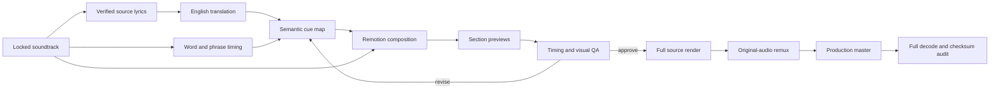

<div align="center">
  
  <h1>Lyrics Video Lab</h1>
  <p><strong>Source-first lyric films where translation, typography, motion, and music land as one complete piece.</strong></p>
  <p>
    <a href="https://github.com/ael-dev3/lyrics/releases/latest/download/Tanisea-Lyric-Film-Production-Master.mp4">Download the final master</a>
    ·
    <a href="projects/tanisea-lyric-film">Browse the source</a>
    ·
    <a href="audits/tanisea-ksviety-remix.md">Read the timing audit</a>
  </p>
  <p>
    <code>Remotion 4</code>
    <code>1080 × 1080</code>
    <code>30 fps</code>
    <code>153 seconds</code>
    <code>HEVC hvc1</code>
  </p>
</div>

## What we are building

This repository is a practical lab for making lyric videos feel like authored motion-design films—not subtitles placed over an image and not last-minute patches over an encoded export.

The goal is a repeatable production system that:

- begins with a locked soundtrack and verified lyric source;
- treats source-language transcription, English translation, and performance timing as separate layers;
- aligns English semantic groups to the words actually being performed;
- keeps lyric timing separate from animation entrance and exit timing;
- builds intros, verses, choruses, breaks, and outros inside one visual language;
- regenerates the complete film from source after every meaningful change;
- preserves source audio quality while delivering a compact final file;
- records remaining uncertainty honestly so the next render can improve.

## Current case study

### Tanisea — “Закричу на весь мир (ksviety Remix)”

The first project is a 153-second English lyric film rebuilt from its local Remotion source. The final section no longer uses unrelated or mismatched lyric animation: it resolves into the original Russian title while the same artwork, camera drift, particles, reactive halo, equalizer, frame chrome, and colour system continue underneath.

| Deliverable | Purpose | Link |
| --- | --- | --- |
| Production master | Compact, full-length HEVC delivery with the untouched original AAC soundtrack | [Download MP4](https://github.com/ael-dev3/lyrics/releases/latest/download/Tanisea-Lyric-Film-Production-Master.mp4) |
| Source-reference export | The earlier synced H.264 render used for visual and timing comparison | [Download MP4](https://github.com/ael-dev3/lyrics/releases/latest/download/Tanisea-Lyric-Film-Source-Reference.mp4) |
| Reproducible source archive | Remotion project, artwork, fonts, soundtrack, package lock, and timing data | [Download ZIP](https://github.com/ael-dev3/lyrics/releases/latest/download/Tanisea-Lyric-Film-Source-v1.0.0.zip) |
| Browsable source | The same project files directly in the repository | [Open project](projects/tanisea-lyric-film) |

### What changed in the production rebuild

- Recovered and rebuilt the complete animation from the original Remotion project.
- Removed the late wild-chant sequence that did not correspond cleanly to the performed words.
- Designed a native original-title outro rather than covering the old export with a replacement image.
- Retained live artwork motion, deterministic particles, spectrum-driven animation, and frame chrome through the ending.
- Rendered all 4,590 frames as one continuous composition.
- Delivered a 66.2 MB HEVC master with `hvc1`, `faststart`, and the original AAC stream copied bit-for-bit.
- Audited every displayed line and stored a machine-readable cue map for the next timing pass.

## Production model



The important distinction is between **vocal time** and **visual time**. A lyric can have the correct timestamp and still feel late if its blur and opacity animation only begins when the singer starts. The line should normally be fully legible at vocal onset, while word-group highlighting remains locked to the performance.

## Audit status and vNext

The current production master is visually coherent and technically verified. A deeper timing audit also found specific sync debt that should be addressed in the next source render:

- the first verse vocal begins around `60.09`, while the current break-card handoff waits until `64.08`;
- several second-chorus lines drift between `0.25` and `1.53` seconds late;
- the final clear chorus line remains until `118.00`, although the repeated title vocal begins around `116.05`;
- the current lyric component adds `0.32–0.50` seconds of perceived entrance lag through its visual envelope.

Nothing is hidden behind “close enough.” The [human-readable audit](audits/tanisea-ksviety-remix.md) explains every line, and the [machine-readable audit](audits/tanisea-ksviety-remix.json) contains the restored vNext cue windows.

## Repository map

```text
assets/
  tanisea-original-title.jpg       README hero captured from the final master
audits/
  tanisea-ksviety-remix.md         complete timing and translation review
  tanisea-ksviety-remix.json       machine-readable current/recommended cue map
docs/
  production-workflow.md           end-to-end production method
  qa-checklist.md                  editorial, audiovisual, and delivery QA
projects/
  tanisea-lyric-film/              reproducible Remotion source snapshot
```

## Run the source project

```sh
cd projects/tanisea-lyric-film
npm ci
npm run dev
```

Validate and render:

```sh
npx remotion compositions src/index.jsx
npm run render
```

The checked-in project reproduces today's production source snapshot. Before making a vNext master, apply the timing recommendations from the audit and refactor visual entrance/exit windows away from vocal cue boundaries.

## Working principles

1. Work from animation source—not from a previously encoded video.
2. Lock the exact soundtrack before timing anything.
3. Verify the exact remix structure; do not assume repeated choruses share timing.
4. Use automatic speech recognition as evidence, never as the final authority.
5. Align translated meaning in semantic groups rather than forcing false one-to-one word timing.
6. Make every section feel native to the same design system.
7. Prefer an honest title state over invented lyrics when the vocal becomes unclear or heavily processed.
8. Review the actual audiovisual clip; contact sheets alone cannot prove sync.
9. Re-render the entire composition and verify the delivered master end to end.

## Documentation

| Document | What it answers |
| --- | --- |
| [Production workflow](docs/production-workflow.md) | How do we take a soundtrack from lyric authority through timing, animation, rendering, and delivery? |
| [QA checklist](docs/qa-checklist.md) | What must pass before a lyric film is production-ready? |
| [Tanisea timing audit](audits/tanisea-ksviety-remix.md) | Where does the current film still differ from the performed audio or source meaning? |
| [Tanisea cue data](audits/tanisea-ksviety-remix.json) | What exact timestamps should a future implementation restore? |

## Roadmap

- [x] Recover the original local source project.
- [x] Rebuild the ending inside the native visual system.
- [x] Preserve the original soundtrack in the compact master.
- [x] Audit all 24 displayed lines.
- [x] Publish source, reference export, production master, and documentation.
- [ ] Separate vocal windows from visual animation windows.
- [ ] Restore the audited vNext cue map.
- [ ] Complete a fluent Russian/English editorial approval pass.
- [ ] Render and publish the vNext production master.

## Media and rights

The case-study media and project assets are provided for this production and its continued improvement. Music, artwork, fonts, artist names, and other third-party materials remain subject to their respective rights and licences. Verify redistribution and commercial-use rights before reusing the assets outside this project.
