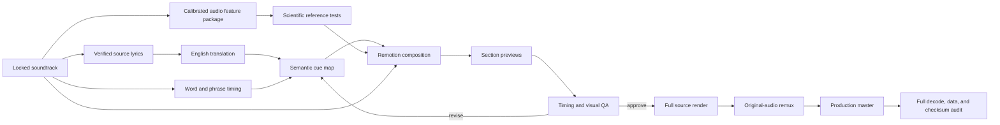

<div align="center">
  
  <h1>Lyrics Video Lab</h1>
  <p><strong>Source-first lyric films where translation, typography, motion, and music land as one complete piece.</strong></p>
  <p>
    <a href="https://github.com/ael-dev3/lyrics/releases/latest/download/Tanisea-Lyric-Film-Production-Master.mp4">Download the final master</a>
    ·
    <a href="projects/tanisea-lyric-film">Browse the source</a>
    ·
    <a href="audits/tanisea-vnext-qc-implementation.md">Read the QC implementation</a>
  </p>
  <p>
    <code>Remotion 4</code>
    <code>TypeScript 7.0.2</code>
    <code>1080 × 1080</code>
    <code>60 fps</code>
    <code>153 seconds</code>
    <code>HEVC hvc1</code>
  </p>
</div>

## What we are building

This repository is a practical lab for making lyric videos feel like authored motion-design films—not subtitles placed over an image and not last-minute patches over an encoded export.

The goal is a repeatable production system that:

- begins with a locked soundtrack and verified lyric source;
- treats source-language transcription, English translation, and performance timing as separate layers;
- aligns English semantic groups to the words actually being performed;
- keeps lyric timing separate from animation entrance and exit timing;
- builds intros, verses, choruses, breaks, and outros inside one visual language;
- regenerates the complete film from source after every meaningful change;
- uses strict, exactly pinned TypeScript for all authored source and reusable workflow code;
- preserves source audio quality while delivering a compact final file;
- separates calibrated audio measurements from artistic audio-reactive motion;
- reports analysis resolution, video cadence, units, transforms, and uncertainty honestly;
- controls source resolution, font loading, raster scale, colour conversion, chroma, and codec artifacts through measurable visual gates;
- records remaining uncertainty honestly so the next render can improve.

## Current case study

### Tanisea — “Закричу на весь мир (ksviety Remix)”

The first project is a 153-second English lyric film rebuilt from its local Remotion source. The final section no longer uses unrelated or mismatched lyric animation: it resolves into the original Russian title while the same artwork, camera drift, particles, reactive halo, equalizer, frame chrome, and colour system continue underneath.

| Deliverable | Purpose | Link |
| --- | --- | --- |
| Production master | Compact, full-length HEVC delivery with the untouched original AAC soundtrack | [Download MP4](https://github.com/ael-dev3/lyrics/releases/latest/download/Tanisea-Lyric-Film-Production-Master.mp4) |
| Source-reference export | The earlier synced H.264 render used for visual and timing comparison | [Download MP4](https://github.com/ael-dev3/lyrics/releases/latest/download/Tanisea-Lyric-Film-Source-Reference.mp4) |
| Reproducible source archive | Remotion project, artwork, fonts, soundtrack, package lock, and timing data | [Download ZIP](https://github.com/ael-dev3/lyrics/releases/latest/download/Tanisea-Lyric-Film-Source-v1.0.0.zip) |
| Browsable source | The same project files directly in the repository | [Open project](projects/tanisea-lyric-film) |

### What changed in the production rebuild

- Recovered and rebuilt the complete animation from the original Remotion project.
- Removed the late wild-chant sequence that did not correspond cleanly to the performed words.
- Designed a native original-title outro rather than covering the old export with a replacement image.
- Retained live artwork motion, deterministic particles, spectrum-driven animation, and frame chrome through the ending.
- Rebuilt all 9,180 frames at 60 fps as one continuous composition.
- Applied all 24 externally measured phrase onsets with separate vocal, entrance, legibility, highlight, and exit windows.
- Replaced the duplicated hand-timed chorus with one normalized semantic marker stack.
- Added deterministic stereo audio features, a sharper 64-band instrument rail, and bounded emotional line reach.
- Preserved the original AAC stream without gain or normalization in the compact HEVC delivery path.
- Stored the complete external report, exact implemented cue map, and decision record in the repository.

## Production model



The important distinction is between **vocal time** and **visual time**. A lyric can have the correct timestamp and still feel late if its blur and opacity animation only begins when the singer starts. The line should normally be fully legible at vocal onset, while word-group highlighting remains locked to the performance.

## Audit status and vNext

Two independent 30 fps audits found no global stream offset, but measured line-level errors as large as `0.74 s` early and `1.17 s` late. Their onset definitions differ by `10–450 ms`, so vNext preserves both tables and uses their rounded midpoint rather than claiming false sample accuracy. Consensus anchors place the verse at `01:04.06`, the critical second “And raise the ocean” at `01:40.89`, and the final fire line at `01:53.81` before the original-title transition at `01:58.20`.

The 60 fps source makes every lyric fully legible three frames before its measured onset and switches semantic focus on the onset. Adjacent cards finish their handoff by the next onset, eliminating both blank gaps and double-text states. Runtime assertions block regressions in cue bounds, targets, adjacent handoffs, and repeated-chorus structure.

Nothing is hidden behind “close enough.” Read the [supplied synchronization report](audits/Tanisea_Lyric_Film_Sync_QC_Report.md), the independent [timing QA audit](audits/Tanisea_Lyric_Film_Timing_QA_Audit.md), the [reconciliation record](audits/tanisea-vnext-qc-implementation.md), and the [exact machine-readable cue map](audits/tanisea-vnext-qc-implementation.json).

### Honest first-project assessment

The audited result scores **8/10 overall as a first project of this type**. Art direction, technical mastering, and reproducibility are already strong; lyric synchronization and bilingual editorial alignment are the limiting areas. Because synchronization is a core function of a lyric film, the major first-verse and second-chorus misses prevent the higher-scoring production strengths from making this a 10/10 master.

The [full retrospective and semantic-highlighting proposal](docs/first-project-retrospective.md) records the scorecard, improvement order, and a vNext design that allows English meaning groups to activate forwards, backwards, repeatedly, or simultaneously when Russian and English phrase order differs.

### 10/10 scientific audio target

The earlier equalizer was truthfully audio-reactive but not a calibrated analyzer and was assessed at approximately **5/10**. vNext now stores a deterministic 60 fps stereo feature package with 64 logarithmic Hann-windowed bands, published 20 Hz–20 kHz limits, an 80 dB display range, dBFS values, pressure, transient impact, low-end weight, brightness, authored emotional accents, and checksum-backed artifacts. Full ITU/EBU loudness, oversampled true peak, calibration fixtures, and independent numerical validation remain required before making a literal scientific-accuracy claim.

The approved claim is **“millisecond-resolved analysis with frame-accurate visualization.”** At the proposed 60 fps, the image updates every `16.667 ms`; stored events may be reported to 1 ms without pretending the video itself refreshes every millisecond. The [scientific audio-visualization specification](docs/scientific-audio-visualization.md) defines the architecture, visual language, numerical tolerances, references, and pass/fail rubric.

### 10/10 pixel-perfect visual target

The vNext visual contract controls the raster-to-delivery path: bundled font coverage, native-grid artwork, pixel-aligned geometry, 2× PNG rendering, explicit BT.709 metadata, a 4:4:4 reference, one documented downsample, 10-bit HEVC delivery, decoded-frame inspection, and temporal artifact review. Host-dependent Cyrillic fallback and JPEG browser intermediates have been removed; Playfair is bundled under the SIL OFL.

### Cleaner emotional audio-reactive motion

The vNext cinematic visualisation now has a separate motion-design contract. Sustained track-relative pressure controls broad line reach; sample-indexed transients create brief overreach whose apex lands on the sound; bass adds bounded weight; and human-authored accents preserve emotional meaning that loudness alone cannot infer.

For the central title rails, the initial range runs from a calm `520–580 px` to a hard-capped `900–920 px` hero state. Hero reach is reserved for roughly the top `1–2%` of musical energy or a reviewed emotional apex, keeping the overall film cleaner while making the loudest moments materially more powerful. The [clean emotional audio-reactive motion specification](docs/emotional-audio-reactive-motion.md) defines the signal architecture, equations, timing, Tanisea loudness baseline, line geometry, impact budget, fixtures, and pass/fail gates.

## Repository map

```text
assets/
  tanisea-original-title.jpg       README hero captured from the final master
audits/
  Tanisea_Lyric_Film_Sync_QC_Report.md supplied full-master synchronization report
  Tanisea_Lyric_Film_Timing_QA_Audit.md independent timing, animation, lyric, and workflow audit
  tanisea-ksviety-remix.md         complete timing and translation review
  tanisea-ksviety-remix.json       machine-readable current/recommended cue map
  tanisea-vnext-qc-implementation.md applied decisions and verification gates
  tanisea-vnext-qc-implementation.json exact 60 fps cue contract
docs/
  emotional-audio-reactive-motion.md clean sound contact and bounded emotional line reach
  first-project-retrospective.md    scorecard and non-linear highlighting design
  pixel-perfect-visual-workflow.md  deterministic raster, colour, chroma, and artifact contract
  production-workflow.md           end-to-end production method
  qa-checklist.md                  editorial, audiovisual, and delivery QA
  scientific-audio-visualization.md 10/10 measurement and display target
  typescript-first-workflow.md      strict source, compiler, migration, and upgrade policy
projects/
  tanisea-lyric-film/              reproducible Remotion source snapshot
```

## Run the source project

```sh
cd projects/tanisea-lyric-film
npm ci
npm run features
npm run dev
```

Validate and render:

```sh
npm run check
npm run render
```

The checked-in render command creates the vNext 2× PNG/BT.709 4:4:4 reference. The release workflow downsamples that reference once to 1080×1080, encodes 10-bit HEVC, copies the locked AAC stream, and performs full decode and metadata checks.

## Working principles

1. Work from animation source—not from a previously encoded video.
2. Author application, analysis, render, and reusable workflow code in strict TypeScript; pin the verified latest stable compiler exactly.
3. Lock the exact soundtrack before timing anything.
4. Verify the exact remix structure; do not assume repeated choruses share timing.
5. Use automatic speech recognition as evidence, never as the final authority.
6. Align translated meaning in semantic groups rather than forcing false one-to-one word timing or artificial left-to-right progress.
7. Keep calibrated measurements separate from documented artistic transforms.
8. Make every section feel native to the same design system.
9. Prefer an honest title state over invented lyrics when the vocal becomes unclear or heavily processed.
10. Review the actual audiovisual clip; contact sheets alone cannot prove sync.
11. Compare the decoded delivery to a locked high-quality visual reference; the Studio preview cannot prove encoded quality.
12. Re-render the entire composition and verify the delivered master end to end.

## Documentation

| Document | What it answers |
| --- | --- |
| [First-project retrospective](docs/first-project-retrospective.md) | How strong was the first result, what prevents a 10/10 score, and how should non-linear bilingual highlighting work? |
| [Scientific audio target](docs/scientific-audio-visualization.md) | What would make the audio visualization scientifically defensible, testable, sharp, and worthy of the internal 10/10 target? |
| [Pixel-perfect visual workflow](docs/pixel-perfect-visual-workflow.md) | How do we preserve sharp geometry, deterministic type, BT.709 colour, gradients, chroma, motion, and decoded codec quality without visual artifacts? |
| [Emotional audio-reactive motion](docs/emotional-audio-reactive-motion.md) | How should clean lines, glow, weight, and reach sit on the soundtrack and expand farther only on genuinely loud or emotionally authored moments? |
| [TypeScript-first workflow](docs/typescript-first-workflow.md) | How are current and future projects kept on strict, latest-stable, exactly pinned TypeScript instead of JavaScript? |
| [Production workflow](docs/production-workflow.md) | How do we take a soundtrack from lyric authority through timing, animation, rendering, and delivery? |
| [QA checklist](docs/qa-checklist.md) | What must pass before a lyric film is production-ready? |
| [Historical source-recovery audit](audits/tanisea-ksviety-remix.md) | What did the first provisional audit infer, and which findings were later superseded? |
| [Historical cue data](audits/tanisea-ksviety-remix.json) | What provisional timestamps were retained for provenance before the two full-master reports? |
| [Supplied full-master QC report](audits/Tanisea_Lyric_Film_Sync_QC_Report.md) | What line-level, wording, pacing, readability, audio, and export issues were measured in the previous master? |
| [Independent timing QA audit](audits/Tanisea_Lyric_Film_Timing_QA_Audit.md) | Which waveform attacks, semantic stresses, cumulative-drift patterns, BPM estimate, and platform-audio risks were independently detected? |
| [vNext QC implementation](audits/tanisea-vnext-qc-implementation.md) | Which report findings were applied, which user-approved wording prevailed, and what must pass before release? |
| [vNext exact cue contract](audits/tanisea-vnext-qc-implementation.json) | What 24 onsets, inferred ends, visual leads, wording, and repeated-section policy are rendered now? |

## Roadmap

- [x] Recover the original local source project.
- [x] Rebuild the ending inside the native visual system.
- [x] Preserve the original soundtrack in the compact master.
- [x] Audit all 24 displayed lines.
- [x] Publish source, reference export, production master, and documentation.
- [x] Define the 10/10 scientific audio-visualization contract and verification rubric.
- [x] Define the 10/10 pixel-perfect visual contract, current-source risk audit, and artifact gates.
- [x] Define the clean emotional-motion envelope, line-reach mapping, impact budget, and sync gates.
- [x] Migrate the current Remotion source from JavaScript/JSX to strict TypeScript/TSX and pin TypeScript `7.0.2`.
- [x] Define the TypeScript-first policy and controlled stable-compiler upgrade gate for future projects.
- [x] Separate vocal windows from visual animation windows.
- [x] Apply all 24 measured QC onsets and store the exact vNext cue map.
- [x] Implement semantic cue targets that support intentional backward, repeated, and simultaneous activation.
- [ ] Complete a fluent Russian/English editorial approval pass.
- [ ] Build the deterministic multi-resolution stereo analysis pipeline and fixture suite.
- [x] Replace the artistic 56-bar baseline with a documented 64-band, 60 fps instrument rail.
- [ ] Validate loudness, true peak, spectrum, stereo behavior, event timing, and rendered values independently.
- [x] Generate the deterministic sustained-pressure, transient-impact, and emotional-accent motion envelope.
- [x] Replace duplicated local line formulas with one reusable, pixel-aligned `AudioMotionLine` component.
- [x] Replace the host-dependent Cyrillic title font and remove the under-resolved artwork zoom.
- [x] Pin PNG intermediates and BT.709 in the 2× reference path.
- [ ] Complete a downsampling bake-off, codec ladder, decoded-frame diff, and temporal artifact audit.
- [ ] Render and publish the vNext production master.

## Media and rights

The case-study media and project assets are provided for this production and its continued improvement. Music, artwork, fonts, artist names, and other third-party materials remain subject to their respective rights and licences. Verify redistribution and commercial-use rights before reusing the assets outside this project.
