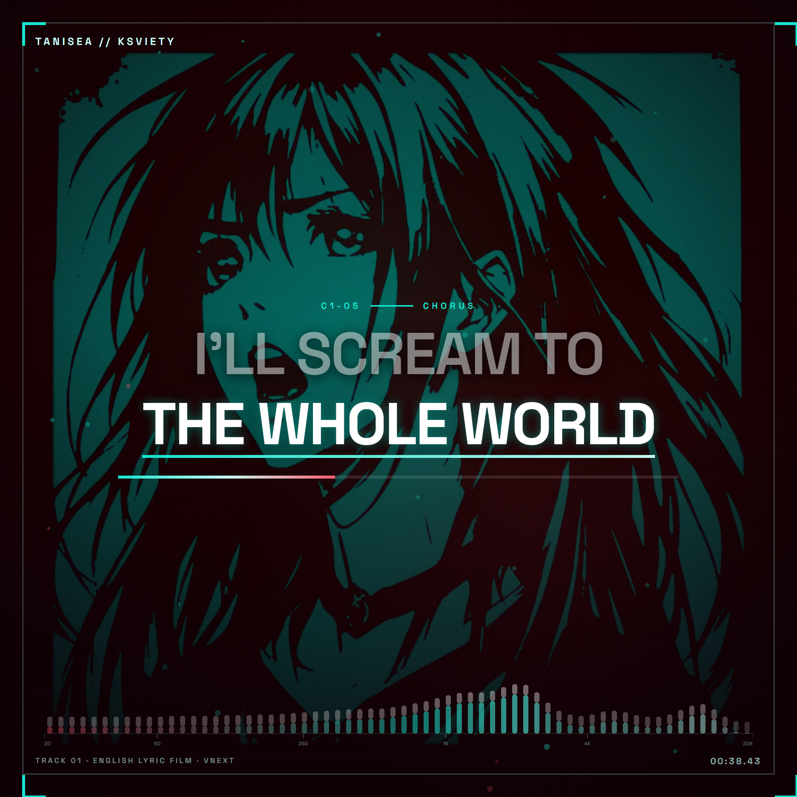

<div align="center">
  
  <h1>Tanisea — Precision-Synced English Lyric Film</h1>
  <p><strong>Sample-indexed Russian vocal alignment, semantic English focus, and verified frame-bounded rendering.</strong></p>
  <p>
    <a href="https://github.com/ael-dev3/lyrics/releases/download/v2.4.0/Tanisea-Lyric-Film-Production-Master-vNext.mp4">Production master</a>
    ·
    <a href="https://github.com/ael-dev3/lyrics/releases/download/v2.4.0/Tanisea-Lyric-Film-Sync-Proof-120fps.mp4">120 fps sync proof</a>
    ·
    <a href="projects/tanisea-lyric-film">Source project</a>
    ·
    <a href="https://github.com/ael-dev3/lyrics/releases/download/v2.4.0/Tanisea-Lyric-Film-Workflow-Evidence-vNext.zip">Workflow evidence</a>
    ·
    <a href="audits/tanisea-final-qa-vnext.md">Final QA</a>
  </p>
  <p>
    <code>1080 × 1080</code>
    <code>60 fps</code>
    <code>153 seconds</code>
    <code>HEVC 10-bit</code>
    <code>AAC 44.1 kHz</code>
  </p>
</div>

## Latest dual-song publication: Roi × Slow Down

The latest release applies the same precision lyric-film workflow to the mixed track `roi x did i tell u that i miss u` (`11tjwUK2adU`). It keeps the two sources distinct in the public picture and in the timing authority:

| Lane | Track | Timing / visual identity |
| --- | --- | --- |
| Song 1 | `Roi` | French · warm rail · 48 reviewed lines |
| Song 2 | `Slow down / Did I tell you that I miss you?` | English · cool rail · 13 reviewed lines |

The public master is 1920×1080 at 60 fps. The source’s native maximum was 720p60; the selected 1080p60 stream is YouTube’s AI-upscaled derivative. The separate 120-fps proof, source metadata, alignment JSON, QA report, checksums, and exact reusable workflow are published with the release.

| Artifact | Link |
| --- | --- |
| Song 1 · `Roi` / Song 2 · `Slow Down` public master | [Roi × Slow Down Lyric Film · 1080p60](https://github.com/ael-dev3/lyrics/releases/download/roi-slowdown-v1.0.0/Roi-x-Slow-Down-Lyric-Film-1080p60.mp4) |
| Song 1 + Song 2 synchronization proof | [120 fps diagnostic proof](https://github.com/ael-dev3/lyrics/releases/download/roi-slowdown-v1.0.0/Roi-x-Slow-Down-Sync-Proof-120fps.mp4) |
| Source project and exact next-song workflow | [Dual-song source archive](https://github.com/ael-dev3/lyrics/releases/download/roi-slowdown-v1.0.0/Roi-x-Slow-Down-Workflow.zip) |
| Source media and provenance | [1080p60 source](https://github.com/ael-dev3/lyrics/releases/download/roi-slowdown-v1.0.0/Roi-x-Slow-Down-Source-1080p60-AI-Upscaled.mp4) · [metadata](https://github.com/ael-dev3/lyrics/releases/download/roi-slowdown-v1.0.0/Roi-x-Slow-Down-Source-Metadata.json) |
| Timing authority | [Song 1 / Song 2 alignment JSON](https://github.com/ael-dev3/lyrics/releases/download/roi-slowdown-v1.0.0/Roi-x-Slow-Down-Alignment.json) |
| QA and checksums | [QA JSON](https://github.com/ael-dev3/lyrics/releases/download/roi-slowdown-v1.0.0/Roi-x-Slow-Down-Release-QA.json) · [checksums](https://github.com/ael-dev3/lyrics/releases/download/roi-slowdown-v1.0.0/Roi-x-Slow-Down-Checksums.sha256) |
| Transcription evidence | [Automatic + French + English Whisper passes](https://github.com/ael-dev3/lyrics/releases/download/roi-slowdown-v1.0.0/Roi-x-Slow-Down-Transcription-Evidence.zip) |
| Reusable workflow | [Dual-song workflow guide](projects/roi-slowdown-lyric-film/docs/roi-slowdown-workflow.md) |

## What this release demonstrates

Tanisea is a complete 9,180-frame Remotion lyric film built against a locked 153-second soundtrack. Russian vocal boundaries are stored as integer sample indices. Each reviewed source group activates the English phrase carrying the same meaning, including backward activation where source and translation order differ. Version 2.4 brings `00:40–00:50` to the same cinematic presentation standard as the repeated `01:46–01:56` passage while preserving every reviewed cue sample and semantic target. It also replaces the rounded measured-bar/transient-cap stack with 64 continuous flat-ended spectrum lines.

The public composition keeps diagnostics out of the picture. A separate 120 fps proof exposes source tokens, target segments, sample indices, confidence, uncertainty, and frame error for inspection.

The implementation includes:

- 24 reviewed vocal lines, 102 source tokens, 74 English segments, and 74 semantic cues;
- a deterministic 64-band audio feature package with one record per 60 fps frame;
- semantic focus that supports forward, backward, repeated, and simultaneous targets, with one cinematic entrance, attack, release, and handoff profile across C1, V1, and C2;
- a zero-phase temporally and spatially smoothed bottom spectrum with 64 flat-ended 4 px ember/teal lines, 96 px of measured travel, and up to 18 px of integrated transient extension with no separate caps or dots;
- a clean upper field, mobile-safe lyric geometry, persistent frame chrome, and a native original-title outro;
- 4:4:4 reference rendering followed by one controlled 1080×1080 delivery conversion;
- packet-identical AAC audio in the production master and synchronization proof.

## Measured synchronization bounds

Public characterization: **sample-indexed alignment with frame-bounded rendering**.

| Measure | Verified result |
| --- | --- |
| Timing authority | Integer sample indices at 44,100 Hz |
| Maximum reviewed token uncertainty | 882 samples / 20.000 ms |
| Maximum 60 fps cue-boundary frame error | 8.321995 ms, within the 8.334 ms bound |
| Maximum 120 fps cue-boundary frame error | 4.002268 ms, within the 4.167 ms bound |
| Public cadence | 60 fps / 9,180 frames |
| Proof cadence | 120 fps / 18,360 frames |

The [reviewed alignment report](audits/tanisea-word-alignment-v3.md) lists every token and semantic cue with source samples, uncertainty, evidence methods, and signed frame error. The [machine-readable alignment](projects/tanisea-lyric-film/alignment/tanisea-word-alignment-v3.json) is the render authority.

## Release files

| Artifact | Purpose |
| --- | --- |
| [Production master](https://github.com/ael-dev3/lyrics/releases/download/v2.4.0/Tanisea-Lyric-Film-Production-Master-vNext.mp4) | 1080×1080, 60 fps, 10-bit HEVC `hvc1`, original AAC |
| [Synchronization proof](https://github.com/ael-dev3/lyrics/releases/download/v2.4.0/Tanisea-Lyric-Film-Sync-Proof-120fps.mp4) | 1080×1080, 120 fps diagnostic render, original AAC |
| [README screenshot](https://github.com/ael-dev3/lyrics/releases/download/v2.4.0/tanisea-vnext-hero.png) | Lossless 2160×2160 frame from the revised `00:40–00:50` passage |
| [Source archive](https://github.com/ael-dev3/lyrics/releases/download/v2.4.0/Tanisea-Lyric-Film-Source-vNext.zip) | Tracked Remotion project files at the release source revision |
| [Alignment JSON](https://github.com/ael-dev3/lyrics/releases/download/v2.4.0/tanisea-word-alignment-v3.json) | Reviewed sample-indexed timing and semantic mapping |
| [QA JSON](https://github.com/ael-dev3/lyrics/releases/download/v2.4.0/tanisea-final-qa-vnext.json) | Machine-readable build, media, layout, and repeatability evidence |
| [Checksums](https://github.com/ael-dev3/lyrics/releases/download/v2.4.0/CHECKSUMS.sha256) | SHA-256 values for the release package |
| [Workflow evidence](https://github.com/ael-dev3/lyrics/releases/download/v2.4.0/Tanisea-Lyric-Film-Workflow-Evidence-vNext.zip) | Canonical alignment provenance, both QA executions, generated QA media, and visual-review artifacts |
| [Workflow manifest](https://github.com/ael-dev3/lyrics/releases/download/v2.4.0/tanisea-workflow-evidence-vnext.json) | Per-file SHA-256 and byte size for the supplemental workflow archive |
| [Workflow checksums](https://github.com/ael-dev3/lyrics/releases/download/v2.4.0/WORKFLOW-EVIDENCE.sha256) | SHA-256 values for the workflow archive and standalone manifest |
| [Earlier platform snapshot](deliverables/Tanisea-Lyric-Film-vNext-60fps-Final.mp4) | Previously published attenuated-AAC delivery retained with its original checksum |

## Build the source

Requirements: Node.js 20 or newer, npm, FFmpeg, FFprobe, and the Chromium runtime supported by Remotion.

```sh
cd projects/tanisea-lyric-film
npm ci
npm run features
npm run check
```

Open the composition or render the 2× reference:

```sh
npm run dev
npm run render
```

Delivery and QA commands are documented in the [project README](projects/tanisea-lyric-film/README.md). The [v2.4 implementation report](docs/cinematic-parity-v2.4-implementation.md) records the first/later-passage parity work and continuous-line spectrum. The [first-pass song workflow](docs/first-pass-song-workflow.md) gives the exact order, timing contracts, review artifacts, and release gates to reuse on the next song. Earlier revisions remain documented in the [v2.3](docs/first-act-semantic-sync-v2.3-implementation.md), [v2.2](docs/first-act-polish-v2.2-implementation.md), [v2.1](docs/first-act-precision-v2.1-implementation.md), and [original implementation](docs/precision-sync-vnext-implementation.md) reports. The [workflow evidence guide](docs/workflow-evidence.md) inventories the supplemental generated evidence and its deliberate exclusions.

## Repository map

```text
assets/                              lossless repository hero
audits/tanisea-word-alignment-v3.md reviewed timing evidence
audits/tanisea-final-qa-vnext.*     final human- and machine-readable QA
audits/tanisea-workflow-evidence-vnext.json
docs/precision-sync-vnext-implementation.md
docs/first-act-precision-v2.1-implementation.md
docs/first-act-polish-v2.2-implementation.md
docs/first-act-semantic-sync-v2.3-implementation.md
docs/cinematic-parity-v2.4-implementation.md
docs/first-pass-song-workflow.md
docs/workflow-evidence.md
projects/tanisea-lyric-film/
  alignment/                         render-authoritative sample data
  public/                            locked media, fonts, audio features
  scripts/                           generation, render, encode, and QA tools
  src/                               Remotion compositions and visual system
  tests/                             timing, layout, media, and release gates
projects/roi-slowdown-lyric-film/    dual-song Roi × Slow Down source project
  alignment/                         Song 1/Song 2 sample-indexed timing
  scripts/                            source lock, alignment export, media QA
  src/                                1080p60 Remotion master and 120fps proof
  tests/                              timing and calm-visualizer contracts
```

## QA status

The release gate covers strict typechecking, 1,200+ assertions, browser-measured layout, composition discovery, full media decode, codec and colour metadata, AAC packet identity, selected encoded frames, generated QA media, and two independent executions of the final matrix. Publication evidence and immutable asset URLs are recorded in the [final QA report](audits/tanisea-final-qa-vnext.md). The generated alignment, run, media, and visual-review evidence is preserved in the supplemental workflow archive.

## Media and rights

The soundtrack, artwork, names, fonts, and other included media remain subject to their respective rights and licences. Confirm the necessary rights before redistribution or commercial use. Playfair is included under the SIL Open Font License in `projects/tanisea-lyric-film/public/Playfair-OFL.txt`.
