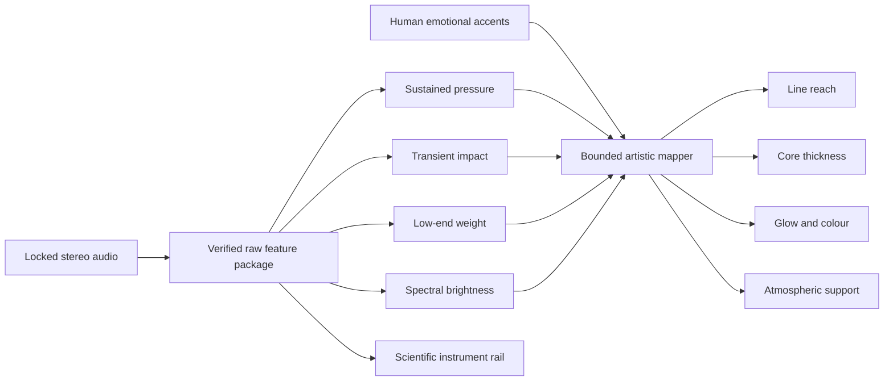

# Clean emotional audio-reactive motion

## Purpose

This specification defines how cinematic lines, dividers, halos, and related accents should sit more precisely on the soundtrack, remain visually clean, and travel farther during genuinely loud musical moments.

The intended result is not “more movement everywhere.” Impact comes from contrast:

- quiet passages hold a restrained, stable baseline;
- builds increase reach and pressure gradually;
- strong transients produce a short, synchronized overreach;
- the loudest chorus and title moments may approach the frame edges;
- lyrics and scientific measurements remain readable and geometrically stable.

This is an **artistic motion system**, not a measurement display. It consumes verified audio features but never modifies or relabels the scientific values documented in the [scientific audio-visualization specification](scientific-audio-visualization.md).

## Why the current response feels smaller and less exact

The checked-in source derives one `masterLevel` from already compressed spectrum bars, clamps `energy` to a narrow range, and holds recent FFT peaks. In the outro, the accent-line width is:

```ts
const lineWidth = 520 + reveal * 150 + pulse * 120;
```

Because `pulse` is capped at `0.5`, audio contributes at most `60 px`. The reveal animation contributes more width than the soundtrack, and the recent-frame maximum softens the distinction between an exact hit and the frames after it. The line is audio-reactive, but the loudest musical moments do not gain enough additional reach to feel exceptional.

The vNext system should replace this one composite control with separate sustained, transient, tonal, and editorial drivers.

## Core design principles

1. **Clean before large.** Every reactive line has a solid, pixel-aligned core. Glow is a separate subordinate layer.
2. **Relative dynamics.** Rank loudness against this exact track; do not assume one absolute LUFS value means the same visual intensity for every master.
3. **Apex on sound.** The line should reach its local maximum on the audible hit, not begin reacting after it.
4. **Macro plus micro.** Sustained loudness controls broad reach; transient strength controls brief overreach.
5. **Emotion is authored.** Loudness is evidence of energy, not a complete model of emotion. Important quiet lyrics may receive a manually authored accent without falsifying the measured audio.
6. **One dominant gesture.** Do not simultaneously maximize line width, text scale, camera shake, glow, particles, colour split, and bar height.
7. **Bounded geometry.** No feature may cross the safe frame, collide with lyrics, or become thinner than the pixel-perfect core.

## Signal architecture



The scientific rail reads calibrated features directly. Cinematic layers read only the separately versioned artistic mapper.

## Required artistic controls

| Control | Source | Visual responsibility | Must not drive |
| --- | --- | --- | --- |
| `pressure` | Track-relative sustained stereo power or momentary loudness | Main line reach and slow halo breadth | Scientific values or lyric timing |
| `impact` | Sample-indexed transient/onset strength | Short overreach, endpoint flash, brief glow | Sustained size |
| `lowEnd` | Calibrated low-frequency band envelope | Small core-weight or bass pulse | Text displacement |
| `brightness` | High-band energy or spectral centroid | Restrained colour temperature and fine sparkle | Line length by itself |
| `emotion` | Human-authored cue envelope | Phrase-specific emphasis and quiet emotional exceptions | Measurement labels |
| `section` | Intro, verse, build, chorus, break, outro | Maximum gesture budget and visual vocabulary | Fabricated audio energy |

Do not derive every control from the same FFT average. Independent drivers allow a sustained chorus, a sharp snare, a bass impact, and a quiet lyric to look meaningfully different.

## Track-relative normalization

This song is heavily mastered, so much of it is objectively loud. A fixed threshold such as `−10 LUFS` would provide almost no contrast.

For the frozen soundtrack, compute valid momentary-loudness percentiles after excluding digital silence and invalid startup windows:

```text
P50 = median active momentary loudness
P85 = strong passage threshold
P95 = major peak threshold
P99 = exceptional peak threshold
```

Map sustained pressure with a soft knee:

```text
pressure = smoothstep(P60, P96, momentaryLoudness)
pressure = pressure ^ 1.35
```

This keeps ordinary loud material below maximum and gives the top few percent room to expand. Store the exact percentiles and gate policy in the artistic-envelope manifest.

Do not normalize each frame or each lyric line independently. That would make a quiet verse hit look as large as a full chorus and erase the track’s real dynamic hierarchy.

## Separate sustained pressure from transient impact

### Sustained pressure

Use a centred offline window suitable for broad musical intensity. Momentary loudness is useful for section-scale pressure; a shorter stereo power envelope may supplement it when `400 ms` is too slow for a particular visual.

Initial artistic timing target:

- attack: `60–100 ms`;
- release: `280–450 ms`;
- no unreported peak hold;
- compensate the feature window centre and any filter delay before mapping to video time.

### Transient impact

Use the separate sample-indexed onset path from the scientific analysis package. Normalize onset strength against the track’s own transient distribution:

```text
impact = smoothstep(onsetP80, onsetP99, onsetStrength)
impact = impact ^ 1.7
```

Initial artistic timing target:

- visual pre-roll: up to `33 ms` at 60 fps;
- apex: nearest video frame to the stored transient timestamp;
- release: `160–240 ms`;
- cooldown after a major hit: `200–350 ms`, unless a denser authored pattern is intended.

The offline mapper may begin extending one or two frames before the sound so the geometric apex lands on the hit. This anticipation belongs only to the artistic control stream; it does not alter the event timestamp shown by the scientific display.

## Authored emotional accents

Loudness alone cannot understand the lyric. Add a reviewed cue map for moments whose emotional importance is greater than their amplitude implies:

```json
[
  {
    "id": "chorus-scream-02",
    "start": 104.10,
    "apex": 105.38,
    "end": 106.10,
    "intensity": 0.95,
    "targets": ["title-rails", "frame-corners"],
    "reason": "vocal peak on the repeated title phrase",
    "owner": "editorial"
  }
]
```

Requirements:

- `apex` aligns to a reviewed vocal or musical event;
- `reason` explains the emotional intention;
- `intensity` is bounded from `0` to `1`;
- manual accents may change reach, colour, hold, or negative space, but never displayed scientific values;
- timing must be rechecked after any lyric-cue correction.

Quiet emotional moments should normally use restraint, colour, a held endpoint, or reduced surrounding motion instead of falsely pretending the audio is loud.

## Line-reach mapping

### Composite envelope

Use a soft, bounded hierarchy rather than a raw sum:

```text
baseReach = max(pressure^1.45, 0.72 × impact^1.8)
emotionLift = 0.18 × emotion
hero = smoothstep(P95, P99, momentaryLoudness) × max(impact, emotion)
reach = clamp(baseReach + emotionLift, 0, 1)
```

`hero` is intentionally difficult to reach. It represents the combination of exceptional sustained level and a strong hit or authored emotional apex.

### Geometry at 1080×1080

For the central paired title rails, use this initial range:

| State | Full line-group width | Meaning |
| --- | ---: | --- |
| Resting | `520–580 px` | Quiet, composed baseline. |
| Active | `600–740 px` | Normal musical movement. |
| Strong | `760–840 px` | Build or chorus pressure. |
| Major | `850–890 px` | Top-five-percent passage or strong transient. |
| Hero | `900–920 px` | Exceptional peak with editorial justification. |

Candidate mapping:

```text
rawWidth = 520 + 300 × reach + 100 × hero
widthPx = min(920, 2 × round(rawWidth / 2))
```

The even-pixel quantization keeps paired endpoints symmetric and supports the [pixel-perfect visual workflow](pixel-perfect-visual-workflow.md). The `920 px` hard cap leaves `80 px` at each side of a centred 1080px composition. Recalculate the cap if the frame chrome or safe area changes.

The current `maxWidth: '84%'` would silently stop a 1080px line group near `907 px`. Replace it with the explicit, reviewed safe-frame cap in the reusable component; do not stack both limits and assume the requested hero width is visible.

Do not animate the line with an unconstrained `scaleX()` that leaves blurred fractional endpoints. Prefer explicit SVG endpoints or two centre-anchored core segments whose lengths are derived from the quantized width.

## Thickness, glow, and colour

Line reach is the primary emotional gesture. Other properties support it with smaller ranges:

```text
coreThickness = 2 + round(2 × lowEnd)       // 2–4 final pixels
glowRadius = 8 + 24 × max(impact, hero)     // separate layer
glowOpacity = 0.12 + 0.28 × max(impact, hero)
```

- Keep the core solid and at least two final pixels.
- Let bass add weight, not large vertical displacement.
- Let transients brighten endpoints briefly.
- Keep a white or high-luminance core inside saturated teal/ember glow so 4:2:0 delivery preserves the mark.
- Do not blur the parent containing lyrics, numbers, or line cores.
- Avoid a permanently wide glow; reduced atmosphere before a peak makes the peak feel larger.
- Use colour changes sparingly. Reach, brightness, and thickness should not all hit maximum on every beat.

## Section choreography

Audio remains primary, while each section controls the available gesture budget:

| Section | Reach behavior | Supporting motion |
| --- | --- | --- |
| Intro | Mostly resting; one or two preview pulses | Slow artwork drift, almost no endpoint flare. |
| Verse | Narrow-to-active range; preserve lyric calm | Small low-end weight, restrained glow. |
| Build | Rising sustained reach with visible headroom left | Gradual frame-corner tension and halo breadth. |
| Chorus | Strong and major states available | Transient overreach and brief endpoint flash. |
| Break | Wider analyzer or structural rails, less lyric motion | Let instrumentation carry the energy. |
| Outro/title | Full major/hero range available | Symmetric title rails remain the dominant gesture. |

Section rules set ceilings and vocabulary, not fake energy. A weak chorus frame should not be forced to maximum, and a real exceptional build hit should still be allowed to read.

## Impact budget

To keep the visualisation clean:

- only the top `15–20%` of active moments should enter the strong range;
- only roughly the top `5%` should enter major range;
- hero reach should be limited to the top `1–2%` or a reviewed emotional apex;
- after a hero gesture, return through a shaped release instead of snapping back;
- do not trigger a new full extension on every kick in a dense sequence;
- choose one primary gesture and at most two secondary gestures per event;
- reduce background particles or glow just before selected hero moments to create negative-space contrast.

These percentages are starting targets, not fabricated measurements. Record the final distribution produced by the frozen envelope and review it against the music.

## Tanisea baseline measured on 2026-08-30

FFmpeg `ebur128` analysis of the checked-in soundtrack produced:

| Quantity | Result |
| --- | ---: |
| Integrated programme loudness | approximately `−6.0 LUFS` |
| Loudness Range | approximately `9.6 LU` |
| Active momentary `P50` | `−5.3 LUFS` |
| Active momentary `P85` | `−4.2 LUFS` |
| Active momentary `P95` | `−3.7 LUFS` |
| Active momentary `P99` | `−3.3 LUFS` |
| Highest observed momentary report, sampled at 100ms cadence | approximately `−2.9 LUFS` near `95.10 s` |

Initial major/hero candidate windows include approximately:

- `39.1–39.3 s`, near “the whole world” in the first chorus;
- `46.1–46.3 s`, near the end of “the walls of apartments”;
- `95.0–95.2 s`, during the second build;
- `105.3–106.8 s`, across “scream to the whole world”;
- `113.1–113.6 s`, near the end of the repeated chorus line.

These are loudness candidates, not final editorial decisions. Recheck them against the corrected vNext lyric map, transient events, and human listening. Closely spaced reports belong to one sustained event and must not create many separate maximum-width flashes.

## Data and component contract

Store the artistic envelope separately from raw analysis:

```text
analysis/
  manifest.json
  spectral-features.f32
  events.json
art-direction/
  emotional-accents.json
  motion-envelope.f32
  motion-manifest.json
```

Each motion frame should use a stable TypeScript contract containing at least:

```ts
export type MotionFrame = Readonly<{
  time: number;
  pressure: number;
  impact: number;
  lowEnd: number;
  brightness: number;
  emotion: number;
  hero: number;
  reach: number;
  lineWidthPx: number;
  coreThicknessPx: number;
  glowRadiusPx: number;
}>;
```

The motion manifest records source-analysis hashes, percentile thresholds, equations, smoothing constants, manual-accent hash, frame rate, interpolation mode, geometry caps, and generator version.

Use one reusable component for all related rails:

```tsx
<AudioMotionLine
  envelope={motionFrame}
  minWidth={520}
  maxWidth={920}
  coreColor="#b8fff4"
  glowColor="#10e0cc"
  role="title-rail"
/>
```

Do not duplicate slightly different audio formulas inside the intro, chorus, and outro components. Section-specific behavior belongs in configuration around one tested mapper. Implement the generator, manifest validator, and reusable component in strict TypeScript under the repository's [TypeScript-first workflow](typescript-first-workflow.md); validate external artifacts at runtime before treating them as `MotionFrame` data.

## Timing and interpolation rules

- Store events in source-sample time and map them to frames using the composition’s actual fps.
- At 60 fps, nearest-frame placement error must remain within `±8.333 ms`.
- Interpolate sustained controls smoothly between feature samples.
- For transient controls, evaluate an offline attack curve whose maximum lands on the event frame.
- Clamp every control before geometry mapping; reject NaN, infinity, and missing frames.
- Do not use a multi-frame maximum as undocumented smoothing.
- Do not change lyric visibility, semantic cue timing, or scientific timestamps to make the visual response look better.
- Review sync with audio at normal speed; frame stepping alone can overemphasize differences that are not perceptually meaningful.

## Validation fixtures

The artistic mapper must pass:

| Fixture | Expected behavior |
| --- | --- |
| Digital silence | Stable minimum width; no jitter or glow pumping. |
| Slow crescendo | Mostly monotonic reach with no premature maximum. |
| Single impulse | Apex on the event frame; clean release within the declared range. |
| Sustained loud tone/noise | Strong width without repeated transient flashes. |
| Repeated kick pattern | Distinct impacts without every kick reaching hero state. |
| Bass-only hit | Small thickness/weight response, bounded line reach. |
| High-frequency transient | Endpoint brightness/glow without false bass weight. |
| Clipped full-scale input | Hard geometry caps; no overflow or persistent maximum. |
| Manual quiet accent | Authored emphasis without changing measurement labels. |

## Acceptance gates

- [ ] The line’s local maximum lands within half a 60fps frame of every tested transient or authored apex.
- [ ] Quiet passages remain visibly calmer than builds and choruses.
- [ ] At least `98%` of active frames remain below hero reach.
- [ ] Only reviewed events reach `900–920 px`.
- [ ] No endpoint crosses the safe-frame cap or collides with lyrics, analyzer labels, or frame chrome.
- [ ] Core thickness remains `2–4` final pixels and survives 4:2:0 delivery.
- [ ] Glow never obscures the line core, title glyphs, lyric punctuation, or measured bar height.
- [ ] Sustained loudness does not produce repeated fake transients.
- [ ] Dense beats do not create nervous one-frame width chatter.
- [ ] Two envelope-generation runs are byte-identical.
- [ ] Every manual accent has an owner, reason, bounded intensity, and reviewed timing.
- [ ] Scientific raw values remain unchanged and independently verifiable.
- [ ] The final encoded motion passes the [pixel-perfect artifact gates](pixel-perfect-visual-workflow.md).

## Anti-patterns

Reject these approaches:

- mapping raw amplitude directly to width with no track-relative normalization;
- making every beat trigger maximum reach;
- using one compressed FFT average for every visual property;
- starting an attack on the transient so the visual peak arrives late;
- treating loudness as a complete emotion detector;
- scaling lyric typography to create impact;
- letting broad glow substitute for a solid line;
- using random shake or glitch because the music is loud;
- renormalizing each section until all sections appear equally intense;
- allowing manual accents to overwrite scientific measurements.

## Implementation order

1. Generate the verified raw audio feature package and sample-indexed transient map.
2. Store track-relative loudness and transient percentiles in an artistic manifest.
3. Author and review the emotional-accent cue map.
4. Build one deterministic, strictly typed offline motion-envelope generator with runtime validation at artifact boundaries.
5. Replace local component formulas with one typed reusable `AudioMotionLine` mapper.
6. Render silence, crescendo, impulse, sustained, and dense-beat fixtures.
7. Tune the width distribution so strong, major, and hero states remain rare and distinct.
8. Review the first chorus, second build, repeated chorus, and title outro with audio.
9. Run the 2× reference, chroma, codec, difference-frame, and temporal QA workflow.
10. Freeze the envelope, hashes, parameters, and review notes before the final master.

## Related specifications

- [Scientific audio visualization](scientific-audio-visualization.md) — raw features, units, timing, and measurement integrity.
- [Pixel-perfect visual workflow](pixel-perfect-visual-workflow.md) — sharp cores, supersampling, BT.709, chroma, encoding, and artifact QA.
- [Production workflow](production-workflow.md) — editorial timing, composition, rendering, and delivery.
- [TypeScript-first workflow](typescript-first-workflow.md) — strict source contracts, stable compiler pinning, and controlled upgrades.
- [QA checklist](qa-checklist.md) — release gates across timing, visuals, science, and delivery.
