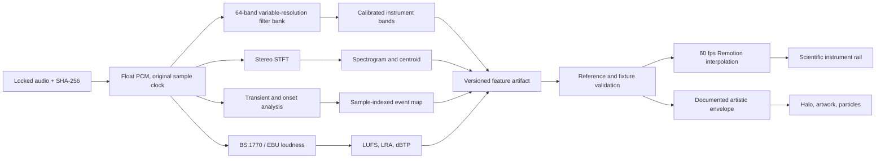

# Scientific audio-visualization target

## Objective

The current Tanisea visualizer is genuinely driven by the locked soundtrack, but it is an artistic audio-reactive system rather than a calibrated measurement display. Its current scientific fidelity is assessed at approximately **5/10**.

The vNext target is **10/10 within a published and testable scope**:

- every displayed measurement comes from the locked audio;
- units, analysis windows, frequency ranges, channel handling, smoothing, and uncertainty are explicit;
- the scientific layer is calibrated, deterministic, reproducible, and verified against reference signals;
- artistic transforms are kept separate and never presented as measurements;
- the display remains sharp and readable enough for viewers to understand the data;
- no precision claim exceeds what the analysis or video frame rate can support.

This internal 10/10 target is not a claim of laboratory certification or perfect modelling of human hearing. It means that the implementation passes the acceptance criteria in this document with no hidden or fabricated behavior.

The reference object is the exact locked soundtrack distributed with the project. Because that soundtrack is AAC, the analysis can be exact relative to its decoded presentation but cannot reconstruct information absent from the lossy file or make claims about an unavailable studio master. Prefer a verified lossless master if one becomes available and treat it as a new source lock.

The approved description is:

> **Millisecond-resolved audio analysis with frame-accurate visualization.**

Do not describe the video as having a 1 ms visual refresh. A rendered frame cannot show independent state changes faster than its frame duration.

## The three clocks

Scientific language must distinguish the audio sample grid, the analysis grid, and the video frame grid.

| Clock | Tanisea vNext target | Meaning |
| --- | --- | --- |
| Source sample clock | `44,100 Hz`, one sample every `0.022676 ms` | The finest timestamp grid present in the locked source. |
| Analysis clock | Sample-indexed events; spectral features every `256` samples (`5.805 ms`) | The grid on which offline features are measured and stored. |
| Display clock | `60 fps`, one frame every `16.667 ms` | The fastest rate at which a conventional 60 fps master can show a new image. |

For this 153-second composition, 60 fps produces **9,180 frames**. Event timestamps can be stored and displayed to the nearest millisecond, but their visual response is rendered on the nearest frame or interpolated between feature samples. The maximum nearest-frame placement error at 60 fps is `8.333 ms`.

Three decimal places indicate timestamp storage precision, not guaranteed perceptual or editorial certainty. Human lyric cues must also carry `confidence`, `method`, and `uncertaintyMs` fields.

## Time-frequency accuracy requires multiple analyses

A longer FFT window improves frequency resolution but spans more time. A shorter window follows transients more precisely but cannot resolve low frequencies as finely. One analysis cannot honestly promise both 1 ms temporal resolution and approximately 10 Hz frequency resolution.

Use separate, synchronized analysis paths:

| Path | Proposed configuration | Purpose |
| --- | --- | --- |
| Calibrated spectrum | 4,096-sample periodic Hann STFT, 256-sample hop | Frequency distribution and spectrogram. At 44.1 kHz: `10.767 Hz` bin spacing, `92.880 ms` window, `5.805 ms` hop. |
| Instrument bands | Calibrated 64-band variable-resolution logarithmic filter bank | Distinct 20 Hz–20 kHz bars without pretending sub-bin STFT slices are independent measurements. |
| Transient/onset path | Short-window energy and spectral-flux analysis with sample-indexed refinement | Millisecond-reported attacks and motion triggers. |
| Loudness path | ITU-R BS.1770 / EBU Mode | Momentary, short-term, integrated loudness, Loudness Range, and true peak. |
| Lyric path | Human-reviewed source-language phrase timing | Semantic cue activation with explicit uncertainty. |

The STFT timestamp refers to the centre of its analysis window. The onset timestamp refers to the detected event location. They must not be treated as interchangeable.

Low-frequency instrument bands necessarily observe longer spans of audio than high-frequency bands. Their effective window length and group delay must be published and compensated on the offline timeline. Millisecond event sensitivity applies to the transient path, not to every spectral band.

This film uses offline analysis and may use centred, non-causal windows because the complete soundtrack is available before rendering. It must not be presented as a zero-latency live meter. A future live implementation would require a causal pipeline with its actual latency measured and published.

## Current baseline and limitations

The source snapshot currently:

- uses a real FFT derived from the soundtrack;
- uses a 512-sample window, giving approximately `86.13 Hz` bin spacing at 44.1 kHz;
- reads only channel zero of the stereo source;
- does not apply a standard analysis window before the FFT;
- converts 256 FFT bins into 56 logarithmic-looking bars, but only 47 band ranges are unique;
- applies an arbitrary frequency-dependent gain, a `0.58` power curve, and hard clamping;
- combines peaks and averages without calibrated units;
- extends prior peaks for up to two video frames;
- labels broad regions aesthetically rather than publishing exact frequency boundaries;
- drives halo, particles, artwork, and camera response from a custom composite energy value.

These choices work as motion design. They are not suitable for interpreting bar height as calibrated spectral magnitude.

## Target architecture



The scientific instrument rail consumes calibrated values. The cinematic layers consume a separate normalized envelope derived from those values. Artistic gain, compression, glow, colour, and peak hold must never modify the stored scientific measurements.

## Measurement contract

### 1. Source integrity

- Analyze the exact soundtrack used by the composition.
- Record the source SHA-256, codec, sample rate, channel layout, duration, sample count, and first-sample timestamp.
- Decode to floating-point PCM without undocumented trimming, padding, tempo change, or implicit offset.
- Honor and record AAC priming, container edit lists, presentation timestamps, and any decoder delay so analysis time zero matches the audio heard by the composition.
- Keep the original sample rate unless a specific standard requires resampling; record any resampler and delay.
- Anchor analysis time zero to the first presented PCM sample heard by the composition, not to encoded priming samples.
- Preserve the original AAC stream during final delivery when no audio edit is required.

### 2. Stereo handling

Retain and analyze both left and right channels. For a single spectrum display, combine channel power rather than selecting one channel:

```text
Pstereo(f, t) = (|L(f, t)|² + |R(f, t)|²) / 2
```

Optionally store left, right, mid, side, channel correlation, and stereo-width features. Every time-varying stereo statistic must declare its analysis window. A left-only, right-only, or anti-phase fixture must prove that channel handling is correct.

### 3. Spectrum and frequency bands

- Use a one-sided 4,096-point STFT with a periodic Hann window.
- Use a 256-sample hop at 44.1 kHz unless the manifest records a justified alternative.
- Centre timestamps on the analysis window.
- Normalize for the Hann window and the one-sided spectrum.
- Calibrate magnitude so a bin-centred full-scale sine has the documented reference result.
- Use the STFT for the spectrogram and spectral statistics; do not claim that zero-padding or fractional labels create frequency information below the true resolution.
- Generate the 64 visible bars with a separately calibrated variable-resolution logarithmic filter bank, such as a constant-Q or equivalently validated design, from `20 Hz` to `min(20 kHz, Nyquist)`.
- Give every bar a distinct filter response rather than reusing the same FFT bin under several labels.
- Publish every band edge, centre frequency, effective bandwidth, time support, normalization, and group-delay treatment in the analysis manifest.
- Store both integrated band power and bandwidth-normalized spectral density when both views are useful.
- State on the display whether the bars show band power or power spectral density.
- Do not apply an undocumented high-frequency boost or perceptual weighting.

Frequency zero, Nyquist behavior, window correction, one-sided scaling, and edge-band treatment must be covered by tests.

### 4. Level, loudness, and peak measurements

Use the current [ITU-R BS.1770 recommendation](https://www.itu.int/rec/R-REC-BS.1770-5-202311-I/en) for objective programme loudness and true-peak measurement. Use [EBU Tech 3341](https://tech.ebu.ch/docs/tech/tech3341.pdf) for EBU Mode meter behavior and compliance tests, and [EBU Tech 3342](https://tech.ebu.ch/docs/tech/tech3342.pdf) for Loudness Range.

Provide only correctly named quantities:

- sample peak in `dBFS`;
- true peak in `dBTP`;
- momentary loudness in `LUFS` using the standard 400 ms window;
- short-term loudness in `LUFS` using the standard 3 s window;
- integrated loudness in `LUFS` with the standard gating behavior;
- Loudness Range in `LU` when stable and applicable;
- RMS only when its window length, channel aggregation, and reference are stated.

Do not label ordinary RMS, FFT magnitude, or the custom animation envelope as loudness. A second implementation such as FFmpeg's documented [`ebur128` filter](https://ffmpeg.org/ffmpeg-filters.html#ebur128) should be used for cross-checking against the standard and official test material, including true-peak mode where available.

Measurements are descriptive; do not normalize, limit, or otherwise modify the locked soundtrack to make the displayed values look better. Labels must distinguish local, maximum-so-far, cumulative, and whole-track values. A precomputed final value shown from the start must be labelled `TRACK`, not presented as a live cumulative measurement.

### 5. Transients, onsets, beats, and tempo

- Run onset analysis separately from the long-window spectrum.
- Store event positions as integer source-sample indices and derive seconds from `sampleIndex / sampleRate`.
- Refine synthetic impulse timestamps to within `±1 ms`.
- For real music, record detector confidence and timing uncertainty; an onset can be perceptually ambiguous even when stored sample-accurately.
- Display tempo, beat phase, or bar position only after confidence checks and human review.
- Do not invent BPM, beat numbers, or transient precision to fill the interface.

### 6. Raw values versus display envelopes

Store two separate streams:

1. **Scientific values** — calibrated and unaffected by animation styling.
2. **Display controls** — normalized values with explicitly versioned attack, release, compression, and limits.

The analyzer may show an instantaneous bar core plus a clearly distinguishable peak marker. Any hold or decay constant must be recorded. The previous implementation's unlabelled maximum of current and prior frames must not be used in the scientific stream.

### 7. Reproducible artifacts

The future analysis package should contain:

```text
analysis/
  manifest.json                 source identity, algorithms, units, versions
  spectral-features.f32         dense calibrated feature frames
  events.json                   sample-indexed onsets and beat events
  loudness.json                 BS.1770 / EBU measurements
  band-edges.json               exact 64-band filters and timing support
  SHA256SUMS                    artifact integrity
scripts/
  analyze-audio.*               deterministic extraction entry point
tests/
  fixtures/                     generated and official reference signals
  expected/                     versioned expected measurements
```

Dense features should use a compact binary representation rather than millions of decimal values in JSON. The manifest must record byte order, shape, units, data type, source checksum, algorithm versions, parameters, and artifact checksums.

## Visual instrument specification

### Output and layout

- Target `1080×1080` at `60 fps` for the delivery master.
- Render vector and text layers internally at `2160×2160`, then downsample with a documented high-quality filter.
- Reserve a stable `96–120 px` instrument rail that does not enter the lyric safe area.
- Use 64 frequency bars with one unique measured band per bar.
- Keep numerical fields fixed in position and use tabular or monospaced figures.
- Increase contrast with a restrained dark local scrim rather than a large opaque panel.
- Record that the 60 fps target doubles the current frame count and approximately doubles render work; measure final HEVC size and quality rather than assuming a fixed multiplier.

### Scales and labels

- Label frequency in `Hz` and `kHz`, with stable logarithmic ticks such as `20`, `50`, `100`, `250`, `500`, `1k`, `2k`, `5k`, `10k`, and `20k`.
- Label level in the actual unit being displayed, with fixed reference lines such as `−60`, `−48`, `−36`, `−24`, `−12`, and `0 dB` where appropriate.
- Use exact ranges as the primary labels. Terms such as “bass,” “mid,” and “air” may appear only as secondary descriptions.
- Label the analysis mode in compact form, for example: `FFT 4096 · HANN · 44.1 kHz · STEREO`.
- Label timing honestly, for example: `EVENTS 1 ms · DISPLAY 16.67 ms`.
- Draw waveform columns from the minimum and maximum sample values in each represented interval rather than skipping samples.
- Give the spectrogram a fixed, labelled dB colour scale; do not auto-normalize each frame independently.

### Recommended visible metrics

Use a restrained subset at any one time:

```text
01:36.050
TP MAX   −1.2 dBTP
M        −9.4 LUFS
S       −10.2 LUFS
CENTROID  2.47 kHz
CORR        +0.71
```

The playhead time updates on video frames. Exact event timestamps may show millisecond precision because they refer to stored analysis events, not to a 1 kHz display refresh.

### Sharpness and readability

- Use pixel-aligned solid bar cores and reserve glow for transient emphasis.
- Keep critical measured marks at least two final-output pixels thick; one-pixel grid lines may be decorative but cannot carry unique information.
- Give critical marks luminance contrast, not only chroma contrast, so 4:2:0 delivery subsampling cannot erase their meaning.
- Reduce persistent blur and broad bloom around text and measured marks.
- Keep grid lines quiet but visible against the local background.
- Use a second visual distinction in addition to colour where state matters.
- Keep changing numbers from shifting horizontally.
- Check contrast against the brightest and darkest artwork frames.
- Inspect the final encoded master, because compression can soften one-pixel lines.

The instrument rail must also pass the repository's [pixel-perfect visual workflow](pixel-perfect-visual-workflow.md): 2× rasterization, BT.709 conversion, chroma stress fixtures, one documented downsample, decoded-frame comparison, and temporal artifact review.

Use progressive information density:

- **Lyrics:** compact spectrum, time, true peak, and one loudness value.
- **Intro and break:** expanded waveform, spectrogram, frequency scale, and analysis metadata.
- **Outro:** expanded scientific state while the original-title treatment remains dominant.

## Claim language

Approved when verified:

- “Millisecond-resolved analysis, frame-accurate rendering.”
- “Sample-indexed transient events reported to 1 ms.”
- “60 fps scientific audio visualization.”
- “4,096-point Hann STFT plus a calibrated 64-band variable-resolution filter bank.”
- “ITU-R BS.1770 / EBU Mode loudness and true-peak measurements.”

Do not claim:

- “1 ms visual refresh” at 60 fps;
- “zero-latency” or “perfectly instantaneous” spectrum;
- “laboratory certified” without an applicable certification process;
- “exact vocal frequency band” for a mixed musical signal;
- “scientifically accurate” while showing unlabelled gain, clipping, smoothing, or invented numbers;
- that no other project has ever used similar analysis without evidence.

The distinctive project claim is the integration of cinematic lyric design, bilingual semantic timing, and transparent measured audio data—not an unverifiable claim of exclusivity.

## Verification suite

### Synthetic and reference fixtures

Test at least:

- digital silence;
- impulses at known sample indices;
- bin-centred sine tones at multiple levels and frequencies;
- two-tone signals;
- a logarithmic sweep from 20 Hz to 20 kHz;
- white noise and pink noise;
- left-only, right-only, centred, anti-phase, and decorrelated stereo signals;
- clipped and near-full-scale signals;
- official EBU loudness and true-peak compliance signals where licensing permits redistribution.

### Numerical acceptance criteria

- Source decode has the expected sample count and zero unintended sample offset.
- Synthetic onset timestamps are within `±1 ms` of their known sample positions.
- Detected bin-centred tone frequency is within half an FFT bin.
- Calibrated bin-centred tone magnitude is within `±0.25 dB` away from DC and Nyquist.
- Left and right channel fixtures produce symmetric results within `0.01 dB`.
- Every one of the 64 visible bands has a unique, published frequency range.
- Every instrument-band test tone produces the documented response without duplicate low-band behavior.
- Loudness, Loudness Range, and true peak pass the applicable EBU Tech 3341 minimum-requirement tolerances.
- Scientific feature interpolation is bounded and introduces no NaN, infinity, or out-of-range values.
- Nearest-frame event placement is within half a video frame while retaining the exact event timestamp.
- Repeated analysis runs produce byte-identical artifacts and matching checksums.

For real musical onsets and human lyric cues, uncertainty must be reported rather than forcing synthetic-test precision onto ambiguous material.

### Independent cross-checks

- Compare loudness and true peak with FFmpeg `ebur128` and the EBU compliance material.
- Compare STFT frequencies, timestamps, and scaling against a second implementation such as SciPy [`ShortTimeFFT`](https://docs.scipy.org/doc/scipy/reference/generated/scipy.signal.ShortTimeFFT.html).
- Verify the periodic [Hann window](https://docs.scipy.org/doc/scipy/reference/generated/scipy.signal.windows.hann.html) and its normalization independently.
- Compare rendered numerical values to the stored feature artifact at selected frames.
- Decode the full final video and inspect all instrument states at native resolution.

## Internal 10/10 rubric

| Category | Weight | Full-credit requirement |
| --- | ---: | --- |
| Source integrity and timing origin | 10% | Locked checksum, exact sample count, no hidden offset or resampling. |
| Temporal and event accuracy | 15% | Sample-indexed events, synthetic `±1 ms` test, honest frame-rate claim. |
| Spectral accuracy | 20% | Calibrated windowed STFT, unique published bands, independent reference match. |
| Level, loudness, and true peak | 15% | Correct units and applicable ITU/EBU compliance tests passed. |
| Stereo representation | 10% | Both channels handled correctly; stereo fixtures passed. |
| Transparency and uncertainty | 10% | Every transform, unit, smoothing constant, and confidence boundary documented. |
| Reproducibility and validation | 10% | Versioned deterministic artifacts, fixture suite, and checksums. |
| Visual legibility | 10% | Scales readable, values stable, no lyric collision, encoded-master QA passed. |

An internal **10/10** requires full credit in every category and no blocking failure. The score is an engineering acceptance rubric, not a marketing substitute for the published settings and test evidence.

## Workflow integration

1. Lock and checksum the soundtrack.
2. Generate the scientific manifest and feature artifacts offline.
3. Run synthetic, official, and independent-reference validation.
4. Freeze the verified feature package before animation work.
5. Map calibrated data to the instrument rail without modifying the raw values.
6. Derive separately documented artistic envelopes for cinematic motion.
7. Render 60 fps previews of transients, quiet passages, dense mixes, and section transitions.
8. Verify every visible number against the feature artifact at selected frames.
9. Complete the lyric, visual, scientific, technical, and full-length listening reviews.
10. Render from source, remux the untouched soundtrack, decode the full master, and publish checksums plus the analysis manifest.

## vNext implementation order

1. Build the deterministic offline analysis extractor and manifest schema.
2. Add generated fixtures and reference-value tests before changing the visualizer.
3. Produce and validate the Tanisea scientific feature package.
4. Convert the composition from 30 fps to 60 fps and confirm all duration math.
5. Replace the 56 stylized bars with the calibrated 64-band instrument rail.
6. Add compact waveform, spectrogram, level scales, and selected metrics.
7. Create a separate artistic envelope for halo, artwork, and particles.
8. Supersample the visual layer, reduce bloom, and verify encoded sharpness.
9. Integrate the audited lyric timing and non-linear semantic cue system.
10. Publish a new master only after every 10/10 rubric gate passes.

## Standards and primary references

- [ITU-R BS.1770-5 — Algorithms to measure audio programme loudness and true-peak audio level](https://www.itu.int/rec/R-REC-BS.1770-5-202311-I/en)
- [EBU Tech 3341 — EBU Mode metering](https://tech.ebu.ch/docs/tech/tech3341.pdf)
- [EBU Tech 3342 — Loudness Range](https://tech.ebu.ch/docs/tech/tech3342.pdf)
- [FFmpeg `ebur128` filter documentation](https://ffmpeg.org/ffmpeg-filters.html#ebur128)
- [SciPy `ShortTimeFFT` reference](https://docs.scipy.org/doc/scipy/reference/generated/scipy.signal.ShortTimeFFT.html)
- [SciPy periodic Hann-window reference](https://docs.scipy.org/doc/scipy/reference/generated/scipy.signal.windows.hann.html)

The analysis manifest must pin the exact standard revisions, tools, library versions, and parameters used. Re-audit this specification when a referenced standard changes.
