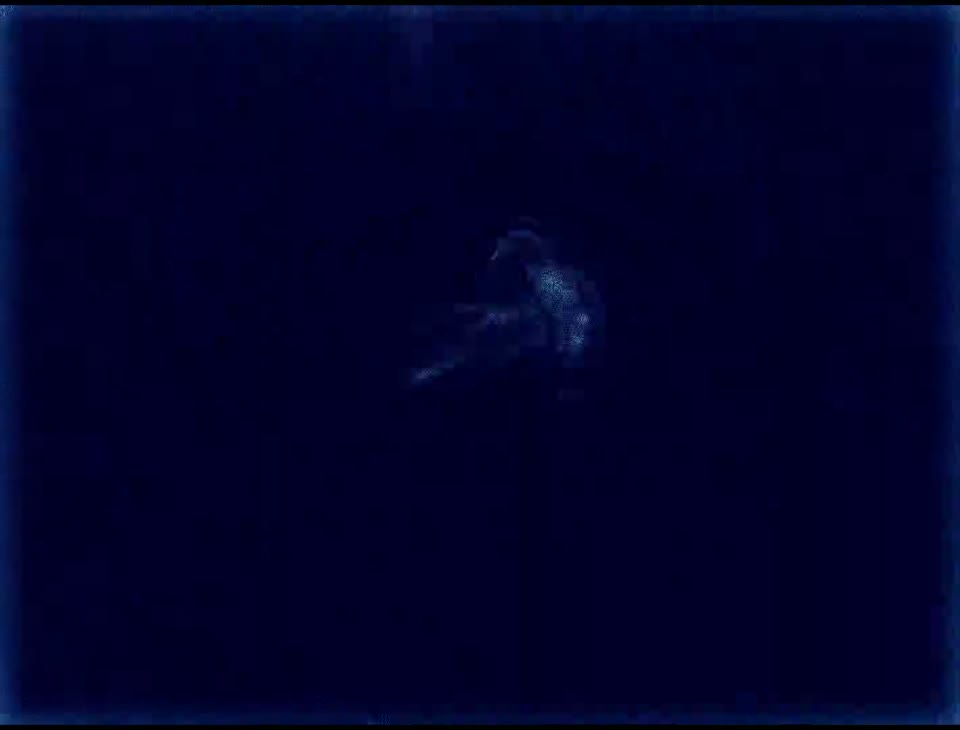
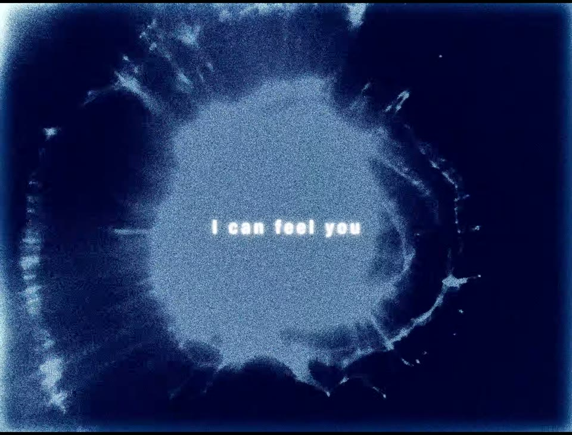
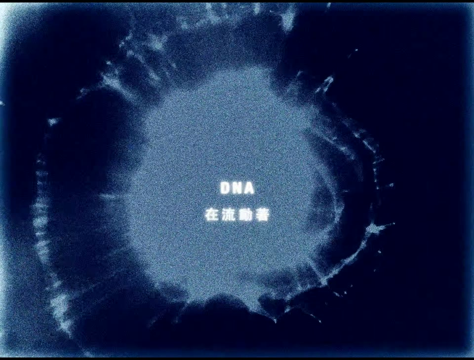
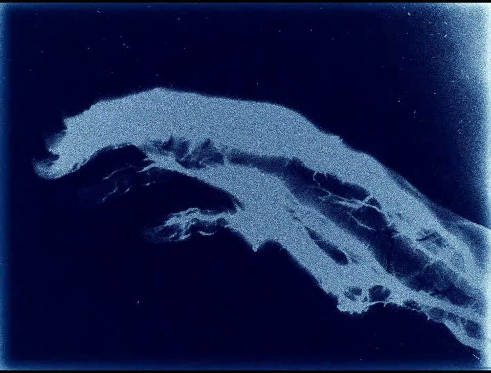

# LÜCY & Moyka — LOOP: visual and lyric-design study

A reference for future Lyrics films, studied on **10 September 2026**. The most useful principle is **expressive, full-frame imagery around a stable reading position**. Combine that principle with our existing word alignment, semantic translation and delivery QA.

[Watch the original](https://www.youtube.com/watch?v=fdcrpG9uKn0) · [Source manifest](source.json) · [Every-frame measurements](frame-metrics.csv) · [Analysis summary](analysis-summary.json) · [Reproduce the scan](#reproducing-the-study)

## Attribution and scope

**LÜCY, Moyka — LOOP (Official Lyric Visualizer)**, uploaded by LÜCY on 20 August 2026. The upload credits **Yoren佑任** for the visualizer; lyrics to LÜCY and Moyka; composition and production to LÜCY, Moyka and Eirik Hella; arrangement and mixing to Eirik Hella; mastering to George Tanderø. The stated copyright is **© 2026 Don’t Lie To Me LTD.**

Creator links: [LÜCY](https://fairygoodmusic.com) · [Moyka](https://www.moykamusic.com) · [original upload and visualizer credit](https://www.youtube.com/watch?v=fdcrpG9uKn0). No independently verified portfolio link for Yoren is asserted here.

The four reduced screenshots below are reference excerpts used to discuss specific design choices. **Their artwork and lyrics are third-party material, excluded from our CC BY 4.0 license.** We claim authorship only of this analysis and its analysis code, not of the music, typography treatment, animation or imagery. No endorsement is implied. The complete video and captions remain local study inputs, rather than repository assets or release downloads.

## What was actually inspected

- Downloaded YouTube formats **401 + 251**, merged without re-encoding: **2840×2160, 24 fps, AV1 video and Opus audio**, BT.709 tags. This is a 71:54 canvas, close to but not exactly 4:3. Download resolution does not establish the creator’s native render resolution.
- Fully decoded **8,654 video frames**, retaining each source presentation timestamp. First PTS is 0.000 s; last is 360.542 s. Container duration is 360.601 s. The nominal temporal step is 41.667 ms; container timestamps are stored at millisecond resolution.
- Reviewed eight chronological contact sheets spanning the whole video at approximately three-second intervals. These were generated with FFmpeg’s `fps` selection and used only for orientation, not exact event timing.
- Examined consecutive native-rate frames in selected windows: 29–32 s, 78–81 s, 92–93 s, 112–113 s, 177–179 s, 252–253 s, 254–255 s and 352–353 s. These expose entrances, independent language updates, rapid montage, text-free passages and the dark ending.
- Measured per-frame grayscale mean and frame-to-frame mean absolute difference (MAD) at a **160×122 analysis proxy**. This locates visual-change candidates; it does not measure text contrast, musical beats or vocal accuracy. Downsampling suppresses some grain and small text changes.

**Coverage boundary:** every frame was decoded and numerically scanned; individual-frame visual scrutiny was concentrated in the windows above. This is not a claim that all 8,654 full-resolution frames were manually inspected. Auto-generated English captions were available but are not reliable multilingual alignment ground truth. This study does not certify audio-to-word synchronization, identify the exact font, or establish the creator’s software, AI usage or audio-reactivity method.

## Visual language



*04:12.000, reduced from the downloaded source. Notice the large quiet field around the small subject.*

The imagery cycles among a jellyfish-like form, branching structures, translucent organic masses, a helix-like structure, radial cellular shapes and softer abstract close-ups. These are visual descriptions, not biological identifications. Their association with the song’s themes of inheritance, connection and breaking cycles is an interpretation supported by the official description, not a statement of the visualizer artist’s intent.

A narrowly controlled navy-to-ice-blue palette makes quite different shapes belong to the same world. Grain, soft focus and a bright feathered perimeter remain recognizable through shot changes. The texture feels built into the entire image rather than placed in a separate decorative panel.

The frame at 00:31, reduced and quantized to five colors, gives representative swatches **#00022D, #040D3C, #1B3364 and #6084AA**. These are sample-derived RGB approximations, not the creator’s design tokens or a complete palette. Whites in the typography and edge glow sit above this range.

The visual scale changes dramatically: tiny suspended subject, medium organism, then an object cropped beyond the frame. That alternation creates emphasis without requiring a new color theme for every section. Recurring subjects provide continuity; repetitions vary through scale, phase and surrounding montage. Exact loop lengths were not measured.

### What transfers to our work

Use a small family of **original motifs with a shared material treatment**. Give each motif a full-frame, close-up and quiet composition. For Roi-like material, the film’s world should still come from the source animation and its own light-blue palette; biological imagery is not a mandatory template.

Keep background motion and lyric placement separate. A motif may cross the center, but the reading position should not chase it. Design a subtle local contrast treatment where luminous forms pass behind words.

## Typography and language layout



*00:31.000. The phrase sits near the horizontal center and approximately 52% down the frame.*

The sampled text uses a heavy sans-serif appearance, modest tracking, white fill and visible softness/glow. Its geometry stays fixed across cuts. There is no visible word-by-word karaoke sweep in the inspected runs: complete short phrases appear together. This is a presentation choice, not evidence of worse timing.

On this 960-pixel-wide reference, the first phrase occupies roughly one quarter of the width and its bright letter core is roughly 3% of image height. These are visual estimates, not recovered font settings. A longer sentence occupies much more width while remaining a single row. On a phone, that combination of small letters, grain and glow is less forgiving than our larger, cleaner type.



*01:19.500. English is above Traditional Chinese; the upper row keeps its established position while the lower row adds a second baseline.*

English/Chinese and later English/Norwegian combinations use a compact stacked layout. The lower row can fade or update independently of the upper row. At several boundaries, the new upper phrase coexists briefly with the preceding lower phrase. **Do not treat the two rows as a guaranteed phrase-by-phrase translation pair.** The official description presents multiple language passages; timing and meaning need separate assessment.

For our renderer, retain explicit roles: `original vocal`, `translation of cue`, or `independent vocal`. A translation follows the meaning of its source cue; an independent vocal follows its own audio. The reference is useful evidence for separate row state, not a reason to collapse these roles.

### Improvements to test in our films

- Keep a crisp luminance-defined glyph core, with texture and glow primarily behind it.
- Preserve the upper baseline when a translation row appears; reserve its space to avoid layout jumps.
- Keep our timed word or phrase highlights inside stable text geometry. Highlight by fill or underline rather than enlarging words and causing reflow.
- Use a restrained scrim or shadow when bright art crosses text. Judge the compressed export at phone size, including the shortest cues and longest translations.
- Allow lyric-free intervals to remain lyric-free. Avoid filling every gap with labels or a permanent title.

## Frame-level observations

Times below refer to the downloaded video. Fade visibility is judged from reduced frames, so onset estimates have at least **±1 source frame** uncertainty. These are visual event times, not measured vocal onsets.

| Window | Observed behavior | Reusable lesson |
| --- | --- | --- |
| 00:30.125–00:30.500, approximately frames 723–732 | First phrase emerges as a whole through an opacity ramp. A background cut occurs around 00:30.250 while the phrase remains anchored. | Separate phrase opacity from shot transitions. Our proposed entrance duration must leave useful fully readable time. |
| 00:31.417 onward | The same phrase stays in place while radial imagery gives way to short bursts of other shapes. | A held lyric can bridge several rapid shots without restarting its entrance. |
| 01:18.750, approximately frame 1890 | Upper phrase changes while the lower Chinese row initially retains its previous state. | Two language rows need independent event clocks and state. |
| 01:19.000–01:19.500 | The background changes; the lower row fades into its next state while the upper row holds. | Don’t bind translation or second-vocal transitions to background cuts. |
| 01:32.333–01:32.958 | The upper row updates before the lower language transition finishes; lower-row fading spans several frames. | Distinguish deliberate overlap from stale text caused by implementation errors. |
| 01:52.458–01:53.083 | Rapid alternation among radial, helix-like, bright organic and darker forms occurs under an unbroken lyric position. | Reserve rapid montage for selected passages, and preserve a stable text layer. |
| 02:57–03:00 | Text is absent while abrupt visual changes continue. | Art can carry a passage independently of typography. |
| 04:14.000–04:14.500 | Returning upper text is already visible; the lower row emerges separately as the background changes. | A repeated lyric section can reuse layout rules without synchronizing all layers to one event. |
| 05:52–05:54 | The picture is near-uniform dark navy. | Include the actual ending in duration/trim review; don’t assume the last active shot reaches the file end. |

The numerical scan’s largest MAD is **144.8033/255 at frame 2706, 01:52.750**. Other strong changes occur at 02:57.625 and 02:57.750. The 110–178 s interval has mean MAD **10.17**, versus **6.53** over 30–78 s. This supports the presence of a more visually changeable passage in those chosen windows. It does not establish tempo, beat locking, artistic quality or a safety threshold. MAD peaks include cuts and flashes; they are not a validated shot list.

## Approximate whole-film map

These are navigation regions, not authoritative musical section labels or exact cue boundaries. Open the original at the region to inspect context.

| Region | Presentation | Design takeaway |
| --- | --- | --- |
| 00:00–00:30 | Blue montage establishes shapes, softness and edge treatment without lyrics. | Establish the material vocabulary before adding reading load. |
| 00:30–01:17 | Mostly one-row English phrases over recurring imagery. | Keep phrase position consistent while shot scale varies. |
| 01:17–01:50 | Compact multilingual rows, with independent transitions. | Store line roles and independent timing explicitly. |
| 01:50–02:57 | Longer single-row phrases and visually active montage. | The lyric layer provides continuity through image changes. |
| About 02:57–04:13 | Long text-free stretch using the same visual vocabulary. | Repetition can sustain a world; consider whether our arrangement needs additional development. |
| About 04:13–04:46 | Multilingual lyric treatment returns. | Reuse a recognizable layout for a returning passage. |
| About 04:46–05:50 | Imagery continues without the earlier lyric density, then darkens. | Plan an intentional exit rather than only stopping the renderer. |
| Around 05:50–06:00.6 | Dark tail. | Verify intended audio tail and picture tail before adapting duration. |

## What to adopt, adapt and avoid

| Decision | Application to Lyrics |
| --- | --- |
| **Adopt: a coherent visual family** | Use a few recurring motifs, consistent color treatment and controlled scale changes. Keep each new song’s own identity. |
| **Adopt: anchored reading** | Hold lyric baselines through cuts and camera movement. |
| **Adopt: independent language state** | Keep separate cue clocks for overlapping vocals; link translations to meaning. |
| **Adapt: restrained text** | Maintain uncluttered composition while retaining our precise word highlighting and larger phone-readable type. |
| **Adapt: image-dominant framing** | Let original animation occupy more of the composition. Place a calibrated spectrum unobtrusively only where useful. |
| **Adapt: repeated imagery** | Reuse motifs with changes in crop, phase or intensity; let later sections develop rather than merely repeat. |
| **Avoid: copying the exact assets** | Create original or appropriately licensed visuals. Attribution does not transfer asset rights. |
| **Avoid: inheriting all the softness** | Keep readable letter cores, especially in Chinese, long translations and vertical delivery. |
| **Avoid: assuming scientific accuracy** | Organic motion is not evidence of a measured spectrum, simulation or vocal-response system. |
| **Avoid: indiscriminate rapid brightness changes** | Use fewer/lower-amplitude transitions where they compete with reading; review any intense montage before delivery. This study is not a flash-safety certification. |



*03:34.500. A second reference to the shared material and palette, during the text-free passage.*

## Concrete brief for the next project

Build a **20–30 second comparison prototype**, using our own permitted material and one dense multilingual phrase plus a quiet gap. This is proposed work, not a change to existing masters.

1. **Composition:** compare our current layout with an image-dominant layout and fixed lyric baselines. Keep the soundtrack and cue timings identical.
2. **Motion:** give the artwork slow continuous movement and reserve larger transitions for authored section events. Keep measured audio controls separate from decorative motion, following [our emotional-motion workflow](../../emotional-audio-reactive-motion.md).
3. **Text:** compare the current glow with a crisp core plus restrained halo. Use the same font size in the comparison, then test a larger phone version.
4. **Timing:** retain sample-based word boundaries. Try a 150–250 ms whole-phrase entrance only where it leaves enough readable dwell; this is our proposed range, not a measured universal setting from LOOP. Active-word highlighting must remain aligned after the entrance.
5. **Languages:** test both an independent second vocal and a meaning-linked translation. Check transitions independently, including the interval where only one row is active.
6. **Texture:** keep grain weaker near small glyphs; compare the actual platform-sized encoded versions rather than only source frames.
7. **Delivery:** author our overlays at 60 fps if needed. The reference’s 24 fps is not a 60 fps motion source. A 24→60 conversion requires an explicit cadence/interpolation decision; duplicating frames does not invent new motion.

Accept the prototype only if the longest translation fits, no baseline jumps occur, highlights remain readable over the brightest art, instrumental gaps feel intentional, and the encoded phone-size comparison is at least as legible as the baseline. Do not replace the existing [alignment](../../production-workflow.md), [scientific visualization](../../scientific-audio-visualization.md) or [pixel-quality](../../pixel-perfect-visual-workflow.md) gates with visual resemblance to this reference.

## Reproducing the study

The source checksum and tool versions are in [source.json](source.json). Obtain the source from the original uploader, then run with Node 24+, FFmpeg and FFprobe:

```sh
node docs/studies/loop-2026/analyze-frames.ts /path/to/source.mkv /tmp/loop-frame-study
```

The script probes actual frame PTS, decodes every frame without an FPS filter, and exports one CSV row per frame. It checks decoded-frame count against probed-frame count. The proxy deliberately approximates the aspect ratio by less than one percent for cheap whole-frame metrics. It cannot resolve word timing or exact glyph geometry.

For an individual-frame strip, using a 24 fps source and an integer-second start:

```sh
ffmpeg -ss 78 -i /path/to/source.mkv -t 1 \
  -vf 'scale=480:-1,tile=6x4' -fps_mode vfr -q:v 3 /tmp/loop-78.jpg
```

Read the 24 tiles left-to-right, top-to-bottom; tile 0 corresponds to the requested start, subsequent tiles advance by one source frame. For source timestamps, consult the CSV rather than rounded screenshot labels. Screenshot reduction and JPEG encoding are for study, not a production master workflow.

**AI disclosure:** AI assisted the frame inspection, analysis, code and writing. Observations are distinguished from inferred design intent and proposed settings. Automatic metrics and captions do not certify musical synchronization or translation. No claim is made about whether the original creators used AI.
