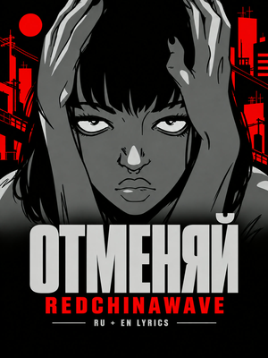

# TikTok profile cover workflow

Every TikTok publishing kit includes a dedicated portrait profile cover, a title and concise artist-focused description. These are established defaults; contributors should apply them without asking for the same specifications again.

## Dimensions and orientation

| Asset | Width × height | Ratio, width:height |
| --- | --- | --- |
| Default profile-cover upload | **1200×1600 px** | **3:4 portrait** |
| Profile-size review | 150×200 px and 300×400 px | 3:4 portrait |
| Vertical video | 1080×1920 px at 60 fps | 9:16 portrait |

The supplied upload interface labels its **tall** profile preview “4:3”. That label describes the established target in this workflow; the actual cover file must be taller than it is wide. Use explicit width and height rather than copying the label into an image-generation prompt. This is a project default based on the observed interface, not a claim that every TikTok surface or future client uses the same crop.

A 1600×1200 landscape cover loses 43.75% of its width when center-cropped to a 900×1200 portrait window. A side-by-side title and face can both be cut off. Changing only the filename, padding a wide image, or asking the uploader to zoom cannot repair that composition.

If a later interface visibly changes, use its actual crop geometry and document the new evidence. Otherwise keep this default. Produce landscape or full 9:16 cover variants only when separately requested.

## Composition

1. Recompose the source character or focal artwork for a tall poster. Keep the main face and both eyes recognizable; decorative edges may bleed.
2. Use the track's original visual language and approved palette. The four-color red/black/gray palette belongs to Отменяй; other tracks retain their own palettes.
3. Make the complete song title the primary text. Keep the artist clearly readable beneath or above it. A language label is optional when it remains useful at profile size.
4. Stack the focal artwork and text for portrait. Protect all title and artist lettering with approximately 8% horizontal margins and 7% top/bottom margins; increase them when the artwork or crop needs more room.
5. Prefer a clean backing area and strong contrast. Do not let eyes, bright background details or decorative lines compete with the title. Avoid tiny metadata, busy credits and unrequested slogans.
6. Check exact spelling, Cyrillic characters and diacritics against the approved publishing copy. A truncated title or unreadable artist is a failed cover, even if the full-resolution artwork looks attractive.

## Generation and delivery

- Use the approved artwork and prior accepted covers as visual references, with the source identity and palette stated as invariants.
- In the generation prompt, say **“portrait, 1200 pixels wide and 1600 pixels tall, 3:4 width:height”**. Do not pass an unexplained “4:3” label to the image tool.
- Generate a dedicated portrait composition. Preserve the selected generated original and exact prompt; record whether the built-in image tool or another explicitly requested method was used. Do not invent an undisclosed image-model version.
- Export a high-quality RGB JPEG at exactly 1200×1600 with square pixels and no rotation metadata. A lossless PNG companion is optional. Normalize dimensions without stretching; tiny edge cropping is acceptable only after visual inspection.
- Use an unambiguous filename: `<Track>-TikTok-Cover-Profile-1200x1600.jpg`. Archive superseded wide covers away from the primary upload choice.
- Deliver the selected cover with the vertical film and publishing copy. Record dimensions, byte size, SHA-256, prompt location, visual checks and the delivered-copy hash.
- Keep source-artist credits and AI disclosure in the publishing copy and production notes. Covers containing adapted third-party imagery are subject to the repository's [rights exclusions](../LICENSE.md), not a blanket CC BY grant over the source artwork.

## Required cover review

- [ ] Actual image metadata is 1200×1600, width less than height, square pixels and no EXIF rotation dependency.
- [ ] The full title and artist are correct and readable at 150×200 pixels; subject identity remains clear.
- [ ] A 300×400 review shows clean edges and deliberate spacing.
- [ ] Removing 5% from each edge as a conservative zoom stress check still preserves the title, artist and key facial features. This is a design check, not a guarantee about every platform overlay.
- [ ] The delivered image is a portrait composition without letterboxing, crop guides, UI elements or watermarks.
- [ ] The actual upload preview is checked when available; otherwise clearly record a local crop simulation rather than claiming an in-app test.
- [ ] All publishing assets use original-language lyrics and meaning-based translations, consistent with the production scope in `AGENTS.md`.
- [ ] Final filenames, dimensions and checksums are recorded and the handoff copy matches.

## Reference correction: Отменяй

The original landscape cover placed the title on the left and the face on the right. The tall profile preview clipped both. The corrected edition centers the source face and stacks the complete title and artist in a portrait composition.

[Selected upload, exact prompts and crop evidence](../projects/otmenyai-lyric-film/tiktok/README.md).

The earlier [Roi TikTok kit](../projects/roi-adore-rebuild/tiktok/README.md) already included a 1200×1600 portrait version. This workflow makes that geometry the default rather than an optional alternative.
