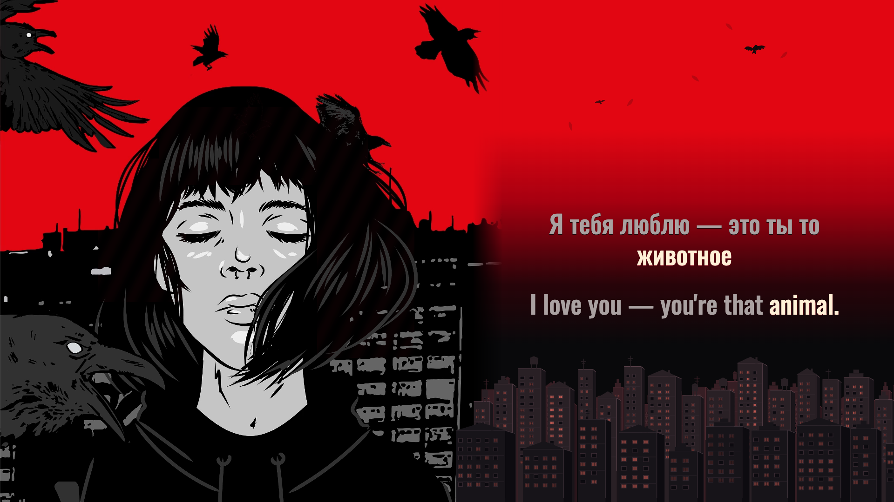

# Друг — REDCHINAWAVE

**Complete preview · Russian / English · 16:9 and 9:16 · v2**



*Browser canvas at 26.200 s from the complete source-video preview, with животное / animal focus. [Correction and capture provenance](evidence/animal-translation-check.json). Original music and illustration: [REDCHINAWAVE's official audio](https://www.youtube.com/watch?v=SXAReusgEC0). This is preview presentation evidence, not a final encoded movie or a listening attestation.*

The original woman, ravens and city remain the center of the film. The source's red sky continues into an illustrated reading area. Three depths of fixed buildings use distinct rooftops, perspective sides, window frames and masonry. Measured music changes occupied-window light rather than moving the skyline. Three small ravens follow separate curved routes with turns, banks and varied glide/wingbeat phases. Crisp, stationary Russian and English text shares the same focus strength.

## Status

- The complete 150.071-second source plays with its original soundtrack and actual decoded picture. The square illustration is intentionally still; source decoding continues.
- Twenty-two cues contain 93 separately selected Russian events and 128 corresponding English tokens. Small grammar words retain their own source events; necessary English expansions share complete meaning spans.
- TypeScript checks, five contract tests and all 44 cue layouts pass. The scene proof covers 442 glyph placements, 186 start/end visibility checks and 260 target-focus states across both layouts.
- Current human full-song/reduced-speed listening review and rendering authorization are **pending** in [REVIEW.json](source/REVIEW.json). No production movie has been rendered.
- The weak final filtered repeat at **111.212–111.820 s** is provisional. Review 37–43 s and 97–112 s slowly in the actual source, particularly that last echo.

## Reproduce the complete preview

Use Node 24 or newer, FFmpeg/ffprobe and the exact source recording at `public/source.mp4`. [recording.json](source/recording.json) binds its SHA-256, complete duration and native picture. The source binary and private analysis media remain ignored.

```sh
npm ci
npm run check
npm run identity
npm run proof
npm run preview
```

The server uses `http://127.0.0.1:4337/`. Review controls include both formats, exact seeks, 1×/0.75×/0.5× speed, animation comparison, fullscreen, the untouched source reference and recovery. Reload after rebuilding the client; no hot reload is assumed.

`node scripts/build-timeline.ts` rebuilds the selected map without model downloads. `npm run features` recomputes raw source-audio measurements. Input changes invalidate the current review identity. `npm run render:gate` deliberately refuses this pending preview; an approved production adapter still has to be prepared later.

## Read next

[Production decisions and lessons](PRODUCTION-NOTES.md) · [Agent handoff](AGENT-HANDOFF.md) · [Timing selections](source/selected-boundaries.json) · [Competing acoustic observations](source/acoustic-observations.json) · [Translation correspondences](source/editorial-and-correspondence.json) · [Review scope](evidence/cross-language-sync-review.md) · [Native-library adapters](scripts/acoustic/README.md)

Typography: Oswald Medium, supplied with its [OFL license](public/fonts/Oswald-OFL.txt). Original music/artwork is credited to REDCHINAWAVE and the linked recording; no separate illustrator identity is inferred.
