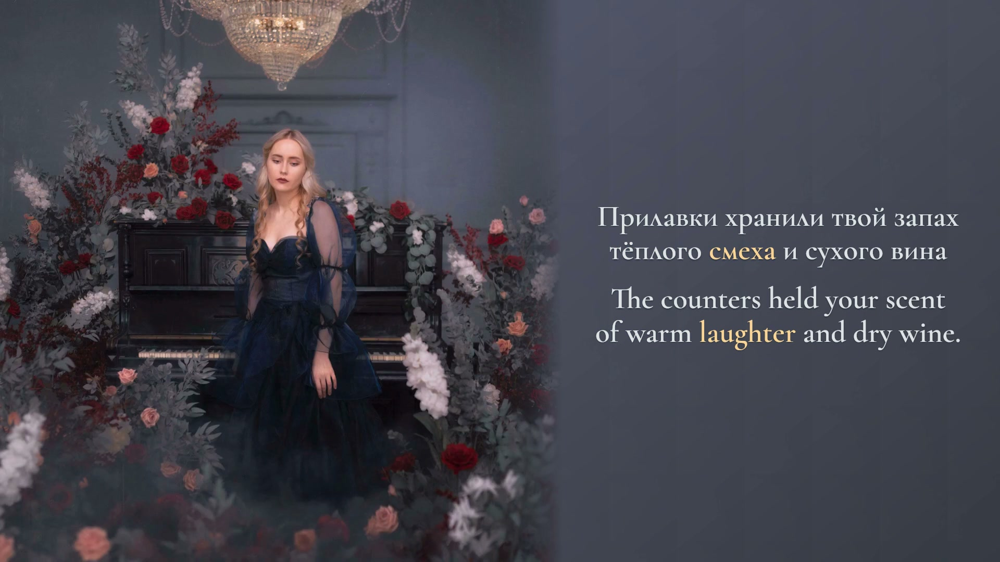

# где ты?

**элли на маковом поле feat. лампабикт · Russian / English · complete 16:9 and 9:16 films**



*Exact decoded output frame 1,497 at 00:24.950, original picture frame 623 at 00:24.920. [Original recording and photograph](https://www.youtube.com/watch?v=Dpek_5Wh6IE). [Final-frame provenance](evidence/final-stills.json).*

The room supplies its own visualizer: measured frequency energy illuminates existing crystal facets and exposed ivory piano keys. The photograph, woman, piano and flowers remain intact. Pale stationary Russian and English receive the same warm color focus; their complete meanings follow the same source events. Both vocalists retain independent complete reading blocks during the closing duet.

The original 1080×1080 picture is preserved over a continuation of its blue-gray wall. Wide extends the room to the right; portrait continues it below. The source is deliberately held photography, with small compression variations; the player and renderer still decode every original picture.

## Contents and verification

- 40 performed cues, 185 independently selected Russian events and 260 English tokens.
- Separate opening vocalization and four complete female reply/backing cues; advertisements and recognition hallucinations excluded.
- Original/vocal CTC character observations, complementary Whisper comparisons and bounded signal panels support the timing. Human full-preview review is recorded separately in [REVIEW.json](source/REVIEW.json).
- Both 60 fps films contain 12,062 output frames. Full decoding, every-frame timestamps, original AAC packet/PCM identity and missing-picture checks must pass.
- Final glyph verification covers active **and** neutral states, all contributors, simultaneous singers and deliberately delayed controls. This verifies encoded presentation, not millisecond perceptual certainty.
- The 13-file upload kit contains both MP4s, two dedicated thumbnails, YouTube title/description, TikTok description, three optional SRTs, README, delivery inventory and checksums. [Delivery](publishing-kit/DELIVERY.json) identifies the actual files.

Public Git contains the editable scene, frozen text/timing/mappings, measured features, original reference frame, covers, copy, captions and verification receipts. The original source MP4, full rendered films, model weights and private diagnostics are ignored. No platform upload or public media release is recorded.

## Reproduce

Read root [AGENTS.md](../../AGENTS.md), [preview-first requirements](../../docs/preview-before-render.md), [cross-language review](../../docs/cross-language-sync-gate.md), [production notes](PRODUCTION-NOTES.md) and [agent handoff](AGENT-HANDOFF.md).

Place the exact locked recording at `public/source.mp4`; [recording.json](source/recording.json) supplies its SHA-256. Run from this project:

```sh
npm ci
npm run check
npm run identity
npm run preview
```

Preview defaults to loopback port 4336 and includes the entire recording, both formats, exact-second seeks, reduced speed, animation A/B and picture recovery. Private metadata is not served.

After current-revision review and render approval are complete:

```sh
npm run render:gate
npm run render -- --format landscape --production
npm run render -- --format portrait --production
npm run verify:final -- --format landscape
npm run verify:final -- --format portrait
npm run kit
```

The renderer refuses existing destinations. Changed source, timeline, scene, font, reference, measured features or transport invalidates approval. Do not copy this song's review to another recording.

## Rights

Source recording: ℗ МТС Лейбл, released March 22, 2024; supplied by the official auto-generated recording. No independent photographer credit was available in its metadata. Original music and photograph remain excluded from the repository's licensing grant. English translation, typography and measured material treatment were prepared for this edition. Cormorant Garamond Semibold uses the [SIL Open Font License](public/fonts/RoomSerif-OFL.txt).
