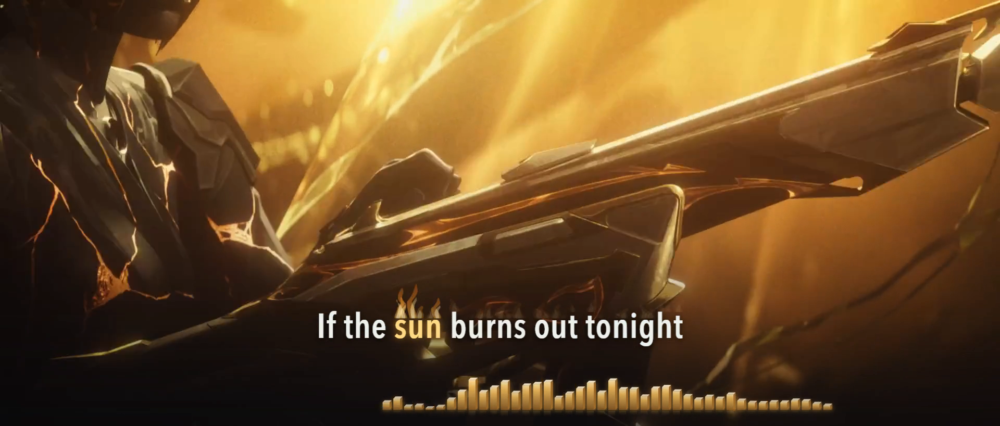

# If The Sun Burns Out Tonight — lyric film

**English lyrics · verified 1920×818 and 1080×1920 films · word-atmosphere-v5 / production-v1**

Start with the [agent handoff](AGENT-HANDOFF.md), [complete effect and timing contract](PRODUCTION-LESSONS.md), and [one-prompt workflow](../../docs/source-clocked-word-effects-workflow.md). Current review and render authorization are recorded in [render-authorization.json](evidence/render-authorization.json); historical technical audits keep their original scope.




*Exact final frame 12042 at 200.700 seconds. Original music video: VALORANT; performers: Grabbitz, Oli Sykes and Courtney LaPlante.*

## Delivered edition

Both full 60 fps films are rendered and verified. Each contains 14,056 frames over 234.266667 seconds, with the original AAC soundtrack copied unchanged (decoded PCM identity verified). Landscape retains the source's 1920×818 aspect without added bars; portrait is 1080×1920 with the complete panorama over moving source-derived fill. No introduced blank frames or substantial black regions were detected, including the portrait fill.

Every one of the 254 word midpoints was checked in the actual encoded pixels in each format. Across 399 sampled frames per film, 2,169 glyph checks passed with zero suspects or ambiguities. This verifies the display of the accepted timeline; acoustic uncertainty is retained separately. Ten native final frames covering all effect classes and the ending also passed visual inspection.

The new Desktop posting kit has **13 verified files**: both videos, both platform covers, titles/descriptions, English SRT/VTT, a start guide, delivery manifest and checksums. Full media remains local; source, measurements, workflow, screenshots and verification evidence are the repository handoff.

[Delivery receipt](evidence/delivery-receipt.json) · [Final verification](evidence/final-verification.md) · [Reproduction commands](WORKFLOW.md) · [Final screenshot identities](evidence/final/manifest.json)

The default composition preserves the complete 1920×818 source frame at its original aspect ratio. Lyrics sit over the moving picture with soft, continuous lower-edge shading. A bounded 64-band spectrum sits below the words, directly on the image. The current `spectrum-depth-v1` treatment uses taller gold columns with lit caps, shaded sides, a contained glow and a short fading reflection. There is no added black caption area, curved rail, or source crop in the original-ratio view. Added shading and spectrum fade away outside the sung portion, preserving the original introduction and closing card. The optional portrait composition retains the full panoramic image with moving, softly blurred fill sampled from the same source frame.

The preview uses one video element for the original picture and native soundtrack. A same-frame foreground canvas keeps the visible picture reliable when browser video compositing fails; its matching native video remains underneath. The whole stage fits the review window, and Restore picture retains the current position and speed. The callback chain is canceled and renewed during transport changes so pause/resume cannot accumulate paint loops. A paused frame is refreshed immediately and once after the compositor settles, avoiding a stale foreground after the last video callback is canceled. Foreground callback gaps and native decoder drops are tracked separately.

Every supplied word has an individual color-only highlight with fixed glyph geometry. Short neutral pre-roll makes a phrase readable before its first word when space permits. Acoustic timings remain separate from line visibility. The audio visualizer is derived from locked, deterministic 60 Hz measurements, so playing, pausing, slowing down and seeking all use the same source-time spectrum. It does not route or delay the soundtrack through a separate audio graph.

## Timing evidence and remaining limits

All **44 supplied lines and 254 words** remain present in order. The v6 map replaces the earlier small-model timing estimates using transcript-conditioned MMS and English wav2vec2 observations on the original mix and separated vocals, together with independent large-v3-turbo alignment. 242 onsets changed by more than 50 ms. The previously truncated “I wonder…” line, 30 ms “Would” event and 60 ms “barely” event were substantial alignment errors, not merely display problems.

The [timing audit](evidence/timing-audit-v6.md) and [per-word observations](evidence/alignment-v6.json) preserve selected boundaries, old values, candidate disagreements and model failures. The final two processed hooks contain correlated audio exactly 9.6 seconds apart; [local waveform comparisons](evidence/repeat-correlation-v6.json) corrected late highlights in the last repeat, including a 380 ms delay on “sun”. This establishes relative timing, while the absolute reference remains uncertain. The selected timeline is **reviewed and accepted**, with model uncertainty retained for transparency, especially the processed opening/final hooks, some connected pronouns and held releases. General synchronization feedback is positive, and the specifically requested opening, chorus-word and final-hook passages were accepted after manual listening. The [current review status](evidence/review-status-v6.json) records the exact timing identity and remaining ranges. Matching interval tests and model agreement do not certify perfect acoustic sync.

## Run and review

```sh
npm run preview
npm run check
```

Open <http://127.0.0.1:4325/>. The default starts paused at the beginning. Start returns to zero; the line menu, seek bar, reduced speeds and Original / 9:16 toggle support review. A `speed=0.5` or `speed=0.75` link opens directly at a supported review speed; the full soundtrack and all source imagery remain available throughout. Restore picture refreshes media while preserving position, speed and prior playing state.

The checks validate source identity, all selected acoustic records, every individual word event, bounded spectrum geometry, deterministic seeks and single-chain frame scheduling. The [browser runtime audit](evidence/preview-runtime-v6.json) records the preceding flat-spectrum revision: a complete muted technical playback with zero dropped frames, 88 passing cue/layout observations across both views, visible picture motion at normal and reduced speed, and successful picture recovery. Muted technical playback verifies transport and presentation; it does not replace acoustic listening review.

The depth treatment keeps the same source, word timeline and measured frequency bands. Its artistic height mapping is `clamp((dBFS + 58) / 34, 0, 1)^1.6`: quieter bands recede while isolated peaks retain their reach. The canvas reserves 13.5% of original-frame height (10% in portrait), with internal space for caps, glow and reflection. Compare quieter material near 40 s, the chorus near 78 s and the later peak near 200 s; added depth must remain below the stable lyric area. All faces use the same instantaneous media-time spectrum, with no delayed trails or separate audio path. The [depth-treatment audit](evidence/spectrum-depth-v1.json) records bounded geometry over every measured frame, quiet/chorus/peak visual comparisons, and zero dropped frames during the targeted browser playback checks in both layouts.

The spectrum analysis is reproducible using `scripts/analyze-audio.py`; its [measurement audit](evidence/audio-features-audit.json) records exact source identity, binary encoding, frame coverage and verification. Its 92.88 ms analysis windows measure energy, not beats or vocal syllables.

## Source

Official music video: [VALORANT — If The Sun Burns Out Tonight](https://www.youtube.com/watch?v=x8jAY2CoOBg), featuring Grabbitz, Oli Sykes and Courtney LaPlante. `source/lyrics-supplied.txt` preserves supplied wording; `source/media-manifest.json` records the source media identity. Music, lyrics, game footage, characters, marks and source video remain with their respective owners. This is an unofficial lyric-film edition.

## Targeted listening review

The following links open the full preview at 0.75×; they do not replace it with cropped diagnostics. Use 0.5× when a boundary is still unclear.

- [Processed opening](http://127.0.0.1:4325/?t=26.7&speed=0.75&format=landscape)
- [First chorus short words](http://127.0.0.1:4325/?t=71.7&speed=0.75&format=landscape)
- [Second chorus short words](http://127.0.0.1:4325/?t=129.2&speed=0.75&format=landscape)
- [Processed closing hooks](http://127.0.0.1:4325/?t=209.2&speed=0.75&format=landscape)

The [repeated-chorus audit](evidence/repeated-chorus-relative-audit-v6.json) found shared waveform components but insufficient evidence to transfer disputed absolute word anchors. The independently aligned occurrences remain separate; no timings were changed from moderate correlation alone.

## Solar-fire preview treatment

`sunfire-v2-vocal-dynamics` adds solar flames to the twelve occurrences of “sun burns / burnt out tonight”. Measured glyph positions anchor orange outer bodies and cream cores behind stationary words. Quiet singing produces compact, slow flames; louder, forceful vocals increase their reach, curl speed, brightness and ember activity. Each word keeps its original highlight interval. A separate phrase envelope allows a bounded decorative tail of up to 180 ms after “tonight”, clipped by cue visibility; this never extends word focus. Wrapped portrait lines reserve additional spacing and cap the lower flames below the preceding row.

The [fire dynamics analysis](evidence/fire-dynamics-audit.json) measures the original stereo mix and a time-matched estimated vocal stem at 60 Hz, using 46.44 ms windows. Vocal RMS dominates the artistic drive; high-mid vocal energy, broadband texture and a smaller mix contribution refine it. A 70 ms attack and 180 ms release avoid unstable frame-to-frame intensity. These features measure acoustic energy and texture, not the semantic presence of screaming. Separation artifacts remain possible. `scripts/analyze-fire.py` reproduces the data from the locked source and cached vocal stem.

The quieter verse hook near 32 s has median drive 0.076 and burn rate 0.764; the climactic hook near 200 s has median drive 0.794 and rate 2.414. Flame reach scales from 0.4 to 1.7 font heights before per-letter variation and layout limits; quiet passages emit no sparks, while peaks allow up to six small embers. The precomputed integral of burn rate controls procedural motion. Seeking, reduced playback speed and repeated playback therefore reconstruct the same flame at the same source time, without phase jumps or changes to the soundtrack clock. No lyric geometry, picture shake or full-screen flash is added.

Use **Sunfire on/off** to compare the effect at the same moment. The renderer uses a tightly cropped overlay, shared gradients and one small CSS blur instead of a blur pass for every tongue. The [v1 sunfire audit](evidence/sunfire-v1.json) is the historical compact-fire check; [v2 verification](evidence/sunfire-v2.json) records the current dynamics treatment. The [foreground transport audit](evidence/foreground-runtime-v6.json) separately records a complete source playback after the paused-frame repair, before adding fire.

A [complete playback of the current fire revision](evidence/foreground-runtime-sunfire-v2.json) reached the end with all 5,621 native frames, zero decoder drops, zero foreground frame gaps and no picture or console errors. Captions, spectrum, fire and added shading clear for the source ending. This is muted technical evidence, separate from acoustic listening. The [completion audit](evidence/preview-completion-audit-v2.json) maps the current requirements to their evidence and keeps remaining listening and artistic-review limits explicit.

## Gentle sunlight on “light”

`sunfire-v2-sunbeam-v1` adds a soft diagonal sunbeam landing on the measured box of each exact sung “light” token. This recording contains one: **43.955–44.420 s**, in “Just one touch could erase the light”. Warm feathered shafts and a small landing glow enter over 100 ms and fade over 140 ms, entirely within that existing word interval. The destination stays fixed; the broad upper end drifts slightly without flicker. Text color timing, glyph positions, original picture and the vocal-responsive fire remain unchanged.

The independent beam layer recalculates its destination when the layout changes and reconstructs from source time when paused or seeking. It disappears on the exact highlight release. [Sunbeam verification](evidence/sunbeam-v1.json) records boundary, layout, seek and reduced-speed playback checks. The preceding full-song playback audit predates this isolated sunlight addition; it is not relabeled as a full-song check of the new revision.

## Gentle frost on “colder” and “freezing”

`sunfire-v2-sunbeam-v1-frost-v1` adds a pale ice tint that spreads across **“colder” (59.827–60.320 s)** and **“freezing” (61.684–62.449 s)**. A few fine, stationary ice branches grow along measured letter edges; their reach stays below 0.17 font heights. A soft entrance and release keep the treatment mild. Glyph positions stay fixed, and each effect ends with its word, handing focus cleanly to the next lyric.

The frost uses an independent cropped canvas and source-time color progression. It leaves no particles or animation history after a seek. Contrast uses a shadow behind the clipped text rather than a dark text shadow over its translucent fill, preserving readability against bright footage. [Frost verification](evidence/frost-v1.json) records both-layout boundary checks, unchanged geometry, clean switching between frost/sunlight/fire, and targeted playback. Timing, source media and the previously accepted fire/sunlight renderers remain unchanged.

## Soft purple glow on “Supernova”

The `word-atmosphere-v1` preview retains fire, sunlight and frost and adds a restrained lavender/violet halo around both **“Supernova”** occurrences: **79.002–81.270 s** and **136.501–138.810 s**. Two soft text shadows enter over 180 ms and release over 280 ms, sampled from source time. The gold letter fill and exact glyph geometry stay unchanged; there is no pulse, expansion or shake. Glow clears when “all” takes focus. [Supernova verification](evidence/supernova-glow-v1.json) covers both repeats, both layouts and seek cleanup. No lyric or source-media timings change.

## Drifting shadows on “darkness”

`word-atmosphere-v2` adds soft charcoal wisps behind both **“darkness”** highlights: **99.065–100.149 s** and **156.765–157.829 s**. Five feathered shapes drift locally around the measured word box while its gold letters remain stationary and readable. A 180 ms entrance and 220 ms release keep the shadow within the existing word interval, including a clean exit before the following vocal gap.

The cropped canvas and subtle text shadow reconstruct from source time when seeking and recalculate their anchor after layout changes. No picture dimming, lyric displacement or timing edit is introduced. [Darkness verification](evidence/darkness-v1.json) covers both layouts, exact occurrence boundaries, inter-effect cleanup, unchanged glyph geometry and targeted playback.

## Gentle damage on “hurts”

`word-atmosphere-v3` adds a small contact glow, fine copper cuts clipped within the gold letters, and three tiny released flecks to **“hurts” at 68.252–68.620 s and 125.803–126.520 s**. The glyphs remain stationary. Duration-adaptive entrance, fracture development and release fit within each existing word interval, including the shorter first occurrence. Flecks travel at most 0.24 font heights and fade before the word ends.

The effect matches exact `hurt` / `hurts` tokens; unrelated metaphors do not inherit it. The cropped canvas and clipped-text treatment use source-time envelopes, clear fully on word changes, and reconstruct on reverse seeks. [Damage verification](evidence/damage-v1.json) records exact envelope bounds, both-layout readability and geometry, clean effect switching and targeted portrait playback. No lyric, audio or source-video timing changes.

## Combined shadow and purple halo on “void”

`word-atmosphere-v4` combines the existing drifting charcoal wisps and gentle lavender/violet halo on **“void” at 89.523–90.040 s and 147.153–148.077 s**. An explicit combined text-shadow style preserves both effects, with the gold letter fill above the local shadow canvas. Neither treatment changes glyph geometry or word timing. Each retains its source-time entrance and release, and both clear at the word end, including the first occurrence’s gap before “calls”.

Standalone “darkness” keeps only its shadows, and “Supernova” keeps only its purple halo. [Void verification](evidence/void-v1.json) records both-layout boundary and composition checks, stable text geometry, cleanup after seeks and targeted playback.

## Sunlight on “you” in “all I need is you”

`word-atmosphere-v5` extends the gentle sunbeam to the final **“you”** in all four occurrences of **“all I need is you”**, including the two longer darkness-prefixed lines: **74.020–74.480 s, 102.800–103.000 s, 131.520–131.800 s and 160.360–160.680 s**. The beam lands on the measured final-word box and follows its existing highlight interval. Duration-scaled fades preserve a soft entrance and release even for the 200 ms occurrence.

The selector matches the complete five-word phrase ending at the active token. Other “you” contexts, including “all I see is you”, keep their existing treatment. The original “light” beam remains. [Phrase-specific sunlight verification](evidence/sunbeam-you-v1.json) records all matching and excluded contexts, both-layout boundary/geometry checks and targeted playback. No source or lyric timing changes.
