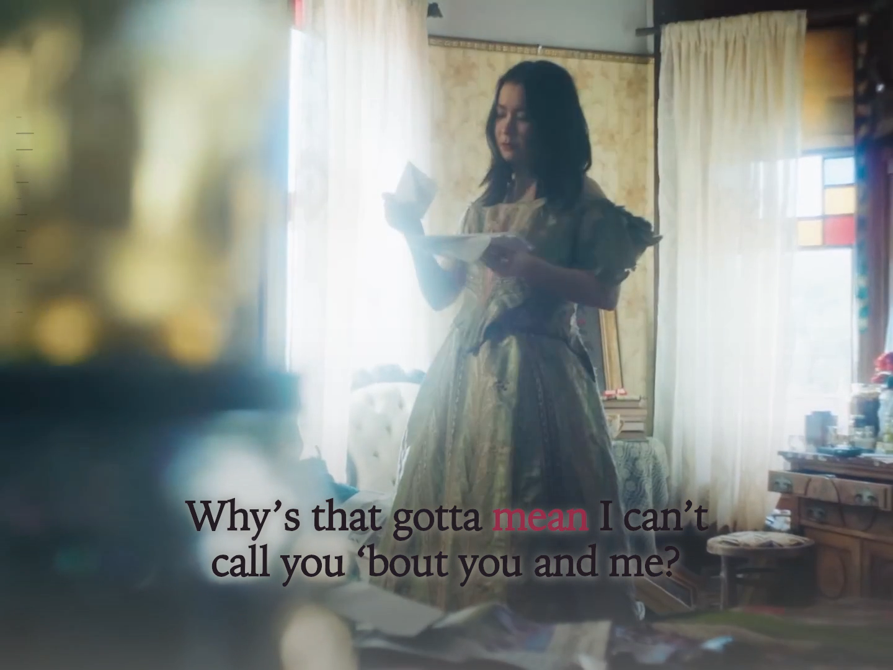

# I'll Change for You — lyric film

An English-only, full-recording lyric film for [Mitski's source video](https://www.youtube.com/watch?v=BPy1NIiKKW0). The complete preview was reviewed at normal speed, uncertain words and held endings at reduced speed, and in both 4:3 and 9:16. Explicit production authorization and the exact approved preview hashes are preserved in [the render record](evidence/render-authorization.json). Follow the repository's [preview-before-render rule](../../docs/preview-before-render.md) for any later revision.



*Exact frame 2700 at 00:45 from the encoded 4:3 film, with “mean” in focus. Original video directed by Lexie Alley and edited by Rena Johnson. The earlier static preview reference is preserved separately as history.*

## Source and composition

The [release note from Dead Oceans and Mitski](https://thelabel.co.nz/mitski-presents-ill-change-for-you-single-video/) credits director Lexie Alley and editor Rena Johnson and describes the original footage as printed frame by frame with hand-drawn marks. That source texture motivates the small edge-print response and restrained type treatment; the source film remains the main visual work.

The locked local `public/source.mp4` is the complete moving picture and original soundtrack. Its SHA-256 is `5af79acdcb8d708a6d53f901dee814f2a8038e2c775e806635e4286a57d01309`; the [source manifest](source/media-manifest.json) records the complete stream identity. The source is **1440×1080, 4:3**, H.264 at regular 24000/1001 cadence, with 4,709 frames. Its 44.1 kHz stereo AAC stream has 8,664,064 samples and lasts 196.464036 seconds. The picture ends at 196.404533 seconds, about 60 ms before the audio; preview and production keep the final picture visible through that short audio tail.

The file is ignored by Git and is not in the source handoff. A fresh checkout needs an authorized local copy matching the manifest hash. Do not substitute another upload or encode without establishing a new timing and picture identity.

The Original view presents the entire 4:3 frame with lyrics in its lower picture area. The 9:16 view retains the full source frame above the words, over a moving, dimmed fill derived from the same video. Both have a steady reading position and word-by-word color/luminance focus. A compact, audio-shaped edge print supports the source image. The small displaced ink treatment belongs only to the highlighted word “change.” The palette and readability ink respond to measured picture brightness; verify those choices against actual shots at normal and mobile viewing sizes. See the [scene-integration guide](../../docs/scene-integrated-visuals.md).

## Preview

From this directory, with Node.js and the exact local source file present:

```sh
npm run preview
```

Open <http://127.0.0.1:4326/>. The page starts paused at the beginning. It offers play/pause, restart, full-duration seek, 1×/0.75×/0.5× playback, lyric-line jumps, Original 4:3 and 9:16 layout buttons, sound and edge-print controls, and **Restore picture**. A direct review link such as <http://127.0.0.1:4326/?t=78&format=portrait&speed=0.5> keeps the complete preview available. Use `PORT=4327 npm run preview` if port 4326 is occupied, then use that port in review links. Keep the server running during review.

After a fresh load, confirm the actual picture moves with the soundtrack in both formats, including after seeking, switching format and restoring the picture. A working clock or poster alone does not establish video visibility. Inspect a nonblack shot and the ending. The main preview includes the picture, lyrics, measured edge response and intended word treatment; isolated diagnostics do not replace it.

[Sampled browser review](evidence/browser-preview-review.md) records the picture, control and seek checks already completed, plus their limits.

## Timing and measured inputs

The supplied text is retained in [source/lyrics-supplied.txt](source/lyrics-supplied.txt). The [timeline](src/timeline.json) contains 25 display lines and 118 individually identified word intervals at 44.1 kHz. It preserves isolated opening words, two complete refrain performances and the closing phrase. The [preliminary alignment record](evidence/alignment-candidate-preliminary.json) remains as the baseline; the [acoustic revision ledger](evidence/alignment-revision-2026-09-24.json) records 72 revised boundaries and independent model observations. This revision corrects early short-word focus, a first-refrain word that crossed a vocal pause, and clipped held endings without changing the supplied wording. The actual-audio review scope is recorded separately from model evidence; passing interval validation alone is not proof of acoustic accuracy.

The audio analysis stores 64 unsmoothed, logarithmic 20 Hz–16 kHz band measurements at 60 Hz in [audio-features.bin](public/audio-features.bin), with units and generator settings in [audio-features.json](public/audio-features.json) and [the audit](evidence/audio-features-audit.json). The display transform is separate in `src/edgeprint.js`; changing its shape or opacity does not change the measured data or lyric events. [Picture-tone samples](public/picture-tones.json) at 2 Hz propose light or dark lyric ink; [their audit](evidence/picture-tone-audit.json) records sampling limits and transitions. These measurements support design decisions but do not certify vocal boundaries or readability over every frame.

The reproducibility path is summarized in [AGENT-HANDOFF.md](AGENT-HANDOFF.md). [Production lessons](PRODUCTION-LESSONS.md) and [the preview-to-master comparison](evidence/render-parity-review.md) explain the scene, font and portrait-fill decisions. Material changes to the picture, audio, timing or presentation need affected preview review and a new render authorization; technical checks and GitHub integration alone do not open the render gate.

## Verified production and posting kit

The complete 4:3 master (`Ill-Change-for-You-original-4x3.mp4`) is **1440×1080**; the complete 9:16 master (`Ill-Change-for-You-portrait-9x16.mp4`) is **1080×1920**. Both are H.264, 60 fps, 11,788 frames, with the original AAC packet stream and a 196.467-second picture that covers the 196.464-second soundtrack. Their SHA-256 hashes are `4b3076311ccdf60e9996a602bb26d9670f3f5672d45125545bd8f0e85ba8bc04` and `ca45673173f7af3886e66a8a18c22f12276f6f587c0b283b4d1a3140eba12f64` respectively.

The [independent verification](evidence/final-verification.md) checked full decode, exact source audio packet hashes and timestamps, 382 testable 2 Hz source-picture samples per format, expected source-black intervals, and 18 exact encoded-frame comparisons against uncompressed production stills. No blocking defects were found. [Contact sheets](evidence/final-contact-sheets/) include dark and bright source scenes, lyric gaps, revised short words, held endings, repeats and the original black fade. The separately recorded actual-audio review is the basis for timing acceptance; these file checks do not replace it.

The Desktop folder **Mitski — I’ll Change for You — Upload Kit** contains both final videos, separate YouTube/TikTok covers, titles/descriptions, optional English SRT/VTT captions, posting instructions and a SHA-256 manifest. All 14 copied files match the verified local package; all 13 checksummed posting/manifest files passed verification in the Desktop folder. [The delivery receipt](evidence/delivery-receipt.json) records master, verification and package identities. Finished videos and the locked original source remain local and are not committed to this public repository.
