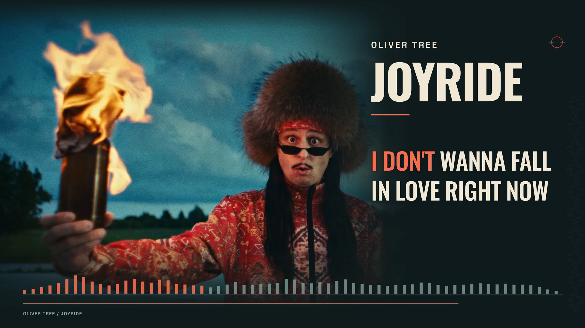
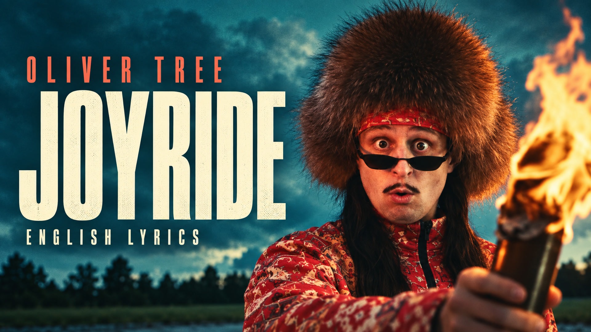
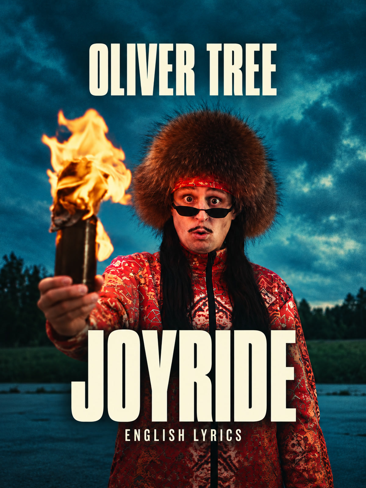

# Oliver Tree — Joyride

**A cinematic English lyric film, composed separately for YouTube and TikTok.** The original video's teal courtyard, patterned red clothing and fire imagery set the palette. Large cream lyrics turn coral with the vocal, while continuous shading blends the footage into a calm reading area. The original performance and recording remain Oliver Tree's work.



*Decoded final film at 02:00. Original song, performance and footage: [Oliver Tree's official music video](https://www.youtube.com/watch?v=TIipwQUU9mc). Added lyric presentation by Ael, assisted with Codex.*

[Download the complete release](https://github.com/ael-dev3/lyrics/releases/tag/joyride-v1.0.0) · [Original creators](CREDITS-SOURCE.md) · [Verification](evidence/final-verification.md) · [Software and fonts](SOFTWARE.md)

## Deliverables

| Asset | Specification |
| --- | --- |
| YouTube film | 1920×1080, 60 fps, H.264 High, 8,932 frames |
| TikTok film | 1080×1920, 60 fps, dedicated portrait composition |
| Soundtrack | Full 148.8535-second recording, stereo 48 kHz AAC; identical audio packets in both films |
| YouTube thumbnail | 1920×1080 JPEG |
| TikTok profile cover | **1200×1600 portrait**, 3:4 width:height; matches the established tall upload preview labelled “4:3” |
| Publishing kit | Concise artist-focused titles/descriptions, optional English SRT, verification reports and SHA-256 checksums |
| Production archive | Editable code, original source, fonts, timing evidence, stems, covers and final deliveries; pinned to a Git commit |

The video lasts 148.866667 seconds because a complete final frame is required. Its additional 13.167 ms is picture duration, not inserted audio. Both editions preserve the complete intro and closing footage.

[YouTube title](publishing/Joyride-YouTube-Title.txt) · [YouTube description](publishing/Joyride-YouTube-Description.txt) · [TikTok title](publishing/Joyride-TikTok-Title.txt) · [TikTok description](publishing/Joyride-TikTok-Description.txt) · [English captions](publishing/Joyride.en.srt)

## Visual decisions

- **Source-led color:** deep teal `#101b1c`, cream `#f0e9d6`, coral `#f16e50` and muted teal accents. Original footage keeps its own colors.
- **Stable reading:** Oswald Medium lyrics keep their positions, size and weight during focus. Only color changes. No lyric underlines, word boxes, pills or bouncing glyphs. The small title rule and full-recording progress line are composition elements.
- **Continuous shading:** full-frame gradients protect contrast and fully conceal the cropped source edges. There is no cue-shaped panel behind the lyrics.
- **Separate compositions:** landscape places footage left and lyrics right; portrait places the performance above the lyrics. The same source samples drive both timing maps.
- **Measured spectrum:** 64 square-ended bands share a fixed scale. Decorative diamonds and the rotating accent are artistic motion, not additional signal measurements.

The source is **2880×2160 at 25 fps**. Its original cadence is preserved on the 60 fps timeline; no optical flow invents in-between source frames. Newly rendered graphics run at 60 fps. Each composition is captured at twice delivery resolution using lossless intermediates, then downsampled once with Lanczos and encoded at CRF 14 with the slow x264 preset. A 1080p60 export is not a claim that the original camera captured 60 fps.

## Lyrics and timing

The [supplied reference](analysis/lyrics-user-en.txt) contains **395 words in 44 lines**. All are retained, divided into **70 display cues and 323 focus groups**. English is the song's original language, so this edition has one lyric lane. Pronunciation material is excluded.

Timing combines full and bounded Whisper attention alignment, MMS-FA on the full mix and isolated vocals, an independent English wav2vec2 encoder, and visual inspection of 5 ms vocal-energy panels. The [decision record](analysis/alignment-decisions.json) retains every candidate and 112 explicit token adjustments. [Cue construction](scripts/build-cues.ts) reproduces the chosen sample intervals and semantic splits.

Short connected words are grouped when their individual acoustic boundaries are ambiguous. First-person contractions sometimes land in the preceding held vowel in CTC output; attention models sometimes absorb the preceding gap. Those candidates are reconciled explicitly. Weak repeated-chorus waveform correlations (0.136–0.417) do **not** justify copying timings between performances.

Sample intervals are rounded once onto the 60 fps clock. All 323 groups are fully visible at their selected contact frame and release at an exclusive endpoint. The maximum display rounding error is 8.33 ms; **this is not a bound on acoustic alignment error**. Model observations and waveform inspection do not establish perfect synchronization or a human listening review. See [timing checks](evidence/timing-checks.json) and [boundary fixtures](evidence/timing-boundary-checks.json).

### Complete-recording coverage

The audit compares the entire recording's transcription with the supplied sequence and checks the opening and complete ending separately on both mix and vocal stem. Focused ending passes corroborate the last supplied phrase around 124–125.3 s. A stray extra chorus line near 146.7 s in full-track ASR is not corroborated and is not added. An isolated, extremely low-confidence opening token is also not adopted as a confirmed lyric.

The selected last held-word endpoint is **125.4793125 s**. The closing lyric-area title begins at 132 s, leaving the final vocal release and a pause unobstructed. No confirmed lyric omission remains in the reviewed evidence. This classification is evidence-based and does not treat missing captions, ASR silence or separated-stem energy as proof of an instrumental passage. [Coverage record and limits](analysis/vocal-coverage.json).

## Audio and signal analysis

The source Opus decodes to **7,144,968 stereo samples at 48 kHz**. Delivery applies a fixed **−3.8 dB** gain and one AAC encode, with no time stretching, dynamics processor or inserted silence. The measured delivered audio is **−11.20 LUFS integrated, −1.94 dBTP and 2.10 LU loudness range**. Analysis stems are not mixed into the film.

[Source-stream checks](evidence/source-stream-identity.json) confirm that all 3,721 working-video packets retain their original payloads and timestamps, and all 7,443 extracted Opus packets retain their original payloads. Container-specific Opus priming is handled separately from decoded-audio timing.

Eleven waveform comparisons between source and decoded delivery find a zero-sample shift. The final verifier checks every AAC packet and timestamp against the locked soundtrack for both videos.

The spectrum uses 64 logarithmic bands from 20 Hz to 20 kHz, forward/backward prewarped biquads and centered RMS windows. Values represent filtered stereo RMS dBFS on a fixed −60 to 0 scale. Low-frequency windows cover more time; zero-phase filtering removes causal delay but does not create instantaneous measurements. Artistic movement is recorded separately and is not an objective measure of emotion. [Filter definitions](analysis/manifest.json) · [Calibration](analysis/calibration.json) · [Motion record](analysis/motion-manifest.json) · [Audio timing checks](evidence/audio-timing-check.json).

## Covers

| YouTube | TikTok profile |
| --- | --- |
|  |  |

The covers are AI-assisted adaptations of a source frame, not original music-video frames. Generated originals and [exact prompts](analysis/cover-prompts.json) are retained. The YouTube original is 1672×941 and the selected portrait original is 1086×1448; delivery dimensions use a documented Lanczos resize. The portrait revision moves title and artist inside safe margins. Both covers are checked at small display sizes; the portrait also survives a centered crop removing 5% per edge. [Cover evidence](evidence/cover-verification.json).

## Reproduce

Download and extract `Joyride-Complete-Production.zip` from the release. It includes the original and runtime media that are intentionally kept out of ordinary Git history. `SOURCE-REVISION.txt`, `MANIFEST.json` and `CHECKSUMS.sha256` identify the source commit and packaged bytes. Use Node.js 24+, the pinned npm dependencies and FFmpeg/FFprobe. Model reruns additionally require the Python packages listed in [SOFTWARE.md](SOFTWARE.md); set `ALIGN_PYTHON` to that environment's interpreter.

```sh
npm ci
node scripts/build-cues.ts
node scripts/check.ts
node scripts/timing-boundaries.ts
node scripts/prepare-analysis.ts
node scripts/audio-check.ts
node scripts/render-all.ts --parts=8 --workers=2 --total-concurrency=6
node scripts/captions.ts
node scripts/verify.ts
```

Stored signal data and selected cues are sufficient to render; model reruns are optional. To regenerate signal data, preserve the archived `public/soundtrack.m4a`, run `node scripts/prepare-analysis.ts`, then `npm run features`. [Audio preparation](analysis/audio-preparation.md) records the original encode separately. [Model windows](analysis/window-method.md) and [alignment methods](analysis/ALIGNMENT-HANDOFF.md) explain the optional alignment passes.

`render-all.ts` awaits typechecking, timing fixtures, DSP calibration, composition discovery and all-cue layout checks before rendering. It creates one shared browser bundle, freezes code/media/dependency/report hashes, and checks them around each worker. Eight contiguous segments per composition cover every frame. Source-video caches are capped at 512 MiB per worker, with a 128 MiB media cache and two decode threads. Final encoding rebuilds exact integer frame timestamps after concatenation; the verifier checks every decoded frame timestamp, strict full decoding, dimensions, color metadata, fast-start placement and soundtrack packet identity.

An initial render encountered browser failures with automatic source-video cache sizing. Its intact 1,116-frame YouTube prefix was recovered from the frozen 2× PNG captures after source/media hash checks and exact RGB comparisons against three fresh frames. The [recovery receipt](evidence/recovery/capture-reuse.json) records the lineage. This saves a completed capture segment; a clean reproduction uses the command above to render every segment without requiring temporary caches.

See [final review](evidence/final-verification.md) for native/mobile frame observations and limitations. The [publication receipt](evidence/release-upload-verification.json) records hashes from a fresh download of every release asset.

## Credits, AI assistance and licence

**Oliver Tree is the original artist. We take no credit for the song, lyrics, recording, performance or original video.** The official video was directed and written by Oliver Tree, produced by WMW studio, with post-production by Alien Boy Films. [Full source production credits](CREDITS-SOURCE.md) · [Listen and support Oliver Tree](https://olivertree.lnk.to/Joyride).

Ael's contribution is the added lyric presentation and workflow, assisted by **OpenAI Codex (GPT-6 Astra)**. Built-in image generation was used for covers; its underlying model version was not exposed. Fonts, software and models keep their respective licences. No artist endorsement or affiliation is implied.

The repository's [CC BY 4.0 licence](https://github.com/ael-dev3/lyrics/blob/main/LICENSE.md) covers only licensable authored contributions. It does not relicense the original music, lyrics, recording, footage, complete audiovisual films, source-derived covers, fonts, software or model weights. Attribution records provenance, not third-party rights clearance.
