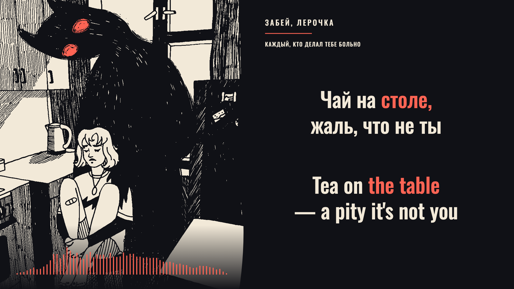

# каждый, кто делал тебе больно

**забей, лерочка · Russian + English · full-recording preview v3 · three-color animated treatment**



*Diagnostic landscape preview frame at 01:12.200. Music and source illustration from the original забей, лерочка / Spooky music upload. The illustrator is not identified in the verified source metadata. This is not a frame from a rendered delivery film.*

Ink, ivory and vermilion carry the original kitchen illustration and a measured 64-band spectrum. Brief, anchored picture pulses follow 107 strong percussion attacks corroborated in the original soundtrack; the picture rests between them. Independent camera drift, orbiting contours, added eye marks, artificial steam and chorus palette inversion have been removed. Equal Russian and English text keeps fixed geometry and uses color-only focus. The presentation applies the Lyrics workflow in general.

## Preview status

The complete approximately 3:33 recording is playable in 1920×1080 and 1080×1920 layouts. Thirty-two cues cover 220 Russian lexical words, one nonlexical event and 306 English tokens including punctuation. Both languages follow shared source meaning intervals; no separate English acoustic times are fabricated.

**No full production rendering has been authorized or performed.** Acoustic timings remain model-assisted preview candidates. Full actual-audio review in both formats and explicit approval of this revision are still required under the [preview-first workflow](../../docs/preview-before-render.md) and [cross-language gate](../../docs/cross-language-sync-gate.md).

[Detailed three-pass review](evidence/sync-review.md) · [Picture timing and purpose](evidence/motion-review.md) · [Workflow study and lessons](evidence/workflow-study.md) · [Technical checks](evidence/technical-checks.json) · [Source and audio identity](source/input-manifest.json) · [Original upload](https://www.youtube.com/watch?v=3yDdoi1c7-8)

## Run locally

Use Node.js 24 or later. Install pinned dependencies with `npm ci`. The original media is excluded from GitHub: place the unchanged source upload in `public/review-source.mp4`, stream-copy its audio to `public/soundtrack.m4a`, and extract the original illustration at 15 seconds to `public/artwork.png`. Compare hashes with `source/input-manifest.json`; a different acquisition invalidates the frozen review identity.

```sh
npm run check
npm run review:build
npm run preview
```

Open `http://127.0.0.1:4319/`. Playback uses the original recording, including intro, interlude and tail. Select 16:9 or 9:16; use Timing review for per-word inspection and 0.75× / 0.5× playback. Saved local proposals are revision-bound and do not approve rendering. `Start Preview.command` launches the already-built local preview without reinstalling packages.

The unchanged stream-copied AAC plays in an audio element whose clock drives the picture. Artwork and filters stay mounted throughout playback; only changing attributes and cue text are updated. The hidden inspector does no spectrogram drawing until opened. Browser frame cadence and device latency remain distinct from the composition's 60 fps timeline.

## Reproduce analysis and checks

The committed cues and measured JSON allow preview reconstruction without rerunning models. Regenerating alignments additionally requires the locked source audio decoded to the PCM paths used in `scripts/infer.ts` / `scripts/align.ts`, compatible pretrained-model dependencies and `ALIGN_PYTHON` pointing to that environment. Python is used only as a bridge to those libraries; authored pipeline, timing, display and QA logic is TypeScript.

The deterministic refinement chain is `prepare-text.ts`, `build-cues.ts`, `refine-releases.ts`, then `layout.ts`. `refine-releases.ts` always starts from `analysis/core-cues.json`, so releases and the nonlexical cue cannot accumulate on reruns. `analysis/boundary-ledger.json` retains independent candidates; `evidence/semantic-ledger.json` records every full translated span. After an intentional revision, update evidence and freeze the reviewed inputs with `npm run preview:freeze` before rebuilding the browser bundle. This invalidates earlier review notes when hashes change.

Picture accents are separate from lyric alignment. `scripts/infer.ts drums` creates an analysis-only percussion stem; decode that stem to stereo 48 kHz Float32 `analysis/drums48.f32`, then run `node scripts/motion-features.ts` against it and the original mix in `analysis/audio-delivery.f32`. The [motion manifest](analysis/motion-manifest.json) records thresholds and source identity; the [corroboration ledger](analysis/mix-impact-corroboration.json) includes all 19 rejected candidates. Reproduction requires the identified PCM inputs; regenerating a model stem can change those inputs.

`npm run geometry:build` prepares the browser audit at `/review/geometry.html`. `npm run stills` produces only selected diagnostic PNGs through one-frame Remotion compositions. `npm run render` and `npm run sync:gate` refuse incomplete or stale review and missing approval. This preview revision deliberately has no full-film renderer.

## Palette and motion

| Role | Value |
| --- | --- |
| Ink | `#101116` |
| Ivory | `#F2E9D8` |
| Vermilion | `#FF6454` |
| Lyric typography, both languages | Oswald Medium, 78 px landscape / 82 px portrait |
| Focus | Stable geometry, source-linked color changes, exclusive ends |
| Spectrum | 64 measured bands; artistic display `clamp((dB + 64) / 55)^1.35` |
| Bar travel | 3–39 px in verses, up to 111 px in choruses |
| Picture response | Maximum scale addition 0.012; fixed focal anchor; nearest-frame attack apex and 11-frame release |

Three base colors describe the authored palette; antialiasing, opacity and gradients create intermediate raster values. The source is a static illustration. Picture pulses are authored motion driven by analysis, not original source animation. Font licenses are included. Artist recording, lyrics and illustration rights are excluded from the repository contribution license. Full media and listening notes stay local.
