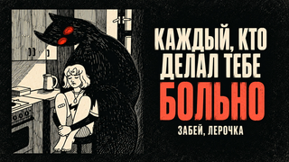
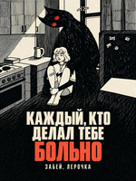

# каждый, кто делал тебе больно — upload kit

The approved bilingual film has separate landscape and portrait compositions. The final local posting folder contains one video, cover and publishing copy per platform, plus optional line-level caption files. Final-file verification and copied-file hashes are recorded in the delivery receipt when production completes.

| Platform | Video | Cover | Copy |
| --- | --- | --- | --- |
| YouTube | 1920×1080, 60 fps | [1920×1080 thumbnail](Kazhdyy-YouTube-Thumbnail-1920x1080.jpg) | [Title](YouTube-Title.txt), [description](YouTube-Description.txt) |
| TikTok | 1080×1920, 60 fps | [Portrait 1200×1600 profile cover](Kazhdyy-TikTok-Cover-Profile-1200x1600.jpg) | [Title](TikTok-Title.txt), [description](TikTok-Description.txt) |

The covers are AI-assisted promotional adaptations of the current source illustration using the built-in image-generation tool. They are distinct from the film and from decoded README screenshots. Selected originals and exact prompts are retained in [Cover-Source](Cover-Source/); export dimensions, hashes and source dimensions are in the [manifest](cover-manifest.json). [Cover review](Cover-Review.md) records local small-size and crop simulations. No platform upload is implied.

The Russian and English words are burned into both films. [Optional SRT files](captions/) contain line-level cues for platform captions; they do not reproduce the film's word highlighting. Avoid enabling both the bilingual SRT and overlapping platform-generated captions unless that duplication is intended.

Music, recording, lyrics and source illustration: [забей, лерочка / Spooky music](https://www.youtube.com/watch?v=3yDdoi1c7-8). The illustrator is not identified in the verified upload metadata. Added lyric film, translation and visualizer: Ael, assisted by OpenAI Codex, following the Lyrics workflow in general. Adapted imagery remains subject to the [third-party rights exclusions](../../../LICENSE.md).
