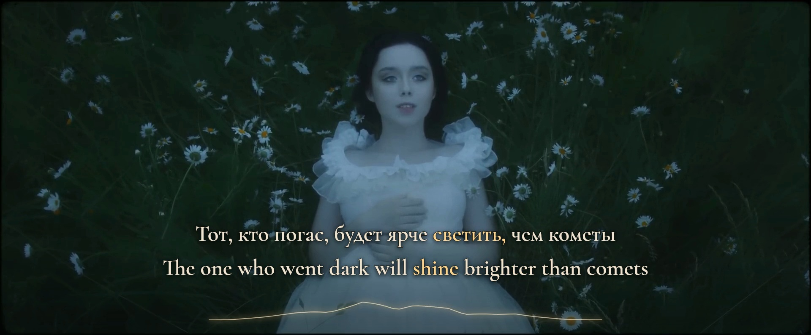

# POLNALYUBVI — Кометы

Complete original-video bilingual review preview. Russian singing has English translation; English radio speech has Russian translation. **Final v10 native-wide and portrait films are rendered, verified and delivered in a local Desktop upload kit.**



Exact frame **744 at 0:12.400** decoded from the verified native 1920×796, 60 fps film; original source frame 310. Source picture: POLNALYUBVI / FILM GODS. This image proves the delivered composition; listening acceptance is recorded separately.

## Recording and complete coverage

- [Official recording](https://www.youtube.com/watch?v=76BmuIf0duw), 4:20.086712.
- Native picture: 1920×796, square pixels, 25 fps; 6,501 original frames.
- Original stereo AAC: 44.1 kHz, 11,469,824 decoded samples. Audio continues 46.7 ms beyond the picture extent; keep the final decoded picture through that tail.
- Source identity and public creator credits: [manifest](source/manifest.json).
- The original 24 supplied lyric lines are preserved separately from recording additions. There are 27 performed cues, 139 original word events and 157 translation words. A merged two-line birth sentence preserves natural English order without merging its acoustic words.
- The recording contains **two radio transmissions**. Four late cues around 3:55–4:10 were independently detected beyond the supplied text. Original endcards stay intact while the reprise remains captioned.

## Treatment

The actual forest, pale dress, mirror, bowstring, night beams and final orb carry the visual story. Landscape retains the full native frame. No new celestial artwork, artificial foliage, replacement footage or global palette cycling is introduced.

Both languages use the bundled Cyrillic/Latin Cormorant Garamond Semibold with the same size, weight, ivory resting color and warm gold focus. Words keep fixed positions; focus changes their color. Dense cues reflow both languages together. Necessary grammatical completions share the originating source event, and reordered translations may highlight non-linearly. Multi-source meanings use the union of actual participating intervals, releasing over unrelated words and real gaps.

A stable single bow-light ribbon translates 24 measured spectral bands into a smooth 64-segment contour. It is a supporting screen-space graphic inspired by this video's luminous bowstring, not a claim of tracked physical attachment. Narrow emission, trailing smoothing, an absolute quiet gate and unsaturated response preserve the source imagery. A reserved maximum-reach band keeps it clear of descenders and punctuation.

Portrait uses 78 separately reviewed framing spans. Medium panoramas retain complete faces; full-width spans retain mirror/hand, bow/action, performer/orb pairs and original cards. Before the endcards, a defocused copy of the same current source picture supplies subdued surrounding atmosphere. The sharp principal picture remains unstretched. Original endcards use a clean full-width fit, without blurred duplicate lettering.

## Timing and its evidence limits

All acoustic events use original 44.1 kHz integer sample boundaries. The original video is the single playback authority. Native picture PTS is recorded separately; word focus repaints at display cadence from that video's current time, so it need not wait for the next 25 fps picture. Highlighting adds no eased color reveal or deliberate onset delay.

Bounded Whisper and independent multilingual CTC candidates, source waveform/spectrograms and a zero-lag verified vocal stem support the onset audit. Sparse CTC grapheme cores are evidence, not automatically the first audible consonant. The complete 139-word pass revises 61 starts and 67 releases individually. Quiet initial consonants, full held vowels and final consonant bodies receive separate source-supported boundaries, with the before/after ledger retained. Release, line visibility, meaning focus, picture framing and decorative lifetime remain separate.

Sample-level storage and millisecond labels do **not** establish millisecond listening certainty. Browser display cadence is finite. Complete normal-speed and uncertain-event reduced-speed listening in both layouts was explicitly attested for the frozen v10 preview; see [the input-bound review](evidence/sync-review.json).

The current `komety-preview-v10-first-final-eagle` moves the final refrain’s first орёл/an eagle from **180.550 to 180.350 s**, source sample **7,953,435**, and ends the preceding словно/like at the same handoff. The changed quiet descending body around 180.33–180.43 follows narrowing near 180.22 and precedes the sparse initial-character core at 180.406. Both targeted proposals select 180.350 s within the retained 180.315–180.435 s ownership range; original-mix/stem observations remain correlated evidence, not independent precision votes. See [the current 180-second eagle review](evidence/eagle-180-focus-review.md).

The prior `komety-preview-v9-final-eagle-entry` moves the final refrain’s second орёл/an eagle from 184.090 to **183.700 s**, source sample **8,101,170**, with the preceding словно/like release at the same handoff. The selected point is within 183.665–183.805 s. The independent 183.735 s proposal and the selected 183.700 s quiet leading edge differ by 35 ms; that disagreement remains explicit. The changed body around 183.69–183.71 precedes the stronger initial-character core. Original mixed audio remains authority; correlated stem/model paths do not certify a unique phonetic boundary. See [the archived v9 final-eagle review](evidence/eagle-final-entry-review-v9.md) and [the complete eagle history](evidence/eagle-entry-review.md).

Earlier corrections remain intact: the second-refrain eagle entrances at 132.304988662 and 135.700 s, its second fire at 149.480 s, and the v5 connected-word pass including fire at 62.160 s. Two other eagle entrances, at 45.180 and 48.420 s, retain their individual selections and broad ownership uncertainty. The [v8 fire decision](evidence/fire-entry-review.md) and [v5 connected-word review](evidence/connected-word-review.md) bind their archived inputs. The preview badge comes from the timeline actually loaded in memory; DOM diagnostics expose the source event samples and paired active words so an older open page is distinguishable from current timing evidence.

The inherited v4 presentation separates the complete line’s full-opacity hold from the last word’s lexical release. All 27 phrase endings retain their reviewed source/stem/accompaniment tail selections. Both complete language lanes remain readable through the selected decay hold, then receive a 0.42–0.50 s fade when the gap permits. Closely adjoining phrases retain the outgoing neutral line until the next sung entrance and replace it without a blank frame or ghosted overlapping text. Five v3 midpoint blanks and compressed release fades are covered by independent regression cases. See [line-lifetime decisions](evidence/line-lifetime-review.md) and [cue-final signal review](evidence/cue-tail-review.md).

See [all-word timing evidence](evidence/timing-review.md), [independent onset audit](evidence/onset-independent.md), [independent release audit](evidence/release-independent.md), [prior-workflow comparison](evidence/timing-workflow-comparison.md), [translation review](evidence/translation-review.md), [portrait study](evidence/portrait-framing.md), [workflow study](evidence/workflow-study.md), [technical checks](evidence/technical-checks.json) and [browser preview checks](evidence/browser-preview-checks.md).

## Verified delivery

Both complete films contain 15,606 frames at 60 fps and preserve all 11,201 source AAC packets and 11,469,824 decoded audio samples. Strict full decode, every frame timestamp/count, BT.709 tags, faststart and authored-black checks pass. The independent decoded scene/focus audit checks 1,066 output frames per format, all 139 source events and 157 target tokens in active and neutral states, all 27 reading tails, framing transitions and the final-picture hold.

The local **18-file upload kit** contains native 1920×796 YouTube and 1080×1920 TikTok videos, platform-specific covers, titles/descriptions, Russian/English SRT/VTT, evidence and checksums. All copied files match their verified inputs. [Delivery receipt](evidence/delivery-receipt.json) · [Final technical checks](evidence/final-verification.json) · [Encoded scene/focus checks](evidence/encoded-scene-verification.json) · [Posting assets](publishing/README.md).

[Production method and export fixes](PRODUCTION-NOTES.md) · [All timing mistakes and first-pass prevention](PRODUCTION-LESSONS.md) · [Agent startup](AGENT-HANDOFF.md) · [Reusable connected-word procedure](../../docs/connected-phoneme-onset-workflow.md).

## Run and recover

Requires Node 24+, ffmpeg/ffprobe, and the exact original source saved as `public/source.mp4`. Large media, model weights, stems, raw downloader metadata and reproducible analysis caches remain excluded from Git.

```sh
npm ci
npm run features
npm run prepare
npm run check
npm run preview
```

Preview: `http://127.0.0.1:4331/`. Keep the server running. Restart, cue selection, exact seconds, 1×/0.75×/0.5×, Native wide / 9:16, source comparison and Restore preview are available. Recovery preserves position, layout, speed and mute state. A decoded-dimensions check alone never substitutes for observing real picture movement.

## Production boundary

`node scripts/render-production.ts --check-gate` checks the current authorization without capture. Production requires an explicit `--production --format landscape` or `--production --format portrait`; missing, incomplete or stale cross-language listening review and current-revision authorization are rejected **before capture or encoding**. The gate compares exact cue membership and hashes of the source, text, mapping, timing, fonts and presentation. Current owner review and production authorization are recorded separately and bound to all 17 frozen v10 inputs.

Repository publication is separate from preview preparation and requires the conservative Actions preflight in the repository's AGENTS instructions. No remote workflow dispatch or media publication is recorded by this project.
