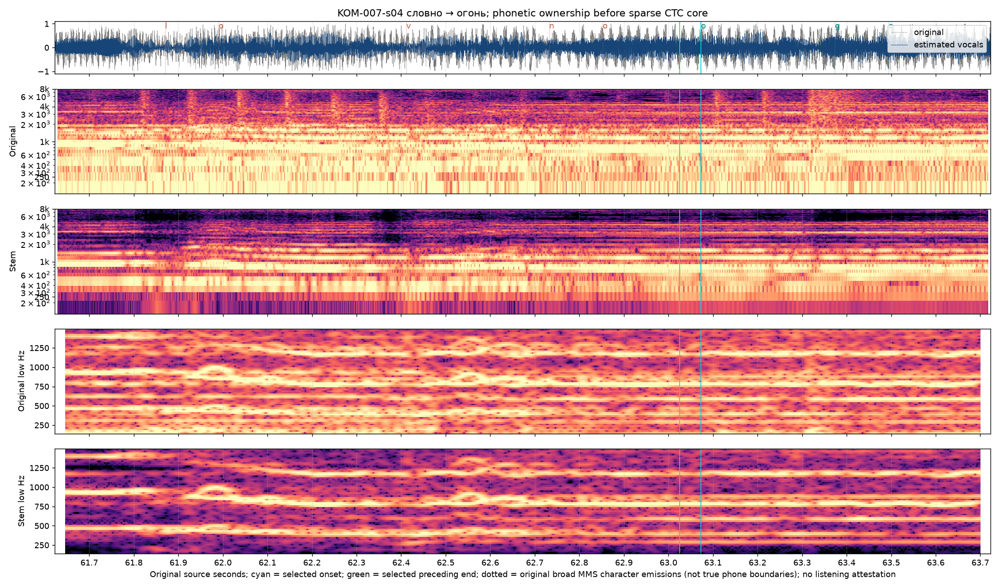

# Connected-word ownership — Кометы v5

Historical v5 revision: `komety-preview-v5-connected-words`. [Archived frozen inputs](preview-inputs-v5.json). [Selected sample corrections](../source/onset-corrections-v5.json). **Source/signal estimates; full human listening acceptance remains pending.**

The current critical eagle entrance is refined further in [v6](eagle-entry-review.md). This record preserves the prior review and its then-selected uncertainty ranges; it is not a current timing acceptance.

## The correction

The second «огонь / fire» previously switched at 63.073039 s, well inside an established sung vowel. The new selected ownership starts at 62.160 s (2,741,256 original 44.1 kHz samples), about 913 ms earlier. Its quiet opening /o/ precedes a g-like attenuation at 62.39–62.43. That closure is internal to the word: selecting 62.425 would still omit the opening vowel. The preceding «словно / like» now ends at the same 62.160 s handoff. Russian and English use this one source event with immediate color switching.

Twelve repeated eagle/fire starts and seven related nasal/trill starts received targeted original-mix and zero-lag estimated-vocal inspection. Eleven starts changed; eight continuous boundaries also changed the prior word’s release. Eight other onsets were individually retained. Short true gaps in the three sonorant corrections remain gaps. There is no global shift, earliest-model rule or requirement that a new word start after silence.

## Selected changes from v4

| Event | Previous start | New start | Advance | Source-supported uncertainty |
| --- | ---: | ---: | ---: | --- |
| KOM-005-s02 | 45.766848 | 45.180000 | 586.8 ms | 45.125–45.265 s |
| KOM-005-s04 | 48.895533 | 48.420000 | 475.5 ms | 48.340–48.590 s |
| KOM-007-s04 | 63.073039 | 62.160000 | 913.0 ms | 62.110–62.240 s |
| KOM-013-s02 | 133.206689 | 132.650000 | 556.7 ms | 132.590–132.740 s |
| KOM-013-s04 | 136.535941 | 135.850000 | 685.9 ms | 135.790–135.960 s |
| KOM-015-s04 | 150.073537 | 149.650000 | 423.5 ms | 149.590–149.735 s |
| KOM-021-s02 | 181.023946 | 180.550000 | 473.9 ms | 180.485–180.665 s |
| KOM-021-s04 | 184.410930 | 184.090000 | 320.9 ms | 184.030–184.170 s |
| KOM-002-s02 | 17.248186 | 17.090000 | 158.2 ms | 17.065–17.125 s |
| KOM-003-s06 | 27.369955 | 26.970000 | 400.0 ms | 26.935–27.035 s |
| KOM-003-s07 | 27.950839 | 27.924989 | 25.9 ms | 27.905–27.955 s |

See the [nineteen-case measurement ledger](vowel-handoff-proposals.json) for compact original/stem model observations alongside these selected corrections.

## Retained cases and limits

Retained fire starts: KOM-007-s02, KOM-015-s02, KOM-023-s02 and KOM-023-s04. Retained sonorant starts: KOM-004-s02, KOM-006-s02, KOM-014-s02 and KOM-009-s02. The correction JSON retains every range, decision and reason. These points are already within the inspected phonetic transition; a speculative additional advance is unsupported.

Both broad and restricted MMS character paths and original/stem Whisper alignments are competing observations. Original versus stem applications remain the same model family, not independent votes. Several original-mix paths attach phones much later than the corresponding original/stem formant sequence. The stem aids articulation identity but can leak accompaniment or smear edges; it never replaces the original clock. Original-source trajectories, phone order and the quieter first vowel determine ownership, with uncertainty retained.

The source/stem figure below records the rejected v4 boundaries: cyan denotes the old next-word core at 63.073, green the old preceding release 63.025, and dotted letters old sparse CTC emissions. It is a diagnostic of why a core is inadequate, not a claim of a clean isolated phoneme. Fresh stem ordering is n 61.920 → preceding final-o 62.020 → next initial-o 62.241 → g 62.401 → stressed-o 62.502; the renewed lower vowel/body is visible before the later closure. The selected initial ownership lies in 62.110–62.240.

All 27 final lexical endpoints are identical to the v4 cue-tail review. The longer neutral line holds and uninterrupted cue handoffs remain unchanged. Word ownership does not extend passive reverb into full-strength focus. Original video/audio, native aspect ratio, portrait framing, font, meaning mappings and measured visualizer response are unchanged.

The exact integer samples encode reviewed estimates. Spectral support, display cadence and coarticulation uncertainty preclude a literal millisecond listening-certainty claim. Regression checks target formerly wrong early-vowel points in both language lanes and preserve real gaps, line holds and the closed production gate.

Saved shared-scene proofs at the corrected passage: [native wide](connected-word-landscape-62.300.jpg) and [portrait](connected-word-portrait-62.300.jpg). Complete browser checks are recorded separately.

No full song render, Desktop package or remote mutation is part of this preview revision.
