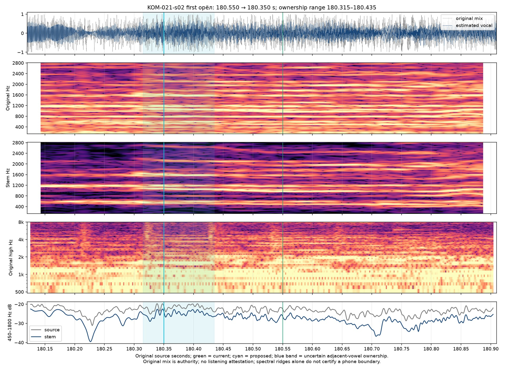

# First final-refrain eagle — Кометы v10

Current revision: `komety-preview-v10-first-final-eagle`. [Frozen inputs](preview-inputs.json). [Selected layer](../source/onset-corrections-v10.json). [V9 inputs](preview-inputs-v9.json), [ledger](timing-review-v9.md) and [browser record](browser-preview-checks-v9.md) preserve the preceding selection. **Targeted original/signal refinement; full current-revision listening acceptance and production authorization remain pending.**

KOM-021-s02, the final refrain’s first «орёл / an eagle», moves **180.550 → 180.350 s**, **200 ms earlier**, sample **7,953,435**. Preceding Словно/Like releases at this same explicit lexical handoff. Both English words “an eagle” follow the single source event; they have no guessed separate timing or eased reveal.

## Quiet descending entrance

Original-mix and estimated-vocal attenuation near180.22 precedes a changed quiet descending connected body around180.33–180.43. Select180.350 in its leading portion, before sparse reduced-initial character core180.406 and the stronger later sequence. The former180.550 split falls inside that following sequence, excluding the quieter prefix. Earlier180.250 renewal can still belong to the preceding consonant/final vowel and is rejected. Continuous adjacent vowels do not expose a silence-separated word boundary.

Both targeted signal reviewers selected180.350 within **180.315–180.435**. Agreement on a point does not turn the source, estimated vocal or cached paths into independent acoustic recordings, nor narrow their qualitative ownership uncertainty into a millisecond certificate. Original mixed audio remains authority.

The [independent proposal](eagle-180-independent.json) preserves exact samples, alternatives and cached path disagreement. Whole-stem reduced-initial paths place the initial-vowel core180.406; orthographic whole and restricted paths place it180.567/180.568 and reassign prior final-vowel ownership around180.367–180.386. Original paths misattach the sequence much later. These context/spelling variants share one family and cannot exclude an earlier source-supported quiet prefix. The estimated vocal can blur boundaries or retain accompaniment; no new model run was needed. The [compact acoustic review](eagle-180-entry-review.md) and [selected-source comparison](eagle-180-entry-comparison.png) preserve the supporting original/stem and competing path evidence.

## Preserved releases and reading lifetime

This first орёл ends at the same **182.970 s**, sample **8,068,977**, followed by the next словно at183.020. The final second орёл remains183.700–186.764988662. The whole neutral bilingual line retains its full-opacity hold and atomic next-cue handoff at187.064988662. All27 cue-final endpoints and reading windows remain unchanged. Prior132.304988662,135.700,149.480 and183.700 corrections remain intact. Initial-baseline counts stay61 changed starts and67 changed releases because this refines an already changed event.

The new recorded regression keeps Словно/Like at180.280, then requires орёл and complete “an eagle” at180.450 with the prior word neutral. [Current browser observations](browser-preview-checks.md) verify actual loaded v10 identity and full original picture in both layouts. Inspected original-frame pairs: [native180.280](eagle-180-landscape-180.280.jpg), [native180.440](eagle-180-landscape-180.440.jpg), [portrait180.280](eagle-180-portrait-180.280.jpg), [portrait180.440](eagle-180-portrait-180.440.jpg). Proofs use native25fps grid points so the original picture and scene time are inspectable together; they are not browser exports or final encoded-frame certificates.

Only one onset and its preceding release change relative to v9. Original audio/video clock, footage, meaning mapping, typography, framing and visualizer remain intact. No full film render, Desktop package, remote mutation or Actions trigger is part of this correction.
