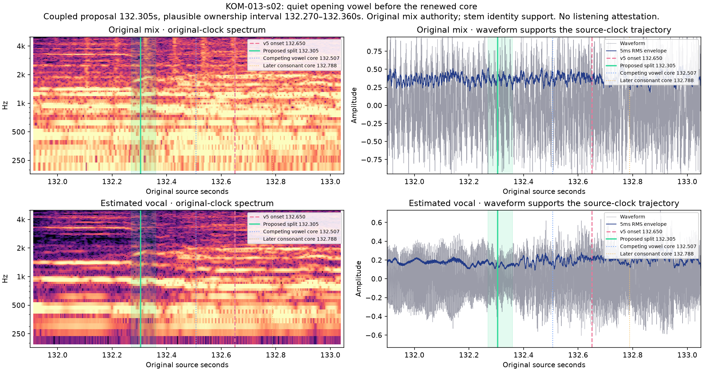

# Eagle entry — Кометы v6

Historical v6 revision: `komety-preview-v6-eagle-entry`. [Archived preview inputs](preview-inputs-v6.json). [Selected sample layer](../source/onset-corrections-v6.json). The preceding [v5 ledger](timing-review-v5.md) and [v5 input identities](preview-inputs-v5.json) remain historical. **Source/signal estimates; full human listening acceptance remains pending.**

## Selected correction

The second refrain’s first «орёл / an eagle» moves from132.650 to132.304988662 seconds: source sample **5,834,650**, approximately **345 ms earlier**. The preceding «словно / Like» ends at the same explicit lexical handoff. The selected source sample is shared by both English expansion words, without extra translation timing or anticipation.

The original harmonics and estimated vocal show a quieter connected trajectory changing around132.28–132.33. This comes before the renewed stronger body around132.50–132.65 and later consonant. Fresh four-word alignment places the initial-character core132.507, already before the rejected132.650 selection. That sparse core is still later than the quiet prefix. Selecting the core, waiting for a silence, or measuring only a louder note would omit part of the word. The selected point lies within a **132.270–132.360** plausible ownership interval, not a statistical confidence interval or millisecond perception certificate.

## Every repeated entrance

| Source event | V5 → selected onset (s) | Plausible ownership range (s) | Decision |
| --- | --- | --- | --- |
| KOM-005-s02 | 45.180 → 45.180 | 45.030–45.265 | Retain |
| KOM-005-s04 | 48.420 → 48.420 | 48.235–48.590 | Retain |
| KOM-013-s02 | 132.650 → 132.305 | 132.270–132.360 | Earlier coupled handoff |
| KOM-013-s04 | 135.850 → 135.850 | 135.705–135.960 | Retain |
| KOM-021-s02 | 180.550 → 180.550 | 180.325–180.665 | Retain |
| KOM-021-s04 | 184.090 → 184.090 | 183.685–184.170 | Retain |

The other five passages also contain possible earlier quiet trajectories. Their ownership remains ambiguous between the adjacent unstressed vowels. Each retained point carries a wider range on both sides of its shared handoff; retention does not certify the older narrow range. No fixed advance is copied between repetitions. Full per-occurrence reasons and original/stem panels are linked in [the six-decision record](eagle-entry-decisions.json).

[Fresh phone-path evidence](eagle-phone-path-review.md) preserves 24 whole-context and 48 restricted tests as correlated context/spelling observations of one cached model family. Failed occurrence assignments and stolen consonant paths are explicitly rejected. The stem can smear edges or retain accompaniment; original-source trajectories remain authority.

## Playback and preserved lifetimes

Source audio/video packets start at zero. All11,201 AAC packets were checked for continuity, with no padding/discontinuity near the reported passage or elsewhere. No source-clock offset is introduced. Focus uses the single original video's current time, with fractional sample comparisons and no eased color reveal. The complete neutral line remains at full opacity through the same reviewed hold.

Only one stored start and its paired preceding release change relative to v5. All27 cue-final lexical endpoints and their neutral holds remain unchanged. Initial-baseline counts remain61 changed starts and67 changed releases. The current all-word ledger and focus-gap table remain bound to the selected candidate. Browser checks must verify the actual loaded timeline revision and event samples after reload; an HTML badge alone cannot prove that an already-open page holds new timing.

The 132.400 source point is a regression: «орёл» and both “an eagle” words must already be active while the preceding words are neutral. The 132.250 point retains preceding-word ownership. [Archived browser observations](browser-preview-checks-v6.md) and [native132.400](eagle-entry-landscape-132.400.jpg) / [portrait132.400](eagle-entry-portrait-132.400.jpg) shared-scene proofs are recorded separately. No full film render, Desktop package or remote mutation belongs to this refinement.
