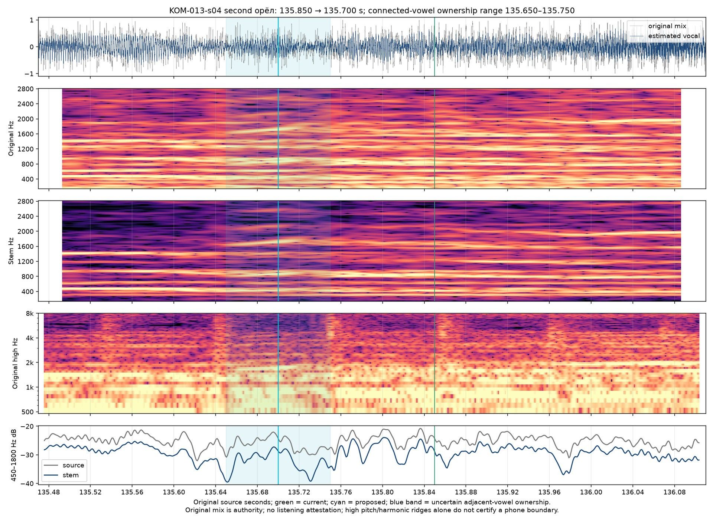

# Historical Eagle entries — Кометы v9

Historical revision: `komety-preview-v9-final-eagle-entry`. [Archived v9 frozen preview inputs](preview-inputs-v9.json). [Current selected layer](../source/onset-corrections-v9.json). The [archived v7 eagle paper](eagle-entry-review-v7.md), [v7 preview inputs](preview-inputs-v7.json), [v6 review](eagle-entry-review-v6.md), [v6 ledger](timing-review-v6.md) and [v6 identities](preview-inputs-v6.json) preserve earlier selections. The [v5 ledger](timing-review-v5.md) and [v5 input identities](preview-inputs-v5.json) remain historical. **Source/signal estimates; full current-revision listening acceptance and production authorization remain pending.**

The 149.480 s fire entrance is retained from [the archived v8 fire decision](fire-entry-review-v8.md). The earlier 132.304988662 and 135.700 s eagle corrections remain intact.

## Historical first-eagle correction in v6

The second refrain’s first «орёл / an eagle» moves from132.650 to132.304988662 seconds: source sample **5,834,650**, approximately **345 ms earlier**. The preceding «словно / Like» ends at the same explicit lexical handoff. The selected source sample is shared by both English expansion words, without extra translation timing or anticipation.

The original harmonics and estimated vocal show a quieter connected trajectory changing around132.28–132.33. This comes before the renewed stronger body around132.50–132.65 and later consonant. Fresh four-word alignment places the initial-character core132.507, already before the rejected132.650 selection. That sparse core is still later than the quiet prefix. Selecting the core, waiting for a silence, or measuring only a louder note would omit part of the word. The selected point lies within a **132.270–132.360** plausible ownership interval, not a statistical confidence interval or millisecond perception certificate.

## Historical second-eagle correction in v7

V7 revisits the second eagle of this same refrain. Its start moves135.850→135.700 s (**5,984,370 source samples**, **150 ms earlier**), with preceding словно/like releasing at the same handoff. Original/stem attenuation135.60–135.66 is followed by a changed quiet connected body135.66–135.75, before the stronger vowel body135.78–135.85. The selected ownership lies within135.650–135.750. Cached phone paths redistribute the adjacent unstressed vowels and place later cores; those inconsistent cores cannot exclude an earlier quiet prefix identified in source-focused perceptual review. This targeted feedback does not attest full-song listening acceptance.

[Targeted independent decision](eagle-second-independent.json) and [cached-path comparison](eagle-136-entry-review.md) record the point, shared release, retained138.650 final-word ending, competing model paths and uncertainty.

## Current final-refrain second eagle in v9

KOM-021-s04 moves **184.090 → 183.700 s**, source sample **8,101,170**, **390 ms earlier**. Its preceding словно/like ends at the same selected handoff. Both “an” and “eagle” share that one Russian source event. The plausible ownership range is **183.665–183.805 s**.

Original-mix and estimated-vocal narrowing around 183.53–183.61 is followed by a changed lower connected body around 183.69–183.71, continuing through 183.80. The selected quiet leading portion precedes the reduced-initial character core at 183.731. The independent proposal at 183.735 s and acoustic selection at 183.700 s differ by **35 ms**; both remain documented within overlapping ownership uncertainty. Original mixed audio is authority. Stem and cached path observations are correlated, can redistribute adjacent reduced vowels, and cannot certify a unique boundary or full listening acceptance. See [the current final-eagle review](eagle-final-entry-review.md) and [selected v9 correction](../source/onset-corrections-v9.json).

## Every repeated entrance

| Source event | V5 → current v9 onset (s) | Plausible ownership range (s) | Decision |
| --- | --- | --- | --- |
| KOM-005-s02 | 45.180 → 45.180 | 45.030–45.265 | Retain |
| KOM-005-s04 | 48.420 → 48.420 | 48.235–48.590 | Retain |
| KOM-013-s02 | 132.650 → 132.305 | 132.270–132.360 | Earlier coupled handoff |
| KOM-013-s04 | 135.850 → 135.700 | 135.650–135.750 | Earlier coupled handoff |
| KOM-021-s02 | 180.550 → 180.550 | 180.325–180.665 | Retain |
| KOM-021-s04 | 184.090 → 183.700 | 183.665–183.805 | Earlier coupled handoff |

The three retained passages also contain possible earlier quiet trajectories. Their ownership remains ambiguous between the adjacent unstressed vowels. Each retained point carries a wider range on both sides of its shared handoff; retention does not certify the older narrow range. No fixed advance is copied between repetitions. The historical six-entry v6 audit is linked in [its numerical record](eagle-entry-decisions.json); its KOM-013-s04 and KOM-021-s04 retentions are superseded by the targeted v7 and v9 layers above.

[Fresh phone-path evidence](eagle-phone-path-review.md) preserves 24 whole-context and 48 restricted tests as correlated context/spelling observations of one cached model family. Failed occurrence assignments and stolen consonant paths are explicitly rejected. The stem can smear edges or retain accompaniment; original-source trajectories remain authority.

## Playback and preserved lifetimes

Source audio/video packets start at zero. All11,201 AAC packets were checked for continuity, with no padding/discontinuity near the reported passage or elsewhere. No source-clock offset is introduced. Focus uses the single original video's current time, with fractional sample comparisons and no eased color reveal. The complete neutral line remains at full opacity through the same reviewed hold.

Historically, v7 changed the second eagle start and paired preceding release relative to v6. V9 changes only the final refrain’s second eagle start and its paired prior release relative to v8. The earlier eagle/fire corrections remain intact. All 27 cue-final lexical endpoints and their neutral holds and clears remain unchanged. Initial-baseline counts remain 61 changed starts and 67 changed releases. The current all-word ledger and focus-gap table remain bound to the selected candidate. Browser checks must verify the actual loaded timeline revision and event samples after reload; an HTML badge alone cannot prove that an already-open page holds new timing.

The 132.400 source point is a regression: «орёл» and both “an eagle” words must already be active while the preceding words are neutral. The 132.250 point retains preceding-word ownership. A second recorded regression at135.760 requires the independently performed second орёл and both “an eagle” words to be active while the prior словно/like is neutral;135.600 keeps that prior-word ownership. [V7 browser observations](browser-preview-checks-v7.md) and [v7 native135.760](eagle-second-landscape-135.760.jpg) / [v7 portrait135.760](eagle-second-portrait-135.760.jpg) shared-scene proofs are recorded separately. No full film render, Desktop package or remote mutation belongs to this refinement.

V9 playback observations are recorded separately in [current browser checks](browser-preview-checks-v9.md); the inherited v7 proofs above retain their historical scope. No full film render or listening certificate follows from sample or layout regression checks.

This archived record describes v9 only. Shared source, renderer and current-review links may advance in later revisions; the archived v9 input manifest retains the identities checked here.
