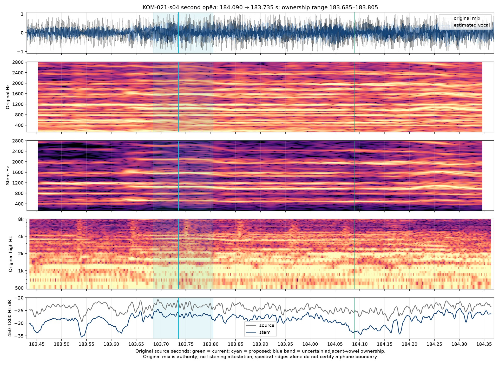

# Historical Final refrain second eagle — Кометы v9

Historical revision: `komety-preview-v9-final-eagle-entry`. [Archived v9 frozen inputs](preview-inputs-v9.json). [Selected layer](../source/onset-corrections-v9.json). [V8 inputs](preview-inputs-v8.json), [ledger](timing-review-v8.md) and [browser observations](browser-preview-checks-v8.md) preserve the preceding selection. **Targeted original/signal refinement; full current-revision listening acceptance and production authorization remain pending.**

## Selected quiet entrance

KOM-021-s04, the final refrain’s second «орёл / an eagle», moves **184.090 → 183.700 s**, **390 ms earlier**, source sample **8,101,170**. The preceding словно/like ends at the same explicit ownership handoff. Both English words “an eagle” follow that one source event; no separate translation timing, anticipation or color easing is added.

Original-mix and estimated-vocal narrowing around183.53–183.61 precedes a changed lower connected body developing183.69–183.71 and continuing through183.80. Select its leading quiet portion183.700 before the sparse reduced-vowel core183.731 and later r/e articulation sequence. The former184.090 point lies near the later attenuation/core sequence and excludes that quieter prefix. Earlier183.600 is rejected because it can still belong to the preceding nasal/final-vowel renewal. Adjacent reduced vowels have no clean silence boundary.

The acoustic review selected183.700 within183.665–183.805. The [independent proposal](eagle-final-independent.json) selected183.735011 within183.685–183.805. This **35 ms difference is retained**, not counted as unanimous sample agreement. The coordinator selected183.700 because the changed source trajectory is already developing around183.69–183.71;183.735 lies close to a sparse character core rather than its quiet leading edge. Both selections lie inside the independent interval. The final range183.665–183.805 describes plausible ownership, not statistically calibrated certainty or millisecond perception certification.

Whole-stem reduced-initial paths place the prior nasal/final vowel near183.571/183.611, initial-vowel core183.731 and r-core184.111. Ordinary and restricted paths redistribute the quiet prefix to the previous final vowel and place later initial cores183.951/184.103. Original paths that steal preceding syllables or place the core184.404/185.146 are rejected as onset authority. These are correlated context/spelling observations of one family. Estimated vocal separation can blur quiet boundaries and retain accompaniment; the original mix supplies timing authority. No fresh model run was needed. The [compact acoustic review](eagle-185-entry-review.md) and [selected-source comparison](eagle-185-entry-comparison.png) preserve the selected183.700 leading edge separately from the independent183.735 proposal.

## Preserved ending and source clock

The final орёл release remains **186.764988662 s**, sample **8,236,336**. The complete neutral bilingual line remains readable through **187.064988662 s**, then hands off atomically to the next cue at its unchanged entrance. All27 cue-final releases and reading windows remain unchanged. Earlier132.304988662/135.700 eagle and149.480 fire fixes remain intact. Baseline counts stay61 changed starts and67 changed releases because this refines an already changed event.

At183.640 the prior словно/like still owns focus. At183.800 the complete орёл/an eagle must own focus while the prior word is neutral. [Browser observations](browser-preview-checks-v9.md) verify the actual loaded revision and the complete original moving picture in both layouts. Inspected original source-frame before/after pairs: [native183.640](eagle-final-landscape-183.640.jpg), [native183.800](eagle-final-landscape-183.800.jpg), [portrait183.640](eagle-final-portrait-183.640.jpg), [portrait183.800](eagle-final-portrait-183.800.jpg). These are shared-scene source-frame proofs, not browser exports or encoded-render parity certificates.

Only one onset and its paired preceding release change relative to v8. Source audio/video clock, footage, translated meaning, typography, framing and visualizer stay intact. No full film render, Desktop package or remote mutation is authorized by this targeted correction.

This archived record describes v9 only. Shared source, renderer and current-review links may advance in later revisions; the archived v9 input manifest retains the identities checked here.
