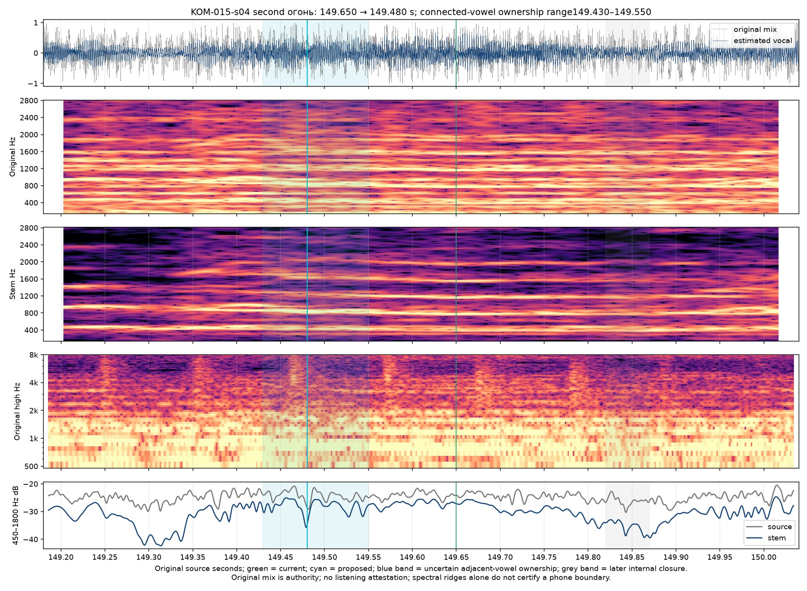

# Fire entrance — Кометы v8

Current revision: `komety-preview-v8-fire-entry`. [Archived v8 frozen inputs](preview-inputs-v8.json). [Selected correction layer](../source/onset-corrections-v8.json). The preceding [v7 timing ledger](timing-review-v7.md), [v7 inputs](preview-inputs-v7.json) and [v7 browser record](browser-preview-checks-v7.md) preserve the old selection. **Targeted source/signal refinement; full current-revision listening acceptance and production authorization remain pending.**

## Earlier quiet vowel

The second «огонь / fire» in the second refrain, KOM-015-s04, moves **149.650 → 149.480 s**, **170 ms earlier**. Its source sample is **6,592,068**. The preceding «словно / like» ends at this same explicit lexical handoff. The English word uses the same source event, with no independent translation timestamp or eased color reveal.

The original audio and estimated vocal show attenuation around149.28–149.34, a renewal near149.35, then a distinct descending/changed quiet body around149.44–149.50. That later transition supports the opening vowel. The previous149.650 point lies inside this prefix. A later attenuation around149.82–149.87 is consistent with an internal consonant, after the initial vowel has begun; it must not become the whole word's entrance. An earlier149.300 split is rejected because the renewal can still belong to the preceding consonant sequence.

The selected149.480 point lies within **149.430–149.550 s** plausible ownership uncertainty. Adjacent sung vowels do not supply an isolated silence boundary. Source-focused perceptual feedback supports reconsidering the earlier quiet trajectory; it does not certify a physically unique boundary or full-song review.

The [independent targeted decision](fire-entry-independent.json) records the sample, coupled release, unchanged final end, alternative boundary, model disagreements and limits. [Historical cached observations](vowel-handoff-proposals.json) include prior estimated-vocal nasal/final-vowel cores near149.414/149.454, later initial-vowel core149.696, consonant core149.836 and stressed vowel149.957. Original-mix paths favor substantially later parts. These paths are context-sensitive, correlated model evidence; they do not replace the original trajectory or add independent votes. No model rerun was needed for this refinement. The [compact cached-path and original/stem review](fire-150-entry-review.md) preserves the alternate ownership analysis and a sample comparison.

## Kept separate from line lifetime

The final огонь release remains **152.330 s**, sample **6,717,753**. The complete neutral bilingual line retains its reviewed full-opacity hold through154.150 and clears after the same gentle fade at154.650. All27 cue-final lexical releases and line-reading windows remain unchanged, including the two eagle corrections at132.305 and135.700. Initial-baseline counts remain61 changed starts and67 changed releases because this refines an already changed event.

The149.560 source point is the regression: огонь/fire must be active while словно/like is neutral. At149.400 the preceding word still owns focus. Browser verification must read the actual loaded v8 identity and both source sample edges after reloading. [Archived v8 browser observations](browser-preview-checks-v8.md) record the complete original picture and soundtrack in both layouts. Shared-scene before/after proofs: [native149.400](fire-entry-landscape-149.400.jpg), [native149.560](fire-entry-landscape-149.560.jpg), [portrait149.400](fire-entry-portrait-149.400.jpg), [portrait149.560](fire-entry-portrait-149.560.jpg). These show actual original source frames with the shared scene; they are not browser exports or encoded-render certificates.

This revision changes one onset and its paired prior release relative to v7. It does not alter the source audio clock, translation, source footage, typography, framing or visualizer. No full film render, Desktop package or remote mutation is part of this correction.
