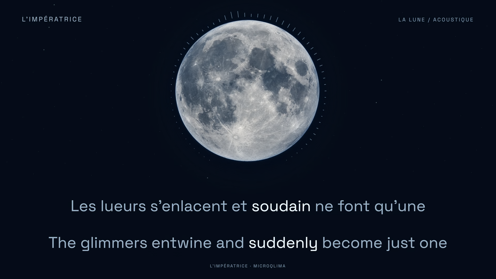

# La Lune — acoustic lunar film

**L’Impératrice · French + English · preview-v2-lunar · verified local delivery**



*Native 1920×1080 frame at 00:46.800 decoded from the verified final landscape film. Music: L’Impératrice / microqlima. AI-assisted lunar artwork and lyric presentation created for this edition.*

The complete 3:17.555 acoustic recording has 14 bilingual cues: 49 French words and 56 English words. Both 1920×1080 and 1080×1920 layouts use equal language prominence and stable color-only emphasis. English follows the corresponding French meaning; it has no invented vocal timestamps.

## Lunar direction

A newly generated silver Moon fills the upper scene, surrounded by a compact radial spectrum. Midnight, icy blue and pearl colors come from this asset. Space Grotesk replaces the earlier serif treatment; both layouts use one centered composition. The opening gradually reveals the lunar surface. Vocal energy changes its light gently, and selected instrumental attacks create faint, short halo ripples. Titles return during the substantial instrumental passages, with a final 2.5-second fade. Words and image geometry remain fixed.

See [visual decisions](PREVIEW-NOTES.md), [artwork provenance](source/moon-artwork-prompt.md) and [measured motion features](analysis/lunar-motion-manifest.json).

## Start the preview

Use Node 24 or later and the exact dependencies in the lockfile. Restore the original AAC locally as described in [source preparation](source/PREPARATION.md); the music file is intentionally absent from Git.

```sh
npm ci
npm run check
npm run preview:freeze
npm run preview
```

Open `http://127.0.0.1:4320/`. The macOS launcher `Start Preview.command` starts the same server with already installed dependencies. The recording starts paused at zero. Buttons switch between 16:9 and 9:16. Normal, 0.75× and 0.5× playback, cue navigation, waveform/spectrogram inspection and local notes support review. Optional links such as `/?t=103.5&format=portrait` open a particular moment. Review notes are local and do not confer render approval.

## Verification and review scope

| Check | Result |
| --- | --- |
| Original audio | AAC packet payloads/timestamps and decoded stereo samples match the downloaded recording |
| Source clock | 44,100 Hz; 8,712,192 samples; 11,854 frames cover the recording at 60 fps |
| Cue structure | 14 cues; all source and target words mapped; no invalid or overlapping French word intervals |
| Timing/color implementation | 542 boundary states across both formats; 4,732 visible word-color checks |
| Browser geometry/painter parity | 664 states; 5,838 glyph checks; zero failures |
| Technical playback | Portrait played from 26.7 s to completion; landscape 0.75× segment progressed without media errors |
| Actual-audio synchronization review | **Pending for every cue and both formats** |
| Production render | **Both complete 1080p60 files passed technical verification** |
| Decoded word focus | **50,372 source/target word states; zero mismatches or ambiguous states** |

The maximum nearest-frame quantization is 8.232 ms; this measures implementation rounding, not acoustic timing accuracy. Model agreement and spectrogram review support candidate timing, but do not establish perfect synchronization. All 49 French words retain `reviewRequired: true`.

[Technical checks](evidence/technical-checks.json) · [Browser geometry](evidence/browser-geometry.json) · [Playback scope](evidence/playback-smoke-check.json) · [Audio identity](evidence/source-audio-identity.json) · [Sync findings](evidence/sync-review.md) · [Review checklist](evidence/cross-language-sync-review.md) · [Semantic ledger](evidence/semantic-ledger.json)

The current preview was accepted and production explicitly authorized on 18 September 2026. The [production record](PRODUCTION-NOTES.md) separates this scoped owner acceptance from incomplete granular listening fields. `npm run render -- --production --format landscape` and the corresponding portrait command verify the approved inputs before capture. The [final sync audit](evidence/final-sync-audit.json) and [production-adapter comparison](evidence/production-adapter-equivalence.json) document the additional checks.

## Reproduction and source

- [Original acoustic upload](https://www.youtube.com/watch?v=p3E731cu_nE): L’Impératrice / microqlima, described by the artist as an impromptu winter recording.
- [Input identity](source/input-manifest.json) and [preview hashes](evidence/preview-identity.json).
- [French source text](source/lyrics-fr.json), [translation mapping](source/translation.json) and [translation decisions](source/translation-notes.md).
- [Bounded model candidates](analysis/boundary-ledger.json) and [selected adjustments](analysis/selected-boundary-decisions.json).
- [Workflow study](evidence/workflow-study.md). Methods are reused; visual choices and measured values are specific to this recording.

`npm run review:geometry` builds the browser audit at `/review/geometry.html`. `npm run stills` creates sixteen local diagnostic PNGs, not full-length films. Analysis inputs, model weights, downloaded source media, logs and generated browser bundles stay local. The bundled font retains its SIL Open Font License. Music rights remain with the original creators and are not granted by the repository license.

[Final verification and limits](evidence/final-verification.md) · [Production lessons](PRODUCTION-LESSONS.md) · [Posting assets](publishing/README.md)

## Render and verify

After restoring the source audio and installing the locked dependencies, build and bind the two lossless layer caches as described in [the render contract](PRODUCTION-NOTES.md#render-contract). Then run:

```sh
npm run render -- --production --format landscape
npm run render -- --production --format portrait
node scripts/verify-production.ts output/La-Lune-landscape-1920x1080-60fps.mp4 landscape
node scripts/verify-production.ts output/La-Lune-portrait-1080x1920-60fps.mp4 portrait
node scripts/audit-decoded-focus.ts output/La-Lune-landscape-1920x1080-60fps.mp4 landscape
node scripts/audit-decoded-focus.ts output/La-Lune-portrait-1080x1920-60fps.mp4 portrait
npm run package
```

The package step requires both final verification reports to match the actual video hashes. It creates separate YouTube and TikTok upload directories with the correct video, dedicated cover and posting copy. Full films and cache data are generated locally and excluded from Git.
