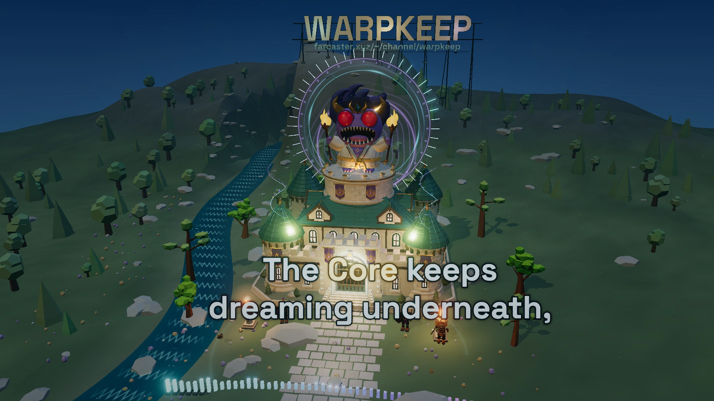

# Leave It On — Warpkeep lyric film

**English · complete recording · 16:9 YouTube and 9:16 TikTok editions · accepted preview `preview-v2-pr375`**

A real-time lyric film set around Warplet's Watch, using the exact castle, rooftop guardian and landscape from [Warpkeep PR #375](https://github.com/ael-dev3/Warpkeep/pull/375). Bright English phrases appear as a magical inscription above the forecourt. The same measured music spectrum drives luminous stone resonators and a circular rune field behind the guardian. Cyan and violet gate light, tower ribbons, warm practical lights and a physical mountain landmark give the fantasy setting its electronic treatment.

The owner reviewed the complete local preview and explicitly approved both full renders, a Desktop delivery folder and a lyrics-repository release. This is the documented **owner-approved-preview** path for this English-only song. The 343 word times remain acoustic candidates; an independently recorded every-cue listening audit has not been completed. The ordinary granular synchronization gate remains closed, and the candidate uncertainty is preserved rather than presented as phonetic certainty.

[Published release and videos](https://github.com/ael-dev3/lyrics/releases/tag/leave-it-on-warpkeep-v1.0.0) · [Production and delivery record](PRODUCTION-NOTES.md) · [Fresh-download receipt](evidence/release-upload-verification.json) · [Publishing kit](publishing-kit/README.md) · [Start and reproduce](WORKFLOW.md) · [Art direction](STORYBOARD.md) · [Audio/timing uncertainty](analysis/README.md) · [Asset provenance](ASSETS.md) · [Acceptance scope](review/owner-acceptance.json)



[Final portrait film frame](evidence/final-portrait-105.000.png) · [Current visual/interaction and encoded-file evidence](evidence/README.md)

## Editions and delivery

The same frozen scene and original source clock drive the two 60 fps productions. The posting MP4s use H.264 video, BT.709 color and high-bitrate AAC for platform compatibility. Separate Matroska archival masters pair the same picture with packet-preserved original stereo Opus audio. The supplied `.m4a` master is kept unchanged and is part of the editable source archive. Posting AAC is a documented transcode, not a byte-identical copy of the Opus packets.

| Edition | Native picture | Final posting file |
| --- | ---: | --- |
| YouTube | 1920 × 1080 | `Leave-It-On-Warpkeep-YouTube-1920x1080-60fps.mp4` |
| TikTok | 1080 × 1920 | `Leave-It-On-Warpkeep-TikTok-1080x1920-60fps.mp4` |

The local Desktop handoff is **`Leave It On - Warpkeep`**, with `YouTube`, `TikTok`, and `Source & Verification` folders. Its [publishing kit](publishing-kit/README.md) supplies platform titles, descriptions or captions, tags, a YouTube thumbnail, and both TikTok profile and full-frame covers. The source ZIP is assembled from exact merged commit `4c94cd871c5765ccfd71a94cbfc32fb9336953ed` plus frozen, hash-checked local audio and game assets; large media stay out of ordinary Git history. [Release `leave-it-on-warpkeep-v1.0.0`](https://github.com/ael-dev3/lyrics/releases/tag/leave-it-on-warpkeep-v1.0.0) contains the same 17 files. Every release asset matched both the Desktop copy and a fresh download; see the [publication receipt](evidence/release-upload-verification.json). No YouTube or TikTok platform post is represented by the prepared copy.

## Open the complete preview

From this project directory, with its authorized local soundtrack and asset inputs present:

```sh
npm ci
npm run check
npm run preview:start
```

Open [the local preview](http://127.0.0.1:4392/). It starts paused at 0:00 in portrait. Select YouTube 16:9 or TikTok 9:16; both use the same original source clock. `npm run preview:start` starts a detached server, checks the exact preview page title before reporting readiness, and logs to `output/preview-server.log`. Re-running it recognizes an existing matching instance. The server binds to loopback and remains available after the launch command exits. Use `PORT=4393 npm run preview:start` for another local port. `npm run preview` is the optional foreground command.

The preview includes play/pause, restart, scrubbing, chapter and cue navigation, 1×/0.75×/0.5× speed, sound control, cinema view, effects and lyrics comparison toggles, reduced motion, timestamped review notes and note export. **Restore visuals** rebuilds the scene while preserving source position and existing notes. Errors identify missing local input rather than substituting a poster. The full soundtrack continues through its original ending.

## Current picture and typography

The PR castle retains its original limestone, oak, teal roofs, gold details, eight native emblem-bearing cloth panels and embedded materials. The separate 12-joint Warplet retains the +12 world-Y rooftop seating relationship and its authored Idle and Torch Salute actions. Honor guards, a lamplighter, rabbit, trees, birds and fire support the inhabited scene. Camera movement returns to recognizable views of this same place.

The lyric installation is authored for the film. Its transparent, camera-facing inscription stays at a fixed world anchor for each format, with a restrained matching projection onto the paving. It has no opaque plaque and does not replace the original crest or pretend to be text painted on a source wall. Complete phrase geometry is reserved before focus changes; active words turn warm ivory-gold while inactive words remain pale cyan. A dark contour protects the letters against the moving castle and glow. Layout adapts each complete phrase to its composition without resizing the currently sung word.

Two measured 48-band instruments make the response obvious: a cyan/violet forecourt arc and short radial rune segments around the guardian's circular ward. Their input is the recording's shared 25 Hz spectrum, not random motion. Additional magic traces the actual gateway, sends bounded ribbons and sparse light motes upward beside the towers, and colors the existing practical light and river. The gate trace, particle routes and circular field reconstruct from source time after arbitrary seeks. The circular field keeps one center behind the guardian; the subject's occlusion does not split it into separate effects.

A fixed **WARPKEEP** sign uses actual extruded Space Grotesk letter meshes, steel braces and stone footings on the north mountain. Its lower physical lettering reads `farcaster.xyz/~/channel/warpkeep`. The sign and a normal HTML link open the exact [Warpkeep Farcaster channel](https://farcaster.xyz/~/channel/warpkeep). It is an authored film landmark, not a claim that the PR source already contains it. Neither the sign nor the castle scales with the bass.

## Source, text and measured response

| Item | Current record |
| --- | --- |
| Original master | `source/Leave It On.m4a`, 4,448,680 bytes |
| Master SHA-256 | `376926ae77af41789ac620685dd15b5e1515e3777aece65e964463277e5cfe44` |
| Actual soundtrack codec | Stereo Opus, 48 kHz, despite the `.m4a` extension |
| Declared master duration | 273.560 seconds |
| Local browser playback | Opus stream copy in `source/leave-it-on.opus.webm`; declared 273.568 seconds |
| Native decoded length | 13,131,528 samples per channel, 273.5735 seconds |
| Current acoustic map | 63 line cues, 343 independently represented word events; all pending listening review |
| Measured features | 13,679 frames at 50 Hz: RMS, low, mid, high and attack |
| Measured spectrum | 6,840 frames at 25 Hz; 48 log-spaced bands from 45 Hz to 10 kHz, quantized 0–255 |

The master and browser remux preserve the same compressed audio packet payload and FFmpeg-decoded PCM. Their container timestamps differ; the preview follows the selected audio element's presentation clock without a manually added offset. The [source inspection](analysis/source-inspection.json) records Opus pre-skip, packet timestamps, tail and exact hashes. This does not substitute for browser onset/tail listening.

Unforced recognition and multiple CTC/attention alignments informed the candidate text and boundaries. The preserved 67-line embedded reference lists extra compressed first-chorus repetitions; the current model-supported candidate contains two refrain pairs there, retaining the omitted reference entries unchanged in source evidence. Proper names keep their supplied spelling. The Farcaster entrance, repeated refrains, processed echoes and every final release remain explicit review questions. Words are never distributed evenly across captions or snapped to musical attacks.

The spectrum uses one full-recording reference for every band; quiet passages are not independently amplified to maximum. Acoustic word focus, line visibility, measured energy, authored camera paths and semantic-effect tails have separate data ownership. The [analysis method](analysis/README.md) records the windows, models, limitations, filtering, normalization and reproduction commands.

## Exact PR asset identity

The selected game source is [`75934520a8dc295c8b68d4c8c197785299e2ff0b`](https://github.com/ael-dev3/Warpkeep/tree/75934520a8dc295c8b68d4c8c197785299e2ff0b), branch `codex/verdant-title-menu`. The archived source and the music-film staging are distinct from a released game build.

| Selected local asset | SHA-256 |
| --- | --- |
| `public/assets/pr375/castle.glb` | `c55f2c6c610e4aacddde58e485156c85629dd0a2eab88fad65652c317ae59088` |
| `public/assets/pr375/guardian.glb` | `e934a81ae2a210e495675aff99293aebc60cebb1a42603c9d99351db43d9e602` |
| `public/assets/pr375/hegemony-emblem.png` | `26e8664b1db0acf3e6db443caf46ef13e45fe9de794749e431b7c2e3d6fb8774` |

The [complete PR asset manifest](source/asset-provenance/pr375/manifest.json) includes all nine selected files, original paths, byte sizes, hashes and animation metadata. The [asset ledger](ASSETS.md) also records exact landscape source, dimensions, native facade measurements, original source terms and the earlier superseded selection. Source GLBs, materials, UVs, pivots and rig hierarchies remain unchanged. Film camera, illumination, procedural magic, lyric carrier and mountain sign are new presentation code.

Space Grotesk supplies the primary lyric and sign lettering; Cormorant Garamond supplies the review page's contrasting display type. Both are distributed with their SIL Open Font License 1.1 notices under `public/fonts/`. The mountain sign uses a weight-700 subset derived from the included Space Grotesk outlines, preserving its letter designs and source hash. Three.js is pinned to 0.185.1 in the package lock.

## Review and production boundary

Automated checks cover source/asset integrity, all cue and word intervals, measured-data contracts, exclusive releases and neutral gaps, exact semantic selectors, deterministic reconstruction, and stale/missing production bindings. The actual guardian rig also has direct versus nonsequential-seek pose checks. Such checks establish the behavior of the candidate map and code; they do not establish phonetic accuracy or a successful whole-song visual review.

Complete independent listening remains an open quality record for every cue, repeated performance, difficult proper name, possible late echo and final voice/music tail. The owner accepted the complete picture in both formats; that acceptance is recorded separately from granular phonetic review. Browser stills under `evidence/` illustrate the accepted preview, while decoded-frame checks of the final encoded files belong to the production verification receipts.

The standard `npm run render` synchronization gate stays closed on those open listening fields. The specifically approved production adapter in `scripts/render-production.mjs` instead requires the frozen preview identity, this song's owner acceptance and both-format render parity. A short encoded diagnostic was checked before full capture. `scripts/verify-production.mjs` checks final frame count, full decode, geometry, color tags, posting AAC and archival original-Opus packet identity; `scripts/package-delivery.mjs` verifies the committed source and final assets before copying the Desktop kit. See [PRODUCTION-NOTES.md](PRODUCTION-NOTES.md) for what was actually completed and where remaining uncertainty lives.

The supplied audio, estimated stems and local GLBs are excluded from ordinary Git commits. The release source archive and final media have separate checksums. Public source documentation retains provenance and evidence limits; the Warpkeep asset records are specific use/distribution records, not a blanket open-content license. No game deployment, account assignment, player-data operation or YouTube/TikTok posting is part of this production.
