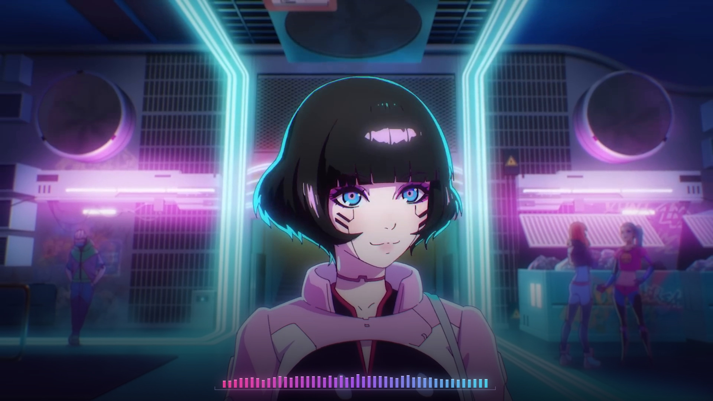

# Dawid Podsiadło — Let You Down

**Status: preview in production. Word timing is waiting on the local lyric text, so there is no listening review and no render authorization.** The complete scene system, measured light, shot map, preview player, render gate, final-file verifiers and posting covers are built and tested. Timing alignment runs once the supplied lyric text is saved locally as `source/lyrics.local.txt` (see [Lyric text stays local](#lyric-text-stays-local)). No production render exists.

Source: [Cyberpunk: Edgerunners — Ending Theme | Let You Down by Dawid Podsiadło | Netflix](https://www.youtube.com/watch?v=BnnbP7pCIvQ) (official CD PROJEKT RED upload; music video directed by Ilya Kuvshinov, produced by STUDIO MASSKET).



*Native-renderer preview frame at 00:27.000 (intro, before the first vocal). The original picture is unchanged except for its own neon tubes glowing with the measured music, plus the small spectrum. Frames with lyrics are kept out of the repository because the lyric text stays local. [Portrait frame](evidence/preview-portrait-27.000.jpg).*

## What this edition does

- **The original music video stays the picture.** Landscape keeps the full 1920×1080 frame. Portrait uses 92 reviewed shots: subject-centred crops (including authored pans), and full-frame fits for the video's own title cards, dialogue boxes, Securicine files, upload screens, logos and credits. See the [visual brief](VISUAL-BRIEF.md).
- **The city's neon is the visualizer.** Bright, saturated source pixels brighten with the band family that matches their hue: magenta with the low end, violet with low-mids, amber with mids, cyan with the highs. Protected shots (lettering, logos and credits) receive no added light.
- **A compact cyberdeck spectrum.** 48 square-ended bars on a hairline rail sit at a fixed anchor per format. Section tiers set their reach: restrained verses, fuller choruses, and the strongest response in the instrumental drop.
- **Lyric type.** The type is Oswald Bold, leaning forward like the film's UI lettering, with stable glyphs and colour-only focus. Verses light cyan and choruses light Edgerunners yellow; sung words stay bright white and unsung words soft lilac-white. Over the white flashback frames, a measured picture-tone track switches the type to dark ink with magenta focus.
- **Three meaning-linked effects:**
  - the two neon words strike like pink neon tubes;
  - the fire words burn with vocal-energy flames;
  - the title hook's final word ends each chorus and outro phrase with a short cyan/magenta signal-drop afterimage.

  Each effect is selected by exact word ID plus its expected word, with a tested negative case.

## Lyric text stays local

This project deliberately keeps the song's lyric text out of the repository and out of every committed file. The supplied text lives only in `source/lyrics.local.txt`, which is ignored by Git. Committed data refers to words only by ID (`L07-W06`) and to the text only by the SHA-256 of its normalized form. The preview and renderer read the local file at runtime and refuse to show lyrics if its hash differs from the timeline's. Diagnostics and public screenshots use neutral lorem-ipsum placeholders (`?text=placeholder` in the preview, `--placeholder` in native tools).

**File format:** UTF-8, one sung line per line (blank lines between stanzas are optional), with backing vocals in parentheses. This edition's section map expects the 40-line text supplied for the commission. Save that text exactly as supplied; `npm run check` confirms the binding.

## Run it

Use Node.js 24 with native TypeScript, plus `ffmpeg` and `ffprobe`. Timing analysis also needs a Python 3.13 environment with the packages listed in [analysis/requirements.txt](analysis/requirements.txt) (CUDA optional).

```sh
# 1. Restore the locked source (ignored by Git) and confirm its identity
yt-dlp -f '137+140' --merge-output-format mp4 -o 'public/source.%(ext)s' 'https://www.youtube.com/watch?v=BnnbP7pCIvQ'
npm ci && node scripts/check.ts --local-media

# 2. Save the supplied lyric text to source/lyrics.local.txt, then align (IDs only)
python analysis/separate_stems.py        # HTDemucs vocal stem (analysis input only)
python analysis/align_candidates.py      # MMS, English wav2vec2 and Whisper observations
python analysis/select_timing.py         # documented selection rules
node scripts/build-timeline.ts           # public/timeline.json (no lyric text)

# 3. Review preview
npm run check
npm run preview                          # http://127.0.0.1:4331/
```

The review player offers:

- play/restart, precise seeking, and line-by-line stepping (← / →);
- 1×, 0.75× and 0.5× speed, and 16:9 / 9:16 switching;
- a muted source reference and a **Restore preview** control;
- a word-timing panel showing basis, spread and priority flags;
- review notes that stay in your browser.

Check real picture motion after a fresh load, after seeking and after switching formats; an advancing clock alone is not enough.

## Production (after review and authorization only)

```sh
node scripts/render-gate.ts                                   # refuses until review + authorization bind current inputs
npm run render:production -- --format landscape
npm run render:production -- --format portrait
node scripts/verify-final.ts                                  # decode, 60 fps grid, AAC packets + PCM identity, black intervals
node scripts/verify-word-focus.ts --format landscape          # encoded glyph focus + negative control
node scripts/verify-word-focus.ts --format portrait
node scripts/make-captions.ts                                 # optional SRT/VTT, local only
node scripts/package-delivery.ts                              # Desktop posting kit, re-hashed
```

The gate binds 15 presentation inputs, including the compiled preview client and the local lyric text's normalized hash. It requires a complete actual-audio review (every cue, both formats, normal and reduced speed, picture motion, nothing unresolved) and an explicit render authorization for the same revision. `--proof` renders (≤ 8 s) and stills are diagnostics with placeholder words; they are not production.

## Locked source

| Field | Value |
| --- | --- |
| YouTube ID | `BnnbP7pCIvQ` (streams `137+140`, merged without retiming) |
| File | `public/source.mp4`, 74,252,984 bytes |
| SHA-256 | `c384e814edfaaf22a944101a0d1a73661bb63a83ad304fc79c5953a00c51010c` |
| Picture | H.264 High, 1920×1080, `24000/1001` fps, 6,794 frames, BT.709 limited range |
| Sound | AAC-LC stereo 44.1 kHz, 283.422766 s (56.3 ms beyond the last picture) |

Full identity, packet and PCM hashes: [evidence/source-identity.json](evidence/source-identity.json). The film holds the last picture through the audio tail and stream-copies the original AAC packets.

## Evidence and limits

| File | What it establishes |
| --- | --- |
| [evidence/source-identity.json](evidence/source-identity.json) | Exact source bytes, streams, frame count, packet and decoded-PCM hashes |
| [evidence/audio-features-audit.json](evidence/audio-features-audit.json) | 60 Hz measured features, including the vocal-activity map used for section tiers before timing exists |
| [analysis/shot-map.json](analysis/shot-map.json), [src/shots.ts](src/shots.ts) | 150 cut candidates reviewed into 92 shots |
| [evidence/cover-assets.json](evidence/cover-assets.json) | Cover source frame and file hashes |
| [evidence/review-status.json](evidence/review-status.json) | Current status by stage; nothing beyond "preview technically working" is claimed |

Structural tests, gate tests and a 6 s placeholder proof passed. The proof passed container/cadence verification and an encoded-focus check with 38/38 glyphs correct and a 10/10 negative control. None of these establishes acoustic word timing, perceived sync or artistic quality. Those need the listening review of the complete preview.

[Visual brief](VISUAL-BRIEF.md) · [Timing method](TIMING.md) · [Asset provenance](ASSET-PROVENANCE.md) · [Agent handoff](AGENT-HANDOFF.md) · [Posting assets](publishing/README.md)
