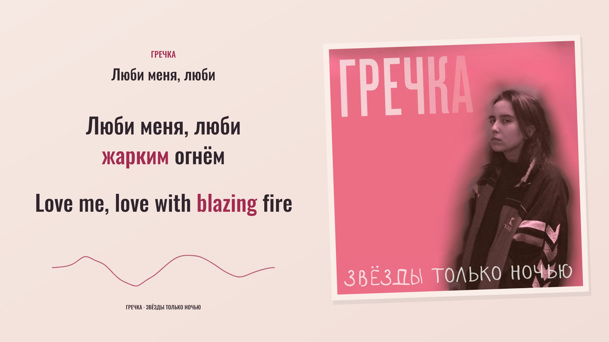

# Гречка — Люби меня, люби

**Russian / English review preview · `preview-v2-rose-paper` · production not authorized.**

A full-recording, 187.402-second preview with 33 lyric cues, 147 Russian word events and 167 English words. Landscape and portrait use equal bilingual typography, stable color-only highlighting and the same original soundtrack. Word timings remain provisional: complete actual-audio listening and audiovisual review are pending.



*Rendered preview reference at 00:33.200, revision v2, 1920×1080. The shared scene supplies the graphics; the unchanged source image is composited at its exact fixed transform. This is a still reference, not a browser capture or a frame decoded from a production film. Original recording and album artwork: Гречка and their respective creators.*

## Picture and sound

The [selected official upload](https://www.youtube.com/watch?v=DBGCHjBSNzo) identifies Гречка and the album **Звёзды только ночью**. Its album picture is visually static in the inspected samples. The composition presents it as a stationary print, tilted −2° on warm rose paper with a pale sleeve edge and a soft offset shadow. Paper texture and generous reading space support the original portrait.

Both languages use Oswald Medium at equal size and weight: dark ink for resting text and berry for current meaning. A single smooth ribbon responds to 64 measured frequency bands, with immediate attack and a short decay. Its shape is an artistic spectrum display, not a physical waveform. The artwork remains mounted across lyric changes; picture geometry is composed separately for 1920×1080 and 1080×1920.

The original stereo AAC is retained at 44.1 kHz. All 8,073 packet payloads, timestamps and durations match the source video. Source URLs, byte identities and the distinction between presented duration and decoded sample extent are recorded in the [media manifest](source/media-manifest.json).

## Open the preview

Use Node.js 24 or later. On a fresh checkout, run `npm ci` in this project directory and supply the hash-matched local media recorded in the manifest.

With the documented local media and dependencies present, double-click **Start Preview.command**, or run from this project directory:

```sh
npm run review:build
node scripts/freeze-preview.ts
REVIEW_PORT=4324 node scripts/review-server.ts
```

Open [the local review preview](http://127.0.0.1:4324/). It starts at the beginning and includes seeking, restart, 16:9 / 9:16 switching, 0.75× / 0.5× playback, cue inspection and saved notes. **Restore visuals** reconnects the full composition at the current position. The source media are local preparation assets; a source checkout alone does not contain the soundtrack.

`npm run preview` rebuilds the client and starts the same server. After changing inputs, run the explicit build-and-freeze sequence above so the manifest includes the newly compiled client. Changed inputs invalidate previous review flags. Missing required media or an incomplete identity prevents preview readiness.

## Review status

| Area | Current status |
| --- | --- |
| Translation and correspondence | Model-assisted editorial review and independent semantic regression expectations recorded |
| Acoustic timing | Bounded original-mix and vocal-stem candidates retained; every word still requires listening review |
| Complete recording and both layouts | Pending actual-audio and audiovisual review |
| Production authorization | Absent; preview-only |
| Final films and posting kit | Not produced |

Check short conjunctions, held vowels, all four bridge repetitions and the final vocal release. The supplied lyric inventory and model agreement cannot certify full vocal coverage or perfect synchronization. See [timing evidence and questions](evidence/timing-review.md), [translation decisions](evidence/translation-review.md) and the [current synchronization record](evidence/cross-language-sync-review.json).

The [instrumental-phrase refinement](evidence/phrase-focus-refinement.json) keeps “with blazing” together on «жарким», followed by “fire” on «огнём», across all four occurrences. It preserves the acoustic events and word geometry.

The [full correspondence scan](evidence/correspondence-scan.json) refines six verse cues to **Те / Those**, then **же / same**. It checks complete English expressions and all repeated patterns while preserving necessary English word-order changes and every acoustic event.

Run `npm run check` for TypeScript, semantic and authorization tests. `npm run sync:gate` is expected to reject the pending review. `npm run render` cannot produce a film: it checks the gate and this edition has no production renderer.

## Reproduction and credits

[Workflow and evidence boundaries](WORKFLOW.md) · [Frozen preview inputs](evidence/preview-identity.json) · [Mandatory preview-first workflow](../../docs/preview-before-render.md)

Original recording and album artwork: Гречка and their respective creators. Font: the Oswald Project Authors, distributed under the [SIL Open Font License 1.1](public/fonts/Oswald-OFL.txt). Translation mapping, timing preparation, preview composition and review tooling are additional project work. Local preview preparation does not constitute public media release or platform upload.
