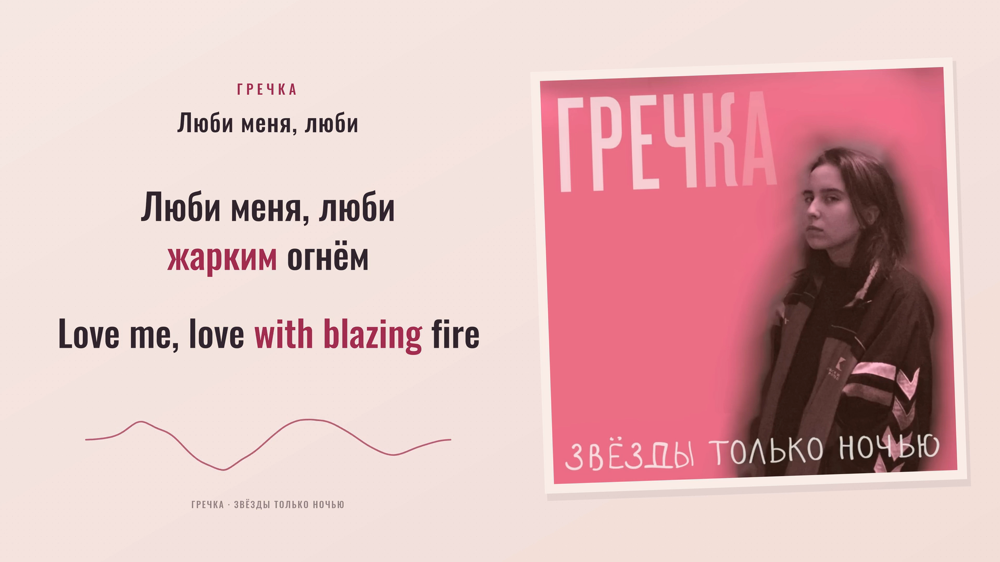

# Гречка — Люби меня, люби

**Russian / English · rose paper edition v1.0.0 · verified YouTube and TikTok films.**

A full-recording, 187.402-second film with 33 lyric cues, 147 Russian word events and 167 English words. Landscape and portrait use equal bilingual typography, stable color-only highlighting and the same original soundtrack. The unchanged preview inputs received comprehensive human listening and audiovisual review, followed by explicit render authorization. Model candidates and their uncertainty remain documented separately.



*Frame 1992 at 00:33.200, decoded directly from the verified v1 landscape film. Original recording and album artwork: Гречка and their respective creators.*

## Picture and sound

The [selected official upload](https://www.youtube.com/watch?v=DBGCHjBSNzo) identifies Гречка and the album **Звёзды только ночью**. Its album picture is visually static in the inspected samples. The composition presents it as a stationary print, tilted −2° on warm rose paper with a pale sleeve edge and a soft offset shadow. Paper texture and generous reading space support the original portrait.

Both languages use Oswald Medium at equal size and weight: dark ink for resting text and berry for current meaning. A single smooth ribbon responds to 64 measured frequency bands, with immediate attack and a short decay. Its shape is an artistic spectrum display, not a physical waveform. The artwork remains mounted across lyric changes; picture geometry is composed separately for 1920×1080 and 1080×1920.

The original stereo AAC is retained at 44.1 kHz. All 8,073 packet payloads, timestamps and durations match the source video. Source URLs, byte identities and the distinction between presented duration and decoded sample extent are recorded in the [media manifest](source/media-manifest.json).

## Open the preview

Use Node.js 24 or later. On a fresh checkout, run `npm ci` in this project directory and supply the hash-matched local media recorded in the manifest.

With the documented local media and dependencies present, double-click **Start Preview.command**, or run from this project directory:

```sh
npm run review:build
node scripts/freeze-preview.ts
REVIEW_PORT=4324 node scripts/review-server.ts
```

Open [the local review preview](http://127.0.0.1:4324/). It starts at the beginning and includes seeking, restart, 16:9 / 9:16 switching, 0.75× / 0.5× playback, cue inspection and saved notes. **Restore visuals** reconnects the full composition at the current position. The source media are local preparation assets; a source checkout alone does not contain the soundtrack.

`npm run preview` rebuilds the client and starts the same server. After changing inputs, run the explicit build-and-freeze sequence above so the manifest includes the newly compiled client. Changed inputs invalidate previous review flags. Missing required media or an incomplete identity prevents preview readiness.

## Review status

| Area | Current status |
| --- | --- |
| Translation and correspondence | Model-assisted editorial review and independent semantic regression expectations recorded |
| Acoustic timing | Bounded original-mix and vocal-stem evidence retained; comprehensive human review recorded |
| Complete recording and both layouts | Complete by explicit human attestation for the frozen input identity |
| Production authorization | Recorded for the exact reviewed preview inputs |
| Final films and posting kit | Both films verified; complete 14-file Desktop posting kit copied and checksummed |

Review priorities included short conjunctions, held vowels, all four bridge repetitions and the final vocal release. The supplied lyric inventory and model agreement alone cannot certify full vocal coverage or perfect synchronization. See [timing evidence and questions](evidence/timing-review.md), [translation decisions](evidence/translation-review.md) and the [current synchronization record](evidence/cross-language-sync-review.json).

The [instrumental-phrase refinement](evidence/phrase-focus-refinement.json) keeps “with blazing” together on «жарким», followed by “fire” on «огнём», across all four occurrences. It preserves the acoustic events and word geometry.

The [full correspondence scan](evidence/correspondence-scan.json) refines six verse cues to **Те / Those**, then **же / same**. It checks complete English expressions and all repeated patterns while preserving necessary English word-order changes and every acoustic event.

## Render and verify

The production renderer reuses the frozen scene and source-linked focus at 2× dimensions, then performs one Lanczos reduction to 1920×1080 or 1080×1920. H.264 High-profile video uses 60 fps, CRF 16 and limited-range BT.709. The original AAC is copied without trimming, normalization or re-encoding; MP4 metadata precedes the media for fast loading.

The native SVG decoder omits embedded images and some static text attributes. Explicit adapters preserve the original picture transform and metadata spacing/opacity, with separate native-browser inspection and short encoded proofs. Cached/shared-scene raster agreement is supporting evidence, not a claim of browser pixel equality. See [renderer adoption](evidence/render-adoption.json).

```sh
npm run check
npm run sync:gate
npm run render:proof -- landscape
npm run render:proof -- portrait
npm run render -- landscape
npm run render -- portrait
node scripts/verify-production.ts output/Lyubi-Menya-Lyubi-landscape-1920x1080-60fps.mp4 landscape
node scripts/verify-production.ts output/Lyubi-Menya-Lyubi-portrait-1080x1920-60fps.mp4 portrait
node scripts/audit-decoded-focus.ts output/Lyubi-Menya-Lyubi-landscape-1920x1080-60fps.mp4 landscape
node scripts/audit-decoded-focus.ts output/Lyubi-Menya-Lyubi-portrait-1080x1920-60fps.mp4 portrait
node scripts/extract-delivery-proofs.ts
```

Production requires the current gate, renderer parity and native-browser adoption records. Output files are never silently overwritten. Changing a renderer or verification script requires refreshing its bound evidence. The technical verifier checks the complete frame clock and decode, original AAC packets and decoded PCM; the separate focus audit inspects visible word colors, lyric gaps and original picture presence on every decoded frame.

[Posting assets and optional captions](publishing/README.md) · [Production lessons](PRODUCTION-LESSONS.md) · [Human review and render authorization](evidence/render-authorization.json)

## Verified delivery

| Video | Dimensions | Frames / cadence | File size |
| --- | --- | --- | --- |
| YouTube | 1920×1080 | 11,245 / 60 fps | 27,573,157 bytes |
| TikTok | 1080×1920 | 11,245 / 60 fps | 29,329,059 bytes |

Both final H.264 files pass complete decoding, constant presentation timestamps, square-pixel/BT.709 checks and fast-start placement. All **8,073 original AAC packets**, their timing and priming information, and the decoded **8,265,152 samples per channel** remain identical. Video duration is 187.416667 seconds, the 60 fps frame extent covering the 187.401995-second presented audio.

The independent decoded-focus audit checks **90,306 visible word states per format**, all 33 cues and all 314 displayed source/target words in active and resting states. It finds zero mismatches, ambiguous colors or stale lyrics in gaps. The original picture is present on all 11,245 frames. These are encoded-display and media-integrity checks; comprehensive listening approval is recorded separately as human attestation.

The posting kit contains platform-specific videos, a 1920×1080 YouTube thumbnail, a 1200×1600 portrait TikTok profile cover, both titles/descriptions, three optional SRT files, a manifest and checksums. Every one of the 14 Desktop files matches the verified kit. Source, publishing assets, workflow and evidence are tracked here; no platform upload or public media release was performed.

[Delivery receipt](evidence/delivery-receipt.json) · [Desktop copy receipt](evidence/desktop-delivery-receipt.json) · [Decoded final screenshots](evidence/final/manifest.json) · [Final visual review](evidence/final-visual-review.json)

## Reproduction and credits

[Workflow and evidence boundaries](WORKFLOW.md) · [Frozen preview inputs](evidence/preview-identity.json) · [Mandatory preview-first workflow](../../docs/preview-before-render.md)

Original recording and album artwork: Гречка and their respective creators. Font: the Oswald Project Authors, distributed under the [SIL Open Font License 1.1](public/fonts/Oswald-OFL.txt). Translation mapping, timing preparation, preview composition and review tooling are additional project work. Local preview preparation does not constitute public media release or platform upload.
