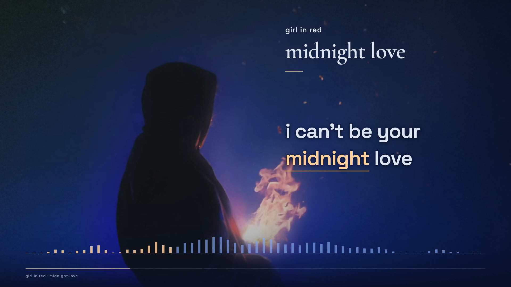
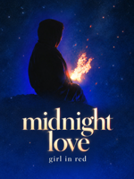

# girl in red — midnight love

A lyric film built around the official video's hooded silhouette, moving flame and blue night sky. Large English words hold a stable reading position; pale-gold focus follows the sung words or explicit connected-word groups. The landscape and vertical compositions preserve the original source animation and share one soundtrack and lyric timeline.



## Deliverables

| Asset | Specification |
| --- | --- |
| YouTube film | 1920×1080 · 16:9 · 60 fps · H.264 High / AAC |
| TikTok film | 1080×1920 · 9:16 · 60 fps · H.264 High / AAC |
| Timeline | 193.8535 s retained audio · 11,632 delivery frames |
| Lyrics | 32 cues · all 151 supplied words · 132 focus groups |
| YouTube thumbnail | 1920×1080 JPEG |
| TikTok profile cover | **1200×1600 portrait**, 3:4 width:height |
| Publishing kit | Titles, concise descriptions, English SRT captions and verification reports |

The song is already in English, so English is the primary lyric layer. An additional translation lane is unnecessary. No pronunciation or singing-guide material is included.

## Original creators

**girl in red** — [original song and visual](https://www.youtube.com/watch?v=9256X67IQdQ), [official listening links](https://girlinred.ffm.to/midnightlove-single), [artist website](https://www.worldinred.com), [source channel](https://www.youtube.com/channel/UCwlHDQ83jgF1crd6XXzSmIA).

The original upload, dated 14 April 2020, credits the photograph to **Fabian Fjeldvik**. That photograph credit does not establish separate authorship of every animated element. This project retains the official upload's visual footage and recording. [Source identity, tool versions and input hashes](source.json).

Lyric presentation and additional motion: **Ael / Lyrics workflow**, assisted with **OpenAI Codex (GPT-6 Astra)**. The covers are AI-assisted adaptations using the source visual as a reference; the image tool did not expose its model version. Exact prompts and selected generated originals are retained.

We do not take credit for the original music, lyrics, performance, recording or imagery. The repository's [scoped CC BY 4.0 license](https://github.com/ael-dev3/lyrics/blob/main/LICENSE.md) covers only contributions we have authority to license. It does not cover the original works, complete films or source-derived cover imagery. Source credits do not imply endorsement or rights clearance.

## Timing method and limits

1. Preserve the supplied English text, normalizing apostrophes and display capitalization. Decode the source once to a 48 kHz sample clock; derive 16 kHz model inputs without moving timeline zero.
2. Separate a vocal analysis stem with Demucs. Run full-track Whisper/stable-ts attention alignment on the mix and vocal stem to locate phrases. Reject gap absorption and held-word drift as final timing authority.
3. Refine 32 bounded phrases with MMS-FA on both mix and vocals, an independent English wav2vec2 acoustic encoder, and bounded Whisper attention on vocals. Retain each observation, not just selected timestamps.
4. Use vocal MMS contacts as the primary path, with explicit corrections supported by independent observations and visible vocal-envelope boundaries. Group very short vowels and connected words where isolated flashes would imply unsupported precision. Resolve two phrase overlaps explicitly.
5. Keep the two choruses independently aligned. Separate waveform-correlation searches produced low similarity and did **not** justify copying or shifting their cue timestamps.
6. Check source-text coverage, ordered positive intervals, complete focus-group coverage, presentation windows and nearest-frame conversion. Both editions use the same finalized cue data.

[Final cues](src/cues.json) · [Candidates and selection decisions](analysis/alignment-decisions.json) · [Phrase windows](analysis/windows.json) · [Repeated-phrase evidence](analysis/repeated-vocal-correlation.json) · [Timing checks](evidence/timing-checks.json).

**Review limits:** 8.3125 ms is the maximum nearest-frame quantization error at 60 fps, not a bound on acoustic alignment accuracy. Short sung vowels, the second chorus's “In / this” transition, and held/reverberant endings retain uncertainty. The record includes model comparisons, waveform observations, layout checks and selected decoded-frame review. It does not claim native-listener or human audition of every word. The second chorus near 105.6 s and the sustained endings near 70 s and 119 s remain useful checkpoints for a future listening review.

## Visual and audio design

- Preserve the official moving flame and source grain. The source is nominally 24 fps; its existing motion is sampled on the 60 fps delivery clock. Camera movement, lyric focus, added embers and spectrum graphics are newly rendered at 60 fps. No optical-flow interpolation or recovered source detail is claimed.
- Draw the palette from the source: midnight `#090f24`, navy `#141e3b`, silver `#dce3f1`, gold `#ffcf9c`, blue `#83a6ec` and muted blue-gray `#8491ad`. Cormorant Garamond titles and Space Grotesk lyrics sit above continuous, full-frame shading and soft text shadows. No cue-shaped dark patch appears behind the lyrics.
- Keep the shading independent of cue visibility, so it does not pulse at lyric handoffs. The portrait source extends beyond the top edge and fades completely into the background before its lower edge. Check both empty and occupied lyric states for visible seams.
- Fade the opening landscape title out before revealing the persistent header, completing the handoff before the first lyric. Keep the portrait header stable throughout.
- Compose the full landscape and portrait frames separately. Keep the figure and flame prominent, protect the lyric reading area, and let instrumental gaps remain free of filler lyrics. The closing title returns only near the end.
- Measure 64 logarithmic stereo-power bands from 20 Hz–20 kHz using zero-phase forward/backward prewarped biquads and centered RMS windows. Show a fixed −60 to 0 dBFS scale. Artistic camera, particle and glow controls do not change measured band values.
- Apply **−2.7 dB fixed gain** before a single 320 kb/s AAC encode. The result measures **−12.34 LUFS integrated** and **−1.79 dBTP**. Preserve the source dynamics without a limiter, time stretching or inserted silence. Eleven waveform-correlation windows show no measured source-to-delivery delay.

[Spectrum analysis](analysis/manifest.json) · [DSP calibration](evidence/dsp-checks.log) · [Artistic motion controls](analysis/motion-manifest.json) · [Audio timing check](evidence/audio-timing-check.json).

## Review and delivery verification

All 32 cues are checked active and inactive in both aspect ratios: **128 browser layout states**. Glyph rectangles remain unchanged during highlighting and every word stays inside the defined reading region. Short previews cover the first chorus, a difficult second-chorus handoff and the closing verse. Selected final decoded frames cover intro, dense lines, phrase handoffs, the segment join, instrumental sections and ending.

[YouTube layout](evidence/layout-YouTube.json) · [TikTok layout](evidence/layout-TikTok.json) · [Final verification](evidence/final-verification.md) · [YouTube report](evidence/youtube-verification.json) · [TikTok report](evidence/tiktok-verification.json).

Technical delivery checks require full strict decoding, 11,632 frames per movie, a timestamp check for every frame on the 60 fps clock, expected dimensions, square pixels, limited-range BT.709, fast-start MP4 layout and identical AAC packets/timestamps in both editions.

The [opening-title repair record](evidence/intro-revision.json) documents a bounded replacement of landscape frames 0–959 before encoding. Only two opening-opacity expressions changed; the first untouched PNG matched byte for byte, and the opacity values agree for every later frame. The finalized source includes this clean title handoff in a normal full render.

## Covers and publishing copy



The TikTok profile cover is 1200 pixels wide and 1600 pixels tall, following the [repository cover default](https://github.com/ael-dev3/lyrics/blob/main/docs/tiktok-cover-workflow.md). Its full title, artist and subject are reviewed at 150×200 and under a centered crop removing 5% from every edge. The YouTube cover is reviewed at 320×180. These are local crop checks, not a live platform-preview claim.

[YouTube title](publishing/Midnight-Love-YouTube-Title.txt) · [YouTube description](publishing/Midnight-Love-YouTube-Description.txt) · [TikTok title](publishing/Midnight-Love-TikTok-Title.txt) · [TikTok description](publishing/Midnight-Love-TikTok-Description.txt) · [English captions](publishing/Midnight-Love.en.srt) · [Exact cover prompts](analysis/cover-prompts.json).

## Reproduction

Use Node.js 24+, FFmpeg/FFprobe with libx264, and the exact npm lockfile. Obtain the complete production archive for large source media and finalized observations; the Git snapshot excludes large media and replaceable intermediates.

```sh
npm ci
npm run typecheck
node scripts/check.ts
node scripts/dsp-test.ts
node scripts/layout.ts
node scripts/render.ts --preview --start=104 --seconds=7
node scripts/render-all.ts
node scripts/verify.ts
node scripts/captions.ts
```

The full render uses two independent segments per format at **2× final dimensions**, lossless PNG frames and lossless H.264 4:4:4 intermediates. Join segments without re-encoding, then downsample once with Lanczos to H.264 High CRF 14 / slow and copy the locked AAC. Verify the encoded stream's color tags and final decoded pixels. Render cancellation is propagated to child processes.

To regenerate audio analysis:

```sh
ffmpeg -i source/soundtrack.opus -ar 48000 -ac 2 -f f32le analysis/audio.f32
ffmpeg -i public/soundtrack.m4a -af atrim=end_sample=9304968 -ar 48000 -ac 2 -f f32le analysis/audio-delivery.f32
node scripts/analyze.ts
node scripts/motion.ts
node scripts/audio-check.ts
```

For model experiments, install the versions in [SOFTWARE.md](SOFTWARE.md), set `ALIGN_PYTHON` to that environment's Python executable, and provide the 16 kHz `audio16.wav` and `vocals16.wav` files. `align-models.ts` supports `full`, `whisper`, `mms` and `wav2vec` modes. Finalized observations and cues are the release authority; new model inference requires review before replacing them. Python is confined to pretrained interfaces; cue selection, DSP, animation, rendering and verification are authored in TypeScript.

Prepare model inputs and reproduce the recorded candidate passes with:

```sh
"$ALIGN_PYTHON" -m demucs --two-stems=vocals -n htdemucs -o analysis/stems source/soundtrack.opus
ffmpeg -i source/soundtrack.opus -ar 16000 -ac 1 analysis/audio16.wav
ffmpeg -i analysis/stems/htdemucs/soundtrack/vocals.wav -ar 16000 -ac 1 analysis/vocals16.wav
ffmpeg -i analysis/vocals16.wav -f f32le analysis/vocals.f32
node scripts/align-models.ts full audio16
node scripts/align-models.ts full vocals16
node scripts/align-models.ts whisper vocals16
node scripts/align-models.ts mms vocals16
node scripts/align-models.ts mms audio16
node scripts/align-models.ts wav2vec vocals16
```

Source-video remuxing and the fixed-gain delivery audio are reproducible separately:

```sh
ffmpeg -i source/original.mkv -map 0:v:0 -c copy public/source-video.webm
ffmpeg -i source/soundtrack.opus -af volume=-2.7dB -ar 48000 -ac 2 -c:a aac -b:a 320k -movflags +faststart public/soundtrack.m4a
```

Keep the archived AAC and finalized observations when reproducing the released edition. Regenerating them may change hashes or model estimates and requires new verification.

## Archive and publication

The [versioned release](https://github.com/ael-dev3/lyrics/releases/tag/midnight-love-v1.0.0) includes both films, original source video, covers, publishing copy, captions and a complete production ZIP. The ZIP combines the committed source snapshot with original media, source-audio extraction, video remux, locked AAC, analysis stems and selected final proof frames. `SOURCE-REVISION.txt`, `MANIFEST.json` and `CHECKSUMS.sha256` identify its source revision and file contents.

Git keeps the editable TypeScript project, finalized observations, fonts and notices, generated cover originals, concise publishing material and sanitized evidence. Replaceable decoded PCM, model weights, npm dependencies, temporary download URLs, obsolete previews and lossless rendering caches are excluded from the archive. Final delivery verification checks the frozen composition inputs, strict full decoding, audio packet identity, source timing, layout, dimensions, color tags and fast-start metadata.

Publication scripts are `stage-repo.ts`, `package.ts` and `verify-publication.ts`. The last compares every release asset against bytes downloaded from GitHub and verifies the release tag, public README and displayed final-frame image. `desktop.ts` copies the publishing kit to an explicitly supplied local destination and verifies each copied media hash.
