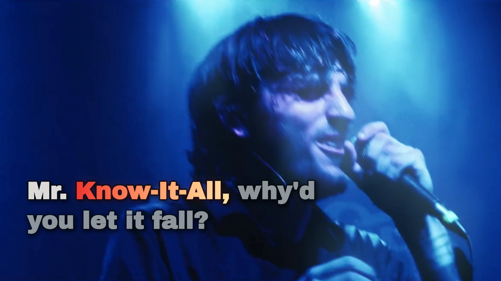

# Computer Kill — Must Have Been A Dream

**Status: the revised preview was owner-reviewed, both full-length films passed independent encoded-file verification, and the Desktop upload kit passed checksum verification.** The project keeps the official moving picture and its original soundtrack as the composition, with individually timed English words and a source-measured visualizer. Listening review and encoded-byte checks are separate evidence.

Source: [Computer Kill — Must Have Been A Dream (Official Music Video)](https://www.youtube.com/watch?v=AK6duyCPU50).



*Exact decoded frame 1891 at 01:18.870 from the verified 1920×1080 landscape MP4. The original stage performance supplies the picture; lyric focus and measured light belong to this edition. The image is an unmodified final-film frame, separate from the posting covers.*

## Preview composition

One browser video element supplies both the original soundtrack and each decoded picture frame. Both outputs fill their frame from the source's **active 1920×672 picture** at source y=204–876. The encoded black matte bands are omitted. Landscape and portrait use separate, shot-aware cover crops of that active image, so neither format stretches the performers or widens the picture. Contiguous source-clock shot intervals choose lyric zones and subject framing across hard cuts. Original title and credit passages are identified for separate visual review because a cover crop can trim lettering near the source edges. At 43.35–44.12 seconds, the artist name is keyed from the source's red lettering and laid over a stage frame from that same video in landscape; portrait sets those words in a narrow local arrangement. The following moving artist card in landscape preserves its full source width over blurred extensions of the same frame. During the later song-title flash, landscape isolates the current source frame's colored title; portrait redraws those same words in a narrower arrangement using color measured from the current source title. The portrait lettering is an adaptation, not the original glyph shapes. In the daylight end credits, the narrow portrait crop would show fragments of the source's wide red credit row, so only those red pixels are filled from adjacent pixels in each moving source frame; landscape retains the original credits.

The visualizer lives in the filmed light and sung lettering. Source-frame RMS, positive rises and 24 spectral bands control warmth and energy in the active word. Existing lamps and glints receive bounded source-colored glows, while source-bright pavement, bus glass and stage lamps host brief reflections or soft beams. A color mask can also brighten red or blue pixels already present in the picture. There is no separate bar graph or border trace. The 26 lyric lines use individually timed word focus on the picture, with stroke and shadow for contrast. These treatments stop before the end credits. Their intensity and placement require visual inspection at actual player sizes; measurements alone cannot establish that they feel native.

Some original source passages are effectively black. Six small JPEGs extracted from that same source (`bridge-intro`, `bridge-mid`, `bridge-title`, `bridge-credits`, `bridge-stage-light`, `bridge-blue-face`) can carry the picture through short intervals. For near-black flashes around 19.45–21.25 seconds, the landscape crop uses a blue face from source time 20.15 seconds, and portrait uses a stage crowd from 21.3 seconds. The longer 151.25–156.32-second blackout uses a **moving source-footage memory**: 60 frames from 146.25–151.25 seconds, sampled at 12 fps and packed as 960×336 tiles in `bridge-mid-sprite.jpg`. It replays earlier picture movement during the black passage. The compositor keeps source-authored title or credit lettering visible over a bridge, and a slow crop drift supports the other long bridge. Review the handoffs and original lettering in motion.

## Run the complete preview

Use Node.js with native TypeScript support (developed with Node 24.20), `ffmpeg`, and `ffprobe`. First restore the exact ignored `public/source.mp4` described below. From this project directory:

```sh
npm ci
npm run build
npm run check
node scripts/check.ts --local-media
npm run preview
```

Open [the local review player](http://127.0.0.1:4329/). It offers play/restart, precise seeking, cue navigation, 1×/0.75×/0.5× speed, 16:9/9:16 switching, the untouched source reference and a **Restore preview** control. The server must remain running. After changing scene or timing files, rebuild, reload and use Restore preview if the media surface is stale. Check actual picture motion after a fresh load, seeking, playback and layout switching in both formats; a moving progress bar alone is insufficient.

`npm run check` verifies text, timing-data shape, source-derived audio rows, full-bleed framing, six still bridges, the moving source-footage sprite and fonts. When the local MP4 exists, it also verifies the entire source file and stream metadata. `node scripts/check.ts --local-media` requires that MP4 and fails if it is missing. Neither command establishes phonetic word accuracy, visible browser playback, perceptual quality or completed listening review.

## Restore the source

The original video is **local media, excluded from Git**. Its selected YouTube streams were `137+140`, merged without retiming into `public/source.mp4`. Stream availability or container bytes can change later; verify the resulting SHA-256 before using a replacement. A reproducible restore attempt is:

```sh
yt-dlp -f '137+140' --merge-output-format mp4 -o 'public/source.%(ext)s' 'https://www.youtube.com/watch?v=AK6duyCPU50'
shasum -a 256 public/source.mp4
```

| Locked input | Value |
| --- | --- |
| YouTube ID | `AK6duyCPU50` |
| Local size | 75,473,884 bytes |
| SHA-256 | `8a37587959dcfef6b9a91d84498d819cd782fc2b78f2edb923cbb63c1fdc19a5` |
| Picture | H.264, 1920×1080, `24000/1001` fps, 6,153 frames, 256.631375 s |
| Sound | AAC stereo, 44,100 Hz, 256.696599 s |

The source soundtrack continues about 65 ms after its last picture frame. The player uses the same media clock for picture, lyrics and measured visual response; do not silently substitute a shorter audio-only version. See [asset provenance](ASSET-PROVENANCE.md) and [audio feature method](AUDIO-FEATURES.md).

## Text and timing review

The [supplied 26-line reference](source/user-transcript.txt) is preserved verbatim, without unrelated site-navigation text. The official video description corroborates those lines, while the actual vocal performance determines their timing. `public/timeline.json` holds line and individual-word intervals in seconds on the *music video's* clock. Repeated chorus lines have separate cue IDs and timings. Highlight timing comes from that timeline; the spectral measurements never assign word onsets.

The current revision adjusts **34 of 156 word starts** after a complete independent onset comparison. Early first-word highlights were corrected locally, including the entrances to “Once again,” “Mr. Know-It-All,” “It's a bad idea,” “Running towards your voice” and the closing repeat. There was no global audio/video clock offset. The [timing-review record](TIMING-REVIEW.md) explains the model evidence, changed boundaries, frame-precision limit and remaining perceptual uncertainty. [The structured refinement](source/onset-refinement.json) lists each old and new start. Review authorization is recorded separately by the production gate. The [candidate audit](source/onset-audit-candidates.json) compares models against the **earlier** timeline hash and must not be mistaken for a measurement of the current map.

The project owner reviewed the **revised** complete preview, including the closing 2:36–2:41 phrase, the full recording at normal speed, uncertain events at reduced speed and both 16:9 and 9:16 layouts, and authorized production for that revision. The previous approval of the earlier timing map was not reused. [Hash-bound review evidence](evidence/sync-review.json) and [render authorization](evidence/render-authorization.json) were recorded before capture. This acceptance is a listening judgment, not a claim that model boundaries prove every phoneme; the [preview-first rule](../../docs/preview-before-render.md) governed the production transition.

## Final films and verification

Both films contain **6,155 frames at 24000/1001 fps**, H.264 `yuv420p`, BT.709 limited range, and the original 44.1 kHz stereo AAC stream. The last two picture frames hold the source image for the short audio tail. The full-file verifier decoded every frame, checked exact frame timestamps, compared every AAC packet and its timing, and matched the entire decoded PCM including the last second. [Final verification](evidence/final-verification.json) records these measurements and exact hashes.

To reproduce both formats from the restored, hash-matched source and built preview in a checkout without existing output files:

```sh
node scripts/render-gate.ts
npm run render:production -- --format landscape
npm run render:production -- --format portrait
npm run verify:production
```

| Local deliverable | Frame | Bytes | SHA-256 |
| --- | --- | ---: | --- |
| Landscape YouTube master | 1920×1080 | 305,441,786 | `ef692615789b8297b6235e147d837346e4fd2565136ee22b3236d69b5e1873b9` |
| Portrait TikTok master | 1080×1920 | 245,866,978 | `abb4f75d2d7bf99a8d3cccdb6ba9ff6926e26271d332543e9cf871171d0e3a26` |

An [all-frame near-black scan](evidence/blackframe-scan.json) flagged 30 frames in each film at a 98%-below-luma-32 threshold. They are brief source-authored dark cuts: the longest is nine frames (about 0.375 s) and is present in the original picture. One portrait-only flagged frame at 11.053 s retains faint source detail after a narrow crop. No missing-video interval was found. This scan is a luminance test, not an aesthetic judgment about dark cinematography.

The [posting assets](publishing/README.md) include exact-source covers, platform copy and optional source-clocked English SRT/VTT. The final MP4s and locked original source remain local and excluded from Git; the [verified Desktop kit](evidence/delivery-receipt.json) is recorded separately from platform publication.

## Edit map and evidence limits

| File | Purpose |
| --- | --- |
| `src/scene.ts` | Full-bleed active source picture, source-derived black-passage bridges, sung lettering and measured source-light response |
| `src/shots.ts` | Contiguous source-clock crop intervals for landscape and portrait; title/credit passages marked for review |
| `src/player.ts` | Single media clock, seek, speed, format and recovery controls |
| `public/timeline.json` | Revised, owner-reviewed line/word events for the complete 26-line text |
| `source/onset-refinement.json`, `TIMING-REVIEW.md` | Exact onset changes, methods, review scope and limits |
| `public/audio-features.json` | 6,155 source-clock measurement rows, including the audio tail |
| `public/bridge-{intro,mid,title,credits,stage-light,blue-face}.jpg` | Six source-derived stills used when the decoded picture is effectively black or briefly too dark to read |
| `public/bridge-mid-sprite.jpg` | 60 prior source frames replayed at 12 fps through the 151.25–156.32 s blackout |
| `scripts/check.ts`, `tests/` | Reproducible structural, source-identity, crop and gate checks |
| `scripts/render-gate.ts` | Blocks production until current review and authorization evidence exists |

Machine alignment and deterministic assertions can catch omitted tokens, out-of-range events, incomplete audio features, invalid source media and stale approvals. They cannot decide how a processed syllable sounds or whether a screen-space effect belongs in a shot. Those are review tasks for the full moving preview.

The [production lessons](PRODUCTION-LESSONS.md) explain the shot crop, source-light response, black-passage treatment and reusable verification sequence. The [word-onset review](TIMING-REVIEW.md) records the local timing changes and evidence limits.
