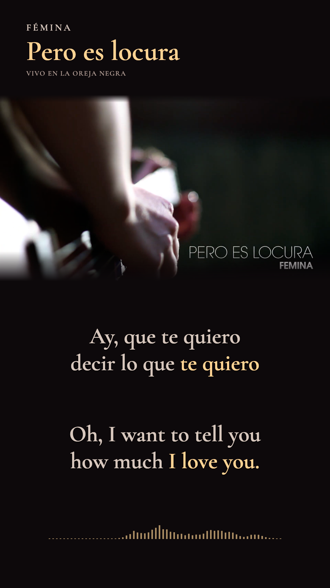
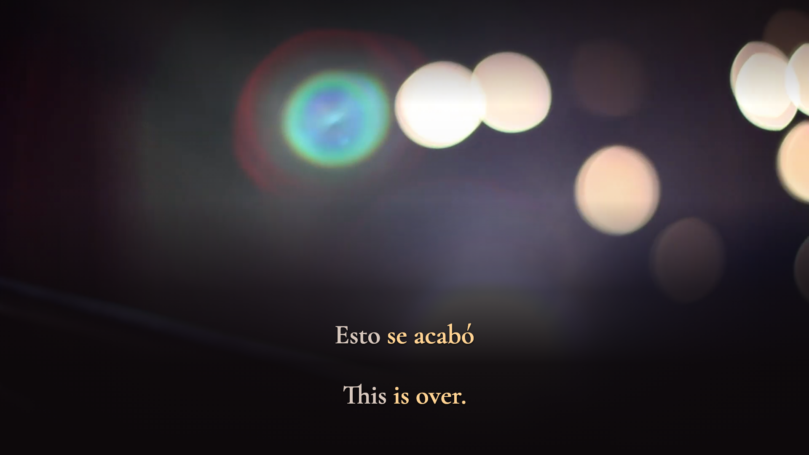

# Paired Spanish and English focus — preview revision 3

**Delivery update:** this corrected presentation is now rendered and verified; see [current delivery](DELIVERY-V3.md). The diagnostic record below preserves the preview-stage findings.

**Historical preview-stage record.** Review and authorization were pending when these diagnostics were prepared; current delivery status is linked above. Delivered v1 films remain unchanged. Revision 2 is superseded because its correction completed the English phrase without completing the corresponding Spanish display group.

## Correct both sides of the meaning

The affection refrain now displays **te quiero ↔ I love you** as one paired unit. Both Spanish words and all three English words receive the same onset, source-event handoffs and release. The implied subject belongs to the inflected verb; it must not appear only after the object clitic has ended.

All **50 translation templates and 86 cues** were audited. The correction changes display focus in **53 cues**, with **116 performed multi-source units / 26 distinct pairings**. All **20 affection refrains** are covered, including independently timed repetitions.

| Construction | Paired focus |
| --- | --- |
| te quiero, with an implied subject | I love you |
| me sumás / me aumentás | You add to me / you expand me |
| me hacés | you make me |
| me inspira | inspires me |
| estés empapado | you … be soaked |
| se levanta | lifts |
| estás vos / al lado | you're / close by |
| nos separan | separate us |
| se acabó | is over |

The existing discourse, degree, relative, prepositional and possession constructions also receive complete Spanish focus when their English counterpart is active. The exact inventory and timing unions are in [the full audit](evidence/semantic-focus-v3.json).

**Keep independently spoken meanings independent.** In `Yo aún te quiero`, explicit `Yo ↔ I` and sustained `aún ↔ still` keep their own events; the remaining `te quiero ↔ love you` is paired. `Más ↔ most/more`, negation and reordered `muchacho dorado ↔ golden boy` remain independently linked. The first `quiero` in `te quiero decir` means “want”: it does not activate the affection group or “to tell you.” Displaced `te … decir` and `me … el corazón` release during unrelated intervening words.

## Timing and implementation

Acoustic events and display focus are separate. `activeSource()` still reports the original sung-word events for timing inspection. `sourceFocusIds()` finds the complete semantic unit shared by translated words, and `activeDisplaySource()` supplies the Spanish display state. Explicit target groups include every required implied subject. Tests reject a target group that covers only part of its matching source unit.

Both languages use the **union of the original source intervals**, including exclusive releases. Genuine gaps remain neutral in both lanes; no interval is extended across a gap or unrelated word. No acoustic timestamps, cue visibility boundaries, displayed wording, font metrics, glyph positions, audio, source-picture cuts, palette or spectrum profile changed. The visual audit found low contrast behind the late spoken landscape cue: soft reading shade now follows that cue independently of faded metadata and spectrum, then clears before the credits.

The browser painter, SVG stills, future production compositor and future decoded-focus verifier all use the paired display state. Diagnostic waveforms and raw timing checks continue using acoustic events.

## Verification

- TypeScript and **14 regression tests pass**. They cover every affection refrain, both directions of phrase correspondence, implied subjects, unrelated words, explicit pronouns, negative constructions, gaps and releases.
- Every visible timeline frame was checked: **80,831 Spanish and 87,911 English word states**. Compared with v2, **4,019 Spanish states and 196 English states** change. These counts describe display corrections, not retimed singing.
- **70,730 SVG color checks** pass across onset/release boundaries in both formats.
- Browser geometry passes **6,036 states / 90,742 glyph observations** with no clipping, overlap, missing words, unstable positions or painter/static mismatch. Both languages keep the same type size and weight.
- Targeted browser checkpoints confirm full paired phrases in both layouts, including the object-clitic onset at 00:02.350 and the verb at 00:02.683. Normal and half-speed playback were technically observed; the media clock drives both picture and lyrics.
- Diagnostic stills cover paired focus, the held `aún`, decoration release, the final spoken tag and unobstructed original credits in both formats. The measured visualizer remains below the lyrics; added metadata and bars clear before the credits. The late spoken landscape cue retains soft shading over the bright stage light; it releases before the source credit card. [Visual evidence](evidence/browser-focus-v3.json).

These checks do not constitute a new human listening attestation or hardware latency measurement. The v3 production gate stays closed. The previous review and delivery evidence remains versioned rather than being relabelled as a v3 signoff.




*Diagnostic preview stills at 00:02.350 and 00:02.683. Music and performance: Fémina. Production: La Oreja Negra. Film: FLAN Audiovisual. No replacement film has been rendered.*



*Late spoken cue at 04:49.600. Soft reading contrast remains while the metadata and visualizer stay absent; the original credits follow unobstructed.*

## Reproduce

```sh
node scripts/translation-templates.ts
node scripts/remap-translations.ts
npm run layout
npm run check
node scripts/audit-semantic-focus.ts
npm run preview:freeze
npm run geometry:build
# Inspect /review/geometry.html in the preview browser.
node scripts/stills-semantic-focus.ts # diagnostic still images only
```

[Current review](evidence/cross-language-sync-review.json) · [Current identity](evidence/preview-identity.json) · [Prior v2 record](SEMANTIC-FOCUS-V2.md)
