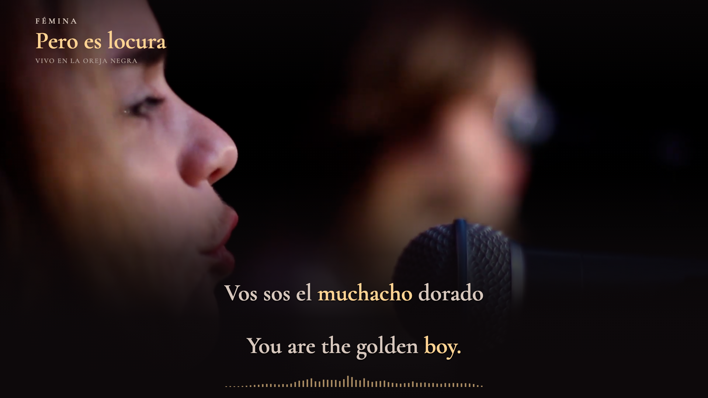

# Fémina — Pero es locura

**Vivo en La Oreja Negra · Spanish + English · full-recording preview**



*Diagnostic landscape still at 01:49.000, made from the actual source picture and shared preview scene. Performance and music: Fémina. Production: La Oreja Negra. Film: FLAN Audiovisual. This is a preview image, not a frame from a completed film.*

## Preview

The complete 4:54.104 recording plays locally at **http://127.0.0.1:4321/**. Select 16:9 or 9:16, seek anywhere, restart, or use 0.75× / 0.5× playback. “Timing review” exposes source and translated word correspondence, acoustic evidence, candidate boundaries and draft review notes. Saving notes does not authorize production.

The live footage provides the motion and shot changes. Warm ivory text, champagne focus, continuous shading and one compact spectrum support the performance. Both languages have equal font size, weight and highlight strength. Words keep fixed positions. Portrait retains the full source width, above dedicated reading space. Added title and spectrum disappear before the source credits; the portrait edge mask also clears to retain the credit lettering.

**Preview only.** No full-length film has been rendered. Model alignment is complete; actual-audio review and explicit approval of this revision remain pending. See [status](status.json), [review record](evidence/cross-language-sync-review.json) and the repository's [mandatory gate](../../docs/cross-language-sync-gate.md).

## Text and timing

- 86 displayed cues, 586 Spanish words, 636 English tokens, on 55 independently aligned performance windows.
- Both supplied lyric references are retained. The displayed transcription follows this particular live recording, including its early heart refrain, shortened refrain endings, three “mucho” repetitions and final spoken tag.
- Each displayed cue starts with a capital letter. Internal text uses normal sentence case; automatic wrapping does not capitalize a continuation. Spanish accents and Rioplatense forms are retained: `párpado`, `estás`, `estadía`, `Perdoná`, `sumás`, `aumentás`, `hacés`; `Quedate` remains unaccented.
- English words follow their corresponding Spanish source intervals. Reordered adjectives, pronouns and necessary English grammatical completions receive the whole mapped focus. Gaps between source events stay gaps; no independent target timing is fabricated.
- One HTML video element supplies both source picture and original sound. Its media clock drives lyric focus and the measured spectrum. Normal and slow playback use that same clock.

[Performed Spanish](source/lyrics-performed-es.txt) · [English translation](source/lyrics-translated-en.txt) · [Translation mappings](source/translation-templates.json) · [Timing and coverage notes](SYNC-NOTES.md)

## Verification and limits

`npm run check` validates capitalization, performed sequence, semantic coverage, source audio identity, all timing boundaries, both layouts and the closed production gate. The recorded run checked **70,730 visible word-color states** with no mismatch. The browser audit checked **6,036 states** in both formats with no missing words, overlaps, clipping or glyph movement.

These are software checks, not proof of perfect acoustic alignment. All 586 words remain marked for listening review. MMS on the mixture and isolated vocal, plus Whisper alignment, retain their disagreements in the boundary ledger. Browser clock measurements exclude hardware output latency. Full audio/video review must resolve the remaining uncertainty before production.

[Technical checks](evidence/technical-checks.json) · [Browser geometry](evidence/browser-geometry.json) · [Playback checks](evidence/browser-playback.json) · [Alignment summary](evidence/alignment-summary.json) · [Frozen identity](evidence/preview-identity.json)

## Run locally

Requires Node with direct TypeScript execution, npm and FFmpeg. The committed lockfile pins dependencies.

```sh
npm ci
# Restore the original local recording using source/PREPARATION.md.
npm run check
npm run preview
```

`Start Preview.command` starts the same preview from this folder on macOS. Recording files remain local and are excluded from Git. Match the source hashes before reusing timing evidence. Generated browser bundles are ignored and rebuilt by `npm run preview`.

To rebuild text/layout after an intentional correction:

```sh
node scripts/translation-templates.ts
node scripts/performed-sequence.ts
node scripts/build-cues.ts
npm run layout
npm run check
npm run preview:freeze
```

Any changed review input invalidates previous signoff. `npm run sync:gate` currently refuses production because listening review and authorization are incomplete. `npm run render` is a guarded placeholder; this preview edition does not install a full-film rendering adapter. Single-frame diagnostic images use `node scripts/stills.ts` and cannot produce a full film.

[Original live recording](https://www.youtube.com/watch?v=uvLVcEBIn-4) · [Source preparation](source/PREPARATION.md) · [Design brief](PREVIEW-BRIEF.md) · [Workflow findings](WORKFLOW-NOTES.md)
