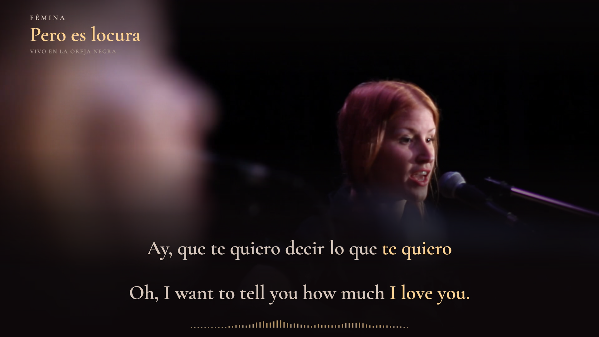

# Fémina — Pero es locura

**Vivo en La Oreja Negra · Spanish + English · verified paired-focus v3 delivery**



*Decoded current landscape delivery, frame 8067 at 02:14.450. Music and performance: Fémina. Production: La Oreja Negra. Film: FLAN Audiovisual.*

## Current delivery

Both full-length formats retain the complete original live footage and soundtrack, warm equal bilingual typography, stable reading positions and a restrained spectrum. The corrected display pairs complete Spanish and English meanings in 53 cues, including **te quiero ↔ I love you**, and protects the late spoken lyric's contrast. Original acoustic word boundaries, wording and layout are unchanged.

The new local upload kit contains the 1920×1080 landscape and 1080×1920 portrait videos at 60 fps; a 1920×1080 YouTube thumbnail; a portrait 1200×1600 TikTok profile cover; titles and descriptions; optional captions; and checksums. Earlier delivered bytes are preserved. No platform upload or public media release was performed.

[Current results and evidence](DELIVERY-V3.md) · [Editorial and visual lessons](PRODUCTION-LESSONS.md) · [Delivery receipt](evidence/delivery-receipt.json) · [Checksums](evidence/delivery-checksums.sha256) · [Desktop handoff](evidence/desktop-handoff.json)

## Review and scope

The earlier explicit complete-recording, uncertain-event reduced-speed and both-format listening attestation is retained for identical source audio and acoustic events. The corrected full presentation was separately accepted and authorized for rendering. Editorial, browser and final-file checks establish the new paired display behavior; no fresh granular human playback log is claimed.

The playable preview includes the complete moving image. **Reload preview** recovers a missing or frozen browser video while preserving position, layout, speed and local notes, returning paused. The final files are independently decoded and checked. [Browser recovery evidence](evidence/preview-video-recovery.json) · [Current review](evidence/cross-language-sync-review.json) · [Approved identity](evidence/preview-identity.json)

## Historical v1 delivery

The complete **4:54.104** live recording is delivered in 1920×1080 and 1080×1920 at 60 fps, with Spanish lyrics and meaning-linked English highlighting. Original live cuts and motion remain intact; warm serif text, continuous shading and a compact measured spectrum support the performance. Both languages have equal size, weight and focus strength, with stable word positions. Portrait retains the full source width above dedicated reading space. Added decoration clears before the source credits; the late spoken tag remains subtitled.

The local upload kit includes both films, separate YouTube and TikTok titles/descriptions, a 1920×1080 YouTube thumbnail, a **1200×1600 portrait TikTok profile cover**, optional captions and checksums. Full recording files and upload assets stay local. Source integration does not publish the recording to a video platform or create a public media release.

[Delivery receipt](evidence/history/delivery-v1/delivery-receipt.json) · [Desktop handoff](evidence/history/delivery-v1/desktop-handoff.json) · [Checksums](evidence/history/delivery-v1/delivery-checksums.sha256) · [Posting assets](publishing/README.md) · [Production and verification](PRODUCTION-NOTES.md)

## Historical v1 review and final-file verification

The project owner explicitly confirmed complete actual-audio review, uncertain events at reduced speed and both layouts, then authorized rendering of `preview-v1-live-capitalized`. The strict gate remains unchanged. Its completed cue records identify human attestation as the review basis; no granular playback telemetry or automated listening is claimed. Those final files retain the approved v1 inputs. The separate current v3 delivery corrects that display behavior; historical v1 results below describe only the preserved original edition.

- Both final films contain **17,647 frames at 60 fps**, with every timestamp checked and strict full-file decode passing.
- Each format passed **168,742 visible word-state checks**, with **zero mismatches and zero ambiguous classifications**.
- All **12,666 AAC packets**, their timestamps and **12,969,984 decoded stereo sample frames** match the original. The decoded audio SHA-256 is identical.
- The metadata correction preserved every native 10-bit pixel hash and timestamp across both films.

Before production, the SVG checks covered **70,730 visible word-color states**; browser geometry covered **6,036 states** with no missing words, overlaps, clipping or glyph movement. Twenty-two compositor proofs verified the production typography against the approved preview. An intentionally shifted encoded diagnostic demonstrated that the focus checker detects incorrect timing.

Software checks establish agreement with the approved map and preservation of the source timeline. The subsequent semantic audit found incomplete English spans despite that agreement; the v1 results are not proof that its map was semantically complete. Human acoustic review is recorded separately. Raw alignment disagreements remain available as provenance; frame quantization and physical playback latency are not claims of perfect acoustic accuracy.

[Completed review](evidence/history/delivery-v1/cross-language-sync-review.json) · [Authorization](evidence/history/delivery-v1/render-authorization.json) · [Timing audit](evidence/history/delivery-v1/final-sync-audit.json) · [Technical checks](evidence/history/delivery-v1/technical-checks.json) · [Browser geometry](evidence/history/delivery-v1/browser-geometry.json) · [Frozen identity](evidence/history/delivery-v1/preview-identity.json)

## Text and timing

- **86 displayed cues, 586 Spanish words and 636 English tokens**, prepared from 55 independently aligned performance windows.
- Both supplied lyric references are retained. The transcription follows this live recording, including its early heart refrain, shortened refrain endings, three “mucho” repetitions and final spoken “Esto se acabó.”
- Every cue starts with a capital letter. Internal text uses sentence case; a wrapped continuation is not automatically capitalized. Spanish accents and Rioplatense forms are retained, including `párpado`, `estadía`, `Perdoná`, `sumás`, `aumentás` and `hacés`; `Quedate` remains unaccented.
- English words follow their corresponding Spanish source intervals. Reordered words keep their own events; necessary grammatical completions receive the complete mapped focus. Gaps remain gaps, without fabricated English syllable timings.
- Preview picture, sound and graphics follow one video clock. Production preserves the original 24000/1001 fps picture cadence on the 60 fps graphics timeline, with the final source picture held through the remaining audio.

[Performed Spanish](source/lyrics-performed-es.txt) · [English translation](source/lyrics-translated-en.txt) · [Meaning mappings](source/translation-templates.json) · [Timing and coverage notes](SYNC-NOTES.md)

## Run locally

Requires Node with direct TypeScript execution, npm and FFmpeg. The committed lockfile pins dependencies. Production uses macOS VideoToolbox HEVC Main10 encoding; the preview does not require that encoder.

```sh
npm ci
# Restore the locked local recording using source/PREPARATION.md.
npm run check
npm run preview
```

The review preview remains available at **http://127.0.0.1:4321/**, with 16:9 / 9:16 selection and normal or reduced-speed playback. `Start Preview.command` starts it on macOS. The frozen revision-3 interface offers a correction checkpoint menu; its original pending-review badge is historical, while the linked record carries current authorization. The current delivery status is in the [review record](evidence/cross-language-sync-review.json) and [project status](status.json). Saving preview notes never authorizes production.

To rebuild this paired-focus correction without recalculating acoustic boundaries:

```sh
node scripts/translation-templates.ts
node scripts/remap-translations.ts
npm run layout
npm run check
npm run preview:freeze
```

Changed review inputs invalidate prior signoff. Recheck the affected material and obtain authorization for the new revision before rendering. See [production reproduction](PRODUCTION-NOTES.md#reproduction) for cache capture, diagnostic proofs, full rendering and final verification.

[Original live recording](https://www.youtube.com/watch?v=uvLVcEBIn-4) · [Source preparation](source/PREPARATION.md) · [Design brief](PREVIEW-BRIEF.md) · [Workflow findings](WORKFLOW-NOTES.md)
