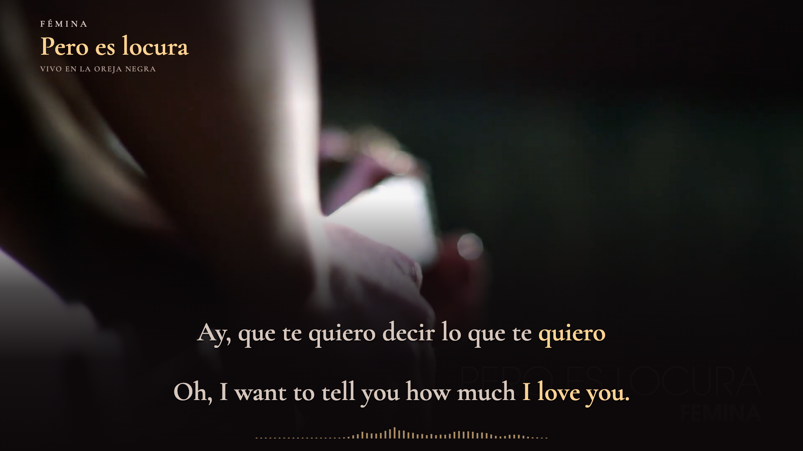
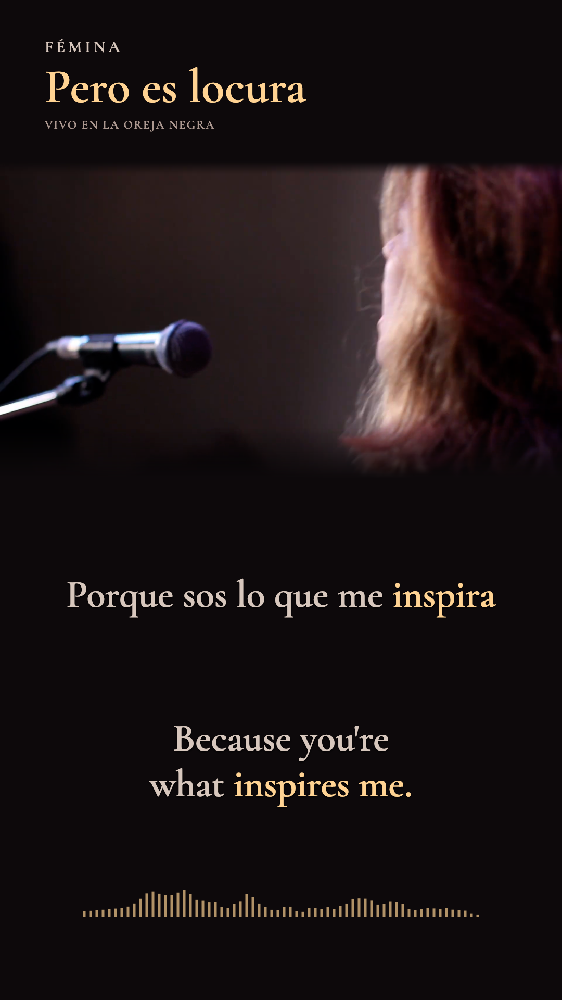

# Complete English focus — preview revision 2

**Status: corrected playable preview; no replacement film rendered.** The delivered v1 files remain unchanged. Review and production authorization for this changed focus are pending.

## Problem and correction

In v1, `te → you` and `quiero → love` were individually mapped correctly, but “you” returned to neutral during “quiero.” The highlighted English meaning looked incomplete. The requested treatment keeps **love you** together over those source events. A full editorial pass through all **50 translation templates and 86 performed cues** found related short-object, displaced-possession and auxiliary cases.

The correction applies **58 phrase occurrences across 40 cues**:

| Spanish construction | Complete English display focus | Example preview time |
| --- | --- | --- |
| te quiero | love you | 00:02.683; 04:17.283 |
| te … decir | to tell you | 00:01.817 |
| me … el corazón | my heart | 00:21.500 |
| estés empapado | be soaked | 01:51.517 |
| me inspira | inspires me | 03:18.750 |
| me sumás / me aumentás | add to me / expand me | 03:21–03:22 |
| me hacés | make me | 03:22.817 |
| nos separan | separate us | 04:14.417 |

Use **Review highlight fixes** in the preview to seek directly to representative changes, then play at normal or reduced speed in either format.



*Diagnostic landscape preview at 00:02.683: “I love you” remains active during the subject-bearing verb “quiero.” The opening picture is the original live recording.*



*Diagnostic portrait preview at 03:18.750: “inspires me” follows “inspira.” Music and performance: Fémina. Production: La Oreja Negra. Film: FLAN Audiovisual. These are preview stills, not frames from a replacement delivery.*

## Mapping rules

`sourceIds` continues to record individual lexical correspondence. Optional `focusSourceIds` and `focusGroup` separately describe the explicitly selected English display phrase. Each group uses the **union of its real source-word intervals**, with exclusive ends. It never fills gaps or includes an intervening unrelated word.

For example, “to tell you” follows `te` and `decir`, releasing during the intervening `quiero` (“want”). “My heart” follows the affected possessor and heart phrase, releasing during `robó` (“stole”). Negation, explicit independent subjects, “still,” “much,” reversed adjective/noun order and independently corresponding words remain separately timed. Existing complete single-word expansions, including attached Spanish clitics, need no new grouping. This is a scoped display choice, not a rule to group every verb and object in future songs.

There are three lexical repairs in the “estés empapado” cue: “you” and “be” belong to `estés`; “to” belongs to the complement marker `que`; “soaked” belongs to `empapado`. The former mapping omitted “be” from the `estés` event. The English wording remains identical.

## Verification and limits

- Every Spanish sample boundary, cue visibility boundary, audio-clock field, displayed word and actual glyph position equals the v1 baseline.
- Regression checks cover every frame of all 58 phrase occurrences, including gaps and exclusive releases. The old lexical-only behavior fails these semantic expectations.
- Full-timeline comparison covers **87,911 English word states**; **2,244 states** change from v1.
- The SVG audit passes **70,730 word-color states**. The browser audit passes **6,036 states / 90,742 glyph observations**, with no missing text, clipping, overlap, movement or mismatch between the preview painter and static scene.
- Nine targeted checkpoints pass in both browser layouts after completed seeks. Normal and 0.5× playback advance correctly; observed overlay/media-clock quantization stays below 8.334 ms. This does not measure hardware speaker/display latency or certify fresh acoustic listening.

The v1 encoded checks correctly proved agreement with the old map; they did **not** prove the map's complete English meaning. Its immutable delivery receipt and files remain v1 evidence. The current review retains the prior attestation for 46 unchanged cues and reopens the 40 affected cues. Automated tests do not sign off the new audiovisual review. The production gate refuses the pending revision, and the posting-kit script rejects final focus verification from a different revision.

## Reproduce the correction

```sh
node scripts/translation-templates.ts
node scripts/remap-translations.ts
npm run layout
npm run check
node scripts/audit-semantic-focus.ts
npm run preview:freeze
npm run geometry:build
# Open /review/geometry.html in the preview browser.
# Optional: four diagnostic still images, no video rendering:
node scripts/stills-semantic-focus.ts
```

Use `remap-translations.ts` for this English-only correction. Rebuilding acoustic cues is unnecessary and could obscure a timing change.

[Semantic audit](evidence/semantic-focus-v2.json) · [Browser verification](evidence/browser-focus-v2.json) · [Current review](evidence/cross-language-sync-review.json) · [V1 review archive](evidence/history/delivery-v1/cross-language-sync-review.json)
