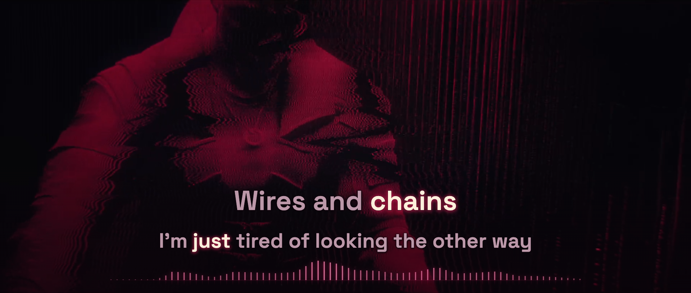

# Phantom Liberty — lyric-film preview

**Dawid Podsiadło · P.T. Adamczyk · English lead and backing vocals**

Status: complete-recording v2 preview ready for listening review. Production rendering and media publication are not authorized.



*Paused browser export at 01:18.070; original picture PTS 01:18.044633. [Exact provenance](evidence/browser-still.json). This is a preview image rather than an encoded final-film frame or listening evidence.*

The [official Cyberpunk 2077 music video](https://www.youtube.com/watch?v=u15tEo0wsQI) remains the picture and soundtrack. Its crimson holographic figures and light filaments inform the added typography and measured audio response. Every lead and backing occurrence has its own source-clocked events; simultaneous voices retain separate, stable reading blocks.

## Start the complete preview

Acquire the exact recording identified in [source/recording.json](source/recording.json) as `public/source.mp4`. Keep its original zero and audio. The server refuses an unrelated or edited source, missing timing or mismatched measured features.

```sh
npm ci
npm run check
npm run build
node scripts/preview-server.ts
```

Open `http://127.0.0.1:4334/`. Native wide preserves the complete 1920×816 active picture after removing only the source’s baked black margins. Portrait keeps the complete moving picture in a sharp inset with a dim, defocused live extension; it avoids cutting faces and opposing characters with an extreme vertical crop. Both offer seeking, cue jumps, reduced-speed playback, source comparison and recovery.

## Inputs and boundaries

- [Original supplied text](source/lyrics-supplied.txt) remains separate from the performed inventory and selected events.
- [Recording identity](source/recording.json) records the unchanged AAC decode, native 30000/1001 picture cadence and 44,100 Hz source audio.
- [Canonical timeline](public/timeline.json) stores inclusive starts and exclusive ends as integer source samples. English words reference their own performed event.
- [Selected-event record](source/selected-words.json) preserves the rebuilt samples, rejected alternatives, uncertainty and separate vocal ownership. The 312 supplied words plus one wordless-vowel candidate form 60 cues.
- [Measured features](public/audio-features.json) contain stereo-power RMS, transient rise and 24 frequency-band powers. These measurements control light; they do not label sung words or supply a beat map.
- [Scene](src/scene.ts) and [player](src/player.ts) keep picture PTS separate from the finer soundtrack clock used for words. Glyph positions remain fixed; active words receive a pale warm focus and localized crimson diffusion.

Model observations, original-signal inspection, technical checks, actual listening review and render approval are separate evidence. Integer timestamps provide deterministic presentation, not proof of perceptually exact milliseconds. The complete listening review and current-revision render approval remain pending.

The rejected first map is retained only in local diagnostic history. The v2 rebuild passes 13 local checks, all 120 cue layouts and 1,878 active-event states in both formats. The real browser was checked for native and portrait motion, seeks, half-speed playback, complete backing blocks, held focus, muted source comparison, recovery and the audio tail. Masked backing word boundaries, sixteen chorus releases and several lexical variants retain explicit uncertainty. [Timing method](TIMING-METHOD.md) · [Signal/model review](evidence/timing-review.json) · [Shared-scene still proof](evidence/proof-stills.json) · [Browser transport evidence](evidence/browser-review.json).

Source media, analysis caches, machine-specific model adapters, dependencies and generated browser bundles stay local. No platform upload or public binary release is part of this preview.

## Credits

The official upload credits music to P.T. Adamczyk and Dawid Podsiadło, lyrics and vocals to Dawid Podsiadło, and orchestration and piano to Marcin Przybyłowicz. Original film: CD PROJEKT RED and the production contributors listed by the [Cyberpunk 2077 upload](https://www.youtube.com/watch?v=u15tEo0wsQI). Added lyric timing, typography and audio visualization are project-specific. [Space Grotesk](https://github.com/floriankarsten/space-grotesk) is used under its [bundled SIL Open Font License](public/fonts/SpaceGrotesk-OFL.txt).
