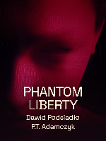

# Phantom Liberty — publishing assets

Each platform receives its complete film, dedicated cover and publishing copy. This directory contains source and review assets; final video identities come from [the final verification report](../evidence/final-verification.json) before packaging. No platform posting or public full-media release is performed by these scripts.

## Covers

The selected artwork is exact original-video frame **4796**, at **160.026533 seconds** on the native 30000/1001 picture clock. Both compositions use that single source frame, a continuous crimson-black contrast wash and the approved Space Grotesk font. The original face and scan-line lighting remain recognizable. No replacement scene, generated image, facial reconstruction or additional subject was introduced.

| Platform | Selected upload | Size |
| --- | --- | --- |
| YouTube | [Thumbnail](Phantom-Liberty-YouTube-Thumbnail-1280x720.jpg) | 1280×720, 16:9 |
| TikTok | [Profile cover](Phantom-Liberty-TikTok-Cover-Profile-1200x1600.jpg) | 1200×1600, 3:4 portrait |



The full song title and both artist names were inspected at 150×200 and 300×400. A conservative 5% crop from each edge preserves the wording and principal facial features. The YouTube cover was also inspected at 320×180. These are local simulations; the actual platform upload preview remains a posting-time check. Dimensions, byte sizes, hashes, text bounds and source crops are recorded in [cover-assets.json](cover-assets.json).

## Copy and captions

- [YouTube title](YouTube-Title.txt) and [description](YouTube-Description.txt) credit the original music, lyrics/vocals, orchestration/piano and film.
- [TikTok title](TikTok-Title.txt) and [description](TikTok-Description.txt) provide concise song and creator attribution.
- [English SRT](Captions/English.srt) and [VTT](Captions/English.vtt) are optional phrase-level accessibility sidecars. All 60 selected cues are covered. At simultaneous lead/backing passages, the interval union produces nonoverlapping caption events with a labelled backing line. Millisecond subtitle rounding does not change the film's sample-based word map.

Both voices already appear in the films with individual focus, so enabling the sidecars duplicates visible lyrics. They inherit the approved selected map and its documented masked-vocal and lexical uncertainty; they are not a second transcription or independent timing proof. [Caption identity](caption-assets.json).

## Reproduction and delivery

```sh
node scripts/make-covers.ts
node scripts/make-captions.ts
node scripts/package-delivery.ts
```

Cover and caption generators require the current approved input hashes and refuse to overwrite existing assets. The cover manifest is marked accepted only after direct inspection of the actual exports and every review proof. The packager requires passed final-file and encoded-scene verification, verifies both film hashes and current producer/verifier identities, checks every accepted cover/caption hash, and then builds the ignored workspace staging kit. It refuses any existing destination.

After workspace verification, the coordinating agent may run the same packager with an explicitly authorized absolute `--dest` Desktop folder. Every copied file is hashed again. The kit includes platform files, optional captions, local cover proofs, verification reports, a posting guide, a delivery manifest and SHA-256 checksums. Public receipts record only the folder label and relative file paths, never local account paths.

Original footage and adapted cover imagery retain their creators' rights under the repository's [media exclusions](../../../LICENSE.md). The official source and detailed original credits are available from the [Cyberpunk 2077 upload](https://www.youtube.com/watch?v=u15tEo0wsQI).
