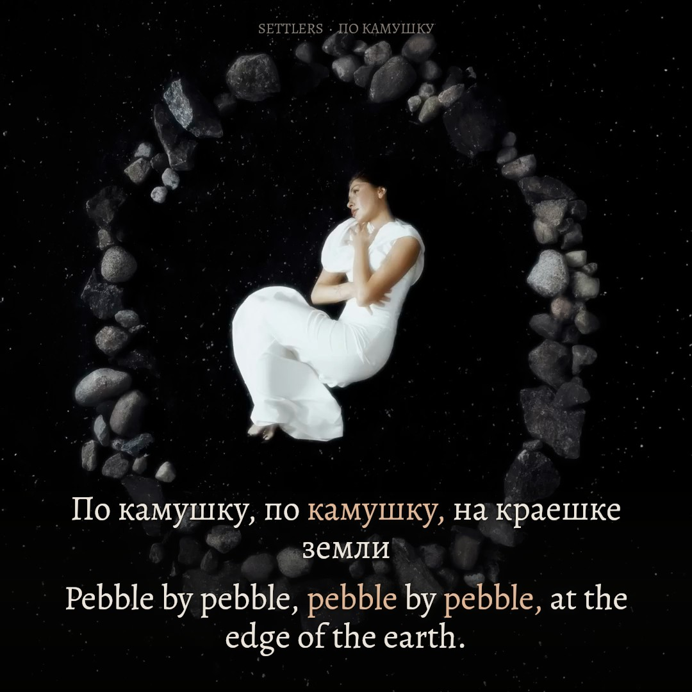

# По камушку — Settlers

**Complete Russian / English preview · original 1:1 artwork · authored 9:16 composition · production not authorized**

The [original recording](https://www.youtube.com/watch?v=oysjDP9Vqdg) places a curled figure inside a real irregular stone ring on dark earth. The preview preserves that picture and soundtrack. Thirty existing stone surfaces respond to measured music; the source grain remains their material. Warm, worn typography and a pale clay focus color share the photograph's muted light. The figure, stone outlines and reading glyphs stay fixed.



*Complete-composition preview still; provenance and exact revision are recorded in `evidence/preview-stills.json`. Original picture and soundtrack: Settlers' source upload. Added translation, word focus, composition and reactive surface light are authored for this preview. This is not a frame from a completed production render.*

## Run and review

```sh
npm ci
npm run features
npm run prepare
npm run check
npm run preview
```

Open [the complete local preview](http://127.0.0.1:4332/). It has play/pause, seeking, exact seconds, cue navigation, 1×/0.75×/0.5× speeds, original-square and 9:16 layouts, muted source comparison, still download and full recovery. The original video element supplies both the soundtrack and picture. Word focus repaints at display cadence against its actual `currentTime`; decoded picture PTS remains separately visible in diagnostics. No lyric timer extrapolates across seeking or buffering.

The authorized local `public/source.mp4` is required and excluded from Git. [The input manifest](source/manifest.json) identifies the exact 1080-square, 25 fps recording, AAC priming, decoded sample extent, source hash and font. Analysis uses the original mix without gain or a shifted zero. Download formats 137+140 from the linked upload and verify the recorded hash before reusing the timing; do not silently swap recordings.

## Picture and material response

The source is deliberately still artwork throughout 208.8 seconds. [The source study](evidence/source-motion-study.md) distinguishes that stillness from stalled browser decoding. All 5,220 source frames were fingerprinted, and representative samples preserve the same pose and stone geometry.

Each receiving polygon in [the stone plan](public/stone-anchors.json) lies inside an actual stone. A cached material mask uses the locked first source frame's luminance, a seven-pixel inward feather and a qualitative upper-left light direction. The lossless `public/material-reference.png` is a texture reference only; the main picture always comes from the original video. Its fixed identity prevents codec noise from changing material masks when a fresh preview begins at a different timestamp. Screen compositing brightens those textured facets with bounded warm-gray light. It creates no replacement rocks, complete neon perimeter, traveling spectrum or hard polygon rims. Masks occupy about 4.53% of the source frame and protect the person and cloth entirely.

Twenty-four logarithmic bands from 40 Hz to 10 kHz drive the 30 fixed receiving surfaces in clockwise order. The generator preserves stereo mean power, a Hann-windowed 4,096-sample spectrum at 22,050 Hz, 40 ms RMS windows and source-cadence feature rows. These centered windows have finite temporal resolution; they are not millisecond beat markers. The artistic exposure curve is `clamp((band dBFS + 57) / 34)^1.45`, multiplied by a bounded full-recording RMS factor. There is no quiet-section normalization. Per-stone screening is capped; the lower native arc receives 48% of its normal response while lyrics are present.

Native 1080×1080 retains the complete square. Equal-size Alegreya text occupies the lower earth without touching the central figure. Longer constructions wrap both languages at one shared font size; focus changes color and luminance without changing geometry. A continuous soft lower shade protects reading while retaining the stones. Portrait 1080×1920 keeps the entire source square at y212–1292 and places equally prominent text below it. Dim, defocused texture from the source's outer soil blends the added space; it does not duplicate the person or stretch the ring. The source edge feather affects only empty perimeter soil.

The lyrics are a deliberate foreground reading layer on earth, not text claimed to be physically carved into photographed stones. The musical response is attached to actual photographed material. This distinction avoids unsupported claims of a three-dimensional reconstruction.

## Text, timing and uncertainty

[The supplied reference and editorial mapping](source/lyrics-editorial.json) retain all original lines, excluding copied advertisements and recommendations. Thirty performed cues represent the supplied verses, independently repeated run/carry words, all four pebble refrains, both doubled closing chorus lines and the spoken opening. Russian and English remain equal in size, weight, contrast and focus strength. Articles, auxiliaries and encoded pronouns highlight with their complete source meaning; reordered English keeps natural reading order. Irreducible constructions use the union of their contributing source intervals, releasing during unrelated words or gaps.

The original 44.1 kHz sample clock is canonical. Unprompted recognition checks the performed inventory; bounded Whisper and a separate MMS CTC family provide candidates for placement. Original-mix waveform and spectral observations, with an explicitly estimated vocal stem as supporting evidence, refine quiet beginnings and sustained releases. Repeats are measured independently. Model scores are not calibrated timing probabilities. Full-vowel release, neutral line hold and gentle fade remain separate data. One targeted held-word refinement extends себя / myself near148 seconds through149.700, preserving the earlier direct-body estimate and recording the bounded soft carry separately in `evidence/held-myself-tail-review.json`.

The spoken opening now has one audible call of the name Yana. Targeted listening rejected the provisional name at 6.127 seconds; it is removed in both languages, while the later call at 7.328 seconds and all other acoustic samples remain unchanged. The original supplied reference and historical recognizer disagreement are preserved. The compressed chorus wording is translated conservatively; the preview does not normalize its intentional-seeming reconstruction paradox into a different metaphor.

Automated contracts, waveform/spectrum inspection, source-motion checks and sampled layout/browser checks establish different facts. They do not establish a complete human listening review or phonetic perfection. Current-review evidence and remaining questions are listed in [the handoff](AGENT-HANDOFF.md). The editorial file's `timingStatus` fields preserve the earlier text-preparation stage; the separately bound v4 candidate and validation record describe the completed signal-based timing pass.

## Production boundary

This edition is preview-only. `npm run render:production` fails closed. Before any full render, bind the exact current input hashes, complete the [full listening and bilingual gate](../../docs/cross-language-sync-gate.md), and obtain explicit approval for this song and revision. A source PR merge, automated pass or approval of an earlier song cannot authorize production. No Desktop upload kit, media release or platform post has been created for this edition.

## Credits

Song, original picture and soundtrack: **Settlers**, from the linked source upload. Its public metadata credits Шелпакова Яна Петровна and Судосьев Олег Павлович, states ℗ Snegiri-music and distribution by ONErpm, and lists release date 26 September 2025. The upload does not identify a separate artwork photographer here; none is inferred.

English translation, typography, synchronized focus, surface relighting and preview implementation: Ael, assisted with Codex. Alegreya is distributed under the [SIL Open Font License](public/fonts/Alegreya-OFL.txt), with the font from [Google Fonts' Alegreya source](https://github.com/google/fonts/tree/main/ofl/alegreya). Original media are not represented as open-licensed software assets.
