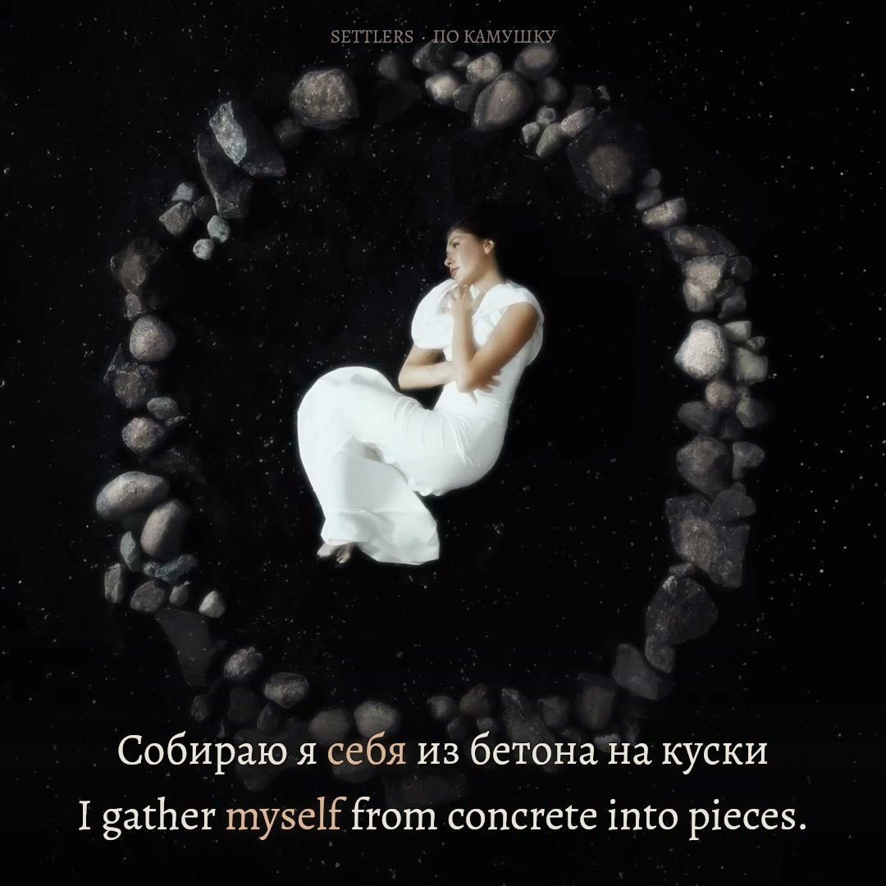

# По камушку — Settlers

**Verified Russian / English films · original 1:1 artwork · authored 9:16 composition · complete upload kit**

The [original recording](https://www.youtube.com/watch?v=oysjDP9Vqdg) places a curled figure inside a real irregular stone ring on dark earth. The films preserve that picture and soundtrack. Thirty existing stone surfaces respond to measured music; the source grain remains their material. Warm, worn typography and a pale clay focus color share the photograph's muted light. The figure, stone outlines and reading glyphs stay fixed.



*Exact decoded frame 3495 at 00:58.250 from the verified 1080×1080, 60 fps final film; original picture frame 1456. The complete source photograph, paired held себя / myself focus and material response remain visible. [Screenshot provenance](evidence/final-stills.json). Original picture and soundtrack: Settlers' source upload.*

## Run and review

```sh
npm ci
npm run features
npm run prepare
npm run check
npm run preview
```

Open the complete review address printed by the preview server. It has play/pause, seeking, exact seconds, cue navigation, 1×/0.75×/0.5× speeds, original-square and 9:16 layouts, muted source comparison, still download and full recovery. The original video element supplies both the soundtrack and picture. Word focus repaints at display cadence against its actual `currentTime`; decoded picture PTS remains separately visible in diagnostics. No lyric timer extrapolates across seeking or buffering.

The authorized local `public/source.mp4` is required and excluded from Git. [The input manifest](source/manifest.json) identifies the exact 1080-square, 25 fps recording, AAC priming, decoded sample extent, source hash and font. Analysis uses the original mix without gain or a shifted zero. Restore the exact MP4 from the verified source-project ZIP in the release. Re-downloading formats 137+140 can produce different container bytes; verify the recorded hash before reusing the timing and do not silently swap recordings.

## Picture and material response

The source is deliberately still artwork throughout 208.8 seconds. [The source study](evidence/source-motion-study.md) distinguishes that stillness from stalled browser decoding. All 5,220 source frames were fingerprinted, and representative samples preserve the same pose and stone geometry.

Each receiving polygon in [the stone plan](public/stone-anchors.json) lies inside an actual stone. A cached material mask uses the locked first source frame's luminance, a seven-pixel inward feather and a qualitative upper-left light direction. The lossless `public/material-reference.png` is a texture reference only; the main picture always comes from the original video. Its fixed identity prevents codec noise from changing material masks when a fresh preview begins at a different timestamp. Screen compositing brightens those textured facets with bounded warm-gray light. It creates no replacement rocks, complete neon perimeter, traveling spectrum or hard polygon rims. Masks occupy about 4.53% of the source frame and protect the person and cloth entirely.

Twenty-four logarithmic bands from 40 Hz to 10 kHz drive the 30 fixed receiving surfaces in clockwise order. The generator preserves stereo mean power, a Hann-windowed 4,096-sample spectrum at 22,050 Hz, 40 ms RMS windows and source-cadence feature rows. These centered windows have finite temporal resolution; they are not millisecond beat markers. The artistic exposure curve is `clamp((band dBFS + 57) / 34)^1.45`, multiplied by a bounded full-recording RMS factor. There is no quiet-section normalization. Per-stone screening is capped; the lower native arc receives 48% of its normal response while lyrics are present.

Native 1080×1080 retains the complete square. Equal-size Alegreya text occupies the lower earth without touching the central figure. Longer constructions wrap both languages at one shared font size; focus changes color and luminance without changing geometry. A continuous soft lower shade protects reading while retaining the stones. Portrait 1080×1920 keeps the entire source square at y212–1292 and places equally prominent text below it. Dim, defocused texture from the source's outer soil blends the added space; it does not duplicate the person or stretch the ring. The source edge feather affects only empty perimeter soil.

The lyrics are a deliberate foreground reading layer on earth, not text claimed to be physically carved into photographed stones. The musical response is attached to actual photographed material. This distinction avoids unsupported claims of a three-dimensional reconstruction.

## Text, timing and uncertainty

[The supplied reference and editorial mapping](source/lyrics-editorial.json) retain all original lines, excluding copied advertisements and recommendations. Thirty performed cues represent the supplied verses, independently repeated run/carry words, all four pebble refrains, both doubled closing chorus lines and the spoken opening. Russian and English remain equal in size, weight, contrast and focus strength. Articles, auxiliaries and encoded pronouns highlight with their complete source meaning; reordered English keeps natural reading order. Irreducible constructions use the union of their contributing source intervals, releasing during unrelated words or gaps.

The original 44.1 kHz sample clock is canonical. Unprompted recognition checks the performed inventory; bounded Whisper and a separate MMS CTC family provide candidates for placement. Original-mix waveform and spectral observations, with an explicitly estimated vocal stem as supporting evidence, refine quiet beginnings and sustained releases. Repeats are measured independently. Model scores are not calibrated timing probabilities. Full-vowel release, neutral line hold and gentle fade remain separate data. All three себя / myself occurrences retain their soft endings with independently selected focus releases at 58.385, 149.700 and 164.820 seconds. Earlier direct-body estimates remain separate from these bounded carries; see `evidence/held-myself-repeat-review.json`.

The spoken opening now has one audible call of the name Yana. Targeted listening rejected the provisional name at 6.127 seconds; it is removed in both languages, while the later call at 7.328 seconds and all other acoustic samples remain unchanged. The original supplied reference and historical recognizer disagreement are preserved. The compressed chorus wording is translated conservatively; the translation does not normalize its intentional-seeming reconstruction paradox into a different metaphor.

Automated contracts, waveform/spectrum inspection, source-motion checks and sampled layout/browser checks establish different facts. They do not establish a complete human listening review or phonetic perfection. The owner attested completion of the current full-recording review at normal speed, uncertain words and held endings at reduced speed, and both layouts before authorizing production. [The bound review](evidence/sync-review.json) records that declaration separately from signal inspection; it does not fabricate per-cue listening telemetry. Historical audits retain their earlier review status. Remaining acoustic uncertainty is preserved in [the handoff](AGENT-HANDOFF.md) and [timing audit](evidence/final-sync-audit.md). The editorial file's `timingStatus` fields preserve the earlier text-preparation stage; the separately bound v6 candidate and validation record describe the completed signal-based timing pass.

## Production and delivery

Production follows the approved `po-kamushku-preview-v6-full-onset-visibility` revision. [Authorization](evidence/production-authorization.json) and [review evidence](evidence/sync-review.json) bind all twelve frozen picture, text, timing, feature, font and drawing inputs. A future change requires a fresh applicable review; an earlier approval does not authorize a different revision.

| Edition | Posting file | Verified size |
| --- | --- | --- |
| YouTube, original 1:1 | `Po-Kamushku-Settlers-YouTube-1080x1080-60fps.mp4` | 23,183,109 bytes |
| TikTok, composed 9:16 | `Po-Kamushku-Settlers-TikTok-1080x1920-60fps.mp4` | 26,677,122 bytes |

Both H.264/BT.709 films contain 12,530 frames on an exact 60 fps grid. Production decodes every original 25 fps picture, selecting `min(5219, floor(n × 5 / 12))` for output frame `n`; the frozen material reference is used only for surface masks. Original AAC is stream-copied. [Full final-file checks](evidence/final-verification.json) passed strict decoding, all frame timestamps, all 8,995 original AAC packets and 9,209,280 decoded stereo samples, protected source-picture presence on every frame, and no near-black intervals. The 208.833333-second video holds the final source picture through the audio tail; its duration differs from the original AAC presentation by 24.331 ms, with no onset offset or audio alteration.

[The separate decoded-scene audit](evidence/decoded-scene-verification.json) passed 829 selected frames in each format, checking all 163 Russian events and 206 English tokens in focused and neutral states, complete cue visibility, source-frame ownership and encoded scene parity. This is finite encoded-pixel evidence; it does not convert perceptual word-boundary uncertainty into acoustic certainty. Final composition proofs were inspected in both formats.

The verified Desktop kit contains 25 files: both posting films, a 1280×720 YouTube thumbnail, a 1200×1600 portrait TikTok cover, titles/descriptions, Russian and English SRT/VTT captions, an upload guide, checksums and verification records. [Staging receipt](evidence/delivery-receipt.json) and [Desktop copy receipt](evidence/desktop-delivery-receipt.json) record independently matched hashes. The [v1.0.0 release](https://github.com/ael-dev3/lyrics/releases/tag/po-kamushku-v1.0.0) contains both films, platform assets, the complete upload ZIP and exact-source project ZIP. All 16 attachments were freshly downloaded and matched their SHA-256 values; after publication, their public download URLs were also checked. [The publication receipt](evidence/release-upload-verification.json) records coverage and identities. The source ZIP preserves committed revision `e35a8440cae9e102e301309ff8f1546b33e981a1`, retained in the default branch through production PR69; later receipt integration does not replace that immutable snapshot. No YouTube or TikTok posting is included.

For the exact reproduction commands and output contract, read [production notes](PRODUCTION-NOTES.md). For the reusable brief, failure prevention and evidence limits, read [production lessons](PRODUCTION-LESSONS.md). `node scripts/render-production.ts --check-gate` fails closed when review, approval or frozen inputs are missing or stale; `--plan` inspects the output contract without encoding. Large upload kits and archives remain outside ordinary Git history.

## Credits

Song, original picture and soundtrack: **Settlers**, from the linked source upload. Its public metadata credits Шелпакова Яна Петровна and Судосьев Олег Павлович, states ℗ Snegiri-music and distribution by ONErpm, and lists release date 26 September 2025. The upload does not identify a separate artwork photographer here; none is inferred.

English translation, typography, synchronized focus, surface relighting and film implementation: Ael, assisted with Codex. Alegreya is distributed under the [SIL Open Font License](public/fonts/Alegreya-OFL.txt), with the font from [Google Fonts' Alegreya source](https://github.com/google/fonts/tree/main/ofl/alegreya). Original media are not represented as open-licensed software assets.

## Portrait visibility follow-up

The delivered TikTok active-word emphasis is documented as too subdued for easy recognition. Both films remain unchanged. Future portrait previews should increase active/neutral distinction and validate focus at realistic viewing size and ordinary brightness, with equal emphasis in both languages. [Known presentation limitation and next-production checks](KNOWN-ISSUES.md). Timing/pixel verification remains valid within its recorded technical scope.

## Final synchronization polish

The [v6 audit](evidence/final-sync-audit.md) reviews every retained onset/release and complete translated meaning. It preserves acoustic selections and the three bounded myself tails, fixes first-word visibility at immediate line handoffs, commits the exact paused word position and prevents neighbouring glyphs from borrowing highlight glow. All active-voice frames now require a fully visible line. The current owner review and render authorization are recorded separately from this signal and software audit; the completed films have their own final-file evidence.
