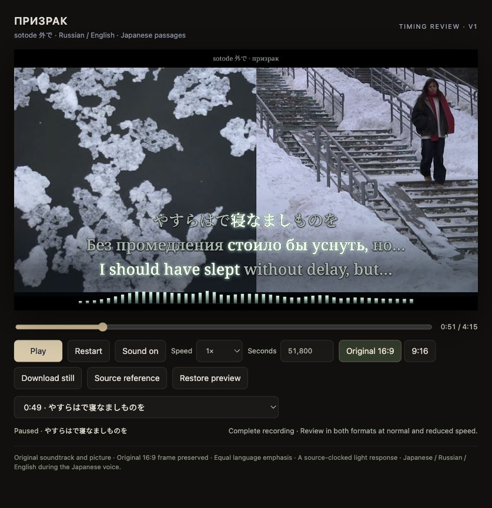

# призрак — sotode 外で

**Complete working preview · Russian / English, with Japanese during Japanese vocals · production not authorized.**

The original [music video and unchanged soundtrack](https://www.youtube.com/watch?v=Psp5vt8BwoY) remain the entire moving picture. Cold paper/silver typography and a fixed measured spectrum follow its winter, library and practical-light imagery. Native 16:9 preserves every source edge; portrait fits the whole sharp frame above a separate readable language block, with dim source-derived atmosphere around it.



*Full-page screenshot of the real browser preview paused at 51.800s. A preview still, not an encoded-film frame. [Provenance](evidence/preview-stills.json).*

## What is complete

- Full 255.094422-second recording, 37 performed cues and 150 independently scheduled source events: 106 Russian words and 44 Japanese lexical/inflection units.
- Russian plus English during Russian passages; Japanese plus original Russian/English translations during Japanese passages. Stable glyph geometry and complete meaning-linked expansions replace fabricated English word timings.
- Opening/closing Japanese fragments absent from the supplied sheet, two complete poem 59 performances, both Russian choruses and every Russian verse repetition. Ads and unrelated recommendations are excluded.
- Quiet prefixes and complete held-body proposals reviewed against the original mix, clock-verified vocal estimates, bounded unprompted transcription and independent CTC/attention candidates. Broad uncertain boundaries remain explicit.
- The closing Japanese entrance overlaps the last Russian night. Both original voice intervals survive; a brief full-size `ночь / night` carry sits above the three-language block. The primary block stays stationary when the carry clears.
- Complete browser playback, seeking, layout switching, source comparison and recovery. Paused timestamp entry stays paused. All 74 actual-source cue stills fit both formats; sample-boundary and semantic-union regressions pass.

## What remains pending

This is a **preview**, not a finished production or a declaration of perfect acoustic accuracy. Current full-song normal-speed listening, uncertain boundaries at reduced speed, both-format perceptual review and explicit current-input render authorization remain pending. The [production gate](evidence/production-gate.json) is closed. Prior songs’ approvals do not apply.

The highest-priority listening points are the Japanese held night endings at 57.9–58.42 and 76.25–76.70, the quiet Russian night prefixes, and the mixed-language 221.65–222.35 handoff. CTC cores cannot resolve every direct-vowel/reverberation boundary. See the [timing record](TIMING.md) and [selected decision ledger](evidence/timing-decisions.json).

## Run the complete preview

Use Node 24+, npm and FFmpeg. Supply the exact locally acquired `public/source.mp4` identified in [source/recording.json](source/recording.json); large source media and analysis stems are excluded from ordinary Git history. The acquisition used official source streams 137+140, H.264/AAC, without soundtrack trimming or re-encoding. A later download/remux can differ byte-for-byte; verify its hash before reusing current features, samples or frozen evidence. Do not simply replace the source hash to make a mismatch pass.

```sh
npm ci
npm run typecheck
npm run build
npm run preview
```

Open `http://127.0.0.1:4333/`. The server binds only localhost and serves GET/HEAD plus byte-range source requests. It stays alive while its process runs; restart with `npm run preview` if needed. `Restore preview` keeps review position, format, speed, sound and playing/paused state while reloading the complete source and scene.

```sh
npm run timeline   # rebuild selected events/mappings from documented proposals
npm run check      # model/gate tests and 74 real-source layout stills
npm run features   # source-bound music measurements; FFmpeg required
```

`npm run render:production` checks current hashes, complete current-song review and explicit authorization before doing anything. No production encoder is provisioned for this preview-only project stage. Browser still exports and diagnostic frame decoding are review evidence, not full lyric-film rendering.

[Visual brief](VISUAL-BRIEF.md) · [Source study](evidence/source-visual-study.md) · [Editorial research](evidence/editorial-research.md) · [Browser checks](evidence/browser-verification.json) · [Local validation](evidence/local-validation.json) · [Agent handoff](AGENT-HANDOFF.md) · [Three-language workflow](../../docs/three-language-lyric-workflow.md)
