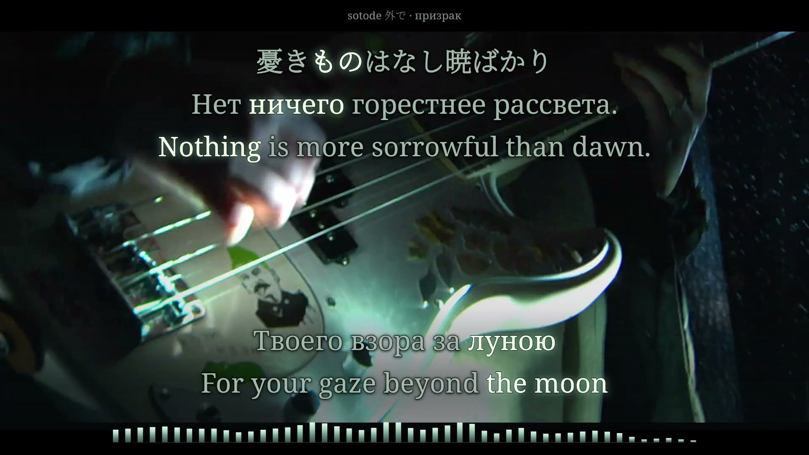

# призрак — sotode 外で

**Verified complete films · Russian / English, with Japanese during Japanese vocals · native 16:9 and portrait 9:16 upload kit ready.**

The original [music video and unchanged soundtrack](https://www.youtube.com/watch?v=Psp5vt8BwoY) remain the entire moving picture. Cold paper/silver typography and a fixed measured spectrum follow its winter, library and practical-light imagery. Native 16:9 preserves every source edge; portrait fits the whole sharp frame above a separate readable language block, with dim source-derived atmosphere around it.



*Exact decoded output frame 12858 at 214.300s from the verified 1920×1080, 60 fps film. Original picture and soundtrack: sotode 外で. [Final-still provenance](evidence/final-stills.json). Earlier browser captures remain preview evidence.*

## What is complete

- Full 255.094422-second recording, 38 performed cues and 156 independently scheduled source events: 106 Russian words and 50 Japanese lexical/inflection units.
- Russian plus English during Russian passages; Japanese plus original Russian/English translations during Japanese passages. Stable glyph geometry and complete meaning-linked expansions replace fabricated English word timings.
- Opening/closing Japanese fragments absent from the supplied sheet, two complete poem 59 performances, both Russian choruses and every Russian verse repetition. Ads and unrelated recommendations are excluded.
- Quiet prefixes and complete held-body proposals reviewed against the original mix, clock-verified vocal estimates, bounded unprompted transcription and independent CTC/attention candidates. Broad uncertain boundaries remain explicit.
- A newly recovered Japanese backing pair at 212.34–221.06 joins the closing Japanese pairs on an independent upper reading track. Its full Japanese/Russian/English block sits above the complete Russian/English foreground; neither voice loses its original held body. See the [overlap revision](OVERLAP-REVISION.md).
- Complete browser playback, seeking, layout switching, source comparison and recovery. Paused timestamp entry stays paused. All 76 actual-source cue stills fit both formats; sample-boundary and semantic-union regressions pass.

## Delivery and evidence

Both complete films contain 15,306 frames at 60 fps (255.10s): **1920×1080 YouTube** and **1080×1920 TikTok**. The original 25 fps pictures retain their cadence without motion interpolation; the complete stereo AAC remains byte-identical, with 11,249,664 decoded samples. The final authored picture holds through the short audio tail. No new source-unexplained near-black interval was found.

[Current-input approval](evidence/production-authorization.json) and [owner-attested listening scope](evidence/sync-review.json) are complete for all 38 cues. [Full encoded-file verification](evidence/final-verification.json) and [finite decoded-scene verification](evidence/decoded-scene-verification.json) separately passed in both formats. Each format's 423 tokens was tested in focused and neutral states, including independent simultaneous vocal blocks. Technical and glyph checks do not establish perceptually exact acoustic boundaries or replace listening judgment.

The new Desktop kit includes each complete film, dedicated covers, YouTube title/description, TikTok description, optional RU/EN/JA SRT/VTT captions and bound verification. [Staging receipt](evidence/delivery-receipt.json) · [Desktop copy receipt](evidence/desktop-delivery-receipt.json) · [Cover review](evidence/cover-assets.json). Media backup remains a separate authenticated draft operation; source integration is not public media release or platform posting.

Quiet Japanese direct-vowel/room-decay edges and the masked backing entrance retain documented interpretation ranges. Review these before any retiming: held night endings at 57.9–58.42 and 76.25–76.70, the quiet Russian night prefixes, Japanese 212.20–212.60 entrance / 213.32–213.92 handoff, and mixed-language 221.65–222.35 passage. See [timing](TIMING.md) and [selected decisions](evidence/timing-decisions.json). The accepted source samples remain unchanged in production.

## Run the complete preview

Use Node 24+, npm and FFmpeg. Supply the exact locally acquired `public/source.mp4` identified in [source/recording.json](source/recording.json); large source media and analysis stems are excluded from ordinary Git history. The acquisition used official source streams 137+140, H.264/AAC, without soundtrack trimming or re-encoding. A later download/remux can differ byte-for-byte; verify its hash before reusing current features, samples or frozen evidence. Do not simply replace the source hash to make a mismatch pass.

```sh
npm ci
npm run typecheck
npm run build
npm run preview
```

Open `http://127.0.0.1:4333/`. The server binds only localhost and serves GET/HEAD plus byte-range source requests. It stays alive while its process runs; restart with `npm run preview` if needed. `Restore preview` keeps review position, format, speed, sound and playing/paused state while reloading the complete source and scene.

```sh
npm run timeline   # rebuild selected events/mappings from documented proposals
npm run check      # model/gate tests and 76 real-source layout stills
npm run features   # source-bound music measurements; FFmpeg required
```

The production encoder is provisioned separately from the preview. `npm run render:production -- --format landscape` and `npm run render:production -- --format portrait` check current hashes, complete current-song review and explicit authorization before decoding or capturing. `npm run check:production` validates clock and stream behavior without starting a film. Pass actual completed paths to both verifiers:

```sh
npm run verify:final -- --landscape renders/Prizrak-Sotode-YouTube-1920x1080-60fps.mp4 --portrait renders/Prizrak-Sotode-TikTok-1080x1920-60fps.mp4
npm run verify:scene -- --landscape renders/Prizrak-Sotode-YouTube-1920x1080-60fps.mp4 --portrait renders/Prizrak-Sotode-TikTok-1080x1920-60fps.mp4
```

The per-format intermediate reports are explicitly partial; the combined reports establish both-format checks. Browser stills and diagnostic source decoding are review evidence, not full lyric-film rendering. [Production process](PRODUCTION-NOTES.md) · [Reusable prevention lessons](PRODUCTION-LESSONS.md).

[Visual brief](VISUAL-BRIEF.md) · [Source study](evidence/source-visual-study.md) · [Editorial research](evidence/editorial-research.md) · [Browser checks](evidence/overlap-browser-v2.json) · [Local validation](evidence/overlap-validation-v2.json) · [Agent handoff](AGENT-HANDOFF.md) · [Three-language workflow](../../docs/three-language-lyric-workflow.md)
