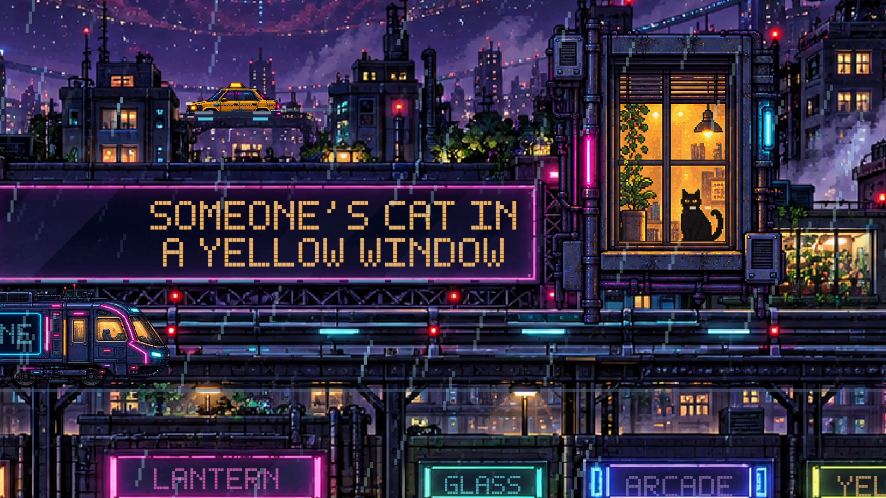

# Rainline pixel lyric film

An original cyberpunk city scene for the soundtrack in the [linked SpikeRiser post](https://x.com/SpikeRiser/status/2102888874858959029). The frozen `preview-v4-native` revision places lyrics within the existing pixel-art sign apertures and keeps walkers on the scene's sidewalks. The full recording plays in a local review page with distinct landscape and portrait compositions. The [production notes](PRODUCTION-NOTES.md) document the complete study, transcription, city revisions, scoped exports, verification, and remaining review limits.



*Frame 5310 at 177.000 s from the checksum-verified 1920 × 1080 final MP4. Original scene artwork was generated for this project and animated in Canvas; the source soundtrack belongs to its respective creators. The screenshot documents the picture, not acoustic timing accuracy.*

**Status:** the v4 preview is frozen as `8933b9713474b0b9e42a7b19130d5f3a6728fde6eb80cf7e2dd463072be1f2cb`. Two local final MP4s, [portrait](evidence/delivery/portrait.json) and [wide](evidence/delivery/landscape.json), were technically verified under separate scoped `owner-approved-preview` acceptance. Lyric text and timing remain provisional. Complete actual-audio and both-format synchronization review is still pending, so the committed default production gate and its render authorization remain closed.

## Open the review preview

Use Node 24 or newer and restore the locked soundtrack to `public/soundtrack.m4a`. The soundtrack is intentionally excluded from Git. `SOURCE-LOCK.md` records its identity and preparation evidence.

```sh
npm ci
npm run typecheck
npm run timing:verify
npm run preview
```

Open `http://127.0.0.1:4388/`. The page starts paused at zero and offers play, restart, seeking, normal/0.75×/0.5× speed, both formats, cue navigation, saved notes, and a **Restore visuals** control that keeps the current position. `Start Preview.command` restarts the server after dependencies are installed. A different local port can be selected with `REVIEW_PORT`.

The browser and Remotion call the same `paintCity(context, frame, format)` function in `src/city.ts` for distinct landscape and portrait canvases. Soundtrack time selects the 60 fps scene frame, including after seeks. The scoped final outputs sample that scene at 30 fps in 1920 × 1080 and 1080 × 1900 frames. `src/spectrum.json` is the measured source feature stream; `src/word-cues.json` contains the current performed text and word timing. The source AAC is preserved in the local soundtrack file.

The earlier `preview-v2-city` and `preview-v3-street` identities and review evidence are preserved in `evidence/history/`. The current `preview-v4-native` identity is in `evidence/preview-identity.json`, and its limited technical checks are in `evidence/technical-preview-checks.json`. Any subsequent change to soundtrack, images, code, or cue data needs another freeze and review. Freezing a preview does not authorize a full render.

For a standalone review file, run `node scripts/build-portable.ts <destination>` after building and freezing the completed revision. The script rejects missing or stale frozen identity. It writes `Rainline Preview.html` with the source AAC, scene art, player, and matching identity embedded. The v4 handoff file's six embedded media assets and identity passed static byte checks. Open the HTML file directly in a browser; it needs no local server. Standalone file playback has not yet been verified. Notes remain in that browser, with a JSON download fallback if browser storage is unavailable.

## Production boundary

`npm run production:gate` rejects missing or changed preview inputs, incomplete actual-audio and both-format cue review, unresolved synchronization defects, or missing explicit authorization bound to this song and revision. `npm run render -- --production --format landscape|portrait` invokes the same gate before capture or encoding. The committed review and authorization records are pending. Saving notes in the preview does not alter them or authorize production. The historical scoped exports used separate, identity-bound [adapters and acceptance](PRODUCTION-NOTES.md#5-scoped-final-exports-and-gate-distinction); they did not change the default gate or certify the pending listening review.

The [repository preview-first workflow](../../docs/preview-before-render.md), [pixel-art workflow](../../docs/pixel-art-lyric-film-workflow.md), and [production preferences](../../docs/track-workflow-preferences-and-known-issues.md) govern further review and delivery.
