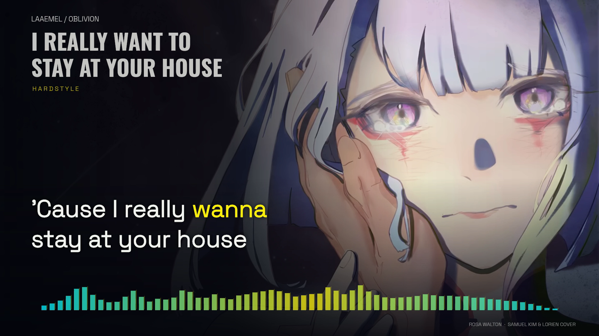
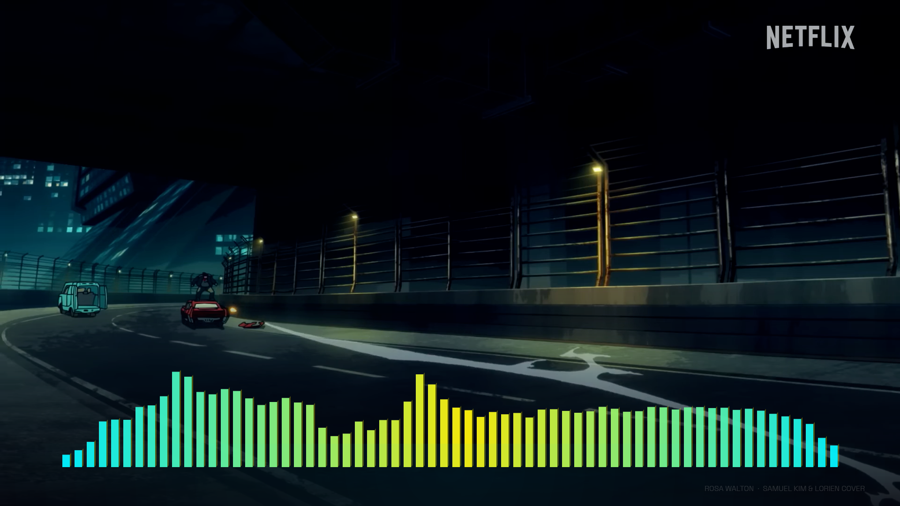
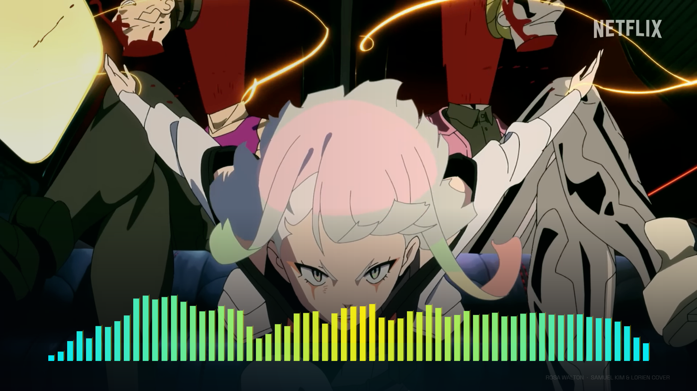

# I Really Want to Stay at Your House — Hardstyle

**English · approved full-recording edition · 16:9 and 9:16 · production authorized**

*Frame at 01:04 decoded from the verified v1 landscape film. Source artwork: xiaocha81269, credited by the music upload.*

The complete 3:47.718 recording pairs fixed English lyrics with Edgerunners yellow **#FCEE0A**. Quiet sections retain the source illustration. Two silent edits of the official Netflix trailer replace it during the hard electronic sections; measured spectrum travel rises with the arrangement. The original music is the only soundtrack.

## Preview

Run `npm ci`, then `npm run preview`; open **http://127.0.0.1:4323/**. The local `Start Preview.command` reopens an existing server or starts one. The player supports normal, 0.75× and 0.5× playback, direct seeking, chapter jumps, both layouts and **Restore visuals**. A clean composition is available with `?clean=1`; `?t=102.7&format=portrait` opens a specific checkpoint. Review marks never grant render approval.

Local media preparation is required on a fresh clone. Source recordings and edited MP4 assets are not uploaded to the repository. The source URLs and selected identities are in `source/media-manifest.json` and `source/trailer-edit.json`.

1. Obtain the selected music upload as `public/source.mp4`; stream-copy its audio to `public/soundtrack.m4a`. The existing source artwork and locked timings are supplied.
2. Obtain the Netflix trailer as `public/trailer.mp4` (1920×1080, 24000/1001 fps for this edition).
3. Run `node scripts/build-trailer-assets.ts` to create the two **silent footage assets**, without rendering the song. This preserves the edit decision list, fixed output frame counts and source framing. Pass `drop-two` to rebuild only that asset, leaving the first encoded edit untouched.
4. Run `npm run check`, `npm run review:build`, then `node scripts/review-server.ts`.

Node 24+, FFmpeg with libx264, npm dependencies and the included OFL fonts are required. Alignment reproduction additionally uses Demucs, torchaudio MMS and stable-whisper through `ALIGN_PYTHON`; it is not required merely to play the preview. `scripts/analyze.ts` consumes original decoded stereo float PCM in `analysis/audio-delivery.f32`; `ALIGN_PYTHON=python3 node scripts/analyze-beats.ts` additionally measures broadband attacks with NumPy; `scripts/motion.ts` derives presentation intensity from the spectrum and attack events. `python3 scripts/verify-trailer-assets.py` checks source-frame timestamps, decoded action accents and both complete silent assets. These analysis tools are optional for playback; committed measurement data is included.

## Picture edit

*Composition still at 01:52; animation from the [official Netflix trailer](https://www.youtube.com/watch?v=JtqIas3bYhg). Original Netflix identification remains in the source picture.*

- First asset: **01:42.350–02:09.150**, 1,608 frames.
- Second asset: **02:59.150–03:33.550**, 2,064 frames.
- The first edit is unchanged. The second contains **28 fresh shots**, with no overlapping source ranges from the first edit and no repeats within itself. Its first 6.4 seconds favor character reactions beneath the closing vocal lines; physical action takes over at 03:05.550, followed by shorter details and a quiet closing image at 03:31.150 as the bass recedes.
- Short dissolves keep the trailer inside the selected intensity windows. Cuts use quarter-note groups of the measured 150 BPM pulse. The current 43 shot starts have a median absolute residual of **0.703 ms** against nearby spectral-flux peaks. These peaks are signal estimates around an editorial grid, not manually certified beat annotations.
- Characters, speed trails, city scale and physical action carry the impact. Trailer dialogue, subtitles, promotional cards and added full-screen flashes are omitted from the selected edit. Short action shots receive shorter holds; atmospheric views can breathe.
- Portrait uses a shot-specific horizontal focal point and continuous bottom shading. Landscape opens the whole picture during instrumental drops. The remaining chorus lyrics retain fixed geometry and contrast during their overlap with the second edit.
- The first edit retains six selected source action frames. The second adds **17 authored action accents** across 15 shots: muzzle flashes, recoil poses and impact frames meet measured quarter/eighth-note attacks while preserving every shot boundary and source range. All 23 action frames and 56 trim endpoints are verified against encoded pixels. Natural character holds remain unchanged.
- The spectrum keeps a smooth clearance zone below visible lyrics, then regains full instrumental reach. A full-song audit checks actual glyph descenders against every intersecting bar and facet in both layouts: 832,855 comparisons, zero collisions and at least 37.524 pixels of clearance.
- The preview decodes 200 ms ahead and selects cached pictures by their actual frame timestamps on the music clock. Seeking primes the picture before music resumes; portrait crops follow the selected picture frame.
- Abstract 3D assets are not loaded or required by this edition.

*Composition still from the second edit at 03:16; original trailer animation, not a full-film render.*

[Lyric clearance still](evidence/preview-lyric-clearance.png) · [Full-frame clearance audit](evidence/visual-clearance.json) · [Portrait composition](evidence/preview-portrait.png) · [Edit decision list](source/trailer-edit.json) · [Asset identities](evidence/trailer-assets.json) · [Freshness and unchanged-input audit](evidence/edit-freshness.json) · [Beat measurements](evidence/beat-audit.json) · [Encoded action-frame checks](evidence/trailer-asset-verification.json)

## Lyrics and review limits

The original lyric sheet is preserved in `source/lyrics-supplied.txt`. This remix does not follow the entire original-song arrangement. The current preview contains **45 phrases / 284 word events**, independently aligned for repeated performances, across the full untouched recording.

Original-mix and isolated-vocal MMS candidates, wider-context candidates and independent Whisper alignment were compared. Wider context repaired several clipped first onsets; it also failed in part of the second chorus, so it is not adopted wholesale. Raw model scores are not treated as calibrated accuracy. Every candidate and final adopted interval is retained in `analysis/word-candidates.json`.

**Listening review is complete by explicit human attestation.** The owner confirmed the complete recording at normal speed, uncertain events and held endings at reduced speed, and both delivery layouts for the unchanged v5 preview. This includes the processed textures, repeated chorus endings and final vocal. The 121 model-flagged events remain preserved as candidate evidence; their raw scores are not rewritten into a machine accuracy claim. [Review scope and frozen identity](evidence/owner-acceptance-v5.json).

Production was explicitly authorized for the reviewed v5 inputs. The render entry point checks both listening review and authorization against current hashes before encoding. Run `npm run render -- landscape` or `npm run render -- portrait`; existing output files are preserved rather than silently overwritten. The renderer uses the same scene function at exact 60 fps times, sequentially decoded trailer frames and stream-copied original AAC. [Complete production workflow](WORKFLOW.md).

## Verification and credits

[Complete workflow](WORKFLOW.md) · [Technical checks](evidence/structural-check.json) · [Browser review](evidence/preview-verification.md) · [Per-event playback measurements](evidence/playback-sync.json) · [Production gate](evidence/production-status.json) · [Reusable lessons](PRODUCTION-LESSONS.md)

- [Selected music upload](https://www.youtube.com/watch?v=tXFVl2Qb4zc): Laaemel. Its description links an Oblivion remix and credits the Samuel Kim / Lorien cover.
- Original song: Rosa Walton / Hallie Coggins. [Cover credited by the upload](https://www.youtube.com/watch?v=_AAdae7diOU).
- Artwork credit in the music upload: **xiaocha81269**; [linked artwork](https://wallhaven.cc/w/3lo8q3).
- Animation: **Cyberpunk: Edgerunners**, from the [official Netflix trailer](https://www.youtube.com/watch?v=JtqIas3bYhg). This fan lyric preview is not an official production or endorsement.
- Highlight color: `#FCEE0A`, verified in the stylesheet of the [official Edgerunners site](https://www.cyberpunk.net/en/edgerunners).
- Space Grotesk and Oswald fonts: included OFL notices in `public/`.

Music, lyrics, animation, characters, source artwork and fonts retain their respective ownership and licences. The repository's authored-code licence does not transfer rights to them.
