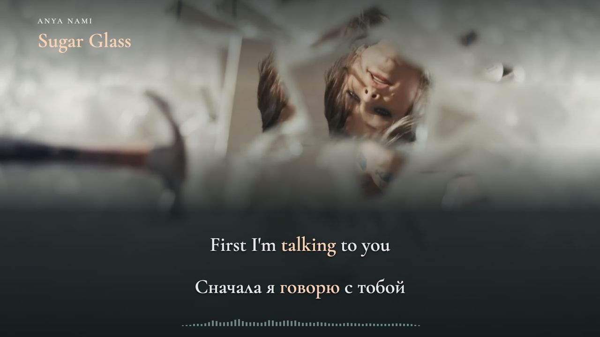

# Anya Nami — Sugar Glass

**English + Russian · preview only · no production film rendered**



*Live browser preview at 01:30.000, captured at the normal review display size. This is a preview screenshot, not a decoded final-film frame. Original music, performance and mood video: [Anya Nami](https://www.youtube.com/watch?v=-NsQ8_WLq2s).*

The full-recording review player pairs the supplied English lyrics with Russian meaning and stable, color-only word/semantic focus. It applies the **Lyrics workflow in general**. The source video's cream, blue and black imagery determines the palette; warm peach focus and a compact muted-teal spectrum support the picture. English and Russian use the same Cormorant Garamond Semibold size, weight and color roles.

| Item | Preview scope |
| --- | --- |
| Recording | Original AAC, 44.1 kHz stereo; 10,202,112 decoded samples; 231.340408 s |
| Compositions | Landscape 1920×1080 and portrait 1080×1920; 60 fps event display |
| Footage | Original 25 fps; local 4K VP9 retained, official 1080p H.264 used for browser playback |
| Lyrics | 71 cues; 424 English source tokens; 405 Russian words; independent lead/backing layers |
| Typography | Equal 64 px in landscape, 72 px in portrait; reflow instead of shrinking one language |
| Visualizer | 64 measured 20 Hz–20 kHz bands; bounded artistic travel, opacity 0.55; no word decoration |
| Approval | Preview available; complete listening review pending; production authorization absent |

## Review the preview

Run from this directory with Node 24 or newer and the locked dependencies:

```sh
npm ci
npm run check
npm run preview
```

Open `http://127.0.0.1:4318/`. Use the format buttons, timeline and 0.75×/0.5× controls. Click a cue, then a source word, to inspect its full Russian correspondence and acoustic candidates. Notes and proposed boundaries stay in the review draft; **Save review progress** also writes the ignored local listener record. Saved notes never authorize production or replace the frozen cue map. A material source change invalidates the draft identity.

For clean live review, add `?clean=1&t=90`; add `&format=portrait` for the portrait layout. The separate `review/geometry.html` checks browser glyph geometry after the review bundle is built.

Downloaded media are excluded from Git. Restore the exact source files listed in [the input manifest](source/input-manifest.json) before local playback. The separately supplied local review package contains the remux, font and bundled player and needs no npm install. It is not a production deliverable.

## Timing and review limits

The [review record](evidence/cross-language-sync-review.md) lists unresolved wording, overlapping-refrain and release questions. Timing is model-assisted and provisional. Candidate disagreement remains visible rather than being presented as completed listening. Every target word is source-linked, including grammatical expansions; non-contiguous source groups preserve their gaps.

Independent recognition on mix/vocals is followed by bounded MMS, Whisper and an English wav2vec encoder. The original audio clock is unchanged. Nearest-frame quantization at 60 fps is at most half a frame; this does not describe the accuracy of inferred vocal boundaries. Repeated choruses are aligned separately.

The raw band artifact preserves stereo dBFS RMS measurements. The separate artistic mapping is `h = 2 + clamp((dB + 65) / 60, 0, 1)^1.5 × travel`, with travel 26 px landscape / 38 px portrait and opacity 0.55. This unlabeled decorative display is not a calibrated scale. The chosen restraint comes from this song's imagery and arrangement, not a borrowed song-specific treatment.

## Preview-before-render enforcement

`npm run render` checks authorization and synchronization before any output work. The preview-only edition contains no production encoder; direct Remotion capture also refuses. Tests cover missing approval, another song/revision, stale input hashes, incomplete sync review and prevention of output creation. A passing check or merged PR does not open the gate.

After review, record explicit approval for this song and revision, resolve the full sync checklist and only then add the production adapter. Follow [preview before render](../../docs/preview-before-render.md).

## Source and reproduction

- Original recording and mood video: **Anya Nami — Sugar Glass**. No production-crew credits were returned in the source description; none are invented.
- Russian meaning, mapping and added presentation: this Lyrics project, assisted with Codex.
- Bundled typeface: Cormorant Garamond, SIL Open Font License; [license](public/CormorantGaramond-OFL.txt).
- Authored application/analysis/QA code: strict TypeScript 7.0.2. Python bridges are limited to existing pretrained audio-model interfaces.
- Stable input identities: [input manifest](source/input-manifest.json), [preview hashes](evidence/preview-identity.json), [browser geometry](evidence/browser-geometry.json), [preview verification](evidence/preview-verification.json).

Model rebuilding requires `ALIGN_PYTHON` pointing to an environment with torch, torchaudio, stable-whisper, demucs, soundfile and uroman plus the named pretrained weights. Run `scripts/prepare-text.ts`, the documented model bridges and `scripts/build-cues.ts`, then `scripts/layout.ts` and `scripts/analyze.ts`. Rebuilding inference does not imply identical boundaries and requires renewed review. Preserve existing listener progress before intentionally starting another revision.
