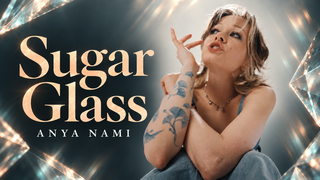
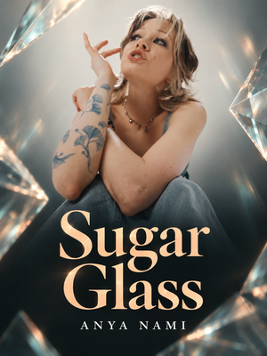

# Sugar Glass — publishing kit

The complete local posting folder contains both verified films, separate platform copy and matching dedicated covers. Every delivered file was verified by SHA-256. The original film delivery and its source identities remain unchanged; this addition is recorded in the [posting-handoff addendum](../evidence/posting-handoff-addendum.json).

| Platform | Video in posting folder | Cover | Copy |
| --- | --- | --- | --- |
| YouTube | `YouTube/Sugar-Glass-landscape-1920x1080-60fps.mp4` | [1920×1080 thumbnail](Sugar-Glass-YouTube-Thumbnail-1920x1080.jpg) | [Title](YouTube-Title.txt), [description](YouTube-Description.txt) |
| TikTok | `TikTok/Sugar-Glass-portrait-1080x1920-60fps.mp4` | [1200×1600 profile cover](Sugar-Glass-TikTok-Cover-Profile-1200x1600.jpg) | [Title](TikTok-Title.txt), [description](TikTok-Description.txt) |

Both films run approximately 3:51 at 60 fps and contain English word highlighting. They are byte-identical copies of the verified delivery. Full videos remain local; no platform upload or public binary release was performed.

## Cover design and review

These are **AI-assisted promotional adaptations**, distinct from the decoded film screenshots in the main README. The covers retain the current track's charcoal, cream, pale peach and muted aqua palette, confident serif title and glass motifs. The portrait cover stacks the title and artist; the landscape cover gives the title and face separate regions. The dedicated TikTok cover is **1200 pixels wide × 1600 tall, 3:4 width:height**, separate from the 9:16 video.

Both were generated using the built-in image-generation tool, with the original performance frame at 03:06 as an identity reference and the approved film as a palette reference. Exact prompts and selected originals are preserved in [Cover-Source](Cover-Source/). The [manifest](cover-manifest.json) records output dimensions, source dimensions, normalization and delivered-copy hashes. The [review](Cover-Review.md) documents native, small-size and conservative crop checks. These are local simulations; no actual upload preview is claimed.

Export dimensions do not imply native generated detail. The portrait original was uniformly resized from 1086×1448; the landscape original was proportionally resized from 1672×941 with negligible edge cropping. Both RGB JPEGs have square pixels and no rotation dependency. Full title, artist and key facial features remain present when 5% is removed from each edge.

Original music, lyrics, recording, performance, mood video and adapted source imagery: [Anya Nami — Sugar Glass](https://www.youtube.com/watch?v=-NsQ8_WLq2s). Added lyric presentation and visualizer: Ael, assisted by OpenAI Codex, following the Lyrics workflow in general. Publishing copy credits the source and discloses AI assistance. The source-derived covers remain subject to the repository's [third-party rights exclusions](../../../LICENSE.md).
