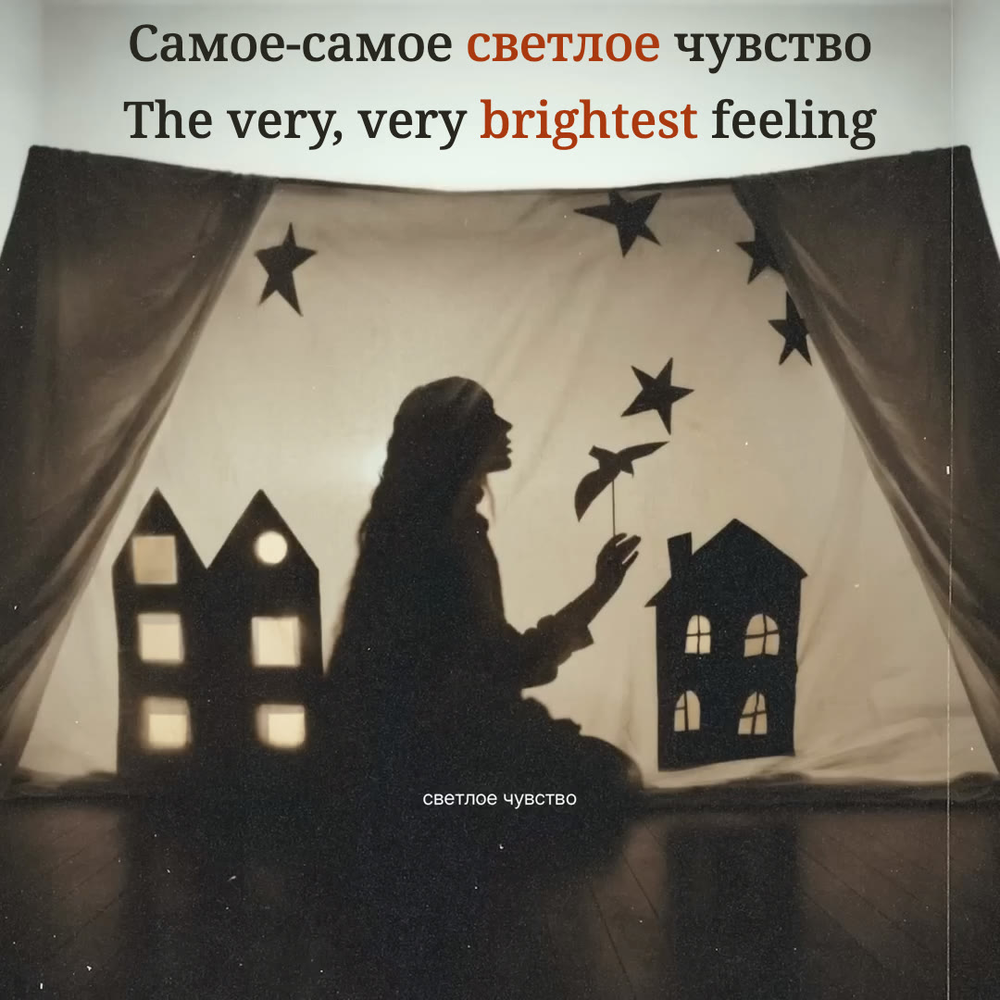

# Светлое чувство — shadow-theatre preview

**Settlers · Russian / English · complete recording · preview only**



*Live browser canvas at 00:32.495; native source frame 812, picture PTS 00:32.480. This is a complete preview still, not an encoded final film. [Still identities and attribution](evidence/preview-stills.json). [Portrait composition at the same source time](evidence/preview-portrait-32.495.jpg).*

The [original upload](https://www.youtube.com/watch?v=UANr7uyRZ3w) uses a square photograph of a paper shadow theatre. Preserve that photograph, its seated figure, bird, stars, curtains and printed title. Ink-like bilingual lyrics occupy the unoccupied pale strip above the stage; ten existing house windows carry measured musical light. No replacement scenery or free-standing spectrum is added.

The complete browser preview supports the original 1080×1080 composition and a separately composed 1080×1920 portrait, normal / 0.75× / 0.5× playback, precise seeking, a muted source comparison and recovery. Portrait preserves the complete square, continues only unoccupied sky/floor material and reserves the top interface area for readable text.

**Review state:** local structural, semantic, signal, all-cue layout and real-browser technical checks passed for the bound preview. Full actual-audio listening at normal/reduced speed and in both layouts remains pending. This song has no production-render authorization. No full lyric film or posting kit has been rendered.

## Reproduce

Requirements: Node.js 24+, ffmpeg/ffprobe and the exact recording. Source media and bulky analysis/stems are excluded from Git; metadata, selected timing, mappings, font license and measured features are retained.

```sh
npm ci
yt-dlp --no-playlist -f '137+140' --merge-output-format mp4 -o 'public/source.%(ext)s' 'https://www.youtube.com/watch?v=UANr7uyRZ3w'
ffmpeg -v error -ss 1 -i public/source.mp4 -frames:v 1 -update 1 public/source-reference.png
npm run prepare
npm run check
npm run preview
```

Open `http://127.0.0.1:4334/`. Verify the source SHA-256 before preparation; a newly encoded or different upload is not the same recording. `npm run features` rebuilds the measured feature file. `node scripts/stills.ts` creates shared-scene review stills, not a film export. The optional `--design` path requires a separately labelled local synthetic fixture and must never supply preview timings.

## Evidence and next-stage handoff

- [Locked recording identity](source/recording.json).
- [Translation and fine-grained contributors](source/english-editorial-draft.json), [editorial rationale](evidence/editorial-review.md).
- [Selected acoustic proposals](source/russian-timing-proposals.json), [independent signal review](evidence/independent-sync-review.md).
- [Primary source-signal decisions and limits](evidence/source-signal-review.md), [all-word changes from the sparse baseline](source/selected-word-decisions.json). Bulky local panels, raw model output and stems are deliberately excluded from Git.
- [Source-art study](evidence/source-visual-study.md), [integration and phone-size review](evidence/visual-integration-recommendations.md).
- [Current local/browser technical results](evidence/technical-checks.json), [complete browser stills](evidence/preview-stills.json).
- [Exact current preview inputs](evidence/preview-inputs.json), [separate technical/listening/authorization state](evidence/review-status.json).
- [Agent startup and reproduction](AGENT-HANDOFF.md).

Original music/artwork are credited to Settlers and the linked source upload; release metadata identifies Snegiri-music and ONErpm. The source description names Яна Петровна Шелпакова and Олег Павлович Судосьев as lyricists. The English translation and added composition belong to this project. No redistribution license for the original recording is inferred from the public link.
