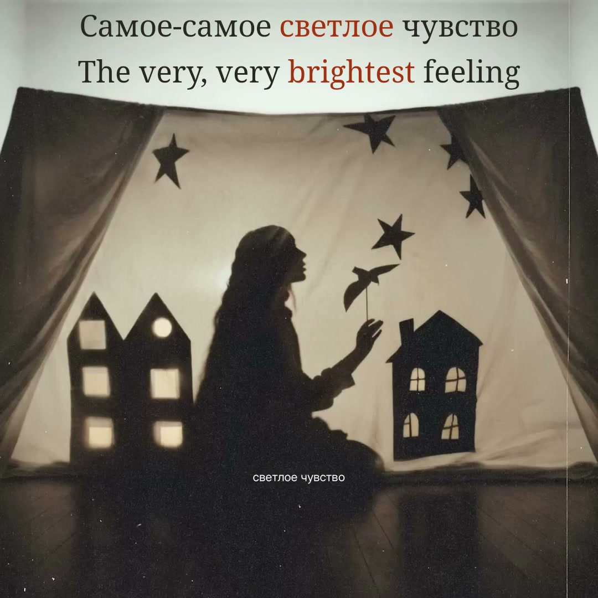

# Светлое чувство — shadow-theatre lyric film

**Settlers · Russian / English · complete native-square and portrait films · v3**



*Frame1950 decoded from the verified native MP4 at 00:32.500; original source frame 812 /PTS 00:32.480. This is the actual final film, not a browser screenshot or cover. [Delivery still provenance](evidence/final-stills.json). [Portrait frame at the same time](evidence/final-portrait-32.500.jpg).*

The [original upload](https://www.youtube.com/watch?v=UANr7uyRZ3w) uses a square photograph of a paper shadow theatre. Preserve that photograph, its seated figure, bird, stars, curtains and printed title. Ink-like bilingual lyrics occupy the unoccupied pale strip above the stage; ten existing house windows carry measured musical light. No replacement scenery or free-standing spectrum is added.

The complete browser preview supports the original 1080×1080 composition and a separately composed 1080×1920 portrait, normal / 0.75× / 0.5× playback, precise seeking, a muted source comparison and recovery. Portrait preserves the complete square, continues only unoccupied sky/floor material and reserves the top interface area for readable text.

**Current state:** owner review and current-v3 render approval are recorded. Both complete 60 fps films passed strict decoding, every-frame timestamp and protected-picture checks, exact AAC packet/priming and decoded PCM comparisons, and 534 shared-scene encoded-frame comparisons per format. The 21-file Desktop posting kit is hash verified. No video-platform posting is recorded.

## Reproduce

Requirements: Node.js 24+, ffmpeg/ffprobe and the exact recording. Source media and bulky analysis/stems are excluded from Git; metadata, selected timing, mappings, font license and measured features are retained.

```sh
npm ci
yt-dlp --no-playlist -f '137+140' --merge-output-format mp4 -o 'public/source.%(ext)s' 'https://www.youtube.com/watch?v=UANr7uyRZ3w'
ffmpeg -v error -ss 1 -i public/source.mp4 -frames:v 1 -update 1 public/source-reference.png
npm run prepare -- --revision=svetloe-chuvstvo-v3-soft-window-light
npm run check
npm run preview
```

Open `http://127.0.0.1:4334/`. Verify the source SHA-256 before preparation; a newly encoded or different upload is not the same recording. `npm run features` rebuilds the measured feature file. `node scripts/stills.ts` creates shared-scene review stills, not a film export. The optional `--design` path requires a separately labelled local synthetic fixture and must never supply preview timings.

## Evidence and next-stage handoff

- [Locked recording identity](source/recording.json).
- [Translation and fine-grained contributors](source/english-editorial-draft.json), [editorial rationale](evidence/editorial-review.md).
- [Selected acoustic proposals](source/russian-timing-proposals.json), [independent signal review](evidence/independent-sync-review.md).
- [Primary source-signal decisions and limits](evidence/source-signal-review.md), [all-word changes from the sparse baseline](source/selected-word-decisions.json). Bulky local panels, raw model output and stems are deliberately excluded from Git.
- [Source-art study](evidence/source-visual-study.md), [integration and phone-size review](evidence/visual-integration-recommendations.md).
- [Current local/browser technical results](evidence/technical-checks.json), [complete browser stills](evidence/preview-stills.json).
- [Exact current preview inputs](evidence/preview-inputs.json), [separate technical/listening/authorization state](evidence/review-status.json).
- [Agent startup and reproduction](AGENT-HANDOFF.md).

Original music/artwork are credited to Settlers and the linked source upload; release metadata identifies Snegiri-music and ONErpm. The source description names Яна Петровна Шелпакова and Олег Павлович Судосьев as lyricists. The English translation and added composition belong to this project. No redistribution license for the original recording is inferred from the public link.

## Current translation refinement

In v2, **рядом со мной будут не те** reads **those next to me won’t be the same**. This makes the negative identity contrast clear while leaving the expected people unnamed. Separate **next / to / me** follows `рядом / со / мной`; **won’t** combines `будут / не` as an interval union, **be** follows `будут`, and `те` carries the recast subject **those** plus **the same**. A compressed **others** draft remains only in the historical v1 audit. All source boundaries and reading lifetimes are unchanged.

[V2 translation correction still](evidence/preview-v2-native-74.745.jpg) · [V2 portrait translation correction still](evidence/preview-v2-portrait-74.745.jpg). These are shared-scene stills at 01:14.745 using the canonical 1-second source photograph; the live browser was checked separately. These v2 correction images retain their historical lighting; the opening image now shows the v3 treatment.

## Current window-light refinement

V3 softens all ten measured window responses with a centered source-time Gaussian envelope: 80 ms sigma, ±200 ms support at the feature file’s 25 fps, followed by linear source-time interpolation. The upper-left rectangle (`pane-01`) uses half the normal multiply/screen modulation. Its isolated lowest-band response previously produced conspicuous abrupt changes. This retains the photographed light and paper texture while reducing the added motion. The cache is independent of playback history, so pause, seeking and reduced speed reconstruct the same lighting. Source timing and bilingual mapping remain identical to v2.

[Window response measurements](evidence/window-light-review.json) document the improvement separately from listening judgment. [Visual review and scope](evidence/visual-integration-recommendations.md) retain earlier evidence without relabelling it as current browser or final-film proof.

[Complete production method and prevention checklist](PRODUCTION-NOTES.md).

## Verified delivery

| Platform | Film | Size | SHA-256 |
| --- | --- | --- | --- |
| YouTube | 1080×1080 native square, 60 fps, 176.800 s | 22,606,845 bytes | `ec033b5419a25438e381bfd6d6bf16c73d58f37d070355985e44a50c9565ab97` |
| TikTok | 1080×1920 portrait, 60 fps, 176.800 s | 27,585,070 bytes | `37ad6de532ef9885d1bb081a8eb8ee6e38a29cf2c5548d31e6515cce80db66e4` |

Each film has 10,608 decoded frames and preserves all 7,796,160 original stereo samples at 44.1 kHz. Original AAC payloads, packet clocks and 1600-sample priming match exactly. No unexpected black interval or missing protected source picture was found. The 534 sampled frames per format include each word’s first, middle and last active frames; complete mean RGB error stays below 2.305 codes and reading-area error below 3.375 against the shared scene. These lossy-codec comparisons complement owner listening review; they do not establish acoustic ground truth.

[Complete encoded verification](evidence/production-verification.json) · [Decoded scene comparisons](evidence/decoded-scene-verification.json) · [Desktop delivery receipt](evidence/delivery-receipt.json) · [Platform copy and covers](publishing/) · [Production method](PRODUCTION-NOTES.md).

The local folder **Светлое чувство — Upload Kit** contains separate YouTube/TikTok films and covers, upload copy, optional Russian/English SRT/VTT, a manifest and SHA256SUMS. Full films and original media stay outside Git; reproduction data, code, workflow, acceptance records and final checksums are tracked. This source handoff does not imply a video-platform upload or public media release.
