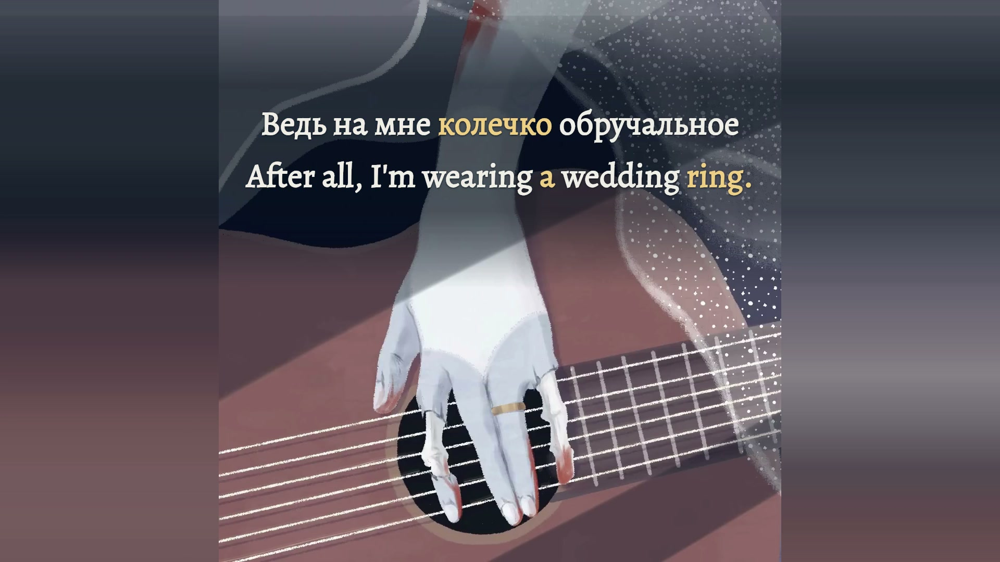

# Труп невесты — bilingual lyric film

**Green Apelsin · Russian / English · verified 16:9 and 9:16 films**



*Exact decoded YouTube MP4 frame 5,712 at 01:35.200, original picture frame 2,380. Original picture and soundtrack: [Green Apelsin’s recording](https://www.youtube.com/watch?v=1CT57xZoYVg). [Final-frame provenance](evidence/final-stills.json). A still establishes visible presentation, not listening scope.*

The original square illustration remains complete. Six measured musical responses animate its actual guitar strings, clipped behind the bridal hand. Existing veil beads shimmer slowly and the wedding ring receives a small, localized glint. Equal bilingual text sits on the artwork’s dark upper cloth; slate and dusty rose extensions preserve the entire illustration in landscape and portrait.

Twenty-eight performed lines contain 184 Russian word events and 258 English tokens. Each Russian entrance and release was selected separately against original/vocal acoustic panels and complementary model-family observations. English follows complete corresponding meanings on the same events. Refrains retain their changing heart, death and place wording. The final sung **нету** differs from the supplied **нет**; the evidence and its limitations remain explicit.

## Finished delivery

| File in the upload kit | Picture | Size |
| --- | --- | --- |
| YouTube/Trup-Nevesty-Green-Apelsin-YouTube-1920x1080-60fps.mp4 | 1920×1080, 60 fps | 46,057,739 bytes |
| TikTok/Trup-Nevesty-Green-Apelsin-TikTok-1080x1920-60fps.mp4 | 1080×1920, 60 fps | 47,860,174 bytes |

Each film contains 12,318 frames over 205.300 seconds and preserves all original AAC packets and 9,053,184 decoded stereo samples. Both passed strict full decoding, every-frame timestamps, no-black-gap scanning, 695 selected complete-scene comparisons, 11,269 decoded glyph-state checks and 63 intentionally delayed timing controls. All 442 displayed tokens have focused and neutral evidence in each format. These checks establish encoded behavior rather than independent acoustic perception. [Wide verification](evidence/final-landscape-verification.json) · [Portrait verification](evidence/final-portrait-verification.json).

The new **Green Apelsin — Труп невесты — Upload Kit** Desktop folder contains 13 files: both films, a 1280×720 YouTube thumbnail, a 1200×1600 portrait TikTok cover, publishing copy, optional Russian/English/bilingual SRTs, delivery metadata and checksums. Every delivered copy matches its prepared hash. [Desktop receipt](evidence/desktop-delivery.json) · [Posting assets](publishing-kit/README.txt) · [Delivery inventory](publishing-kit/DELIVERY.json).

Full MP4s stay local and ignored. Public Git contains the project, covers, copy, captions, selected observations, decoded stills and verification identities. No platform upload or public media release is recorded.

## Open the full preview

Prepared local preview: <http://127.0.0.1:4335/>. Play starts the unchanged original soundtrack. Controls include both formats, reduced speed, exact-second seeks, all 28 cues, animation A/B, original-picture comparison and complete-preview recovery.

From this project directory, with the matching original file in `public/source.mp4`:

```sh
npm ci
npm run check
npm run identity
npm run preview
```

`PORT` selects another loopback port. Node 22.18+ with native TypeScript stripping is needed; development used Node 24. FFmpeg and FFprobe rebuild analysis and reference assets. The locked source is in [recording.json](source/recording.json): YouTube rendition `137+140`, H.264/AAC, 1080×1080 at 25 fps, original 44.1 kHz stereo. A later download must match the SHA-256 or begin a new source/timing revision; similar duration is insufficient.

The original MP4, extractor metadata, stems, model caches, diagnostic audio and compiled client stay local and ignored. Committed observations recreate the selected preview with the matching original; raw analysis is needed to investigate or revise acoustic evidence.

## Review status

Type checking and eleven source/semantic/layout/material/authorization/clock tests pass. Preview preparation also checked 34 complete-scene stills, eight A/B stills and real-browser picture availability, fractional word time, paused seeks, both formats, normal/reduced-speed transport, source comparison and recovery.

The owner accepted and directly authorized production of this exact complete preview. [PRODUCTION-AUTHORIZATION.json](source/PRODUCTION-AUTHORIZATION.json) freezes the source, timeline, scene and revision identities. The separate standardized full/slow/both-layout listening scope remains unattested in [REVIEW.json](source/REVIEW.json); the stricter reusable review gate is unchanged. This current-song authorization is neither a listening certification nor a future-song waiver. Changed inputs invalidate it.

## Reproduce the production

After the matching original and current authorization are available:

```sh
npm run check
npm run render:gate
npm run render -- --format landscape
npm run render -- --format portrait
node scripts/verify-final.ts --format landscape
node scripts/verify-final.ts --format portrait
node scripts/prepare-upload-kit.ts
node scripts/finalize-delivery.ts
```

The renderer refuses to overwrite finished or partial movies. Verification reads the actual encoded films; finalization requires passing evidence and matching hashes before preparing posting copies. Regenerating cover/copy files requires finalization again so their delivery hashes remain current.

[Production decisions](PRODUCTION-NOTES.md) · [Timing method and priorities](TIMING-METHOD.md) · [Agent handoff](AGENT-HANDOFF.md) · [Shared preview-first workflow](../../docs/preview-before-render.md)
