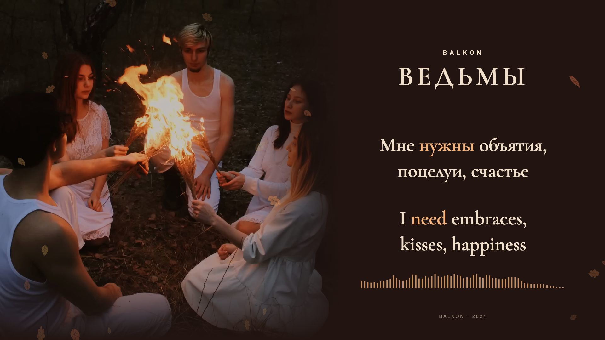

# BALKON — Ведьмы

**Russian + English · approved autumn edition · production in progress**

*Selected native 1920×1080 browser-rendered preview still at 01:34.550, from the shared scene. This is not a decoded final video. Music and original release photograph: BALKON; the available release metadata does not identify the photographer.*

The complete **3:21.134** recording accompanies the original woodland photograph, one warm autumn palette, drifting veined leaves and a compact 64-band spectrum. Stable Russian and English text receives equal size, weight and complete meaning-linked highlighting. Both 1920×1080 and 1080×1920 layouts run at a 60 fps scene clock driven by the actual soundtrack.

## Review status

This is a complete playable preview, including the instrumental opening, all four chorus performances and the outro. Its 54 cues contain 218 Russian words and 281 English words. Original AAC packet payloads, decoded stereo PCM and analysis PCM match exactly. Automated word-state and browser geometry checks are recorded under `evidence/`.

The complete frozen preview has passed editorial and technical checks, followed by explicit human attestation of full normal-speed listening, reduced-speed checks of uncertain words and held endings, and both layouts. Production is authorized for **preview-v5-autumn-sync**. The [review record](evidence/cross-language-sync-review.json) preserves the reviewer role, scope and exact input identity.

Seven alignment configurations from two model families remain documented as preparation evidence. One short negation uses a stable original-mix candidate; eight held-vowel proposals were included in the attested review. Model confidence is not presented as listening evidence or a guarantee of physically exact word boundaries.

## Open the local preview

With the local media available, run `npm ci` and `npm run preview`, or use `Start Preview.command`. The player opens at **http://127.0.0.1:4322/**. Play the recording, switch between 16:9 and 9:16, seek freely, or enter Timing review for individual word candidates, vocal waveform/spectrogram and proposed boundary edits. Reload preview restores the full picture and media surface while retaining position, format and local review notes.

The original release uses a still photograph. The added leaves are the moving picture layer; the original artwork is never substituted by a lyrics-only diagnostic. Artwork failure and audio failure have visible recovery messages.

## Reproduction

The exact TypeScript compiler is pinned to 7.0.2 and dependencies are locked. Node 24 or later runs authored `.ts` tooling. FFmpeg and a local Python environment containing the existing PyTorch, torchaudio MMS_FA, uroman, stable-whisper and Demucs models are needed for audio analysis. Python is used only as a bridge to those models.

1. Obtain the linked 1080-square release with its AAC audio as `public/source.mp4`. The local source is excluded from Git. Save a source frame to `public/artwork.png` and stream-copy the audio to `public/soundtrack.m4a` using `-c:a copy -movflags +faststart` so browser metadata loads promptly.
2. Decode untouched stereo 44.1 kHz Float32 to `analysis/audio-delivery.f32`; prepare 48 kHz stereo and 16 kHz mono WAV model inputs. Preserve the [source clock and hashes](source/media-manifest.json).
3. Run `npm run features`. `ALIGN_PYTHON` selects the local model environment for `scripts/infer.ts` and `scripts/align.ts`. Text, mappings and independent section/line windows are in `source/`. Mixed/stem MMS, bounded Whisper, full large-v3 section alignment and extended MMS windows remain separate from the adopted cue map. Use `source/extended-sections.json` for the context-sensitivity pass; `source/timing-corrections.json` records selected exceptions. Full large-v3 weights live in ignored `models/`.
4. Run `node scripts/build-cues.ts`, `node scripts/held-vowels.ts`, then `node scripts/build-cues.ts`, `npm run layout` and `node scripts/nature-motion.ts`. The held-vowel tool always references the original model candidate, so it does not repeatedly extend already-adjusted words.
5. Run `node scripts/alignment-audit.ts`, `npm run check`, `node scripts/verify-source.ts` and `npm run preview:freeze`. Build `src/geometry-audit.ts` with esbuild to `review/geometry.js` and open `/review/geometry.html` for actual-browser glyph checks.
6. Selected stills remain available through `node scripts/stills.ts`. Production uses the approved scene's lossless 2× Chromium layers and deterministic nature geometry, verified against direct browser frames. The current encoder uses macOS VideoToolbox HEVC Main10; FFmpeg performs one Lanczos downsample.

## Production and delivery tools

All full renders check the completed current-revision review before capture. Rebuild and revalidate the production cache when its inputs change.

- `scripts/raster-cache.ts` extracts lossless layers for each format. `--reuse-raw` can finish cropping existing captures; it does not authorize reuse of stale scene inputs.
- `scripts/raster-proof.ts` compares fourteen native scene checkpoints at 2× resolution. `scripts/adopt-raster.ts` also requires passing encoded highlight diagnostics and a detected deliberate timing-offset control.
- `node --expose-gc scripts/render.ts --production --format landscape` and the corresponding `portrait` command encode the complete film in resumable, verified segments, then stream-copy the original AAC audio.
- `scripts/finalize-color.ts` writes explicit Rec.709 tags without re-encoding pixels, then compares every native 10-bit decoded frame hash and timestamp before/after the remux.
- `scripts/verify-production.ts`, `scripts/audit-decoded-focus.ts` and `scripts/audit-decoded-picture.ts` verify the actual delivery files. Selected decoded frames are extracted with `scripts/extract-delivery-proofs.ts`.
- `scripts/covers.ts` creates dedicated YouTube and TikTok posters. `scripts/package-posting-kit.ts` refuses unverified video/cover files; `scripts/deliver-desktop.ts` verifies the copied kit and records a receipt without local account paths.

Publishing copy and optional line-level captions are under [publishing/](publishing/README.md). Full video files remain local; the repository carries source, verification evidence, representative imagery and delivery hashes.

Public source excludes full audio/video, model WAVs, machine paths and private review progress. Original artist rights are not transferred by this repository's code license. Cormorant Garamond is bundled with its SIL Open Font License.

[Original release](https://www.youtube.com/watch?v=VZfNfjhc8E8) · [Design lessons](PRODUCTION-LESSONS.md) · [Three-pass review](evidence/three-pass-review.md) · [Timing notes](evidence/sync-review.md) · [Preview-before-render policy](../../docs/preview-before-render.md)
